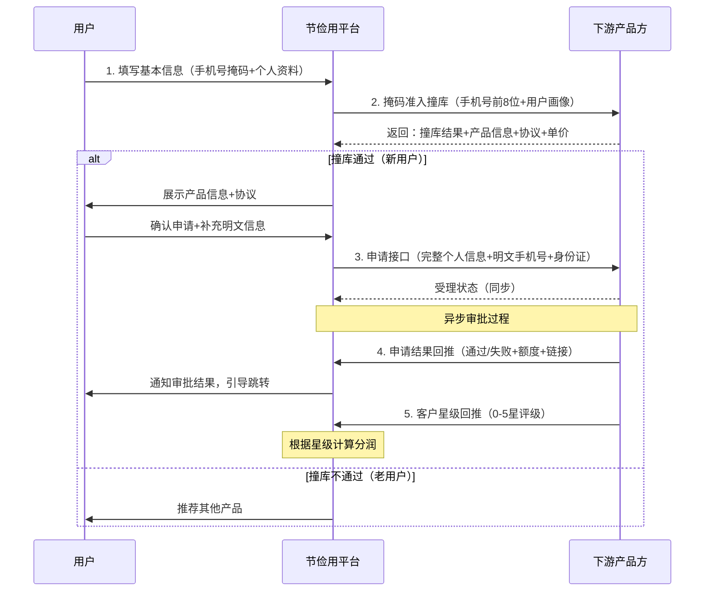
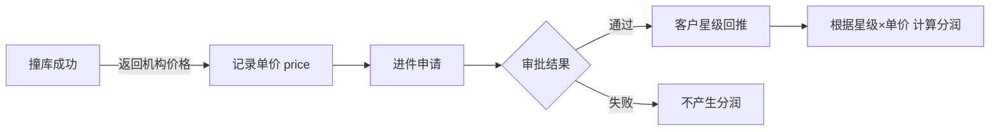
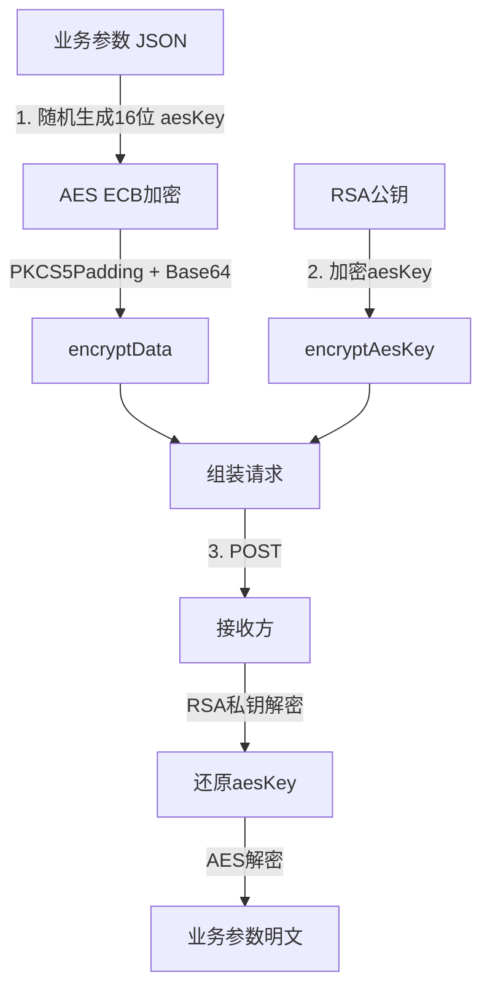

# 节俭用 - 全表单进件与分润 业务模式分析

> 来源：[Apifox 共享文档](https://s.apifox.cn/288c8870-c643-42bc-b71d-a6f96986129a)
> 团队：瀚华小贷科技
> 分析时间：2026-04-16

## 一、模式概述

**全表单进件**是节俭用助贷平台的高级导流模式。与[[节俭用-联登撞库-业务模式分析|小联登模式]]的轻量级导流不同，全表单进件模式收集用户丰富的个人资料，提交给下游产品方进行**全流程授信审批**，并通过**分润机制**实现商业变现。

### 与小联登模式对比

| 维度 | 小联登模式 | 全表单进件模式 |
|------|----------|--------------|
| 用户信息 | 仅手机号/身份证 | 完整个人资料（20+字段） |
| 加密方式 | AES ECB | RSA + AES 混合加密 |
| 审批方式 | 无审批，直接联登 | 下游异步审批，结果回推 |
| 盈利模式 | 按注册计费(CPA) | **分润模式**（按单价+星级） |
| 回调机制 | 无 | 有（结果回推+星级回推） |
| 调用方向 | 单向（我方→下游） | **双向**（我方→下游 + 下游→我方） |

## 二、核心业务流程

## 三、分润机制

### 1. 收入模式

### 2. 客户星级标准

| 星级 | 描述 | 客户质量 |
|------|------|---------|
| 0星 | 空号、停机、刷单、未接、接通秒挂 | 无效 |
| 1星 | 操作失误、捣乱申请、异地申请；能打通但资质差/无意向 | 极低 |
| 2星 | 有意向，但资质不符合，不好开发 | 低 |
| 3星 | 有意向且资质基本符合（社保/车/公积金/芝麻分≥650满足其一） | 中等 |
| 4星 | 有意向且资质符合（商品房/公积金≥1000/芝麻分≥700/无逾期） | 较好 |
| 5星 | 强申请意向+资质优质（商品房未抵押/公积金≥1500满足其一） | 优质 |

### 3. 价格字段说明

- 撞库成功时返回 `price`（机构价格）= 分润前的单价
- 分润模式下，星级越高，单客户价值越大
- 具体分润比例由双方商务约定

## 四、安全机制（RSA+AES 混合加密）

### 与小联登模式的区别

| 维度 | 小联登 | 全表单进件 |
|------|-------|-----------|
| 加密方式 | AES ECB 固定密钥 | RSA+AES **每次请求生成新AES密钥** |
| 密钥交换 | 线下提供固定密钥 | RSA公钥加密AES密钥，动态传输 |
| 安全级别 | 一般 | **高**（前向保密） |

### 加密流程

### 公共请求参数

| 参数 | 类型 | 必填 | 说明 |
|------|------|------|------|
| channelKey | String | 是 | 渠道唯一标识 |
| encryptData | String | 是 | AES加密的业务数据 |
| uid | String | 是 | 请求唯一ID（≤40位） |
| encryptAesKey | String | 是 | RSA加密的AES密钥（每次请求动态生成） |

### 公共响应参数（**不加密**）

| 参数 | 类型 | 必填 | 说明 |
|------|------|------|------|
| code | String | 是 | 200=成功，其他=失败 |
| msg | String | 是 | 响应说明 |
| data | Object | 否 | 响应数据 |
| traceId | String | 是 | 业务执行唯一ID |
| responseTime | String | 是 | 响应时间 yyyy-MM-dd HH:mm:ss |

## 五、用户画像字段

全表单进件模式收集丰富的用户画像数据，用于下游风控和准入判断：

| 字段 | 类型 | 说明 | 枚举值 |
|------|------|------|--------|
| phoneMask | String | 手机号掩码（前8位） | - |
| age | Integer | 年龄 | - |
| sex | Integer | 性别 | 1:男, 0:女 |
| addressProvince/City/District | String | 省市区编码 | 6位国家区划编码 |
| job | String | 职业 | 11:公务员, 13:专业技术, 17:职员, 21:企管, 24:工人, 27:农民, 31:学生, 37:军人, 51:自由职业, 54:个体, 70:无业, 80:退休, 90:其他 |
| education | String | 学历 | 01:硕士及以上, 02:本科, 03:大专, 04:高中/中专, 05:初中及以下, 06:未知 |
| monthIncome | String | 月收入 | 0-3000, 3000-5000, 5000-10000, 10001-15000, 15001-25000, 25000-100000 |
| hasHouse | String | 是否有房 | 1:有, 0:无 |
| hasCar | String | 是否有车 | 1:有, 0:无 |
| hasSocialSecurity | String | 是否有社保 | 1:有, 0:无 |
| hasReservedFunds | String | 是否有公积金 | 1:有, 0:无 |
| hasCivilServant | String | 是否公务员 | 1:是, 0:否 |
| zhiMaScore | Integer | 芝麻分 | - |
| marriage | String | 婚姻状况 | - |

## 六、接口调用方向总结

| 接口 | 调用方向 | 说明 |
|------|---------|------|
| 1. 掩码准入撞库 | 节俭用 → 下游 | 下游提供接口地址 |
| 2. 申请接口 | 节俭用 → 下游 | 下游提供接口地址 |
| 4. 申请结果回推 | 下游 → 节俭用 | 固定地址 `/app-api/translation/org/applyStdResultNotify` |
| 5. 客户星级回推 | 下游 → 节俭用 | 固定地址 `/app-api/translation/org/thirdStdNotify` |

### 环境地址

| 环境 | 域名 |
|------|------|
| 测试 | `https://assist.hanhuatong.com.cn/api/translation-server` |
| 生产 | `https://assist.szjj.cc/api/translation-server` |
