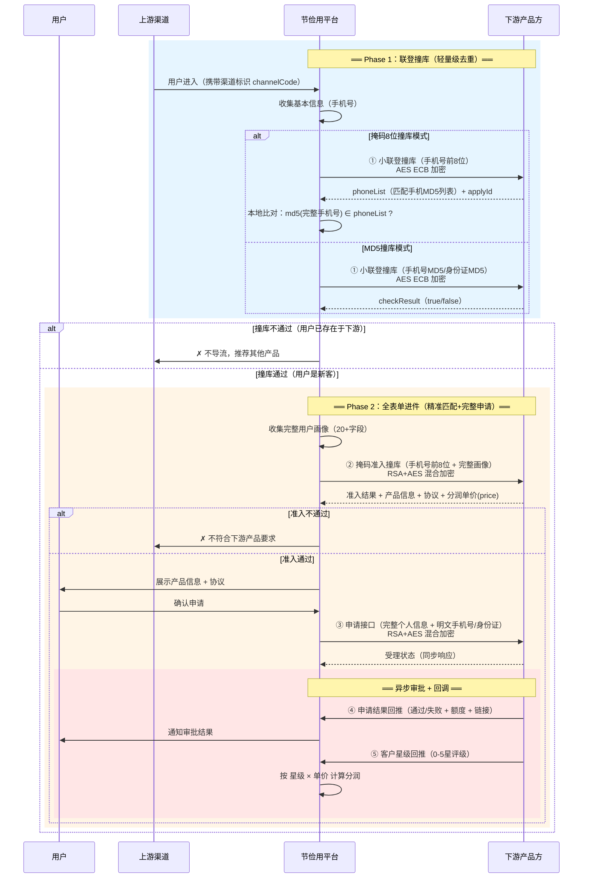
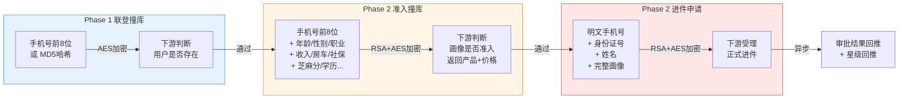
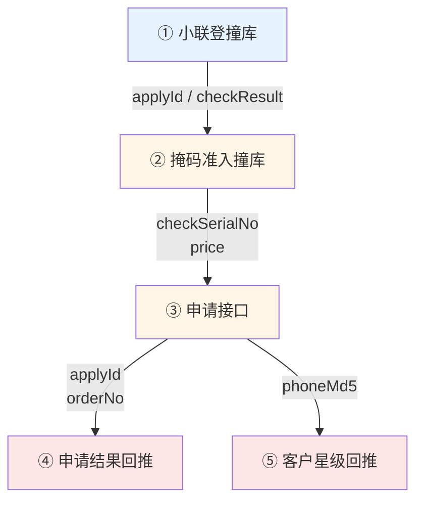
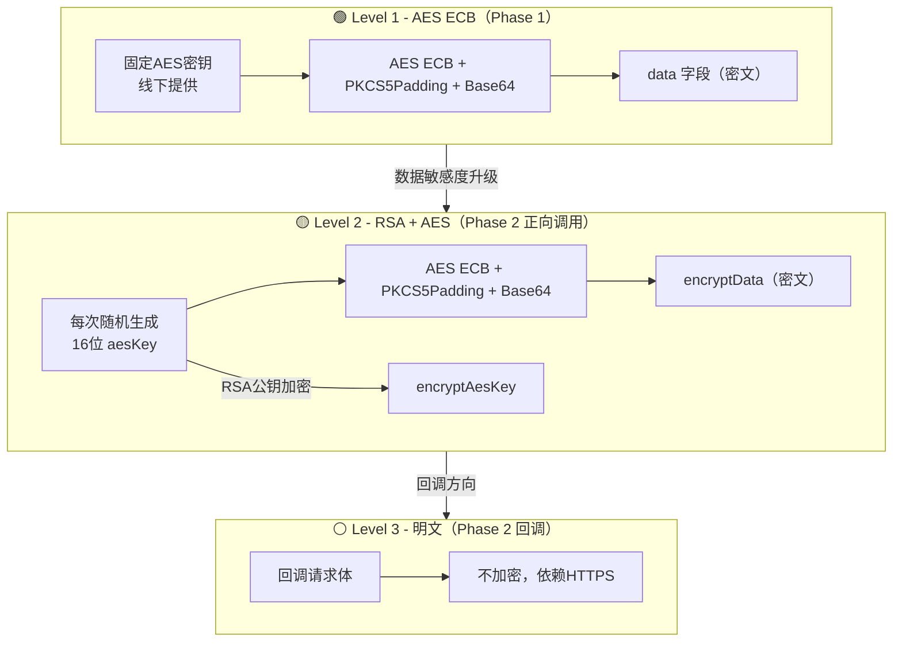
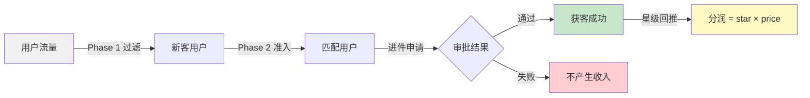
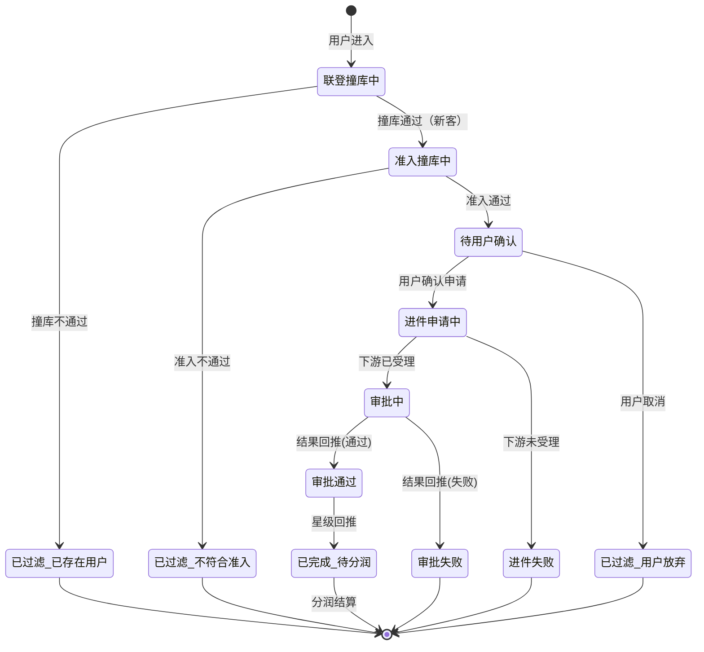

# 节俭用助贷系统 - 整体业务流程分析

> 分析时间：2026-04-16
> 关联文档：
> - [[节俭用-联登撞库-业务模式分析]]  /  [[节俭用-联登撞库-接口文档]]
> - [[节俭用-全表单进件与分润-业务模式分析]]  /  [[节俭用-全表单进件-接口文档]]

## 一、系统全景

**节俭用**是瀚华小贷科技旗下的助贷（贷超）平台，核心职能是**将上游渠道用户精准导流到下游资金方/产品方**。

系统设计了**两阶段串行流水线**：

| 阶段 | 名称 | 核心目的 | 加密方式 |
|------|------|---------|---------|
| **Phase 1** | 联登撞库 | 轻量级用户去重过滤 | AES ECB（固定密钥） |
| **Phase 2** | 全表单进件 | 用户画像匹配 + 完整进件申请 + 异步审批 + 分润 | RSA + AES（动态密钥） |

**调用关系：先联登撞库 → 再全表单进件**，形成「粗筛 → 精筛 → 进件 → 审批 → 分润」的完整漏斗。

---

## 二、完整业务流程



---

## 三、两阶段对比分析

### 3.1 为什么需要两轮撞库？

| 维度 | Phase 1 - 联登撞库 | Phase 2 - 掩码准入撞库 |
|------|-------------------|---------------------|
| **目的** | 快速去重：用户是否已在下游系统 | 精准匹配：用户画像是否符合下游产品准入 |
| **输入** | 仅手机号（前8位/MD5） | 手机号前8位 **+ 完整用户画像**（20+字段） |
| **返回** | 是否命中（已存在） | 产品信息 + 协议 + **分润单价** |
| **加密** | AES ECB（固定密钥，简单快速） | RSA + AES（动态密钥，安全级别高） |
| **成本** | 低（数据量少，加解密快） | 高（数据量大，RSA密钥交换） |
| **响应码** | code = **1000** 表示成功 | code = **200** 表示成功 |
| **角色** | 粗筛漏斗（过滤已有用户） | 精筛漏斗（过滤不匹配用户） |

> **设计逻辑**：先用成本低的 Phase 1 快速过滤大量已存在用户，只有新客才进入成本更高的 Phase 2 进行画像匹配和完整进件。这是经典的**漏斗优化**策略——把廉价过滤前置，昂贵处理后置。

### 3.2 数据逐步升级



**隐私保护递进**：
- Phase 1：仅暴露手机号前8位或哈希值（**无法反推原始信息**）
- Phase 2 撞库：暴露手机前8位 + 画像标签（**脱敏数据**）
- Phase 2 进件：暴露明文手机号 + 身份证 + 姓名（**敏感数据，需RSA+AES最高加密**）

---

## 四、完整接口调用链路

### 4.1 接口调用顺序

```
┌─────────────────────────────────────────────────────────────────┐
│  Phase 1：联登撞库（AES ECB）                                      │
│                                                                 │
│  ① 小联登撞库        节俭用 ──→ 下游     检查用户是否已存在         │
│     ↓ (通过)                                                    │
├─────────────────────────────────────────────────────────────────┤
│  Phase 2：全表单进件（RSA + AES）                                   │
│                                                                 │
│  ② 掩码准入撞库      节俭用 ──→ 下游     画像匹配+获取产品/价格     │
│     ↓ (通过)                                                    │
│  ③ 申请接口          节俭用 ──→ 下游     提交完整申请               │
│     ↓ (异步)                                                    │
│  ④ 申请结果回推       下游 ──→ 节俭用    通知审批结果               │
│  ⑤ 客户星级回推       下游 ──→ 节俭用    通知客户评级（用于分润）     │
└─────────────────────────────────────────────────────────────────┘
```

### 4.2 接口清单总览

| 序号 | 接口名称 | 所属阶段 | 调用方向 | 加密方式 | 关键入参 | 关键出参 |
|------|---------|---------|---------|---------|---------|---------|
| ① | 小联登撞库 | Phase 1 | 节俭用→下游 | AES ECB | 手机号前8位 / MD5 | phoneList/checkResult |
| ② | 掩码准入撞库 | Phase 2 | 节俭用→下游 | RSA+AES | 手机前8位 + 用户画像(20+字段) | check + productName + price + agreement |
| ③ | 申请接口 | Phase 2 | 节俭用→下游 | RSA+AES | 明文手机号 + 身份证 + 姓名 + 画像 | acceptStatus + orderNo |
| ④ | 申请结果回推 | Phase 2 | 下游→节俭用 | 无加密 | applyId + orderStatus + 额度 | status |
| ⑤ | 客户星级回推 | Phase 2 | 下游→节俭用 | 无加密 | phoneMd5 + star(0-5) | status |

### 4.3 关键数据串联

各接口间通过以下关键字段实现数据串联：



| 串联字段 | 来源 | 去向 | 用途 |
|---------|------|------|------|
| `applyId` | ① 联登撞库响应 | ③ 申请接口请求（我方订单号） | 贯穿整个申请生命周期 |
| `checkSerialNo` | ② 准入撞库响应 | ③ 申请接口请求 | 关联撞库与进件 |
| `price` | ② 准入撞库响应 | 分润计算 | 分润单价基准 |
| `orderNo` | ③ 申请响应 | ④ 结果回推请求 | 下游方订单标识 |
| `phoneMd5` | 全流程 | ⑤ 星级回推请求 | 客户唯一标识（脱敏） |
| `channelCode` | 全流程 | 全部接口 | 上游渠道标识 |

---

## 五、加密安全分层



| 安全等级 | 适用场景 | 密钥管理 | 前向保密 |
|---------|---------|---------|---------|
| **AES ECB** | Phase 1 轻量撞库 | 固定密钥，联调/上线分别提供 | ❌ 密钥泄露影响所有历史数据 |
| **RSA+AES** | Phase 2 含敏感信息的正向调用 | 每次请求生成新AES密钥 | ✅ 单次泄露不影响其他请求 |
| **明文** | Phase 2 回调（结果/星级） | 无 | - 依赖HTTPS传输层加密 |

> **设计合理性**：Phase 1 仅传输手机前8位/MD5，即使被截获也无法还原完整信息，AES够用；Phase 2 传输身份证、姓名等敏感信息，必须用RSA+AES保证前向保密。

---

## 六、盈利模型

### 6.1 收入来源



### 6.2 分润计算

分润基于两个关键参数：
- **`price`**：② 掩码准入撞库时返回的机构单价
- **`star`**：⑤ 客户星级回推的评级（0-5星）

| 星级 | 客户质量 | 典型场景 | 分润权重 |
|------|---------|---------|---------|
| 0 ⭐ | 无效 | 空号/停机/刷单 | 零/极低 |
| 1 ⭐ | 极低 | 操作失误/无意向 | 极低 |
| 2 ⭐ | 低 | 有意向但资质不符 | 低 |
| 3 ⭐ | 中等 | 有意向+社保/车/公积金/芝麻分≥650 | 中等 |
| 4 ⭐ | 较好 | 有意向+商品房/公积金≥1000/芝麻分≥700/无逾期 | 较高 |
| 5 ⭐ | 优质 | 强意向+商品房未抵押/公积金≥1500 | 最高 |

---

## 七、环境配置

### 7.1 Phase 1（联登撞库）

| 项目 | 说明 |
|------|------|
| 加密密钥 | 联调提供测试密钥，上线提供正式密钥 |
| 接口地址 | 由接入方（下游）提供 |
| 协议 | code = **1000** 表示成功 |

### 7.2 Phase 2（全表单进件）

| 项目 | 测试环境 | 生产环境 |
|------|---------|---------|
| 域名 | `https://assist.hanhuatong.com.cn` | `https://assist.szjj.cc` |
| 基础路径 | `/api/translation-server` | `/api/translation-server` |
| RSA密钥 | 测试公私钥对（见接口文档） | 联系业务获取 |
| 协议 | code = **200** 表示成功 | code = **200** 表示成功 |

### 7.3 回调地址（下游→节俭用）

| 接口 | 路径 |
|------|------|
| 申请结果回推 | `{域名}/api/translation-server/app-api/translation/org/applyStdResultNotify` |
| 客户星级回推 | `{域名}/api/translation-server/app-api/translation/org/thirdStdNotify` |

---

## 八、接入方开发指南

### 8.1 接入流程

```
1. 获取凭证
   ├── Phase 1：channelCode + AES密钥
   └── Phase 2：channelKey + RSA公钥

2. 实现下游接口
   ├── 小联登撞库 API（Phase 1）
   ├── 掩码准入撞库 API（Phase 2）
   └── 申请接口 API（Phase 2）

3. 实现回调接收
   ├── 申请结果回推 → POST 到节俭用固定地址
   └── 客户星级回推 → POST 到节俭用固定地址

4. 联调测试 → 上线
```

### 8.2 关键注意事项

| # | 注意事项 | 说明 |
|---|---------|------|
| 1 | **两套加密体系** | Phase 1 用 AES ECB，Phase 2 用 RSA+AES，不要混用 |
| 2 | **两套响应码** | Phase 1 成功码是 `1000`，Phase 2 成功码是 `200` |
| 3 | **两套公共参数** | Phase 1 用 `channelCode + data + reqId`，Phase 2 用 `channelKey + encryptData + uid + encryptAesKey` |
| 4 | **撞库判断差异** | Phase 1 掩码模式需本地MD5比对，Phase 2 直接看 `check` 字段 |
| 5 | **数据串联** | `applyId` 和 `checkSerialNo` 必须正确传递，否则流程断裂 |
| 6 | **回调幂等** | 结果回推和星级回推可能重复调用，下游需保证幂等处理 |
| 7 | **RSA密钥** | Phase 2 每次请求必须生成新的随机 AES 密钥，不可复用 |

### 8.3 异常处理

| 场景 | Phase 1 表现 | Phase 2 表现 | 处理建议 |
|------|------------|------------|---------|
| 撞库失败（用户已存在） | phoneList含该用户MD5 / checkResult=false | check=false | 终止流程，推荐其他产品 |
| 加密错误 | 接口返回错误 | 接口返回错误 | 检查密钥和加密模式 |
| 申请被拒 | - | orderStatus=2 或 回推 orderStatus=2 | 记录失败原因，不产生分润 |
| 回调超时 | - | 未收到结果回推 | 设置超时机制，主动查询或重试 |

---

## 九、流程状态机



---

## 十、总结

节俭用助贷系统通过**两阶段串行架构**实现了高效的用户导流：

1. **Phase 1（联登撞库）** 充当**低成本快速过滤器**，用简单的 AES 加密和最少的数据（手机号前8位/MD5）完成用户去重，将已存在用户快速排除
2. **Phase 2（全表单进件）** 作为**高价值精准匹配器**，用 RSA+AES 混合加密保护完整的用户敏感信息，完成画像准入、正式进件、异步审批和分润结算

这种**「粗筛前置 → 精筛后置」** 的漏斗设计，在保障用户隐私的同时最大化了系统吞吐效率：

```
全量用户 ──→ Phase 1 去重 ──→ Phase 2 准入 ──→ 进件 ──→ 审批 ──→ 分润
  100%         ~60%过滤       ~20%过滤       提交     异步     结算
```
