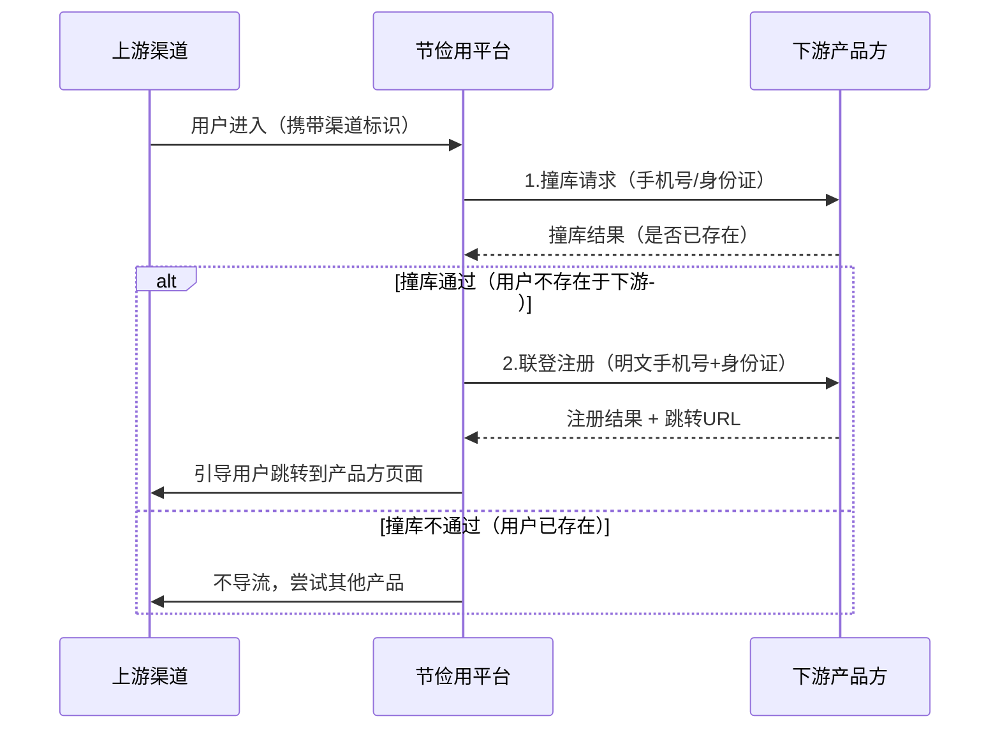
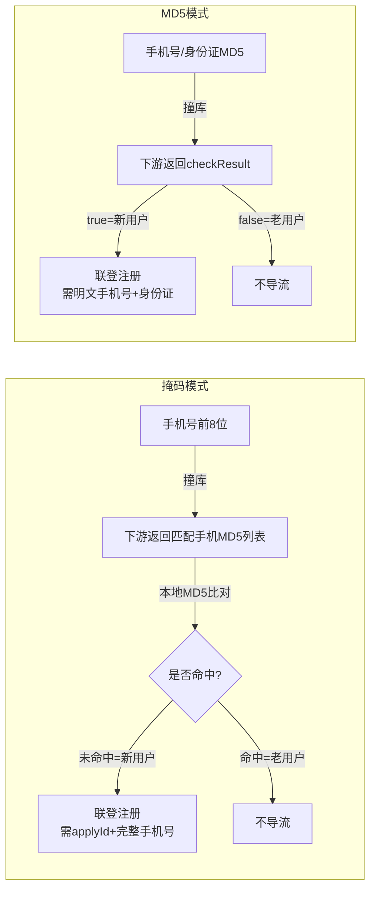

# 节俭用-联登撞库 - 业务模式分析

> 来源：[Apifox 共享文档](https://s.apifox.cn/99977395-9ac5-426f-9a90-ed175c9721bd/435999261e0)
> 团队：瀚华小贷科技
> 分析时间：2026-04-16

## 一、系统概述

**节俭用**是一个助贷（贷超）平台系统，提供"**小联登**"模式的用户导流服务。核心业务为：通过撞库+联登的方式，将用户从上游渠道导流到下游资金方/产品方。

## 二、业务模式

### 1. 核心流程



### 2. 调用方向

- **我方（节俭用）调用合作方（下游）**，接口由节俭用提供规范，下游按规范实现
- 请求方式：POST，Content-Type: application/json

### 3. 两种撞库模式

| 模式 | 撞库方式 | 隐私保护 | 适用场景 |
|------|---------|---------|---------|
| **掩码8位模式** | 手机号前8位明文 | 中等（不暴露完整手机号） | 下游通过手机号前8位匹配已有用户 |
| **MD5模式** | 手机号/身份证的MD5哈希 | 较高（不暴露任何原始信息） | 下游通过MD5比对已有用户 |

### 4. 业务术语

| 术语 | 含义 |
|------|------|
| 撞库 | 检查用户是否已经在下游产品方注册过 |
| 联登 | 撞库通过后，直接将用户注册到下游并获取跳转链接 |
| 小联登 | 轻量级联登方式，仅需手机号+身份证即可完成导流 |
| 掩码 | 手机号前8位，用于隐私保护的撞库方式 |
| 渠道编码 | 标识上游流量来源的唯一编码（channelCode） |

## 三、安全机制

### 1. 数据加密

- 加密方式：**AES ECB** + Base64
- 补码方式：**PKCS5Padding**
- 加密公式：`data = Base64.encode(AES.ECB.encrypt(content, PKCS5Padding, key))`
- 密钥管理：联调提供测试密钥，上线提供正式密钥

### 2. 公共请求头（鉴权）

| Header | 说明 |
|--------|------|
| appUserId | 应用用户ID |
| jiejianyongAppToken | 节俭用App Token |
| jiejianyongToken | 节俭用Token |
| channelNo | 渠道编号 |
| packageKey | 包密钥 |

### 3. 公共请求参数（AES加密层）

| 参数 | 类型 | 必填 | 说明 |
|------|------|------|------|
| channelCode | String | 是 | 渠道唯一标识 |
| data | String | 是 | AES加密后的业务参数 |
| reqId | String | 是 | 请求唯一ID |

### 4. 公共响应参数

| 参数 | 类型 | 必填 | 说明 |
|------|------|------|------|
| code | Integer | 是 | 1000=成功，其他=失败 |
| msg | String | 是 | 响应说明 |
| data | String | 否 | 响应数据 |

## 四、接口列表

### 模式一：掩码8位撞库联登

#### 1. 小联登撞库

- **描述**：用手机号前8位检查用户是否已存在于下游
- **撞库成功判断**：
  - code=1000 且 phoneList 为空
  - 或 code=1000 且 phoneList 中不包含撞库手机号的完整MD5
- **请求参数**（data 解密后）：

| 参数 | 类型 | 必填 | 说明 |
|------|------|------|------|
| userPhone | String | 是 | 手机号前8位明文 |
| channeCode | String | 是 | 上游渠道编码 |

- **响应参数**（data）：

| 参数 | 类型 | 说明 |
|------|------|------|
| phoneList | String[] | 撞库匹配手机号MD5集合 |
| applyId | String | 进件单号 |

- **响应示例**：
```json
{
    "code": 1000,
    "msg": "撞库成功",
    "data": {
        "phoneList": ["0ff4485dd39c24da914bbd1b962e61c1"],
        "applyId": "123456789"
    }
}
```

> **撞库逻辑说明**：掩码手机号 `15308190**`，下游返回 `[md5('15308190001'), md5('15308190002'), ...]`，上游拿完整手机号做MD5后与列表比对

#### 2. 小联登注册

- **描述**：撞库通过后，将用户注册到下游产品方
- **请求参数**（data 解密后）：

| 参数 | 类型 | 必填 | 说明 |
|------|------|------|------|
| applyId | String | 是 | 进件单号（撞库返回） |
| userPhone | String | 是 | 11位明文手机号 |
| channeCode | String | 是 | 上游渠道编码 |

- **响应参数**（data）：

| 参数 | 类型 | 说明 |
|------|------|------|
| url | String | 跳转访问地址 |

- **响应示例**：
```json
{
    "code": 1000,
    "msg": "注册成功",
    "data": {
        "url": "www.baidu.com"
    }
}
```

---

### 模式二：MD5撞库联登

#### 1. 小联登撞库

- **描述**：用手机号MD5或身份证MD5检查用户是否已存在
- **撞库成功判断**：code=1000 且 checkResult=true
- **请求参数**（data 解密后）：

| 参数 | 类型 | 必填 | 说明 |
|------|------|------|------|
| phoneNumberMd5 | String | 否* | 手机号MD5（与idCardMd5不能同时为空） |
| idCardMd5 | String | 否* | 身份证MD5（与phoneNumberMd5不能同时为空） |
| channeCode | String | 是 | 上游渠道编码 |

- **响应参数**（data）：

| 参数 | 类型 | 说明 |
|------|------|------|
| checkResult | String | true=通过，false=不通过 |

- **响应示例**：
```json
{
    "code": 1000,
    "msg": "撞库成功",
    "data": {
        "checkResult": true
    }
}
```

#### 2. 小联登注册

- **描述**：撞库通过后，提交明文信息注册用户
- **请求参数**（data 解密后）：

| 参数 | 类型 | 必填 | 说明 |
|------|------|------|------|
| phoneNumber | String | 是 | 11位明文手机号 |
| idCard | String | 是 | 身份证号（明文） |
| channeCode | String | 是 | 上游渠道编码 |

- **响应参数**（data）：

| 参数 | 类型 | 说明 |
|------|------|------|
| url | String | 跳转访问地址 |

- **响应示例**：
```json
{
    "code": 1000,
    "msg": "注册成功",
    "data": {
        "url": "www.baidu.com"
    }
}
```

## 五、两种模式对比



## 六、接入注意事项

1. **加密必须**：所有业务参数都需要 AES ECB 加密后放入 data 字段传输
2. **幂等性**：每次请求需携带唯一 reqId
3. **撞库判断逻辑差异**：两种模式的撞库成功判断方式不同，需特别注意
4. **掩码模式特殊性**：撞库返回的是 MD5 列表，需要上游自行比对完整手机号的 MD5
5. **注册后跳转**：联登注册成功后返回 URL，需引导用户跳转到该地址完成后续贷款流程
