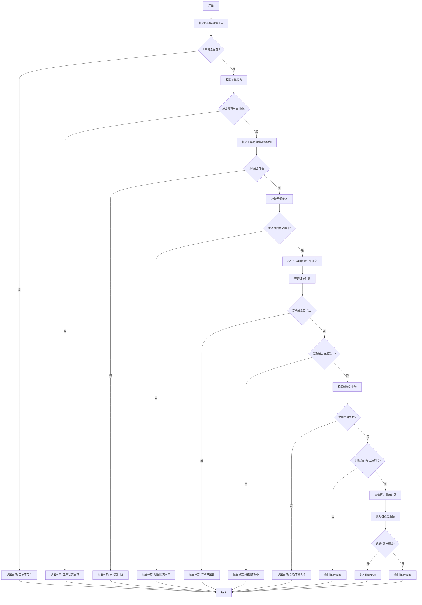

# 工单调账-BPM审批校验接口

## 接口信息

**接口路径**: `/accountAdjust/bpmApprovedCheck`
**请求方法**: `GET`
**接口描述**: 调账BPM审批通过时进行校验，验证工单状态、订单状态、分期状态，并检查调增金额是否大于累计调减金额

**Controller位置**: `cn.caijiajia.accountingoperation.controller.AccountAdjustController#bpmApprovedCheck`
**Service位置**: `cn.caijiajia.accountingoperation.service.accountadjust.AccountAdjustService#bpmApprovedCheck`

---

## 请求参数

### Query参数

| 参数名 | 类型 | 必填 | 说明 |
|--------|------|------|------|
| taskNo | String | 是 | BPM任务号 |

### 请求示例

```http
GET /accountAdjust/bpmApprovedCheck?taskNo=TASK202603300001
```

---

## 响应参数

### 响应对象: CheckAdjustUpMoreThanTotalDownAmountResp

| 字段名 | 类型 | 说明 |
|--------|------|------|
| flag | boolean | 是否显示提示框，true-显示，false-不显示 |

### 响应示例

```json
{
  "flag": true
}
```

---

## 业务逻辑

### 主流程

1. **查询工单信息** - 根据taskNo查询调账工单记录
2. **校验工单状态** - 验证工单必须处于"审批中"状态
3. **查询调账明细** - 根据工单号查询调账交易日志
4. **校验调账明细** - 验证调账明细状态必须为"处理中"
5. **订单信息校验** - 验证订单状态和分期状态
6. **金额校验** - 检查调增金额是否大于累计调减金额

### 核心校验逻辑

#### 1. 工单状态校验 (checkWorkOrderStatus)

```java
// 工单状态必须为 APPROVING(审批中)
if (workOrderStatus != APPROVING) {
    throw new CjjClientException(12001, "调账工单状态异常，请踢退");
}
```

#### 2. 调账明细状态校验 (checkAccountAdjustTransLogInfo)

```java
// 所有调账明细的锁定状态必须为 DOING(处理中)
for (transLog : transLogInfos) {
    if (transLog.workOrderLockEnum != DOING) {
        throw new CjjClientException(12001, "调账订单详情处于异常状态，请踢退或者联系开发人员");
    }
}
```

#### 3. 订单信息校验 (verifyOrderInfoWhenAccountAdjustPass)

按订单号分组校验：

- **订单状态校验**: 订单不能为"已出让"状态
- **分期还款标识校验**: 分期的payFlag不能为"Y"(还款处理中)
- **分期金额校验**: 验证调账后各成分金额不能为负数

```java
// 订单已出让检查
if (orderStatus == SOLD) {
    throw new CjjClientException("当前订单已出让，不能调账！");
}

// 分期还款处理中检查
if (term.payFlag == "Y") {
    throw new CjjClientException(12001, "分期在还款处理中，请稍后再试!");
}

// 调账后金额不能为负
for (component : [fee, warrantyFee, earlySettle, lateFee, interest]) {
    if (currentAmount + adjustAmount < 0) {
        throw new CjjClientException(12001, "调账后金额不能为负数");
    }
}
```

#### 4. 调增调减金额校验 (checkAdjustUpAdjustDownAmount)

**仅对调增方向的工单进行校验**:

- 查询该工单的所有调账明细
- 按分期号分组，查询历史累计调减金额
- 逐个成分比对：如果调增金额 > 0 且历史累计金额 < 0，则设置flag=true

```java
// 只对调增方向校验
if (adjustDirection == UP) {
    // 按分期查询历史费用记录
    for (stagePlan : stagePlans) {
        // 检查各成分
        if (adjustLog.fee > 0 && historyFee < 0) {
            flag = true; // 利息调增大于累计调减
        }
        if (adjustLog.warrantyFee > 0 && historyWarrantyFee < 0) {
            flag = true; // 担保费调增大于累计调减
        }
        // ... 其他成分同理
    }
}
```

**检查的费用成分**:
- fee: 利息
- warrantyFee: 担保费
- earlySettle: 提前结清手续费
- lateFee: 违约金
- interest: 罚息

---

## 数据库交互

### 查询表

| 表名 | 操作 | 说明 |
|------|------|------|
| account_adjust_work_order | SELECT | 根据taskNo查询工单信息 |
| account_adjust_trans_log | SELECT | 根据workOrderNo查询调账明细 |
| account_adjust_fee_account | SELECT | 根据stagePlanNo查询历史费用记录 |

### Mapper方法

```java
// AccountAdjustProxy
AccountAdjustWorkOrderInfo queryWorkOrderRecoredByTaskNo(String taskNo)
List<AccountAdjustTransLogInfo> queryTransLogRecoredByWorkOrderNo(String workOrderNo)
List<AccountAdjustFeeAccountInfo> queryFeeRecordByStagePlanNos(List<String> stagePlanNos)
```

---

## 外部系统调用

### Feign Client调用

| 服务 | 方法 | 说明 |
|------|------|------|
| LoanRpcService | getLoanCoreOrderInfoOfPayOff | 查询订单和分期信息 |

---

## 异常处理

| 错误码 | 错误信息 | 触发条件 |
|--------|----------|----------|
| 12001 | 调账工单不存在，请踢退或者联系开发人员 | 根据taskNo未找到工单 |
| 12001 | 调账工单状态异常，请踢退 | 工单状态不是"审批中" |
| 12001 | 没有找到调账订单详情，请踢退或者联系开发人员 | 未找到调账明细 |
| 12001 | 调账订单详情处于异常状态，请踢退或者联系开发人员 | 调账明细状态不是"处理中" |
| - | 当前订单已出让，不能调账！ | 订单状态为SOLD |
| 12001 | {分期号}分期在还款处理中，请稍后再试! | 分期payFlag为Y |
| 12001 | 调账后{成分}金额不能为负数 | 调账后某成分金额<0 |

---

## 业务状态

### 工单状态枚举 (WorkOrderStatusEnum)

- **APPROVING**: 审批中（允许校验）
- 其他状态均不允许通过校验

### 锁定状态枚举 (WorkOrderLockEnum)

- **DOING**: 处理中（正常状态）
- 其他状态视为异常

### 调账方向枚举 (DirectionEnum)

- **UP**: 调增（需要进行金额校验）
- **DOWN**: 调减（不进行金额校验）

---

## 流程图



---

## 关键节点说明

### 节点1: 查询工单信息
- **输入**: taskNo
- **操作**: accountAdjustProxy.queryWorkOrderRecoredByTaskNo(taskNo)
- **输出**: AccountAdjustWorkOrderInfo
- **异常**: 工单不存在

### 节点2: 校验工单状态
- **输入**: AccountAdjustWorkOrderInfo
- **校验**: workOrderStatus == APPROVING
- **异常**: 工单状态异常

### 节点3: 查询调账明细
- **输入**: workOrderNo
- **操作**: accountAdjustProxy.queryTransLogRecoredByWorkOrderNo(workOrderNo)
- **输出**: List<AccountAdjustTransLogInfo>
- **异常**: 未找到明细

### 节点4: 校验明细状态
- **输入**: List<AccountAdjustTransLogInfo>
- **校验**: 所有明细的workOrderLockEnum == DOING
- **异常**: 明细状态异常

### 节点5: 订单信息校验
- **输入**: List<AccountAdjustTransLogInfo>
- **操作**:
  - 按订单号分组
  - 调用loanRpcService.getLoanCoreOrderInfoOfPayOff查询订单
  - 校验订单状态、分期状态、金额
- **异常**: 订单已出让/分期还款中/金额为负

### 节点6: 金额校验
- **输入**: AccountAdjustWorkOrderInfo
- **条件**: adjustDirection == UP
- **操作**:
  - 查询历史费用记录
  - 比对各成分的调增金额与累计调减金额
- **输出**: flag (true/false)

---

## 使用场景

1. **BPM审批流程**: 在BPM审批通过前调用此接口进行最终校验
2. **风险提示**: 当调增金额大于累计调减金额时，返回flag=true提示审批人注意
3. **数据一致性**: 确保调账操作不会导致数据异常（负数、状态冲突等）

---

## 注意事项

1. 此接口仅做校验，不修改任何数据
2. 调减方向的工单不进行金额比对校验
3. 工单和明细的状态必须匹配，否则视为异常
4. 订单和分期的状态会实时查询，确保数据最新
5. 金额校验会检查所有费用成分（利息、担保费、违约金、罚息等）

---

## 相关文档

- [工单调账-提交工单接口](./interface-accountAdjust-startWorkOrder.md)
- [工单调账-审核处理接口](./interface-accountAdjust-approveWorkOrder.md)
- [工单调账-回调接口](./interface-accountAdjust-callback.md)