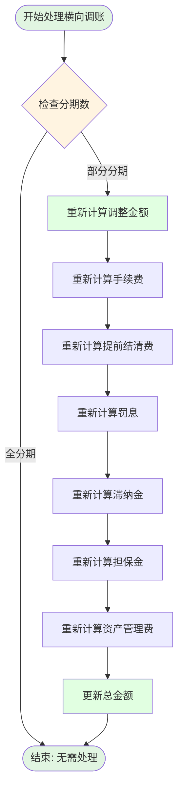
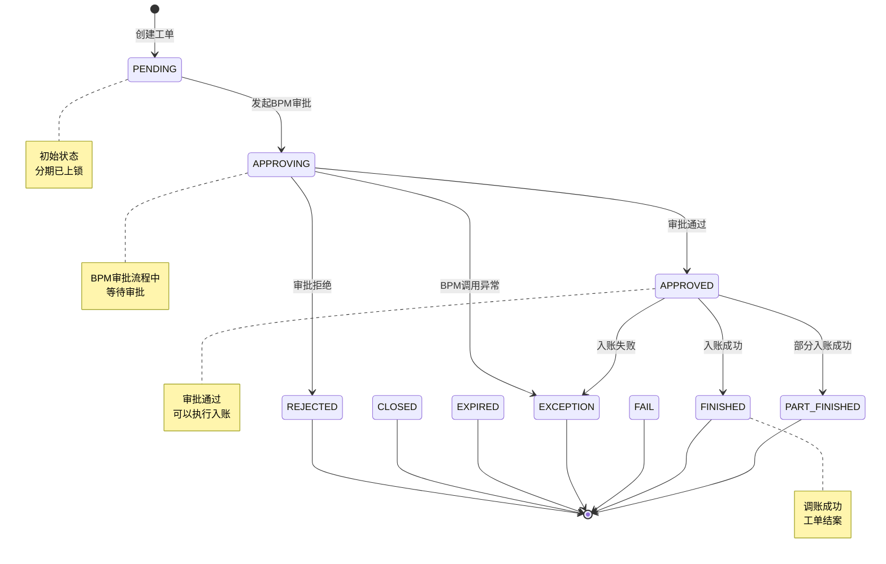

# 账务调整 - 发起调账工单接口

## 接口信息

| 属性 | 值 |
|-----|---|
| 接口名称 | 发起调账工单 |
| 接口路径 | `/accountAdjust/startWorkOrder` |
| 请求方式 | POST |
| Content-Type | application/json |
| Controller | `AccountAdjustController` |
| Service | `AccountAdjustService.startWorkOrder` |

## 接口描述

该接口用于发起账务调整工单，支持纵向调账（单订单多分期调整）和横向调账（多订单分期调整）。工单创建后会自动发起 BPM 审批流程。

---

## 业务流程图

```mermaid
flowchart TD
    Start([开始: 接收请求]) --> ParseReq[解析请求参数]
    ParseReq --> Validate{参数校验}

    Validate -->|校验失败| EndError([结束: 参数错误])
    Validate -->|校验通过| BuildLockKey[构建分布式锁Key]

    BuildLockKey --> LockKey["ACCOUNT_ADJUST:{stageOrderNo}"]
    LockKey --> AcquireLock{获取分布式锁}

    AcquireLock -->|获取失败| WaitLock[等待锁释放]
    WaitLock --> AcquireLock

    AcquireLock -->|获取成功| CheckReq[校验请求参数]

    CheckReq --> GetOrderInfo[🩷 查询订单信息]
    GetOrderInfo --> CallLoanCore["getLoanCoreOrderInfoOfPayOff()"]

    CallLoanCore --> GetMaxOverdue[获取最大逾期天数]
    GetMaxOverdue --> CheckDimension{检查调账维度}

    CheckDimension -->|横向| HandleTransverse[处理横向调账数据]
    CheckDimension -->|纵向| CheckCheated
    HandleTransverse --> CheckCheated

    CheckCheated[校验诈骗客户]
    CheckCheated --> CheckPlanAmount[校验分期调整金额]
    CheckPlanAmount --> CheckAdjusting[校验订单是否调账中]

    CheckAdjusting --> CheckBank[校验资方是否允许调账]
    CheckBank --> CheckOrderStatus[校验订单状态]
    CheckOrderStatus --> CheckLeftAmount[校验剩余金额]

    CheckLeftAmount --> FilterAdjustPlans[过滤有调整的分期]
    FilterAdjustPlans --> CheckSystemRules[调账系统规则校验]
    CheckSystemRules --> CheckCapitalRules[资金配置中心校验]
    CheckCapitalRules --> FilterPlans[过滤提交的分期]

    FilterPlans --> BuildWorkOrderExt[构建工单扩展信息]
    BuildWorkOrderExt --> BuildWorkOrder[构建工单数据]
    BuildWorkOrder --> SaveRecord[(保存工单记录)]

    SaveRecord --> ReleaseLock[释放分布式锁]
    ReleaseLock --> GetWorkOrderNo[获取工单号]

    GetWorkOrderNo --> StartBPM[🩷 发起BPM审批流程]
    StartBPM --> CallFlowplus["flowplusRpcService.startAccountAdjustProcess()"]

    CallFlowplus --> BPMResult{BPM返回结果}
    BPMResult -->|失败| UpdateException[更新状态: EXCEPTION]
    BPMResult -->|成功| UpdateApproving[更新状态: APPROVING]

    UpdateException --> EndError
    UpdateApproving --> EndSuccess([结束: 工单创建成功])

    style Start fill:#e1f5e1
    style EndSuccess fill:#e1f5e1
    style EndError fill:#f5e1e1
    style AcquireLock fill:#fff4e1
    style ReleaseLock fill:#e1ffe1
    style GetOrderInfo fill:#ffe1f0
    style CallLoanCore fill:#ffe1f0
    style StartBPM fill:#ffe1f0
    style CallFlowplus fill:#ffe1f0
    style SaveRecord fill:#e1f0ff
    style CheckDimension fill:#fff4e1
    style CheckCheated fill:#fff4e1
    style CheckPlanAmount fill:#fff4e1
    style CheckAdjusting fill:#fff4e1
    style CheckBank fill:#fff4e1
    style CheckOrderStatus fill:#fff4e1
    style CheckSystemRules fill:#fff4e1
    style CheckCapitalRules fill:#fff4e1
    style UpdateApproving fill:#e1f5e1
    style UpdateException fill:#f5e1e1
```



## 横向调账数据处理流程



---

## 请求参数

### AccountAdjustWorkOrderReq

| 字段名 | 类型 | 必填 | 说明 |
|-------|------|------|------|
| stageOrderNo | String | 是 | 订单号 |
| adjustDirection | String | 是 | 调整方向：UP(调增)/DOWN(调减) |
| adjustDimension | String | 否 | 调账维度：TRANSVERSE(横向)/LONGITUDINAL(纵向) |
| adjustType | String | 是 | 调整分类 |
| adjustReason | String | 是 | 调整原因 |
| totalLeftAmount | Integer | 是 | 剩余应还总金额 |
| totalLeftPrinciple | Integer | 是 | 剩余应还本金 |
| totalLeftFee | Integer | 是 | 剩余应还利息 |
| totalLeftInterest | Integer | 是 | 剩余应还罚息 |
| totalLeftLateFee | Integer | 是 | 剩余应还滞纳金 |
| totalLeftWarrantyFee | Integer | 是 | 剩余应还担保金 |
| totalLeftAmcFee | Integer | 是 | 剩余应还资产管理咨询费 |
| totalLeftEarlySettle | Integer | 是 | 剩余应还提前结清手续费 |
| totalAdjustAmount | Integer | 是 | 调整总金额 |
| totalAdjustFee | Integer | 是 | 调整总手续费 |
| totalAdjustInterest | Integer | 是 | 调整总罚金 |
| totalAdjustLateFee | Integer | 是 | 调整总滞纳金 |
| totalAdjustEarlySettle | Integer | 是 | 调整总提前结清手续费 |
| totalAdjustWarrantyFee | Integer | 是 | 调整总担保金 |
| totalAdjustAmcFee | Integer | 是 | 调整总资产管理咨询费 |
| description | String | 否 | 调整说明 |
| annexPaths | List\<String\> | 否 | 附件上传文件路径 |
| planInfos | List\<AccountAdjustPlanInfoDto\> | 是 | 调整的分期信息 |
| expireDayAutoAdjust | Integer | 否 | 约定期内（天）未还款自动调增 |

### AccountAdjustPlanInfoDto（分期信息）

| 字段名 | 类型 | 说明 |
|-------|------|------|
| planNo | String | 计划编号 |
| termNo | Integer | 期数 |
| adjustComponentInfos | List\<AdjustComponentInfo\> | 调整成分信息 |

### AdjustComponentInfo（成分信息）

| 字段名 | 类型 | 说明 |
|-------|------|------|
| components | ComponentsEnum | 成分类型 |
| leftAmount | Integer | 剩余金额 |
| adjustAmount | Integer | 调整金额 |

### 请求示例

```json
{
  "stageOrderNo": "ORDER20250120001",
  "adjustDirection": "DOWN",
  "adjustDimension": "LONGITUDINAL",
  "adjustType": "INTEREST_RELIEF",
  "adjustReason": "客户申请减免利息",
  "totalLeftAmount": 1000000,
  "totalLeftPrinciple": 800000,
  "totalLeftFee": 100000,
  "totalLeftInterest": 50000,
  "totalLeftLateFee": 30000,
  "totalLeftWarrantyFee": 10000,
  "totalLeftAmcFee": 5000,
  "totalLeftEarlySettle": 5000,
  "totalAdjustAmount": 50000,
  "totalAdjustFee": 0,
  "totalAdjustInterest": 50000,
  "totalAdjustLateFee": 0,
  "totalAdjustEarlySettle": 0,
  "totalAdjustWarrantyFee": 0,
  "totalAdjustAmcFee": 0,
  "description": "疫情期间利息减免",
  "annexPaths": [
    "/path/to/attachment1.pdf"
  ],
  "planInfos": [
    {
      "planNo": "PLAN20250120001",
      "termNo": 1,
      "adjustComponentInfos": [
        {
          "components": "PRINCIPAL",
          "leftAmount": 800000,
          "adjustAmount": 0
        },
        {
          "components": "INTEREST",
          "leftAmount": 50000,
          "adjustAmount": 50000
        }
      ]
    }
  ]
}
```

---

## 响应参数

**响应类型:** `void`（无返回值）

成功时返回 HTTP 200，失败时抛出异常。

---

## 业务流程详解

### 1. 参数校验

**校验规则:**

| 校验项 | 规则 | 错误信息 |
|-------|------|---------|
| 订单号 | 不能为空 | "订单号不能为空！" |
| 调整方向 | 不能为空 | "调整方向不能为空！" |
| 调整分类 | 不能为空 | "调整分类不能为空！" |
| 调整原因 | 不能为空 | "调整原因不能为空！" |
| 分期信息 | 不能为空 | "调整的分期不能为空！！" |
| 金额字段 | 必须 ≥ 0 | 校验注解 |

### 2. 分布式锁

**锁配置:**

| 配置项 | 值 |
|-------|---|
| 锁 Key | `ACCOUNT_ADJUST:{stageOrderNo}` |
| 锁用途 | 防止同一订单并发调账 |

### 3. 查询订单信息

**调用接口:**
```java
LoanInfoNewItemFeign ordersInfo = getLoanCoreOrderInfoOfPayOff(stageOrderNo, "T");
```

**获取数据:**
- 订单基本信息
- 分期列表（termList）
- 用户ID（uid）

**获取最大逾期天数:**
```java
int maxOverDueDays = billClientProxy.getMaxOverDueDays(uid, RangeType.L);
```

### 4. 横向调账数据处理

**触发条件:** `adjustDimension == "TRANSVERSE"`

**处理逻辑:**
1. 检查分期数是否一致
2. 如果是部分分期调整，重新计算调整金额
3. 补全后续分期数据

### 5. 系统校验

#### 5.1 校验诈骗客户
```java
checkCheatedUsers(workOrderReq, ordersInfo);
```

#### 5.2 校验分期调整金额
```java
checkPlanAdjustAmount(workOrderReq);
```

#### 5.3 校验订单是否调账中
```java
accountAdjustCheck(stageOrderNo, ordersInfo);
```

#### 5.4 校验资方是否允许调账
```java
checkByBank(ordersInfo);
```
- 不允许调账的资方列表从配置中获取
- 如果订单资方在黑名单中，抛出异常

#### 5.5 校验订单状态
```java
checkOrderStatus(ordersInfo);
```
- 已结清订单不能调账

#### 5.6 校验剩余金额
```java
int totalLeftPrincipal = checkOrderLeftAmount(workOrderReq, ordersInfo);
```
- 校验订单分期金额数据有没有变化

#### 5.7 调账系统规则校验
```java
checkAdjustAccountSubmitData(adjustPlanInfoDtos, termList, adjustDirection);
```
- 只校验有调账的分期

#### 5.8 资金配置中心校验
```java
checkCapitalAllocationCenterRule(workOrderReq, ordersInfo);
```
- 只校验有调账的分期

### 6. 过滤分期

**过滤逻辑:**
1. 过滤出有调整金额的分期
2. 保存时使用所有分期
3. 提交时只提交有调整的分期

### 7. 构建工单数据

**扩展信息:**
```java
AccountAdjustWorkOrderExtBO extBO = buildAccountAdjustWorkOrderExtBO(
    maxOverDueDays,
    adjustDimensionEnum,
    AdjustSourceEnum.ADJUST_WORK,
    expireDayAutoAdjust
);
```

**工单数据:**
```java
AccountAdjustBo accountAdjustBo = buildAccountAdjustBo(
    workOrderReq,
    ordersInfo,
    totalLeftPrincipal,
    extBO
);
```

### 8. 保存工单记录

```java
accountAdjustProxy.saveAccountAdjustRecord(accountAdjustBo);
```

### 9. 发起 BPM 审批流程

**调用接口:**
```java
ProcessInstanceResp processInstanceResp = flowplusRpcService.startAccountAdjustProcess(accountAdjustBo);
```

**状态更新:**
- 成功：更新为 `APPROVING`
- 失败：更新为 `EXCEPTION`

---

## 数据库交互

### 涉及的表

| 表名                              | 操作     | 说明      |
| ------------------------------- | ------ | ------- |
| `account_adjust_work_order`     | INSERT | 调账工单表   |
| `account_adjust_plan_info`      | INSERT | 调账分期信息表 |
| `account_adjust_component_info` | INSERT | 调账成分信息表 |

### 核心操作 SQL

```sql
-- 插入工单记录
INSERT INTO account_adjust_work_order (
    work_order_no,
    stage_order_no,
    adjust_direction,
    adjust_type,
    adjust_reason,
    total_left_amount,
    total_adjust_amount,
    work_order_status,
    create_time,
    update_time
) VALUES (?, ?, ?, ?, ?, ?, ?, 'PENDING', NOW(), NOW());

-- 插入分期信息
INSERT INTO account_adjust_plan_info (
    work_order_no,
    plan_no,
    term_no,
    create_time
) VALUES (?, ?, ?, NOW());

-- 插入成分信息
INSERT INTO account_adjust_component_info (
    work_order_no,
    plan_no,
    components,
    left_amount,
    adjust_amount,
    create_time
) VALUES (?, ?, ?, ?, ?, NOW());

-- 更新工单状态
UPDATE account_adjust_work_order
SET work_order_status = ?,
    task_no = ?,
    update_time = NOW()
WHERE work_order_no = ?;
```

---

## 关键业务状态

### 工单状态 (work_order_status)

| 状态 | 说明 | 备注 |
|-----|------|------|
| PENDING | 初始状态 | 工单创建后的初始状态，分期已上锁 |
| APPROVING | 审核中 | BPM 审批流程中 |
| APPROVED | 已审批 | BPM 审批通过，可以入账 |
| FINISHED | 工单结案 | 调账入账成功 |
| PART_FINISHED | 部分完成 | 部分分期入账成功 |
| REJECTED | 已拒绝 | BPM 审批拒绝（踢退） |
| CLOSED | 已关闭 | 工单关闭，分期已解锁 |
| EXPIRED | 已过期 | 工单过期 |
| EXCEPTION | 异常 | BPM 调用失败或入账失败 |
| FAIL | 失败 | 入账失败 |

### 状态流转图



---

## 外部系统调用

### 贷款系统 (Loan)

| 接口 | 说明 | 调用时机 |
|-----|------|---------|
| `getLoanCoreOrderInfoOfPayOff()` | 查询订单信息 | 工单创建时 |
| `getMaxOverDueDays()` | 获取最大逾期天数 | 工单创建时 |

### BPM 工作流系统 (FlowPlus)

| 接口 | 说明 | 调用时机 |
|-----|------|---------|
| `startAccountAdjustProcess()` | 发起调账审批流程 | 工单记录保存后 |

---

## 分布式锁

### 锁配置

| 配置项 | 值 | 说明 |
|-------|---|------|
| 锁 Key | `ACCOUNT_ADJUST:{stageOrderNo}` | 订单级别锁 |
| 锁用途 | 防止同一订单并发调账 | 确保数据一致性 |

### 锁使用流程

```
1. 构建锁 Key: ACCOUNT_ADJUST + stageOrderNo
2. 获取分布式锁: distributedLock.lock(key)
3. 执行业务逻辑:
   ├── 校验参数
   ├── 查询订单信息
   ├── 处理横向调账数据
   ├── 执行各种校验
   ├── 构建工单数据
   └── 保存工单记录
4. 释放分布式锁: distributedLock.unlock(key)
5. 发起 BPM 审批流程（锁外执行）
```

---

## 配置项

| 配置项 | 说明 | 来源 |
|-------|------|------|
| notAllowAdjustBanks | 不允许调账的资方列表 | `configs.getNotAllowAdjustBanks()` |

---

## 调账维度

### 纵向调账 (LONGITUDINAL)

- **定义:** 单订单多分期调整
- **特点:** 调整同一订单的不同期数
- **示例:** 订单A的第1、2、3期同时调减利息

### 横向调账 (TRANSVERSE)

- **定义:** 多订单分期调整
- **特点:** 跨订单调整同一成分
- **示例:** 订单A第1期和订单B第1期同时调减利息
- **处理:** 需要对提交的数据进行特殊处理

---

## 调整方向

| 方向 | 代码 | 说明 |
|-----|------|------|
| 调增 | UP | 增加还款金额 |
| 调减 | DOWN | 减少还款金额 |

---

## 监控指标

| 指标 | 说明 | 目标值 |
|-----|------|-------|
| 接口响应时间 | 接口响应总时长 | < 3秒 |
| BPM 调用成功率 | BPM 审批发起成功率 | > 95% |
| 工单创建成功率 | 工单创建成功比例 | > 98% |
| 锁等待时间 | 分布式锁等待时间 | < 5秒 |

---

## 相关接口

| 接口 | 说明 |
|-----|------|
| `GET /accountAdjust/getStagePlanInfoByOrderNo` | 查询订单分期信息 |
| `POST /accountAdjust/approveWorkOrder` | 审核工单 |
| `GET /accountAdjust/bpmApprovedCheck` | BPM 审批通过校验 |
| `POST /accountAdjust/callback` | BPM 回调接口 |
| `POST /accountAdjust/uploadFile` | 上传附件 |

---

## 异常处理

### 异常列表

| 异常码 | 异常信息 | 触发条件 | 处理方式 |
|-------|---------|---------|---------|
| 12001 | 资方不允许调账 | 订单资方在黑名单 | 返回错误 |
| 12002 | 订单已结清 | 订单状态为已结清 | 返回错误 |
| 12003 | 订单调账中 | 存在进行中的调账工单 | 返回错误 |
| 12004 | 诈骗客户 | 用户在诈骗黑名单 | 返回错误 |
| 12001 | BPM 审批流返回值异常 | BPM 调用失败 | 更新状态为 EXCEPTION |
| 系统异常 | 其他系统异常 | 数据库异常、网络异常等 | 返回 500 错误 |

---

## 相关文档

- [项目工程结构](../../01-项目工程结构.md)
- [数据库结构](../../02-数据库结构.md)
- [接口流程索引](../../03-接口流程索引.md)
- [调度任务索引](../../04-调度任务索引.md)

---

**文档版本:** v1.0
**最后更新:** 2025-02-24
**维护人员:** Claude Code
