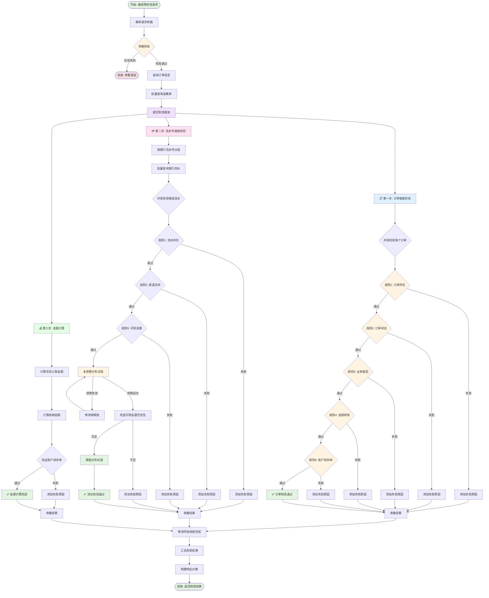
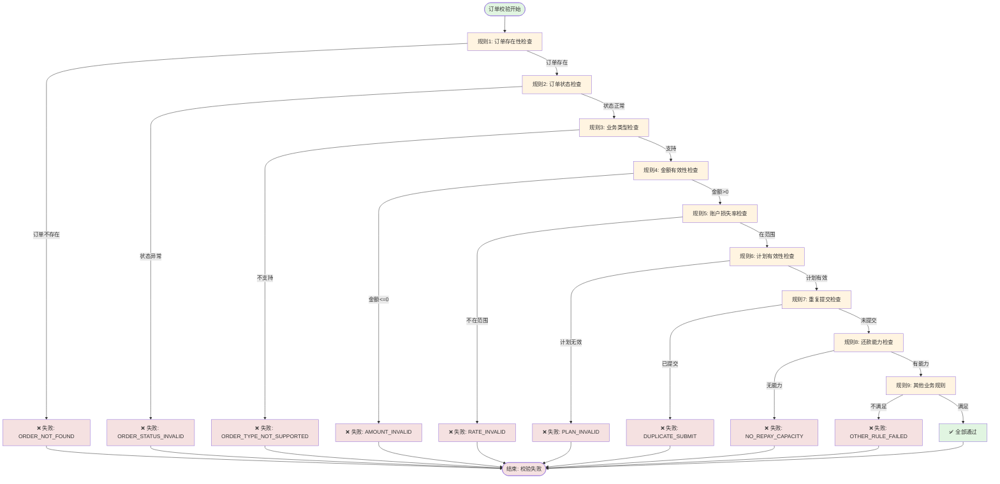
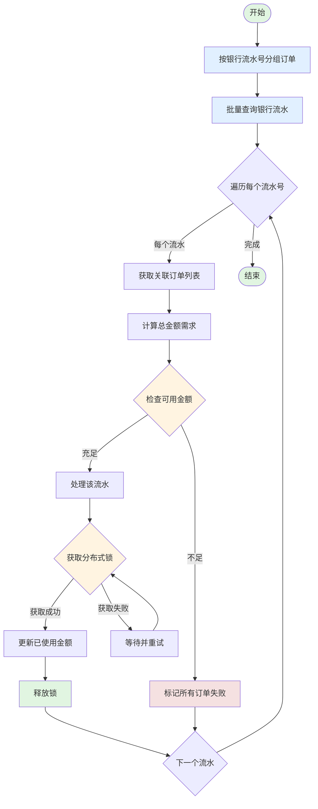

# 法诉自动入账 - 订单预校验接口

## 接口信息

| 属性 | 值 |
|-----|---|
| 接口名称 | 订单预校验 |
| 接口路径 | `/litigationAutoIncome/preCheck` |
| 请求方式 | POST |
| Content-Type | application/json |
| Controller | `LitigationAutoIncomeController` |
| Service | `LitigationAutoIncomeService.preCheck` |

## 接口描述

法诉案件自动入账前，对多个订单进行三步校验：
1. **订单维度校验** - 验证订单状态、业务类型、金额等
2. **流水号维度校验** - 验证流水存在性、可用金额等
3. **金额计算** - 计算实际入账金额、核销金额等

该接口支持批量处理多个订单，使用多线程并发校验提升性能。

---

## 业务流程图



---

## 订单校验规则详解



---

## 请求参数

### LitigationPreCheckReq

| 字段名 | 类型 | 必填 | 说明 |
|-------|------|------|------|
| operator | String | 是 | 操作人 |
| litigationOrders | List\<LitigationOrderReq\> | 是 | 订单列表（最多100个） |

### LitigationOrderReq

| 字段名 | 类型 | 必填 | 说明 |
|-------|------|------|------|
| orderId | Long | 是 | 订单 ID |
| orderNo | String | 是 | 订单号 |
| planId | Long | 是 | 计划 ID |
| planNo | String | 是 | 计划编号 |
| repayAmount | BigDecimal | 是 | 还款金额（单位：分） |
| accountLossRate | BigDecimal | 是 | 账户损失率（0-1之间） |
| bankSerials | List\<String\> | 是 | 关联的银行流水号列表 |

### 请求示例

```json
{
  "operator": "user001",
  "litigationOrders": [
    {
      "orderId": 123456,
      "orderNo": "ORDER20250120001",
      "planId": 789,
      "planNo": "PLAN20250120001",
      "repayAmount": 500000,
      "accountLossRate": 0.15,
      "bankSerials": [
        "BANK202501200001",
        "BANK202501200002"
      ]
    },
    {
      "orderId": 123457,
      "orderNo": "ORDER20250120002",
      "planId": 790,
      "planNo": "PLAN20250120002",
      "repayAmount": 300000,
      "accountLossRate": 0.10,
      "bankSerials": [
        "BANK202501200003"
      ]
    }
  ]
}
```

---

## 响应参数

### LitigationPreCheckResp

| 字段名 | 类型 | 说明 |
|-------|------|------|
| code | String | 响应码，0000 表示成功 |
| message | String | 响应消息 |
| operator | String | 操作人 |
| orderResultList | List\<OrderResultDto\> | 订单结果列表 |

### OrderResultDto

| 字段名 | 类型 | 说明 |
|-------|------|------|
| orderId | Long | 订单 ID |
| orderNo | String | 订单号 |
| planId | Long | 计划 ID |
| planNo | String | 计划编号 |
| checkSuccess | Boolean | 校验是否成功 |
| failReason | String | 失败原因（多个原因用分号分隔） |
| repayAmount | BigDecimal | 还款金额 |
| actualIncomeAmount | BigDecimal | 实际入账金额 |
| writeOffAmount | BigDecimal | 核销金额 |
| writeOffPrincipal | BigDecimal | 核销本金 |
| writeOffInterest | BigDecimal | 核销利息 |
| writeOffFee | BigDecimal | 核销费用 |

### 响应示例

```json
{
  "code": "0000",
  "message": "success",
  "operator": "user001",
  "orderResultList": [
    {
      "orderId": 123456,
      "orderNo": "ORDER20250120001",
      "planId": 789,
      "planNo": "PLAN20250120001",
      "checkSuccess": true,
      "failReason": null,
      "repayAmount": 500000,
      "actualIncomeAmount": 425000,
      "writeOffAmount": 500000,
      "writeOffPrincipal": 400000,
      "writeOffInterest": 75000,
      "writeOffFee": 25000
    },
    {
      "orderId": 123457,
      "orderNo": "ORDER20250120002",
      "planId": 790,
      "planNo": "PLAN20250120002",
      "checkSuccess": false,
      "failReason": "流水金额不足;流水已使用",
      "repayAmount": 300000,
      "actualIncomeAmount": 0,
      "writeOffAmount": 0,
      "writeOffPrincipal": 0,
      "writeOffInterest": 0,
      "writeOffFee": 0
    }
  ]
}
```

---

## 三步校验详解

### 第一步：订单维度校验

**服务类:** `LitigationOrderValidationService`

**校验规则:**

| 规则序号 | 规则名称 | 校验内容 | 失败错误码 |
|---------|---------|---------|-----------|
| 1 | 订单存在性 | 订单必须存在于贷款系统 | LITIGATION_ORDER_NOT_FOUND |
| 2 | 订单状态 | 订单状态必须为正常 | LITIGATION_ORDER_STATUS_INVALID |
| 3 | 业务类型 | 业务类型必须支持法诉还款 | LITIGATION_ORDER_TYPE_NOT_SUPPORTED |
| 4 | 金额有效性 | 还款金额必须大于0 | LITIGATION_AMOUNT_INVALID |
| 5 | 账户损失率 | 必须在0到1之间 | LITIGATION_RATE_INVALID |
| 6 | 计划有效性 | 还款计划必须有效 | LITIGATION_PLAN_INVALID |
| 7 | 重复提交 | 订单未重复提交 | LITIGATION_DUPLICATE_SUBMIT |
| 8 | 还款能力 | 订单有还款能力 | LITIGATION_NO_REPAY_CAPACITY |
| 9 | 其他规则 | 其他业务规则 | LITIGATION_OTHER_RULE_FAILED |

**数据库交互:**
- 批量查询 `over_flow_payment` 表（避免 N+1 查询）
- 查询条件: `order_id IN (...) AND plan_id IN (...)`

**外部系统调用:**
- **TnqBillClientProxy** - 批量查询订单详情

**性能优化:**
- 使用 `ThreadPoolTaskExecutor` 多线程并发校验
- 使用 `CountDownLatch` 等待所有线程完成
- 使用 `ConcurrentHashMap` 收集结果

### 第二步：流水号维度校验

**服务类:** `LitigationBankSerialValidationService`

**校验规则:**

| 规则序号 | 规则名称 | 校验内容 | 失败错误码 |
|---------|---------|---------|-----------|
| 1 | 流水存在性 | 流水必须存在于银行流水表 | LITIGATION_SERIAL_NOT_FOUND |
| 2 | 流水状态 | 流水状态必须为可用 | LITIGATION_SERIAL_STATUS_INVALID |
| 3 | 渠道支持 | 渠道必须支持法诉还款 | LITIGATION_CHANNEL_NOT_SUPPORTED |
| 4 | 可用金额 | 可用金额必须充足 | LITIGATION_SERIAL_INSUFFICIENT |
| 5 | 流水锁定 | 流水未被锁定 | LITIGATION_SERIAL_LOCKED |

**处理流程:**



**数据库交互:**
- 批量查询 `bank_trans_flow_info` 表
- 查询 `over_flow_payment` 表计算已使用金额

**并发控制:**
- 使用 Redis 分布式锁
- 锁 Key: `litigation:bank_serial:{bankSerial}`
- 锁超时: 30秒
- 锁等待: 最多等待5秒

**性能优化:**
- 批量查询银行流水（1次查询替代20次）
- 按流水号分组，减少锁竞争

### 第三步：金额计算

**计算公式:**

```
实际入账金额 = 还款金额 × (1 - 账户损失率)

核销金额分配：
- 核销本金 = 实际入账金额 × (本金占比)
- 核销利息 = 实际入账金额 × (利息占比)
- 核销费用 = 实际入账金额 × (费用占比)
```

**示例计算:**

```
还款金额: 5000元
账户损失率: 15%

实际入账金额 = 5000 × (1 - 0.15) = 4250元

核销金额分配:
- 本金占比: 80% → 3400元
- 利息占比: 15% → 637.5元
- 费用占比: 5% → 212.5元
```

---

## 数据库交互

### 涉及的表

| 表名 | 操作 | 说明 |
|-----|------|------|
| `bank_trans_flow_info` | SELECT | 查询银行流水 |
| `over_flow_payment` | SELECT | 查询溢缴款（已使用金额） |

### 批量查询 SQL

```sql
-- 批量查询溢缴款
SELECT *
FROM over_flow_payment
WHERE order_id IN (?, ?, ...)
  AND plan_id IN (?, ?, ...)
  AND status = 'ACTIVE';

-- 批量查询银行流水
SELECT *
FROM bank_trans_flow_info
WHERE bank_serial IN (?, ?, ...)
  AND status = 'ACTIVE';
```

**优化前:** 100个订单需要200次查询
**优化后:** 100个订单只需2次查询

---

## 外部系统调用

| 系统 | 接口 | 说明 |
|-----|------|------|
| 贷款系统 (TNQ) | batchQueryOrderDetail | 批量查询订单详情 |

---

## 性能优化

### 1. 批量查询优化

| 场景 | 优化前 | 优化后 | 提升 |
|-----|-------|-------|------|
| 100个订单查询溢缴款 | 200次 | 2次 | 100倍 |
| 10个流水号查询银行流水 | 20次 | 1次 | 20倍 |

### 2. 多线程并发

**线程池配置:**
```java
@Bean("litigationRepayExecutor")
public ThreadPoolTaskExecutor litigationRepayExecutor() {
    ThreadPoolTaskExecutor executor = new ThreadPoolTaskExecutor();
    executor.setCorePoolSize(10);
    executor.setMaxPoolSize(20);
    executor.setQueueCapacity(100);
    executor.setThreadNamePrefix("litigation-repay-");
    executor.initialize();
    return executor;
}
```

**并发控制:**
- 使用 `CountDownLatch` 等待所有线程完成
- 使用 `ConcurrentHashMap` 收集结果（线程安全）
- 超时时间：60秒

### 3. 分布式锁优化

**锁粒度:** 银行流水号级别

**锁实现:**
```java
String lockKey = "litigation:bank_serial:" + bankSerial;
boolean locked = redisLockUtil.tryLock(lockKey, 30, TimeUnit.SECONDS);
```

---

## 错误码

### 系统级错误码

| 错误码 | 说明 |
|-------|------|
| 0000 | 成功 |
| 1001 | 参数错误 |
| 1002 | 系统异常 |
| 1003 | 超时 |

### 业务级错误码（LitigationErrorCode）

| 错误码 | 说明 | 校验步骤 |
|-------|------|---------|
| LITIGATION_ORDER_NOT_FOUND | 订单不存在 | 订单维度 |
| LITIGATION_ORDER_STATUS_INVALID | 订单状态无效 | 订单维度 |
| LITIGATION_ORDER_TYPE_NOT_SUPPORTED | 订单类型不支持 | 订单维度 |
| LITIGATION_AMOUNT_INVALID | 金额无效 | 订单维度 |
| LITIGATION_RATE_INVALID | 损失率无效 | 订单维度 |
| LITIGATION_SERIAL_NOT_FOUND | 流水不存在 | 流水维度 |
| LITIGATION_SERIAL_STATUS_INVALID | 流水状态无效 | 流水维度 |
| LITIGATION_SERIAL_INSUFFICIENT | 流水金额不足 | 流水维度 |

---

## 监控指标

| 指标 | 说明 | 目标值 |
|-----|------|-------|
| 接口响应时间 | P99响应时间 | < 2s |
| 数据库查询次数 | 单次请查询次数 | < 10次 |
| 批量查询比例 | 批量查询占比 | > 90% |
| 并发处理能力 | 最大并发订单数 | 100 |
| 锁等待时间 | 分布式锁等待时间 | < 5s |
| 校验成功率 | 校验通过占比 | > 80% |

---

## 相关接口

| 接口 | 说明 |
|-----|------|
| `POST /litigationAutoIncome/queryBankFlow` | 查询银行流水 |
| `POST /litigationAutoIncome/submitRepay` | 提交法诉还款 |
| `GET /litigationAutoIncome/repayResult` | 查询还款结果 |

---

## 相关文档

- [项目工程结构](../../01-项目工程结构.md)
- [数据库结构](../../02-数据库结构.md)
- [调度任务索引](../../04-调度任务索引.md)

---

**文档版本:** v1.0
**最后更新:** 2025-02-24
**维护人员:** Claude Code
