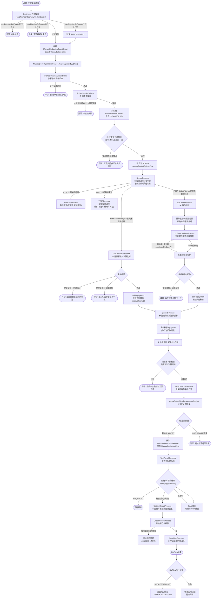

# 人工扣款 - 提交接口

## 接口信息

| 属性 | 值 |
|-----|---|
| 接口名称 | 人工扣款提交 |
| 接口路径 | `/manual_deduction/manualSubmit` |
| 请求方式 | POST |
| Content-Type | application/json |
| Controller | `ManualDeductionController:237` |
| Service | `ManualDeductCommonService.manualDeductSubmit():1365` |
| BizFlow Key | `manualDeductSubmitFlow` (V1.5: `PF-custaccountmanualDeductSubmitFlow_migrate`) |

## 接口描述

人工扣款提交接口，运营/客服/催收人员在完成试算（`/manualTrail`）后，提交扣款请求。系统通过 BizFlow 业务流执行分支路由、试算比对、账务校验、还款引擎提交、结果轮询、结果更新、消息通知等步骤。支持逾期扣款、结清扣款、美团渠道、甜橙渠道等多分支场景，结清场景下自动拆分逾期/未到期分期分步扣款。

---

## 业务流程图



---

## 请求参数

### ManualDeductionSubmitReq

| 字段 | 类型 | 必填 | 校验 | 说明 |
|------|------|------|------|------|
| uid | String | 是 | @NotBlank | 用户UID |
| deductAmount | Integer | 是 | @NotNull | 最终扣款金额（单位：分） |
| deductCardId | String | 否 | - | 扣款卡ID |
| deductTag | String | 是 | @NotBlank | 查询标签：`O`=逾期查询，`A`=结清查询 |
| operator | String | 是 | @NotBlank | 操作人员账号 |
| extraOperator | String | 否 | - | 外部操作人员 |
| isRequired | String | 是 | @NotBlank | 是否客户要求：`Y`=是，`N`=否 |
| trailOrderInfoList | List\<TrailOrderInfo\> | 是 | @NotEmpty | 扣款订单信息列表 |
| cardNumberBeEmpty | String | 是 | @NotBlank | 扣款卡号是否可为空：`Y`=可以，`N`=不可以 |

### TrailOrderInfo

| 字段 | 类型 | 必填 | 说明 |
|------|------|------|------|
| orderNo | String | 是 | 订单号 |
| stagePlanNo | String | 是 | 分期号 |
| stageNo | Integer | 否 | 期数 |

---

## 响应参数

### ManualDeductionSubmitResp

| 字段 | 类型 | 说明 |
|------|------|------|
| code | String | 返回码，`S`=成功 |
| success | Boolean | 提交成功/失败 |
| msg | String | 错误/成功信息 |
| deductNo | String | 业务流水号 |

---

## 数据库交互

### 操作明细

| 表名                          | 操作     | 时机        | 说明                           |
| --------------------------- | ------ | --------- | ---------------------------- |
| `manual_deduct_data_record` | INSERT | 提交RE成功后   | 扣款数据记录（uid、订单号、金额、状态、扣款流水号等） |
| `manual_deduct_data_record` | UPDATE | 收到RE终态结果后 | 更新扣款状态为成功/失败                 |
| `manual_deduction_flow`     | INSERT | 提交RE成功后   | 扣款流水记录                       |
| `manual_deduct_batch`       | SELECT | 批量数据防并发校验 | 查询批次状态，校验是否重复提交              |

### 表关系

```
manual_deduct_batch (批次表，仅批量扣款场景)
  │
  │  batch_no (1) ───→ (N) manual_deduct_data_record.batch_no
  │  batch_no (1) ───→ (N) manual_deduction_flow.batch_no
  │
  ▼
manual_deduct_data_record (扣款汇总记录，1次提交 = 1条)
  │
  │  deduct_no (1) ────→ (N) manual_deduction_flow.deduct_no
  │  deduct_exec_no (1)→ (N) manual_deduction_flow.deduct_exec_no
  │
  ▼
manual_deduction_flow (扣款流水明细，按订单维度拆，1次提交 = N条)
```

**粒度说明：**
- `manual_deduct_batch` — **批次维度**，一个批次任务中每条订单一条记录。仅批量扣款场景（`/batchManualDeduct`）使用，单笔 `/manualSubmit` 不写此表
- `manual_deduct_data_record` — **提交维度**，一次扣款提交 = 一条记录，记录用户提交的扣款金额、实际扣款金额、成功金额、状态等汇总信息
- `manual_deduction_flow` — **订单维度**，一次扣款提交中每个订单一条流水

**关键字段关联：**

| 关联字段 | 来源 | 说明 |
|---------|------|------|
| `data_record.deduct_no` | BizFlow 的 bizSerial（UUID） | 扣款业务号，同时也是 BizFlow 执行实例标识 |
| `flow.deduct_no` | = `data_record.deduct_no` | 通过此字段关联到汇总记录 |
| `data_record.deduct_exec_no` | RE还款引擎返回 | 扣款执行号，用于查询RE扣款结果 |
| `flow.deduct_exec_no` | = `data_record.deduct_exec_no` | 通过此字段关联到汇总记录 |
| `flow.biz_serial` | 每条流水独立生成的 UUID（`:4252`） | **不是** BizFlow 的 bizSerial，是流水表自己的标识 |
| `data_record.bizserial` | 外部调用方传入（可为空） | 外部业务流水号（如 Ares 传入），非 BizFlow 的 bizSerial |
| `batch_no` | 批量场景由上游传入，单笔场景 = deductNo | 三张表通过此字段关联批次 |

---

## 外部系统调用

| 系统/服务 | 调用方式 | 接口方法 | 用途 |
|-----------|----------|----------|------|
| 还款引擎(RE) | Feign | `repayFeignClientProxy.repayApply()` | 发起扣款申请 |
| 还款引擎(RE) | Feign | `repayFeignClientProxy.queryApplyResult()` | 查询扣款结果 |
| repayfront | Feign | `checkCommonService.callRepayFront()` | 账务规则校验(repayCheckV2) |
| 卡服务 | Feign | `cardCommonService.getUserCardByUid()` | 查询用户绑卡列表 |
| TNQ贷款系统 | Feign | `tnqBillClientProxy.findByUidOrOrder()` | 校验订单是否锁单（还款中） |
| innersso | Feign | `innerssoVoFeignClientProxy` | 获取操作人所属部门（用于时间段校验） |
| Redis | 分布式锁 | `distributedLock.lock/unlock()` | 扣款卡次数控制 + 批次防并发 |
| 配置中心 | 本地配置 | `configs.getManualDeductConfigBo()` | 灰度UID列表、卡扣款次数上限等 |

---

## BizFlow 节点详解

### 节点 1: ManualDeductSubmitFlowDecideProcess（提交流程分支判断）

**Bean名称:** `manualDeductSubmitFlowDecideProcess`
**源码位置:** `bizflow/manualdeduct/submit/ManualDeductSubmitFlowDecideProcess.java`

**前置赋值（corePreFileValue）：**
- 设置 `orderNoList`（去重订单号列表）
- 设置 `requestOrderInfoList`（原始分期信息）
- 设置 `sceneCode`（根据 isRequired 转换场景编码）
- 设置 `trailDate`（当前时间）
- 设置 `deductNo`（不存在则生成UUID）
- 设置 `batchNo`（不存在则复用deductNo）

**分支路由逻辑：**

| 优先级 | 条件 | ProcessID | 目标节点 |
|--------|------|-----------|----------|
| 1 | 所有订单渠道 = MEITUAN | P004 | MeiTuanProcess |
| 2 | 所有订单渠道 = TCJR | P005 | TCJRProcess |
| 3 | deductTag=O 且无未到期分期 | P006 | TrailCompareProcess（逾期直扣） |
| 4 | deductTag=A 或含未到期分期 | P007 | SpitDeductProcess（结清拆分扣款） |

**未到期分期判断（isSettle）：** 遍历提交的分期，如果存在 `repaymentDate > 当前日期` 的分期，则认为包含未到期分期。

---

### 节点 2: ManualDeductSubmitTrailCompareProcess（试算结果比对）

**Bean名称:** `manualDeductSubmitTrailCompareProcess`
**源码位置:** `bizflow/manualdeduct/submit/ManualDeductSubmitTrailCompareProcess.java`

**逾期查询(deductTag=O)校验：**
- `totalLeftAmount < deductAmount` → 异常：提交金额超过剩余未还
- `totalTrailLeftAmount ≠ deductAmount` → 异常：提交和试算金额不一致
- 通过后调用 `callRepayFront`（repayCheckV2 账务校验）
- 标记是否部分还款（`partRepay`）

**结清查询(deductTag=A)校验：**
- `totalTrailLeftAmount ≠ deductAmount` → 异常：两次试算金额不一致
- 通过后调用 `callRepayFront`

**callRepayFront 构建参数：** 将试算结果（TrailPlanInfoBo）按订单分组，构建 RepayOrderVo 列表，包含分期号、应还金额、实还金额、担保费、提前结清手续费、本金等。

---

### 节点 3: ManualDeductSubmitSpitDeductProcess（拆分扣款）

**Bean名称:** `manualDeductSubmitSpitDeductProcess`
**源码位置:** `bizflow/manualdeduct/submit/ManualDeductSubmitSpitDeductProcess.java`

将分期拆分为两组：
- `overDueOrderInfoList`：逾期分期
- `unDueOrderInfoList`：未到期分期

**拆分规则：**
- 优先设置逾期分期为当前实际扣款列表（`acutalOrderInfoList`）
- 若逾期分期为空，则使用未到期分期
- 若两者都存在，设置 `continueDeduct=Y`（先扣逾期，后续继续扣未到期）

---

### 节点 4: ManualDeductSubmitDeductProcess（提交扣款）

**Bean名称:** `manualDeductSubmitDeductProcess`
**源码位置:** `bizflow/manualdeduct/submit/ManualDeductSubmitDeductProcess.java`

**核心扣款流程：**
1. **重新校验repayfront** — 防止打包扣款场景导致的规则绕过
2. **分布式锁** — 按 `扣款卡号 + 日期` 加锁
3. **扣款卡次数校验** — 每日扣款次数不超过 `cardMaxDeductNum` 配置
4. **批量数据防并发**（`bachDataCheckStatus`）：
   - 仅对有 batchNo 和 batchId 的数据执行
   - 加分布式锁，校验批次状态是否终态（防重复提交）
   - 校验订单是否锁单（正在还款中）
5. **调用还款引擎** — `repayFeignClientProxy.repayApply(repayApplySubmitReq)`
6. **保存记录** — 构建 ManualDeductDataRecord 和 ManualDeductionFlow 并入库
7. **异常处理** — 标记 `SUBMIT_RE_FAILURE`

---

### 节点 5: ManualDeductSubmitWaitResultProcess（等待扣款结果）

**Bean名称:** `manualDeductSubmitWaitResultProcess`
**源码位置:** `bizflow/manualdeduct/submit/ManualDeductSubmitWaitResultProcess.java`

**轮询机制：**
1. RE返回 `INIT_ABORT` → 流程直接结束
2. 调用 `repayFeignClientProxy.queryApplyResult(deductExecNo)` 查询结果
3. 终态且非INIT_ABORT → 进入下一节点
4. 非终态 → 返回 `PAUSED`，BizFlow 框架后续自动重试

---

### 节点 6: ManualDeductSubmitUpdateResultProcess（更新扣款结果）

**Bean名称:** `manualDeductSubmitUpdateResultProcess`
**源码位置:** `bizflow/manualdeduct/submit/ManualDeductSubmitUpdateResultProcess.java`

调用 `updateManualDeductResultWithReturn()` 更新本地 `manual_deduct_data_record` 表的状态字段。记录 `hasDeductUpdate` 标识是否有状态变更（用于后续消息发送判断）。

---

### 节点 7: ManualDeductSubmitUndueCheckProcess（非逾期订单校验）

**Bean名称:** `manualDeductSubmitUndueCheckProcess`
**源码位置:** `bizflow/manualdeduct/submit/ManualDeductSubmitUndueCheckProcess.java`

- 若 `continueDeduct=Y` 且前一轮扣款成功：
  - 过滤未到期分期中状态为 `LENDING` 的分期
  - 设置为下一轮扣款列表，`continueDeduct=N`
  - 返回 `CONTINUEDEDUCT=Y` 进入下一轮扣款循环
- 否则返回 `CONTINUEDEDUCT=N` 结束

---

### 节点 8: ManualDeductSubmitSendMsgProcess（发送扣款结果消息）

**Bean名称:** `manualDeductSubmitSendMsgProcess`
**源码位置:** `bizflow/manualdeduct/submit/ManualDeductSubmitSendMsgProcess.java`

仅当 `hasDeductUpdate=true` 时发送消息，调用 `sendDeductMsg(uid, sceneCode, deductCardId, repayApplyResultResp, TradeTypeEnum.ORDER)`。

---

## 关键业务规则

| 规则 | 说明 |
|------|------|
| 扣款时间段限制 | 根据操作人所属部门配置可扣款时间段，开关可关闭 |
| 扣款卡次数限制 | 单张扣款卡每日扣款次数不超过 `cardMaxDeductNum` 配置阈值 |
| 多订单灰度控制 | 多订单同时扣款需灰度配置（`grayUids`）放开 |
| 试算金额一致性 | 提交金额必须与试算金额完全一致，防止前端篡改 |
| 逾期/结清分离扣款 | 结清场景包含未到期分期时，先扣逾期分期、再扣未到期分期 |
| 防重复提交 | 批量数据通过分布式锁 + 批次终态校验防止并发重复扣款 |
| 订单锁单校验 | 通过 TNQ 系统校验订单是否正在还款中（payFlag=1） |
| RE结果异步轮询 | BizFlow PAUSED 机制实现对还款引擎结果的异步等待 |

---

## 关联接口

| 接口 | 路径 | 关系 |
|------|------|------|
| 人工扣款试算 | `/manual_deduction/manualTrail` | 前置依赖，提交前必须先试算 |
| 人工扣款查询 | `/manual_deduction/manualOrderQuery` | 提交前查询用户订单信息 |
| 人工扣款历史 | `/manual_deduction/manualDeductHistory` | 查询已提交的扣款历史记录 |
| 批量订单扣款 | `/manual_deduction/batchManualDeduct` | 批量场景复用同一提交逻辑 |

---

## 源码文件索引

| 文件 | 路径 |
|------|------|
| Controller | `accountingoperation/src/main/java/.../controller/ManualDeductionController.java` |
| Service | `accountingoperation/src/main/java/.../service/manualdeduct/ManualDeductCommonService.java` |
| Request DTO | `accountingoperation-common/src/main/java/.../common/req/manualdeduction/ManualDeductionSubmitReq.java` |
| Response DTO | `accountingoperation-common/src/main/java/.../common/resp/manualdeduction/ManualDeductionSubmitResp.java` |
| Input BO | `accountingoperation-common/src/main/java/.../common/req/manualdeduction/ManualDeductionSubmitInput.java` |
| BizFlow-分支判断 | `accountingoperation/src/main/java/.../bizflow/manualdeduct/submit/ManualDeductSubmitFlowDecideProcess.java` |
| BizFlow-试算比对 | `accountingoperation/src/main/java/.../bizflow/manualdeduct/submit/ManualDeductSubmitTrailCompareProcess.java` |
| BizFlow-拆分扣款 | `accountingoperation/src/main/java/.../bizflow/manualdeduct/submit/ManualDeductSubmitSpitDeductProcess.java` |
| BizFlow-提交扣款 | `accountingoperation/src/main/java/.../bizflow/manualdeduct/submit/ManualDeductSubmitDeductProcess.java` |
| BizFlow-等待结果 | `accountingoperation/src/main/java/.../bizflow/manualdeduct/submit/ManualDeductSubmitWaitResultProcess.java` |
| BizFlow-更新结果 | `accountingoperation/src/main/java/.../bizflow/manualdeduct/submit/ManualDeductSubmitUpdateResultProcess.java` |
| BizFlow-非逾期校验 | `accountingoperation/src/main/java/.../bizflow/manualdeduct/submit/ManualDeductSubmitUndueCheckProcess.java` |
| BizFlow-发送消息 | `accountingoperation/src/main/java/.../bizflow/manualdeduct/submit/ManualDeductSubmitSendMsgProcess.java` |
| BizFlow-美团提交 | `accountingoperation/src/main/java/.../bizflow/manualdeduct/submit/ManualDeductSubmitMeiTuanProcess.java` |
| BizFlow-甜橙提交 | `accountingoperation/src/main/java/.../bizflow/manualdeduct/submit/ManualDeductSubmitTCJRProcess.java` |
| BizFlow-结清继续 | `accountingoperation/src/main/java/.../bizflow/manualdeduct/submit/ManualDeductUnDueContinueProcess.java` |
| BizFlowKey枚举 | `accountingoperation-common/src/main/java/.../common/constants/BizFlowKeyEnum.java` |
| BizFlowNode枚举 | `accountingoperation/src/main/java/.../constant/manualdeduct/BizFlowNodeEnum.java` |