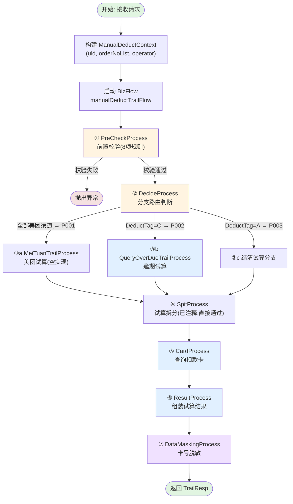
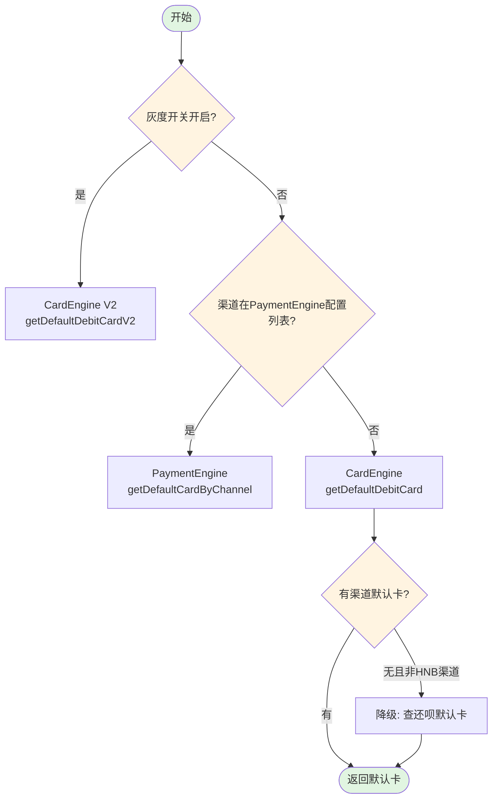
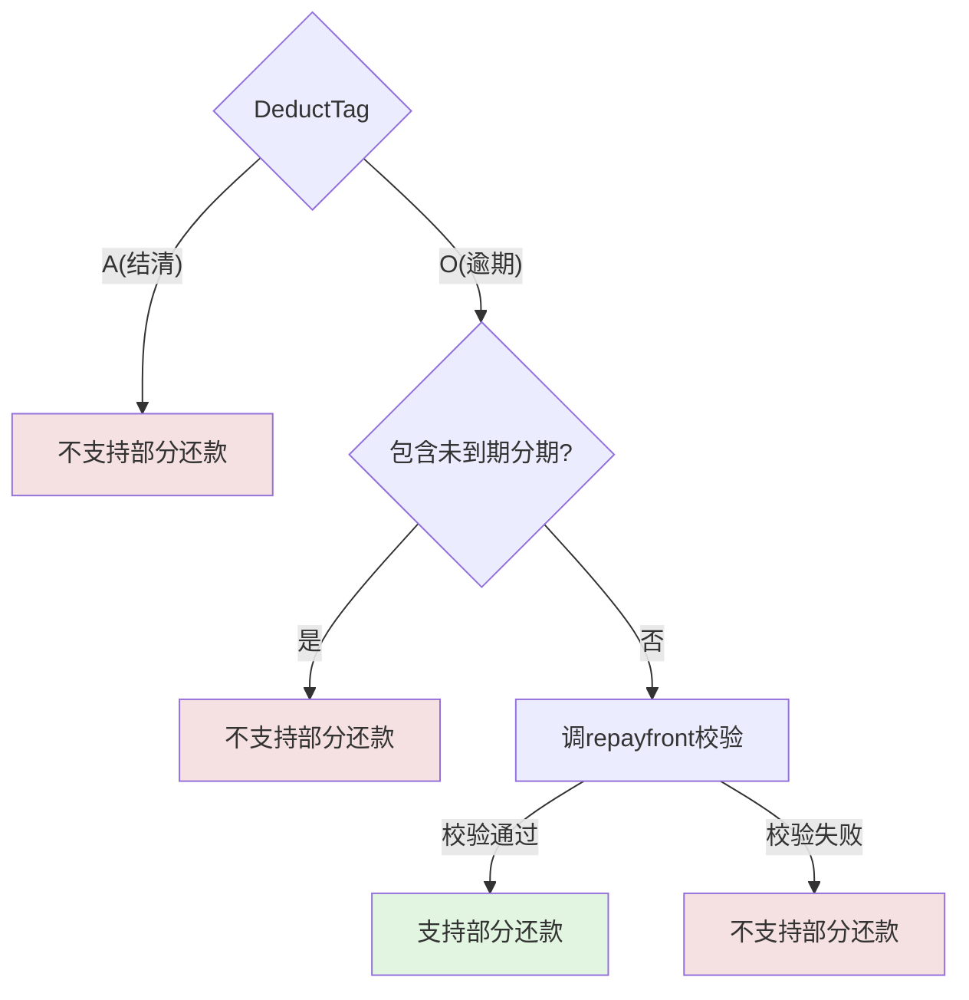

# 人工扣款 - 试算接口

## 接口信息

| 属性 | 值 |
|-----|---|
| 接口名称 | 人工扣款试算 |
| 接口路径 | `/manual_deduction/manualTrail` |
| 请求方式 | POST |
| Content-Type | application/json |
| Controller | `ManualDeductionController:201` |
| Service | `ManualDeductCommonService.manualDeductTrail():343` |
| BizFlow Key | `manualDeductTrailFlow` (V1.5: `PF-custaccountmanualDeductTrailFlow_migrate`) |

## 接口描述

人工扣款试算接口，运营/客服/催收人员选择用户的订单和分期后发起试算，系统通过 BizFlow 业务流执行前置校验、分支路由、费用计算、银行卡查询、结果组装、数据脱敏等步骤，返回各费项明细和可用扣款卡列表，供后续提交扣款使用。

---

## 业务流程图



---

## 请求参数

### ManualDeductionTrailReq

| 字段名 | 类型 | 必填 | 说明 |
|-------|------|------|------|
| uid | String | 是 | 用户ID |
| trailDate | Date | 是 | 试算日期 |
| deductTag | String | 是 | 查询标签：O=逾期, A=结清 |
| operator | String | 是 | 操作人员 |
| trailOrderInfoList | List\<TrailOrderInfo\> | 是 | 试算订单分期列表 |
| skipCheckRepayfront | boolean | 否 | 是否跳过还款前检查，默认false |

### TrailOrderInfo（试算订单分期）

| 字段名 | 类型 | 必填 | 说明 |
|-------|------|------|------|
| orderNo | String | 是 | 订单号 |
| stagePlanNo | String | 是 | 分期计划号 |
| stageNo | Integer | 否 | 期数 |

### 请求示例

```json
{
  "uid": "123456789",
  "trailDate": "2026-03-12",
  "deductTag": "O",
  "operator": "user001",
  "trailOrderInfoList": [
    {
      "orderNo": "ORDER20260101001",
      "stagePlanNo": "PLAN20260101001",
      "stageNo": 1
    },
    {
      "orderNo": "ORDER20260101001",
      "stagePlanNo": "PLAN20260101002",
      "stageNo": 2
    }
  ],
  "skipCheckRepayfront": false
}
```

---

## 响应参数

### ManualDeductionTrailResp

| 字段名 | 类型 | 说明 |
|-------|------|------|
| orderInfoList | List\<OrderInfo\> | 订单集合 |
| deductAmount | Integer | 扣款金额（分） |
| minDeductAmount | Integer | 最小扣款金额（分），按操作人部门配置动态获取，默认1000分(10元) |
| leftTotalAmount | Integer | 应还欠款总额（分） |
| leftPrincipal | Integer | 应还本金（分） |
| leftFee | Integer | 应还手续费（分） |
| leftWarrantyFee | Integer | 应还担保费（分） |
| leftEarlySettleFee | Integer | 应还提前结清手续费（分） |
| leftLateFee | Integer | 应还违约金（分） |
| leftPentyFee | Integer | 应还罚息（分） |
| leftCompFee | Integer | 应还复利（分） |
| leftAmcFee | Integer | 应还资产管理咨询费（分） |
| cardVoList | List\<CardVo\> | 可用卡列表 |
| operatorGroup | String | 操作人员所属组：customer/collection/other |
| canPartDeduct | String | 是否可部分还款：Y/N |
| cardNumberBeEmpty | String | 扣款卡号是否可空：Y/N |
| result | boolean | 结果是否成功，默认true |
| msg | String | 错误信息 |

### OrderInfo（订单维度）

| 字段名 | 类型 | 说明 |
|-------|------|------|
| trailDate | Date | 试算日期 |
| orderNo | String | 订单号 |
| defaultDebitCardNo | String | 默认扣款卡号（脱敏后） |
| defaultDebitCardId | String | 默认扣款卡ID |
| businessType | String | 订单类型 |
| channel | String | 渠道 |
| bankName | String | 资金方 |
| leftPrincipal~leftAmcFee | Integer | 各费项（同汇总层） |
| totalLeftAmount | Integer | 合计（分） |
| planInfoList | List\<PlanInfo\> | 分期列表 |
| orderOverDueStage | String | 逾期状态 |

### PlanInfo（分期维度）

| 字段名 | 类型 | 说明 |
|-------|------|------|
| stageNo | Integer | 期数 |
| stagePlanNo | String | 分期计划号 |
| pmtDueDate | Date | 到期日 |
| planOverDueStage | String | 逾期状态 |
| obtainTag | String | 获取标（资产标签） |
| leftPrincipal~leftAmcFee | Integer | 各费项（分） |
| totalLeftAmount | Integer | 合计（分） |

### CardVo（可用卡）

| 字段名 | 类型 | 说明 |
|-------|------|------|
| cardNo | String | 卡号 |
| cardId | String | 卡ID |
| defaultDebitCard | Boolean | 是否默认卡 |

---

## 业务流程详解

### 1. PreCheckProcess — 前置校验

**文件:** `ManualDeductTrailPreCheckProcess:52`

执行8项业务规则校验：

| 序号 | 校验规则 | 异常码 | 异常信息 |
|-----|---------|-------|---------|
| 1 | 分期处于 THIRD_PAYING（还款中） | 12001 | 分期：{planNo}还款中,订单:{orderNo}无法发起扣款试算 |
| 2 | 需资方试算的订单不支持非当日试算 | 12001 | 订单：{orderNo}不支持非当日试算 |
| 3 | 不同API渠道订单不可打包试算 | 12001 | 不同API渠道接入订单不可一起试算 |
| 4 | API与非API订单不可混合 | 12001 | api与非api订单不可打包试算 |
| 5 | 甜橙不支持结清试算(DeductTag=A) | 12001 | 甜橙不支持结清试算 |
| 6 | 甜橙订单未处理完成不能重复提交 | 9999 | 订单号【{orderNos}】正在处理中，请勿重复提交 |
| 7 | 甜橙订单需勾选全部逾期和当天到期分期 | 9999 | 甜橙渠道订单-需要勾选全部逾期和当天到期的分期 |
| 8 | 大地资方不能与非大地订单打包 | 9999 | 大地的资方订单不能和非大地的订单打包试算 |

最后调用 `repayfront.repayCheckV2` 进行还款规则校验（`skipCheckRepayfront=true`时跳过）。

### 2. DecideProcess — 分支路由

**文件:** `ManualDeductTrailFlowDecideProcess:21`

```mermaid
flowchart TD
    Start([开始]) --> CheckMeiTuan{全部订单为美团渠道?}
    CheckMeiTuan -->|是| P001["P001: 美团试算分支"]
    CheckMeiTuan -->|否| CheckTag{deductTag}
    CheckTag -->|O(逾期)| P002["P002: 逾期试算分支"]
    CheckTag -->|A(结清)| P003["P003: 结清试算分支"]
    CheckTag -->|其他| Err([异常: 未知流程节点])

    style Start fill:#e1f5e1
    style CheckMeiTuan fill:#fff4e1
    style CheckTag fill:#fff4e1
    style Err fill:#f5e1e1
```

### 3. QueryOverDueTrailProcess — 逾期试算（核心计算）

**文件:** `ManualDeductQueryOverDueTrailProcess:31`

- 过滤已结清的订单分期 (`filterPayOffOrderInfo`)
- 构建通用试算请求 (`convertTrailCommonReq`)
- 检测是否包含灵活还款产品 (`isFreeRepayProduct`)
  - 包含灵活还款：按指定分期金额 `byAmount` 提交试算，响应按请求分期过滤
- 调用 **feecalculator** 服务计算各费项 (`callFeecalculatorTrail`)
- 试算结果写入 `manualDeductContext.trailPlanInfoBos`

### 4. SpitProcess — 试算拆分

**文件:** `ManualDeductTrailSpitProcess:17`

当前逻辑已全部注释，直接返回成功。（历史代码曾按逾期/未到期拆分分期）

### 5. CardProcess — 查询扣款卡

**文件:** `ManualDeductCardProcess:45`

对每个订单执行两步查询：

**默认扣款卡**（三种策略按优先级）：



**可扣款卡列表**：调用 `cardCommonService.canDeductCardList(uid, bank, channel, businessType)`

### 6. ResultProcess — 组装试算结果

**文件:** `ManualDeductTrailResultProcess:43`

- 按订单维度汇总各费项（本金、手续费、担保费、违约金、罚息、复利、资产管理咨询费）
- 查询资产标签 `obtainTag`（调 standingbook 服务）
- 取所有订单卡列表的**交集**作为可用卡列表
- 判断**是否可部分还款**：
  - 非逾期(DeductTag≠O) → 不支持
  - 逾期且包含未到期分期 → 不支持
  - 逾期且全部已逾期 → 调 `repayfront.repayCheckV2` 校验决定
- 甜橙渠道特殊处理：`cardNumberBeEmpty=Y`
- 设置最小扣款金额：按操作人部门配置动态获取

### 7. DataMaskingProcess — 数据脱敏

**文件:** `ManualDeductDataMaskingProcess:21`

对响应中每个订单的 `defaultDebitCardNo` 执行掩码处理（`AoCardServiceImpl.maskCardNo`）。

---

## 数据库交互

| 表名 | 操作 | 说明 |
|-----|------|------|
| `manual_deduction_flow` | SELECT | PreCheckProcess 校验甜橙订单是否有未处理完的流水（状态 INIT/PRE_LOCK/PROCESSING） |

---

## 外部系统调用

| 调用目标 | 方法 | 用途 | 调用方式 |
|---------|------|------|---------|
| **repayfront** | `repayCheckV2` | 还款规则校验（前置校验 + 部分还款判断） | Feign |
| **feecalculator** | `callFeecalculatorTrail` | 费用试算，计算各费项明细 | Feign |
| **CardEngine** | `getDefaultDebitCard` / `getDefaultDebitCardV2` | 默认扣款卡查询 | Feign |
| **PaymentEngine** | `getDefaultCardByChannel` | 渠道默认卡查询 | Feign |
| **CardEngine** | `canDeductCardList` | 可扣款卡列表查询 | Feign |
| **standingbook** | `queryObtainTag` | 资产标签查询（获取标信息） | Feign |

---

## 关键业务规则

### 打包限制

| 规则 | 说明 |
|-----|------|
| API渠道隔离 | 不同API渠道的订单不可一起试算 |
| API与非API隔离 | API订单与非API订单不可混合打包 |
| 大地资方隔离 | 大地(CCICBANK)资方订单不能与其他资方打包 |

### 部分还款判断逻辑



### 灵活还款产品特殊处理

- 包含灵活还款产品时，按指定分期金额 `byAmount` 提交试算
- feecalculator 返回所有分期计划，需按请求过滤未选择的分期

### 金额单位

全部使用**分**（Integer），前端展示时需转换为元。

---

## 异常处理

| 异常码 | 异常信息 | 触发条件 |
|-------|---------|---------|
| 12001 | 分期：{planNo}还款中,订单:{orderNo}无法发起扣款试算 | 分期状态为 THIRD_PAYING |
| 12001 | 订单：{orderNo}不支持非当日试算 | 需资方试算的订单试算日期非当日 |
| 12001 | 不同API渠道接入订单不可一起试算 | 多个不同API渠道订单打包 |
| 12001 | api与非api订单不可打包试算 | API和非API订单混合 |
| 12001 | 甜橙不支持结清试算 | 甜橙渠道 + DeductTag=A |
| 9999 | 订单号【{orderNos}】正在处理中，请勿重复提交 | 甜橙订单有未完成流水 |
| 9999 | 甜橙渠道订单-需要勾选全部逾期和当天到期的分期 | 甜橙订单未勾选全部逾期分期 |
| 9999 | 大地的资方订单不能和非大地的订单打包试算 | 大地与非大地订单混合 |
| 9999 | BizFlow失败（标准化错误信息） | BizFlow 执行失败 |

---

## BizFlow 节点清单

| 节点Bean名称 | 类 | 职责 |
|-------------|---|------|
| `manualDeductTrailPreCheckProcess` | ManualDeductTrailPreCheckProcess | 前置校验 |
| `manualDeductTrailFlowDecideProcess` | ManualDeductTrailFlowDecideProcess | 分支路由 |
| `manualDeductMeiTuanTrailProcess` | ManualDeductMeiTuanTrailProcess | 美团试算(空实现) |
| `manualDeductQueryOverDueTrailProcess` | ManualDeductQueryOverDueTrailProcess | 逾期试算核心 |
| `manualDeductTrailSpitProcess` | ManualDeductTrailSpitProcess | 试算拆分(已注释) |
| `manualDeductCardProcess` | ManualDeductCardProcess | 查询扣款卡 |
| `manualDeductResultProcess` | ManualDeductTrailResultProcess | 组装试算结果 |
| `manualDeductDataMaskingProcess` | ManualDeductDataMaskingProcess | 数据脱敏 |

---

## 相关接口

| 接口 | 说明 |
|-----|------|
| `POST /manual_deduction/manualOrderQuery` | 人工扣款-查询接口（试算前查询订单） |
| `POST /manual_deduction/manualSubmit` | 人工扣款-提交接口（试算后提交扣款） |
| `POST /manual_deduction/manualDeductHistory` | 人工扣款-历史查询接口 |
| `POST /manual_deduction/manualDeductAresTrail` | Ares一键扣款试算（内部复用本接口） |
| `POST /manual_deduction/manualDeductAresSubmit` | Ares一键扣款提交 |

---

## 相关文档

- [项目工程结构](../01-项目工程结构.md)
- [数据库结构](../02-数据库结构.md)
- [接口流程索引](../03-接口流程索引.md)

---

**文档版本:** v1.0
**最后更新:** 2026-03-12
**维护人员:** Claude Code