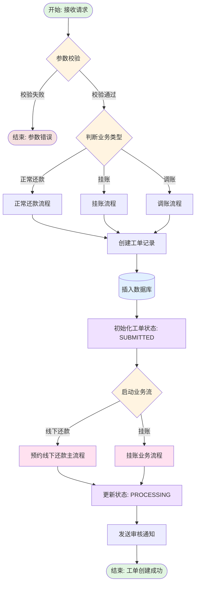
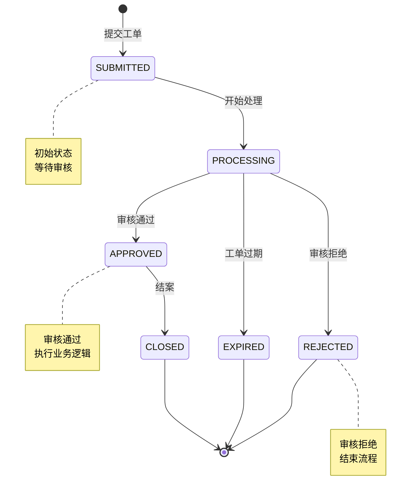
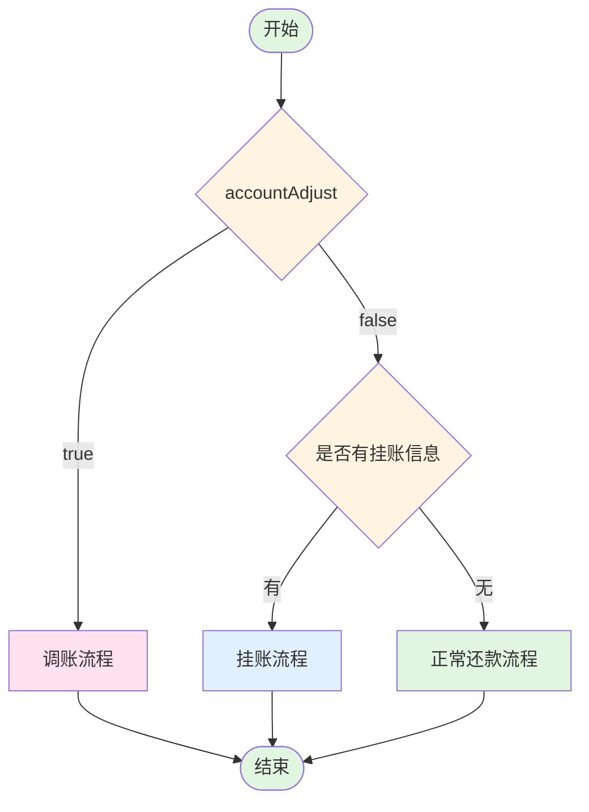
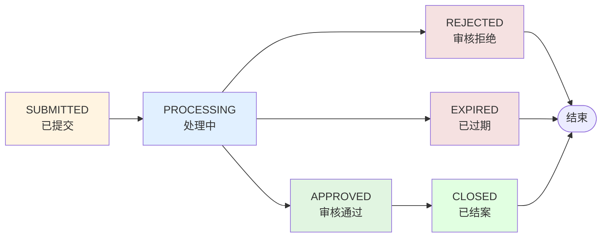

# 线下还款 - 提交工单接口

## 接口信息

| 属性 | 值 |
|-----|---|
| 接口名称 | 提交工单 |
| 接口路径 | `/getReceiptHandleObject` |
| 请求方式 | POST |
| Content-Type | application/json |
| Controller | `OfflineRepayController` |
| Service | `OfflineRepayService.routeStartWorkOrderChoice` |

## 接口描述

运营人员提交线下还款工单，系统创建工单记录并启动业务流程。该接口支持线下还款、挂账、调账等多种业务场景。

---

## 业务流程图



## 工单状态流转图



---

## 请求参数

### ReceiptHandleReq

| 字段名 | 类型 | 必填 | 说明 |
|-------|------|------|------|
| transferList | List\<ChargeUpInfoBo\> | 是 | 挂账信息列表 |
| targetPlanBo | List\<StagePlanDto\> | 是 | 目标分期 |
| sourcePlanBo | List\<StagePlanDto\> | 是 | 源分期 |
| summaryPlanBo | List\<StagePlanDto\> | 是 | 分期汇总 |
| sumTransAmount | Integer | 是 | 转账总金额（必须>0） |
| repayPlanAmount | Integer | 是 | 应还金额（必须>0） |
| customerBo | CustomerDto | 是 | 客户信息 |
| certificateList | List\<String\> | 是 | 证明文件列表 |
| accountAdjust | Boolean | 否 | 是否调账 |
| operator | String | 是 | 操作人员 |
| workOrderNo | String | 否 | 工单号（不传则自动生成） |
| collectionAccount | String | 是 | 线下收款账户 |
| phoneNumber | String | 否 | 手机号 |
| taskId | String | 否 | 工单任务ID |
| partialRepay | Boolean | 否 | 是否部分还款 |
| repaymentStyle | String | 否 | 还款方式（部分还款标识） |
| paymentType | String | 否 | 缴款类型 |
| repayExplain | String | 否 | 还款说明 |
| offlineRepayOrderInfoTotalBos | List\<OfflineRepayOrderInfoTotalBo\> | 否 | 订单信息汇总 |

### ChargeUpInfoBo（挂账信息）

| 字段名 | 类型 | 说明 |
|-------|------|------|
| planNo | String | 计划编号 |
| orderNo | String | 订单号 |
| transferAmount | Integer | 转账金额 |
| stageNo | Integer | 期数 |

### StagePlanDto（分期信息）

| 字段名 | 类型 | 说明 |
|-------|------|------|
| planNo | String | 计划编号 |
| orderNo | String | 订单号 |
| stageNo | Integer | 期数 |
| repaymentDate | Date | 还款日期 |
| leftAmount | Integer | 剩余金额 |
| repayAmount | Integer | 还款金额 |

### CustomerDto（客户信息）

| 字段名 | 类型 | 说明 |
|-------|------|------|
| uid | String | 用户ID |
| customerName | String | 客户姓名 |
| idCard | String | 身份证号 |

### 请求示例

```json
{
  "transferList": [
    {
      "planNo": "PLAN20250120001",
      "orderNo": "ORDER20250120001",
      "transferAmount": 500000,
      "stageNo": 1
    }
  ],
  "targetPlanBo": [
    {
      "planNo": "PLAN20250120001",
      "orderNo": "ORDER20250120001",
      "stageNo": 1,
      "repaymentDate": "2025-01-20",
      "leftAmount": 500000,
      "repayAmount": 500000
    }
  ],
  "sourcePlanBo": [],
  "summaryPlanBo": [],
  "sumTransAmount": 500000,
  "repayPlanAmount": 500000,
  "customerBo": {
    "uid": "123456789",
    "customerName": "张三",
    "idCard": "310***********1234"
  },
  "certificateList": [],
  "accountAdjust": false,
  "operator": "user001",
  "workOrderNo": null,
  "collectionAccount": "工商银行",
  "phoneNumber": "13800138000",
  "partialRepay": false,
  "repaymentStyle": null,
  "paymentType": "OFFLINE",
  "repayExplain": "线下还款说明"
}
```

---

## 响应参数

**响应类型:** `void`（无返回值）

成功时返回 HTTP 200，失败时抛出异常。

---

## 业务流程详解

### 1. 参数校验

**方法:** `ReceiptHandleReq.checkParameter()`

**校验规则:**

| 规则 | 说明 | 错误信息 |
|-----|------|---------|
| 转账总金额 | 必须 > 0 | "转账总金额不能小于等于0" |
| 应还金额 | 必须 > 0 | "应还金额不能小于等于0" |

### 2. 业务类型判断

**方法:** `OfflineRepayService.routeStartWorkOrderChoice()`

**判断逻辑:**



### 3. 创建工单记录

**涉及表:** `offline_repay_work_order`

**初始字段:**

| 字段名 | 初始值 | 说明 |
|-------|-------|------|
| work_order_no | 自动生成UUID | 工单号 |
| uid | customerBo.uid | 用户ID |
| operator | operator | 操作人 |
| status | 'SUBMITTED' | 工单状态 |
| sum_trans_amount | sumTransAmount | 转账总金额 |
| repay_plan_amount | repayPlanAmount | 应还金额 |
| collection_account | collectionAccount | 收款账户 |
| create_time | NOW() | 创建时间 |
| update_time | NOW() | 更新时间 |

### 4. 启动业务流

**业务流调用:**

根据业务类型调用不同的业务流：

| 业务类型 | 业务流 | BizKey |
|---------|-------|--------|
| 正常还款 | 预约线下还款主流程 | `offline_reserve_repay_process` |
| 挂账 | 挂账业务流程 | 待确认 |

### 5. 发送审核通知

**通知方式:**
- 站内消息
- 短信通知（可选）

---

## 数据库交互

### 涉及的表

| 表名 | 操作 | 说明 |
|-----|------|------|
| `offline_repay_work_order` | INSERT | 创建工单记录 |
| `offline_repay_order_info` | INSERT | 创建订单信息记录 |
| `charge_off_trans_log` | INSERT | 挂账交易日志（挂账场景） |
| `account_adjust_trans_log` | INSERT | 调账交易日志（调账场景） |

### 关键SQL

```sql
-- 插入工单记录
INSERT INTO offline_repay_work_order (
    work_order_no,
    uid,
    operator,
    status,
    sum_trans_amount,
    repay_plan_amount,
    collection_account,
    create_time,
    update_time
) VALUES (?, ?, ?, 'SUBMITTED', ?, ?, ?, NOW(), NOW());
```

---

## 外部系统调用

### 无

该接口为纯内部处理接口，不调用外部系统。

---

## 关键业务状态

### 工单状态 (status)

| 状态 | 说明 | 备注 |
|-----|------|------|
| SUBMITTED | 已提交 | 初始状态，等待审核 |
| PROCESSING | 处理中 | 业务流程执行中 |
| APPROVED | 已审核通过 | 审核通过，继续执行 |
| REJECTED | 已拒绝 | 审核拒绝，流程终止 |
| EXPIRED | 已过期 | 工单过期，自动关闭 |
| CLOSED | 已结案 | 工单处理完成 |

### 状态流转规则



---

## 异常处理

### 异常列表

| 异常码 | 异常信息 | 触发条件 | 处理方式 |
|-------|---------|---------|---------|
| 12001 | 转账总金额不能小于等于0 | sumTransAmount <= 0 | 返回错误 |
| 12001 | 应还金额不能小于等于0 | repayPlanAmount <= 0 | 返回错误 |
| 系统异常 | 数据库异常、网络异常等 | 系统内部错误 | 返回500错误 |

---

## 性能指标

| 指标 | 目标值 | 说明 |
|-----|-------|------|
| 接口响应时间 | < 500ms | 正常情况下 |
| 数据库写入时间 | < 100ms | 单条记录插入 |
| 并发处理能力 | 100 TPS | 峰值并发 |

---

## 相关接口

| 接口 | 说明 |
|-----|------|
| `GET /offlineRepay/getWorkOrder/{workOrderNo}` | 查询工单金额 |
| `GET /offlineRepay/workOrderDetail/{workOrderNo}` | 查询工单详情 |
| `POST /offlineRepay/approveWorkOrder` | 审核工单 |
| `POST /offlineRepay/checkWorkOrder` | 工单预校验 |
| `POST /offlineRepay/rejectWorkOrder` | 踢退工单 |

---

## 相关文档

- [项目工程结构](../../01-项目工程结构.md)
- [数据库结构](../../02-数据库结构.md)
- [预约线下还款主流程](../../05-业务流详情/offline_reserve_repay_process.md)
- [调度任务索引](../../04-调度任务索引.md)

---

**文档版本:** v1.0
**最后更新:** 2025-02-24
**维护人员:** Claude Code
