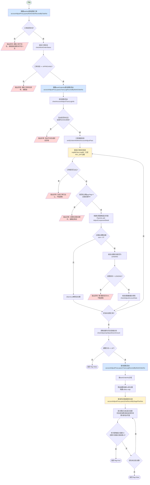

# BPM审批校验

## 接口概览

| 属性 | 值 |
|------|-----|
| 接口路径 | `/accountAdjust/bpmApprovedCheck` |
| 请求方式 | GET |
| 接口描述 | BPM审批流程通过时，对调账工单进行前置校验，判断是否需要弹出提示框（调增金额大于历史累计调减金额） |
| Controller | `AccountAdjustController:91` |
| Service | `AccountAdjustService:3196` |

---

## 接口参数

### 请求参数

| 参数名 | 类型 | 必填 | 描述 |
|--------|------|------|------|
| taskNo | String | 是 | BPM任务号（`@NotBlank` 校验） |

**示例：**
```
GET /accountAdjust/bpmApprovedCheck?taskNo=TASK20240101001
```

### 响应参数

类：`CheckAdjustUpMoreThanTotalDownAmountResp`
（`accountingoperation-common/src/main/java/cn/caijiajia/accountingoperation/common/resp/accountadjust/CheckAdjustUpMoreThanTotalDownAmountResp.java`）

| 字段名 | 类型 | 描述 |
|--------|------|------|
| flag | boolean | 是否显示提示框：`true` = 显示（调增金额超出历史累计调减），`false` = 不显示 |

**响应示例：**
```json
{
  "flag": true
}
```

---

## 业务流程

### 主流程图



### 关键节点说明

**节点1 - 查询调账工单**
- 代码：`AccountAdjustProxy:136` → `accountAdjustWorkOrderRepository.queryWorkOrderRecoredByTaskNo(taskNo)`
- 数据库：`account_adjust_work_order` 表，按 `taskNo` 查询
- 返回 null 则抛异常

**节点2 - 校验工单状态（`checkWorkOrderStatus`）**
- 代码：`AccountAdjustService:2011`
- 只允许 `APPROVING` 状态通过，其他状态均抛异常："调账工单状态异常，请踢退"

**节点3 - 查询调账流水**
- 代码：`AccountAdjustProxy:183` → `accountAdjustTransLogRepository.queryTransLogRecoredByWorkOrderNo(workOrderNo)`
- 数据库：`account_adjust_trans_log` 表，按 `workOrderNo` 批量查询

**节点4 - 校验流水状态（`checkAccountAdjustTransLogInfo`）**
- 代码：`AccountAdjustService:2116`
- 流水列表不能为空
- 所有流水的 `workOrderLockEnum` 必须为 `DOING`，否则抛异常

**节点5 - 订单维度校验（`verifyOrderInfoWhenAccountAdjustPass`）**
- 代码：`AccountAdjustService:2055`
- 按 `stageOrderNo` 分组流水，逐订单进行以下校验：
  1. 调用 TnqBill 获取订单信息（过滤 PAY_OFF 状态分期）
  2. 订单状态不能为 SOLD（已出让）
  3. 所有分期的 `payFlag` 不能为 `Y`（还款处理中）
  4. 调整金额 > 0 的分期，其状态必须为 `LENDING`
  5. 调用 `checkAdjustAccountData` 校验各成分调减金额不超过剩余应还金额

**节点6 - 调增金额校验（`checkAdjustUpAdjustDownAmount`）**
- 代码：`AccountAdjustService:3139`
- 仅对调整方向为 `UP`（调增）时执行
- 查询该工单下所有调整金额 > 0 的分期的历史账务记录（`account_adjust_fee_account`）
- 逐成分比较：若本次调增 > 0 且历史累计调减 < 0，则 `flag = true`
- 比较成分：利息(`fee`)、担保费(`warrantyFee`)、提前结清手续费(`earlySettle`)、违约金(`lateFee`)、罚息(`interest`)

---

## 数据库交互

### 查询操作

| 表名 | 操作 | 条件 | 调用位置 |
|------|------|------|---------|
| `account_adjust_work_order` | SELECT | `task_no = ?` | `AccountAdjustProxy:136` |
| `account_adjust_trans_log` | SELECT | `work_order_no = ?` | `AccountAdjustProxy:183` |
| `account_adjust_fee_account` | SELECT | `stage_plan_no IN (?)` | `AccountAdjustProxy:367` |

> 注：无写操作，本接口为纯校验查询接口。

---

## 外部系统调用

### TnqBill（贷款核心系统）

| 属性 | 值 |
|------|-----|
| 调用位置 | `AccountAdjustService:361` → `getLoanCoreOrderInfoOfPayOff` |
| 调用类 | `tnqBillClient.tnqBill(TNQBillReqFeign)` |
| 请求参数 | `billNos`（订单号列表），`range="T"`（含终态） |
| 返回数据 | 订单完整信息，含分期列表（`termList`）、BNP成分列表（`bnpList`）等 |
| 调用时机 | `verifyOrderInfoWhenAccountAdjustPass` 中，按订单号分组后逐个查询 |
| 后处理 | 过滤掉 `PAY_OFF`（已结清）状态的分期 |

---

## 关键业务状态

### 工单状态（`WorkOrderStatusEnum`）

| 状态值 | 说明 | bpmApprovedCheck 行为 |
|--------|------|----------------------|
| `APPROVING` | 审批中 | **允许通过** |
| 其他 | 非审批中 | 抛出异常：调账工单状态异常，请踢退 |

### 流水锁定状态（`WorkOrderLockEnum`）

| 状态值 | 说明 | bpmApprovedCheck 行为 |
|--------|------|----------------------|
| `DOING` | 处理中 | **允许通过** |
| 其他 | 异常状态 | 抛出异常：调账订单详情处于异常状态，请踢退或者联系开发人员 |

### 调整方向（`DirectionEnum` / `adjustDirection`）

| 值 | 说明 | checkAdjustUpAdjustDownAmount 行为 |
|----|------|----------------------------------|
| `UP` | 调增 | 执行调增金额 vs 历史调减比较逻辑，可能返回 `flag=true` |
| `DOWN` | 调减 | 跳过比较，直接返回 `flag=false` |

> **注意**：`adjustDirection` 字段优先取 `workOrderInfo.adjustDirection`，若为空则从 `extend` JSON 字段的 `FEE_DIRECTION` 键取值。

### 分期状态

| 分期状态 | 说明 | 校验行为 |
|---------|------|---------|
| `LENDING` | 贷款中 | 允许调账 |
| `PAY_OFF` | 已结清 | 在 `getLoanCoreOrderInfoOfPayOff` 中直接过滤掉 |
| 其他 | 非正常状态 | 抛出异常：第X期状态为XX,不能调账 |

---

## 异常处理

| 场景 | 错误码 | 错误信息 |
|------|--------|---------|
| 任务号对应工单不存在 | 12001 | 调账工单不存在，请踢退或者联系开发人员 |
| 工单状态非APPROVING | 12001 | 调账工单状态异常，请踢退 |
| 调账流水为空 | 12001 | 没有找到调账订单详情，请踢退或者联系开发人员 |
| 流水状态非DOING | 12001 | 调账订单详情处于异常状态，请踢退或者联系开发人员 |
| 订单已出让(SOLD) | 12001 | 当前订单已出让，不能调账！ |
| 分期payFlag=Y | 12001 | {termId}分期在还款处理中，请稍后再试！ |
| 分期已结清无调整分期 | 12001 | 查找不到需要调整的分期，请核对分期状态 |
| 分期状态非LENDING | 12001 | 第X期状态为XX,不能调账！ |
| 参数校验失败 | - | 任务号不能为空! |

---

## 重要说明

> **接口用途**：本接口供 BPM 系统在审批通过动作执行前调用，用于前置判断是否需要向审批人弹出提示框。前端根据 `flag` 决定是否拦截审批操作并弹出警告。

> **调增超调减时不拦截审批**：`flag=true` 仅代表显示提示框，不代表禁止审批通过。最终是否审批由人工决定。

> **与 approveWorkOrder 的区别**：
> - `bpmApprovedCheck`：只读查询 + 金额比较，不修改任何数据
> - `approveWorkOrder`：执行 FlowPlus 审批动作（`flowplusRpcService.completeTask`），会修改工单状态

> **verifyOrderInfoWhenAccountAdjustPass 的分期过滤逻辑**：
> - 当某分期的所有调整成分之和为 0 时，该分期从 `termList` 中被移除（跳过状态校验）
> - 只有调整金额 > 0 的分期才会进行 LENDING 状态校验和 `checkAdjustAccountData` 校验

---

## 相关文档

- [03-接口流程索引](../../03-接口流程索引.md)
- [工单调账核心流程](../../工单调账核心流程.md)
- [approveWorkOrder-审核工单](./approveWorkOrder-审核工单.md)（待创建）

---

**文档版本:** v1.0
**创建时间:** 2026-03-30
**维护人员:** Claude Code