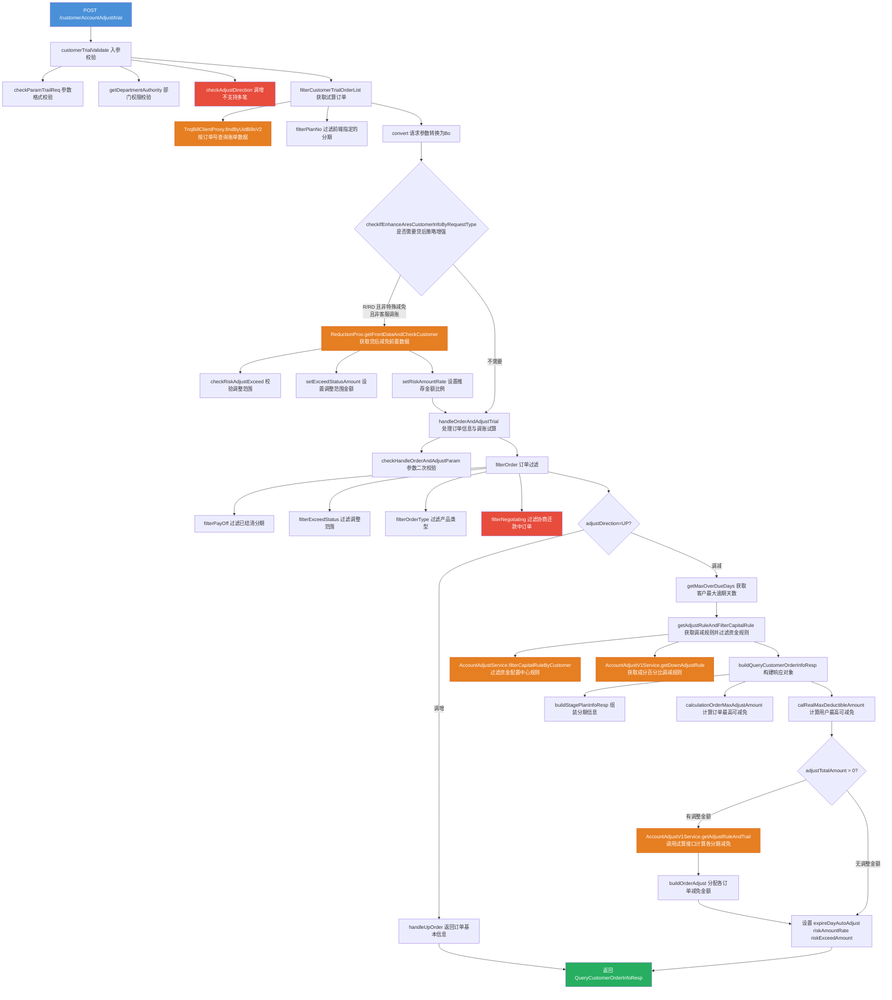

# 工单调账-调账试算

## 基本信息

| 属性 | 值 |
|------|-----|
| 接口路径 | `POST /customerAccountAdjust/trial` |
| Controller | `CustomerAccountAdjustController#customerTrial` |
| Service | `CustomerAccountAdjustService#customerTrial` |
| 功能描述 | 客户维度调账试算，在正式发起调账工单前预计算调账结果，返回各订单/分期/成分的可减免金额及试算明细 |

---

## 请求参数

**类路径：** `cn.caijiajia.accountingoperation.common.req.accountadjust.customer.CustomerTrialReq`

| 字段 | 类型 | 必填 | 说明 |
|------|------|------|------|
| `requestType` | `RequestTypeEnum` | 是 | 请求来源类型，见枚举说明 |
| `adjustExceed` | `AdjustExceedEnum` | 是 | 调整范围（逾期/逾期+M0/全部），见枚举说明 |
| `handledId` | `Long` | 否 | 经办ID（Ares/客服系统传入，用于查询贷后策略） |
| `internalHandleId` | `String` | 否 | 内部经办ID |
| `availableAdjustAmount` | `Integer` | 否 | 剩余可用额度（分，限额控制） |
| `exceedStatusAmount` | `Integer` | 否 | 调整范围对应的金额（分） |
| `orderType` | `AjustOrderTypeEnum` | 否 | 调整产品类型，见枚举说明 |
| `adjustDirection` | `DirectionEnum` | 是 | 调账方向：`UP`（调增）/`DOWN`（调减） |
| `adjustType` | `String` | 是 | 调整分类（如 SPECIAL_REDUCE、CUST_REDUCE 等） |
| `adjustTotalAmount` | `Integer` | 否 | 本次调整总金额（分），不传则查询最大可减免 |
| `orderInfoList` | `List<AdjustOrderTrialReq>` | 是 | 调整的订单信息列表 |

**AdjustOrderTrialReq（内部类）：**

| 字段 | 类型 | 说明 |
|------|------|------|
| `orderNo` | `String` | 订单号（billNo） |
| `stagePlanInfoList` | `List<String>` | 分期计划号列表（指定哪些分期参与试算） |

**枚举说明：**

`RequestTypeEnum`（请求来源）：
- `O` - O系统请求
- `R` - 从贷后阿瑞斯系统请求
- `C` - 客服系统请求
- `RD` - 贷后阿瑞斯直连请求
- `N` - 协商还款请求

`AdjustExceedEnum`（调整范围）：
- `O` - 只查询逾期的分期
- `U` - 逾期计划及M0当期
- `A` - 全部

`AjustOrderTypeEnum`（调整产品）：
- `ORDER` - 订单制
- `STMT` - 账单制
- `ALL` - 全部

---

## 响应参数

**类路径：** `cn.caijiajia.accountingoperation.common.resp.accountadjust.customer.QueryCustomerOrderInfoResp`

| 字段 | 类型 | 说明 |
|------|------|------|
| `uid` | `String` | 用户ID |
| `uidMaxAdjustAmount` | `Integer` | 用户最高可调减金额（分）；客服请求且无逾期订单时不返回 |
| `orderMaxAdjustAmount` | `Integer` | 所有订单最高可调减金额汇总（分） |
| `expireDayAutoAdjust` | `Integer` | 约定期内未还款自动调增天数（配置值） |
| `riskAmountRate` | `Integer` | 推荐金额比例（百分比整数，来自贷后策略） |
| `riskExceedAmount` | `Integer` | 调整范围对应的金额（O系统时为空） |
| `containExceedPlan` | `Boolean` | 是否包含逾期订单 |
| `orderInfoList` | `List<OrderInfoResp>` | 订单信息列表 |

**OrderInfoResp：**

| 字段 | 类型 | 说明 |
|------|------|------|
| `orderNo` | `String` | 订单号 |
| `bankName` | `String` | 资金方名称（中文） |
| `assetId` | `String` | 资产包ID |
| `orderOverDueStatus` | `String` | 订单逾期状态 |
| `applyTime` | `Date` | 订单借款时间 |
| `orderType` | `String` | 产品类型：`ORDER-订单制`/`STMT-账单制` |
| `feeTotal` | `Integer` | 总息费（分） |
| `maxAdjustAmount` | `Integer` | 订单最高可减免金额（分） |
| `adjustAmount` | `Integer` | 订单减免金额（分，试算结果） |
| `totalLeftFee` | `Integer` | 剩余应还总利息（分） |
| `totalLeftWarrantyFee` | `Integer` | 剩余应还总担保费（分） |
| `totalLeftPrepaymentFee` | `Integer` | 剩余应还总提前结清手续费（分） |
| `totalLeftLateFee` | `Integer` | 剩余应还总违约金（分） |
| `totalLeftInterest` | `Integer` | 剩余应还总罚息（分） |
| `totalLeftAmcFee` | `Integer` | 剩余应还总资产管理咨询费（分） |
| `totalLeftPrincipal` | `Integer` | 剩余应还总本金（分） |
| `stagePlanInfoList` | `List<StagePlanInfoResp>` | 分期列表 |

**StagePlanInfoResp（分期信息）：**

| 字段 | 类型 | 说明 |
|------|------|------|
| `stageNo` | `String` | 期数 |
| `stagePlanNo` | `String` | 分期计划号 |
| `exceedStatus` | `String` | 分期逾期状态 |
| `obtainedLabel` | `String` | 获取标 |
| `leftAmount` | `Integer` | 调整前剩余应还金额（分） |
| `preAdjustComponentInfos` | `List<PreAdjustComponentInfo>` | 调整前成分明细（剩余应还） |
| `adjustComponentInfos` | `List<AdjustComponentInfo>` | 调账成分明细（调整金额） |
| `postAdjustComponentInfos` | `List<PostAdjustComponentInfo>` | 调账后成分明细（调整后应还） |

**PreAdjustComponentInfo：**

| 字段 | 类型 | 说明 |
|------|------|------|
| `components` | `ComponentsEnum` | 成分类型 |
| `leftAmount` | `Integer` | 调整前剩余应还金额（分） |
| `downAmount` | `Integer` | 该成分已调减金额（分） |

**AdjustComponentInfo：**

| 字段 | 类型 | 说明 |
|------|------|------|
| `components` | `ComponentsEnum` | 成分类型 |
| `amount` | `Integer` | 调整金额（分） |
| `direction` | `String` | 调账方向：`DOWN`调减/`UP`调增 |

**PostAdjustComponentInfo：**

| 字段 | 类型 | 说明 |
|------|------|------|
| `components` | `ComponentsEnum` | 成分类型 |
| `amount` | `Integer` | 调整后应还金额（分） |

---

## 调用关系

### 外部系统调用

| 系统 | 调用方式 | 说明 |
|------|------|------|
| TnqBill（账单系统） | `TnqBillClientProxy#findByUidBillsV2` | 查询订单、分期、成分数据 |
| 贷后系统（Ares） | `ReductionProx#getFrontDataAndCheckCustomer` | 获取贷后减免前置数据（仅 R/RD/C 部分请求类型） |
| 算费服务 | `AccountAdjustV1Service#getDownAdjustRule` | 获取调减规则（成分百分比） |
| 算费服务 | `AccountAdjustV1Service#getAdjustRuleAndTrail` | 调用试算接口，计算各分期减免金额 |
| 资金配置中心 | `AccountAdjustService#filterCapitalRuleByCustomer` | 过滤资金规则，确定哪些成分不可调减 |

### 数据库交互

本接口为**纯查询/计算接口**，不写入数据库。所有数据通过外部服务获取。

---

## 关键业务规则

1. **调增不支持多笔订单**：`adjustDirection=UP` 时，`orderInfoList` 只允许传一笔订单
2. **客服请求特殊逻辑**：`requestType=C` 且 `adjustType=CUST_REDUCE` 时不依赖贷后策略
3. **特殊减免不依赖贷后策略**：`adjustType=SPECIAL_REDUCE` 时直接使用前端传入的 `exceedStatusAmount`
4. **客服+无逾期订单场景**：`requestType=C` 且订单无逾期分期时，响应中不返回 `uidMaxAdjustAmount`
5. **调账金额边界**：`adjustTotalAmount` 不得超过 `realMaxDeductibleAmount`，不传时取最大可减免值
6. **订单过滤逻辑**：按调整范围（逾期/逾期+M0/全部）、产品类型、协商还款状态过滤分期
7. **订单排序**：响应中按逾期阶段降序、借款时间升序排列

---

## 流程图

---

## 代码位置

| 层次 | 文件路径 | 关键行 |
|------|---------|--------|
| Controller | `accountingoperation/src/main/java/cn/caijiajia/accountingoperation/controller/CustomerAccountAdjustController.java` | L63-67 |
| Service 入口 | `accountingoperation/src/main/java/cn/caijiajia/accountingoperation/service/accountadjust/customer/CustomerAccountAdjustService.java` | L465-479 |
| 入参校验 | 同上 | L485-492 |
| 订单获取过滤 | 同上 | L494-503 |
| 贷后策略增强 | 同上 | L514-538 |
| 核心处理 | 同上 | L548-589 |
| 获取调减规则 | 同上 | L659-678 |
| 构建响应 | 同上 | L1577-1619 |
| 请求 DTO | `accountingoperation-common/src/main/java/cn/caijiajia/accountingoperation/common/req/accountadjust/customer/CustomerTrialReq.java` | L1-70 |
| 响应 DTO | `accountingoperation-common/src/main/java/cn/caijiajia/accountingoperation/common/resp/accountadjust/customer/QueryCustomerOrderInfoResp.java` | L1-165 |
| Feign 客户端 | `accountingoperation-feignclient/src/main/java/cn/caijiajia/accountingoperation/feignclient/CustomerAccountAdjustFeignClient.java` | L42-43 |