# 工单调账-查询订单信息

## 接口概览

**接口路径**: `/customerAccountAdjust/queryCustomerOrderInfo`
**请求方式**: POST
**功能描述**: 客户维度调账时查询订单信息，用于展示客户可调账的订单列表及各订单的可调账金额、分期明细等信息。支持多种请求来源（运营系统O、客服系统C、贷后系统R等）的差异化查询逻辑。

**代码位置**:
- Controller: `cn.caijiajia.accountingoperation.controller.CustomerAccountAdjustController:52-55`
- Service: `cn.caijiajia.accountingoperation.service.accountadjust.customer.CustomerAccountAdjustService:303-320`

---

## 接口参数

### 请求参数 (QueryCustomerOrderInfoReq)

| 字段名称 | 类型 | 必填 | 说明 |
|---------|------|------|------|
| requestType | RequestTypeEnum | 是 | 请求类型：O-运营系统，C-客服系统，R-贷后系统，RD-预约还款，N-协商还款 |
| phone | String | 否 | 手机号（O系统4选1） |
| uid | String | 否 | 用户ID（C/R/RD系统必传，O系统4选1） |
| customerNo | String | 否 | 客户号（O系统4选1） |
| orderNo | String | 否 | 订单号（N系统必传，O系统4选1） |
| availableAdjustAmount | Integer | 否 | 剩余可用额度（R系统必传），单位：分 |
| handledId | Long | 否 | 经办ID（R系统必传） |
| adjustExceed | AdjustExceedEnum | 否 | 调整范围：ALL-全部，OVERDUE-逾期，NOT_OVERDUE-未逾期 |
| orderType | AjustOrderTypeEnum | 否 | 调整产品：ALL-全部，ORDER-订单制，STMT-账单制 |
| adjustDirection | DirectionEnum | 否 | 调账方向：DOWN-调减，UP-调增 |
| adjustType | String | 否 | 调整分类 |
| orderNoList | List&lt;String&gt; | 否 | 调整订单号列表（预约线下还款场景） |
| internalHandleId | String | 否 | 内部经办ID |

**参数校验规则**:
- O系统：phone、uid、customerNo、orderNo 4选1
- C系统：uid必传
- R系统：uid、handledId、availableAdjustAmount必传
- RD系统：uid必传
- N系统：orderNo必传

### 响应参数 (QueryCustomerOrderInfoResp)

| 字段名称 | 类型 | 说明 |
|---------|------|------|
| uidMaxAdjustAmount | Integer | 用户最高可调减金额（分） |
| orderMaxAdjustAmount | Integer | 订单最高可调减金额汇总（分） |
| uid | String | 用户ID |
| expireDayAutoAdjust | Integer | 约定期内（天）未还款自动调增 |
| riskAmountRate | Integer | 推荐金额比例（百分比） |
| riskExceedAmount | Integer | 调整范围对应的金额（分） |
| orderInfoList | List&lt;OrderInfoResp&gt; | 订单信息列表 |
| containExceedPlan | Boolean | 是否包含逾期订单 |

#### OrderInfoResp（订单信息）

| 字段名称 | 类型 | 说明 |
|---------|------|------|
| orderNo | String | 订单号 |
| bankName | String | 资金方中文名 |
| assetId | String | 资金包 |
| orderOverDueStatus | String | 订单逾期状态 |
| applyTime | Date | 订单借款时间 |
| orderType | String | 订单产品类型：ORDER-订单制，STMT-账单制 |
| feeTotal | Integer | 总息费（分） |
| maxAdjustAmount | Integer | 订单最高可减免（分） |
| adjustAmount | Integer | 订单减免金额（分） |
| totalLeftFee | Integer | 订单剩余应还总利息（分） |
| totalLeftWarrantyFee | Integer | 订单剩余应还总担保费（分） |
| totalLeftPrepaymentFee | Integer | 订单剩余应还总提前结清手续费（分） |
| totalLeftLateFee | Integer | 订单剩余应还总违约金（分） |
| totalLeftInterest | Integer | 订单剩余应还总罚息（分） |
| totalLeftAmcFee | Integer | 订单剩余应还总资产管理咨询费（分） |
| totalLeftPrincipal | Integer | 订单剩余应还总本金（分） |
| stagePlanInfoList | List&lt;StagePlanInfoResp&gt; | 分期列表 |

#### StagePlanInfoResp（分期信息）

| 字段名称 | 类型 | 说明 |
|---------|------|------|
| stageNo | String | 期数 |
| stagePlanNo | String | 分期计划号 |
| exceedStatus | String | 分期逾期状态 |
| obtainedLabel | String | 获取标 |
| preAdjustComponentInfos | List&lt;PreAdjustComponentInfo&gt; | 调整前剩余应还成分明细 |
| leftAmount | Integer | 调整前剩余应还金额（分） |
| adjustComponentInfos | List&lt;AdjustComponentInfo&gt; | 调账成分明细（调整金额） |
| postAdjustComponentInfos | List&lt;PostAdjustComponentInfo&gt; | 调账后成分明细（调整后应还） |

#### PreAdjustComponentInfo（调整前成分）

| 字段名称 | 类型 | 说明 |
|---------|------|------|
| components | ComponentsEnum | 成分类型 |
| leftAmount | Integer | 调整前剩余应还金额（分） |
| downAmount | Integer | 该成份已调减金额（分） |

#### AdjustComponentInfo（调整成分）

| 字段名称 | 类型 | 说明 |
|---------|------|------|
| components | ComponentsEnum | 成分类型 |
| amount | Integer | 调整金额（分） |
| direction | String | 调账方向：DOWN-调减，UP-调增 |

#### PostAdjustComponentInfo（调整后成分）

| 字段名称 | 类型 | 说明 |
|---------|------|------|
| components | ComponentsEnum | 成分类型 |
| amount | Integer | 调整后金额（分） |

---

## 业务流程

### 主流程图

```mermaid
flowchart TD
    Start([接收请求]) --> CheckParam[参数校验]
    CheckParam --> |校验失败| Error1[返回错误信息]
    CheckParam --> |校验成功| CheckAuth[部门权限校验]

    CheckAuth --> |权限不足| Error2[返回权限错误]
    CheckAuth --> |权限通过| ConvertParam[转换公共参数<br/>QueryCustomerOrderInfoBo]

    ConvertParam --> CheckRequestType{检查请求类型}
    CheckRequestType --> |C客服/R贷后| EnhanceAres[增强贷后客户策略数据<br/>enhanceAresCustomerInfo]
    CheckRequestType --> |其他| QueryOrder

    EnhanceAres --> |调用贷后接口| ReductionAPI[调用贷后减免前置接口<br/>getFrontDataAndCheckCustomer]
    ReductionAPI --> |DB查询| DB_Customer[(经办记录表)]
    ReductionAPI --> SetStrategy[设置调整范围金额<br/>和推荐金额比例]
    SetStrategy --> QueryOrder

    QueryOrder[查询订单信息<br/>getOrderList] --> |调用贷款系统| TnqBillAPI[调用贷款系统接口<br/>findByUidBillsV2]
    TnqBillAPI --> |外部RPC| TnqBillService[贷款系统<br/>TnqBillClientV2]
    TnqBillService --> FilterNoUnpaid[过滤无可调整成分的分期<br/>filterNoUnpaidAmt]
    FilterNoUnpaid --> CheckOrderNull{订单是否为空}
    CheckOrderNull --> |是| Error3[返回无订单错误]
    CheckOrderNull --> |否| FilterPreOrder[订单前置过滤<br/>filterPreOrderList]

    FilterPreOrder --> FilterPayOff[1.过滤已结清分期]
    FilterPayOff --> FilterFailed[2.过滤已退汇分期]
    FilterFailed --> FilterTermNull[3.过滤分期为空的订单]
    FilterTermNull --> FilterNotAdjust[4.过滤不能调账的订单<br/>filterNotAdjustOrderNo]

    FilterNotAdjust --> FilterBank[4.1 不允许调账的资方]
    FilterBank --> FilterPaying[4.2 还款中分期<br/>payFlag='Y']
    FilterPaying --> FilterOrderStatus[4.3 订单分期状态<br/>出让/核销/核销处理中]
    FilterOrderStatus --> FilterFlexible[4.4 灵活还款产品]
    FilterFlexible --> FilterAdjusting[4.5 调账中订单]
    FilterAdjusting --> HandleOrder[处理订单信息与调账试算<br/>handleOrderAndAdjustTrial]

    HandleOrder --> CheckHandleParam[参数校验]
    CheckHandleParam --> FilterOrders[订单过滤]

    FilterOrders --> Filter1[过滤已结清分期]
    Filter1 --> Filter2[过滤调整范围]
    Filter2 --> Filter3[过滤调整产品]
    Filter3 --> Filter4[限制订单数量并排序]
    Filter4 --> Filter5[过滤协商还款中订单]

    Filter5 --> CheckDirection{调账方向}
    CheckDirection --> |UP调增| HandleUp[处理调增订单]
    CheckDirection --> |DOWN调减| GetMaxOverdue[获取客户最大逾期天数<br/>getMaxOverDueDays]

    GetMaxOverdue --> |调用贷款系统| MaxOverdueAPI[调用贷款系统接口<br/>getMaxOverDueDays]
    MaxOverdueAPI --> GetAdjustRule[获取调账规则并过滤资金规则<br/>getAdjustRuleAndFilterCapitalRule]

    GetAdjustRule --> BuildCapitalRule[构建资金规则请求]
    BuildCapitalRule --> FilterCapitalRule[过滤资金规则<br/>filterCapitalRuleByCustomer]
    FilterCapitalRule --> |调用资金配置中心| CapitalRuleService[资金配置中心服务]
    CapitalRuleService --> FilterTnqBill[过滤不能调账的分期成分]
    FilterTnqBill --> GetDownRule[查询调减规则<br/>成分百分比]
    GetDownRule --> |调用调账规则服务| AdjustRuleService[AccountAdjustV1Service<br/>getDownAdjustRule]

    AdjustRuleService --> BuildResp[构建响应对象<br/>buildQueryCustomerOrderInfoResp]
    BuildResp --> CheckExceedPlan[检查是否包含逾期订单]
    CheckExceedPlan --> CalMaxAmount[计算最高可减免金额<br/>calRealMaxDeductibleAmount]

    CalMaxAmount --> CheckAdjustAmount{是否有调整金额}
    CheckAdjustAmount --> |金额>0| GetAdjustTrail[调用调账试算接口<br/>getAdjustRuleAndTrail]
    CheckAdjustAmount --> |金额=0| SetExpireDay

    GetAdjustTrail --> |调用调账规则服务| AdjustTrailService[AccountAdjustV1Service<br/>getAdjustRuleAndTrail]
    AdjustTrailService --> BuildOrderAdjust[分配每个订单的减免金额<br/>buildOrderAdjust]

    BuildOrderAdjust --> SetExpireDay[设置约定期自动调增天数]
    SetExpireDay --> SetRiskRate[设置推荐金额比例]
    SetRiskRate --> SetRiskAmount[设置调整范围金额]
    SetRiskAmount --> OrderSort[订单排序]
    OrderSort --> Return[返回响应]

    HandleUp --> ReturnUp[返回调增订单信息]

    Error1 --> End([结束])
    Error2 --> End
    Error3 --> End
    Return --> End
    ReturnUp --> End

    style Start fill:#e1f5e1
    style End fill:#ffe1e1
    style Error1 fill:#ffcccc
    style Error2 fill:#ffcccc
    style Error3 fill:#ffcccc
    style DB_Customer fill:#d4e8ff
    style TnqBillService fill:#fff4cc
    style ReductionAPI fill:#fff4cc
    style CapitalRuleService fill:#fff4cc
    style AdjustRuleService fill:#fff4cc
    style AdjustTrailService fill:#fff4cc
```

### 关键节点说明

#### 1. 参数校验（checkParamQueryCustomerOrderInfoReq）
- **位置**: CustomerAccountAdjustService:1372-1392
- **逻辑**:
  - 必填校验：requestType必传
  - 按请求类型分类校验：
    - O系统：phone/uid/customerNo/orderNo 4选1
    - C系统：uid必传
    - R系统：uid、handledId、availableAdjustAmount必传
    - RD系统：uid必传
    - N系统：orderNo必传

#### 2. 部门权限校验（getDepartmentAuthority）
- **位置**: CustomerAccountAdjustService
- **逻辑**: 根据请求类型校验操作人的部门权限

#### 3. 增强贷后客户策略数据（enhanceAresCustomerInfo）
- **位置**: CustomerAccountAdjustService:514-538
- **触发条件**: 请求类型为C客服或R贷后，且非特殊减免、非客服普通调账
- **调用外部接口**:
  - **接口**: ReductionProx.getFrontDataAndCheckCustomer(handledId, uid)
  - **功能**: 调用贷后系统获取减免前置数据
  - **返回数据**: 客户调整范围金额、推荐金额比例
- **数据库操作**: 通过经办ID和uid查询经办记录（具体表名待确认）
- **业务规则**:
  - 特殊减免不走贷后策略
  - 客服普通调账不走贷后策略
  - 其他场景根据贷后策略数据设置调整范围金额和推荐金额比例

#### 4. 查询订单信息（getOrderList）
- **位置**: CustomerAccountAdjustService:394-406
- **调用外部接口**:
  - **接口**: TnqBillClientProxy.findByUidBillsV2(uid, orderList, RangeType.T)
  - **目标系统**: 贷款系统（TnqBill）
  - **功能**: 根据uid和订单号列表查询订单及分期信息
  - **参数**:
    - uid: 用户ID
    - orderList: 订单号列表（可选）
    - RangeType.T: 查询范围类型
- **后处理**（按顺序执行）:
  1. **过滤无可调整成分的分期**（filterNoUnpaidAmt）
     - **位置**: CustomerAccountAdjustService:1450-1464
     - **触发条件**: 仅在调减方向（DirectionEnum.DOWN）时生效
     - **过滤逻辑**: 过滤非本金成分（除PRINCIPAL外的所有成分）未还金额为0的分期
     - **说明**: 如果分期除本金外的所有成分都已还清，则该分期不可调减
  2. **校验订单是否为空**（checkOrderISNull）
  3. **订单前置过滤**（filterPreOrderList）- 详见4.1章节

**⚠️ 注意**：过滤顺序很重要！`filterNoUnpaidAmt` 在 `filterPreOrderList` 之前执行，这意味着无可调整成分的分期会先被过滤掉，不会进入后续的还款中分期检查。

#### 4.1 订单前置过滤（filterPreOrderList）
- **位置**: CustomerAccountAdjustService:429-440
- **过滤逻辑**（按顺序执行）:
  1. **过滤已结清分期**（filterPayOff）- 过滤状态为PAYOFF的分期
  2. **过滤已退汇分期**（filterFailed）- 过滤状态为FAILED的分期
  3. **过滤分期为空的订单**（filterTermNull）- 过滤没有分期的订单
  4. **过滤不能调账的订单**（filterNotAdjustOrderNo）- 详见下方说明

#### 4.2 过滤不能调账的订单（filterNotAdjustOrderNo）
- **位置**: CustomerAccountAdjustService:2502-2519
- **过滤逻辑**（按顺序执行）:
  1. **不允许调账的资方**（checkByBank）- 某些资金方不支持调账
  2. **还款中分期**（checkStagePlanStatusByCustomer）
     - **判断条件**: 分期的payFlag字段为'Y'（还款中标识）
     - **过滤原因**: 分期正在还款中，不允许账务调整，避免数据不一致
     - **实现位置**: AccountAdjustService:2251-2281
  3. **订单分期状态**（checkOrderPlanStatusByCustomer）- 出让、核销、核销处理中不能调账
  4. **灵活还款产品**（checkSupportAnyRepayIndByCustomer）- 灵活还款产品不支持调账
  5. **调账中订单**（accountAdjustCheckByCustomer）- 已在调账中的订单不能再次调账

#### 5. 处理订单信息与调账试算（handleOrderAndAdjustTrial）
- **位置**: CustomerAccountAdjustService:548-589
- **核心逻辑**:

  **5.1 订单过滤**:
  - 过滤已结清分期（filterPayOff）
  - 过滤调整范围（filterExceedStatus）- 根据adjustExceed参数过滤逾期/未逾期订单
  - 过滤调整产品（filterOrderType）- 根据orderType参数过滤订单制/账单制
  - 限制订单数量并排序（filterSortAndMaxOrderNum）
  - 过滤协商还款中订单（filterNegotiating）

  **5.2 获取客户最大逾期天数**:
  - **调用外部接口**: TnqBillClientProxy.getMaxOverDueDays(uid, RangeType.L)
  - **目标系统**: 贷款系统
  - **功能**: 获取客户所有订单中的最大逾期天数

  **5.3 获取调账规则并过滤资金规则**（getAdjustRuleAndFilterCapitalRule）:
  - **位置**: CustomerAccountAdjustService:659-678
  - **步骤**:
    1. 构建资金规则请求（buildCapitalRuleReqBo）
    2. **调用外部接口**: AccountAdjustService.filterCapitalRuleByCustomer(capitalRuleReqBo)
       - **目标系统**: 资金配置中心
       - **功能**: 根据资金方规则校验哪些分期成分不能调账
    3. 过滤不能调账的分期成分（filterTnqBillRespFeignV2）
    4. **调用内部服务**: AccountAdjustV1Service.getDownAdjustRule(adjustRuleAndTrailBo, byUidBillsV2, capitalRuleRespBo)
       - **功能**: 查询调减规则，获取各成分的调减百分比

  **5.4 构建响应对象**（buildQueryCustomerOrderInfoResp）:
  - 构建订单信息列表
  - 计算订单最高可调减金额汇总

  **5.5 计算最高可减免金额**（calRealMaxDeductibleAmount）:
  - **位置**: CustomerAccountAdjustService:1918-1953
  - **计算逻辑**:
    - O系统：返回订单可减免总金额
    - 客服且无逾期订单：返回订单可减免总金额
    - Ares特殊减免：返回订单可减免总金额
    - 客服系统：取 min(订单可减免总金额, 调整范围金额)
    - 贷后系统：取 min(订单可减免总金额, 剩余可用额度, 调整范围金额)

  **5.6 调账试算**（getAdjustRuleAndTrail）:
  - **位置**: CustomerAccountAdjustService:2080-2094
  - **触发条件**: adjustAmount > 0
  - **调用内部服务**: AccountAdjustV1Service.getAdjustRuleAndTrail(adjustRuleAndTrailBo, byUidBillsV2, adjustOrderV1Req)
    - **功能**: 根据调整金额和调账规则，试算各订单各分期各成分的调整金额
  - **后处理**: 分配每个订单的减免金额（buildOrderAdjust）

#### 6. 订单排序（orderSort）
- **位置**: CustomerAccountAdjustService:1903-1907
- **排序规则**:
  1. 按订单逾期状态降序（逾期订单优先）
  2. 按申请时间升序（早申请的订单优先）

---

## 数据库交互

### 查询操作

本接口主要通过外部RPC接口获取数据，不直接操作数据库。涉及的数据来源：

1. **贷款系统（TnqBill）**:
   - 订单信息查询（tnqBillV2）
   - 最大逾期天数查询（getMaxOverDueDays）

2. **贷后系统（Reduction）**:
   - 减免前置数据查询（getFrontDataAndCheckCustomer）
   - 查询经办记录和客户策略数据

3. **资金配置中心**:
   - 资金方规则查询（filterCapitalRuleByCustomer）

4. **调账规则服务（AccountAdjustV1Service）**:
   - 调减规则查询（getDownAdjustRule）
   - 调账试算（getAdjustRuleAndTrail）

---

## 外部系统调用

### 1. 贷款系统（TnqBill）

#### 1.1 查询订单信息
- **接口**: `TnqBillClientV2.tnqBillV2(TNQBillReqFeign)`
- **请求参数**:
  - uid: 用户ID
  - billNos: 订单号列表
  - range: 查询范围（T-全量）
- **响应**: TnqBillRespFeignV2（订单列表、分期信息、成分明细）

#### 1.2 获取最大逾期天数
- **接口**: `TnqBillClientV2.getMaxOverDueDays(uid, RangeType.L)`
- **请求参数**:
  - uid: 用户ID
  - rangeType: 查询范围（L-???）
- **响应**: Integer（最大逾期天数）

### 2. 贷后系统（Reduction）

#### 2.1 获取减免前置数据
- **接口**: `ReductionProx.getFrontDataAndCheckCustomer(handledId, uid)`
- **请求参数**:
  - handledId: 经办ID
  - uid: 用户ID
- **响应**: ReductionFrontDataResp
  - customer.recommendationFactor: 推荐金额因子
  - 调整范围金额数据

### 3. 资金配置中心

#### 3.1 过滤资金规则
- **接口**: `AccountAdjustService.filterCapitalRuleByCustomer(CapitalRuleReqBo)`
- **请求参数**: CapitalRuleReqBo（订单、分期、成分信息）
- **响应**: CapitalRuleRespBo（不可调账的分期成分列表）

### 4. 调账规则服务

#### 4.1 查询调减规则
- **接口**: `AccountAdjustV1Service.getDownAdjustRule(AdjustRuleAndTrailBo, TnqBillRespFeignV2, CapitalRuleRespBo)`
- **请求参数**:
  - adjustRuleAndTrailBo: 调账规则参数
  - byUidBillsV2: 订单信息
  - capitalRuleRespBo: 资金规则
- **响应**: AdjustOrderV1Req（调减规则、成分百分比）

#### 4.2 调账试算
- **接口**: `AccountAdjustV1Service.getAdjustRuleAndTrail(AdjustRuleAndTrailBo, TnqBillRespFeignV2, AdjustOrderV1Req)`
- **请求参数**:
  - adjustRuleAndTrailBo: 调账规则参数（含调整金额）
  - byUidBillsV2: 订单信息
  - adjustOrderV1Req: 调账规则
- **响应**: AdjustOrderV1Resp（试算结果、各订单各分期各成分的调整金额）

---

## 业务状态说明

### 请求类型（RequestTypeEnum）
- **O**: 运营系统
- **C**: 客服系统
- **R**: 贷后系统（Ares）
- **RD**: 预约还款
- **N**: 协商还款

### 调账方向（DirectionEnum）
- **DOWN**: 调减（减免）
- **UP**: 调增

### 调整范围（AdjustExceedEnum）
- **ALL**: 全部订单
- **OVERDUE**: 逾期订单
- **NOT_OVERDUE**: 未逾期订单

### 调整产品（AjustOrderTypeEnum）
- **ALL**: 全部产品
- **ORDER**: 订单制
- **STMT**: 账单制

### 订单逾期状态
- 逾期订单优先展示（排序规则）
- 包含逾期订单标志：containExceedPlan

---

## 配置项

| 配置项 | 说明 | 默认值 |
|-------|------|--------|
| expireDayAutoAdjust | 约定期内（天）未还款自动调增 | 配置读取 |
| riskAmountRate | 推荐金额比例（百分比） | 贷后策略提供 |

---

## 异常处理

### 业务异常

1. **参数校验异常**:
   - 请求类型为空
   - O系统：phone/uid/customerNo/orderNo 4选1未提供
   - C系统：uid为空
   - R系统：uid/handledId/availableAdjustAmount为空
   - RD系统：uid为空
   - N系统：orderNo为空

2. **权限异常**:
   - 部门权限不足

3. **数据异常**:
   - 获取不到用户的订单信息
   - 没有可支持调账的订单分期
   - 贷后策略数据异常

4. **调账规则异常**:
   - 调整范围不符合贷后规则
   - 资金方规则拦截

### 系统异常

1. **外部接口调用失败**:
   - 贷款系统接口异常
   - 贷后系统接口异常
   - 资金配置中心接口异常
   - 调账规则服务异常

2. **数据处理异常**:
   - 订单数据解析失败
   - 调账试算计算失败

---

## 注意事项

1. **请求来源差异**:
   - 不同请求类型（O/C/R/RD/N）的参数校验规则不同
   - C客服和R贷后请求需要增强贷后客户策略数据
   - 特殊减免和客服普通调账不走贷后策略

2. **订单过滤逻辑**:
   - **第一阶段：查询后立即过滤**（在 getOrderList 中）:
     1. **过滤无可调整成分的分期**（filterNoUnpaidAmt）
        - 仅调减方向生效
        - 过滤非本金成分未还金额为0的分期
   - **第二阶段：订单前置过滤**（filterPreOrderList）:
     1. 已结清分期会被过滤（状态为PAYOFF）
     2. 已退汇分期会被过滤（状态为FAILED）
     3. 分期为空的订单会被过滤
     4. 不能调账的订单会被过滤（filterNotAdjustOrderNo）：
        - 不允许调账的资方
        - **还款中分期**（payFlag='Y'）- 正在还款处理中的分期不能调账
        - 出让、核销、核销处理中状态的订单
        - 灵活还款产品
        - 已在调账中的订单
   - **第三阶段：订单业务过滤**（在 handleOrderAndAdjustTrial 中）:
     1. 再次过滤已结清分期
     2. 协商还款中订单会被过滤（根据checkNegotiate参数）
     3. 根据调整范围（adjustExceed）过滤逾期/未逾期订单
     4. 根据调整产品（orderType）过滤订单制/账单制
     5. 订单数量有上限限制

   **⚠️ 过滤顺序说明**：
   - 第一阶段的 `filterNoUnpaidAmt` 会先过滤掉无可调整成分的分期
   - 然后第二阶段才检查还款中分期（payFlag='Y'）
   - 这意味着如果分期已经没有可调整成分，不会进入还款中检查
   - 第三阶段是基于业务规则的进一步过滤

3. **金额计算逻辑**:
   - 不同请求类型的最高可减免金额计算规则不同
   - O系统和特殊减免场景直接返回订单可减免总金额
   - 客服系统需考虑调整范围金额
   - 贷后系统需同时考虑剩余可用额度和调整范围金额

4. **资金方规则**:
   - 资金配置中心会拦截部分分期成分不允许调账
   - 被拦截的成分会从试算结果中排除

5. **调账试算**:
   - 只有调整金额>0时才会进行试算
   - 试算结果包含各订单各分期各成分的调整金额
   - 调整金额按照调账规则的成分百分比分配

6. **订单排序**:
   - 逾期订单优先展示
   - 相同逾期状态按申请时间早的优先

---

## 相关文档

- Wiki: http://wiki.caijj.net/pages/viewpage.action?pageId=211273310
- Ares集成账务调整功能: http://wiki.caijj.net/pages/viewpage.action?pageId=260440642

---

## 更新记录

| 日期 | 版本 | 修改人 | 修改内容 |
|------|------|--------|----------|
| 2026-03-30 | v1.0 | Claude | 初始版本，创建接口文档 |