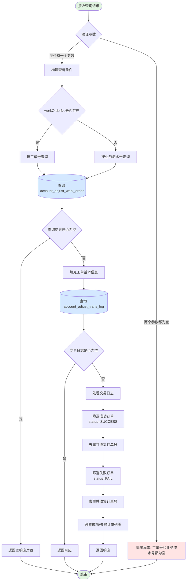

# 查询工单详情

## 接口概览

- **接口路径**: `/customerAccountAdjust/queryWorkOrderDetails`
- **请求方式**: POST
- **接口描述**: 查询客户维度调账工单的详细信息，包括工单基本信息、成功订单号列表和失败订单号列表
- **Controller**: `CustomerAccountAdjustController:94-97`
- **Service**: `CustomerAccountAdjustService:1021-1053`

## 接口参数

### 请求参数 (QueryWorkOrderDetailReq)

**位置**: `accountingoperation-common/src/main/java/cn/caijiajia/accountingoperation/common/req/accountadjust/customer/QueryWorkOrderDetailReq.java`

| 字段名 | 类型 | 必填 | 说明 |
|--------|------|------|------|
| workOrderNo | String | 二选一 | 工单号 |
| bizSerial | String | 二选一 | 业务流水号 |

**验证规则**:
- `workOrderNo` 和 `bizSerial` 必须至少提供一个
- 优先使用 `workOrderNo` 进行查询
- 如果两者都为空，抛出异常

### 响应参数 (QueryWorkOrderDetailResp)

**位置**: `accountingoperation-common/src/main/java/cn/caijiajia/accountingoperation/common/resp/accountadjust/customer/QueryWorkOrderDetailResp.java`

| 字段名 | 类型 | 说明 |
|--------|------|------|
| uid | String | 用户ID |
| workOrderNo | String | 调账工单号 |
| bpmNo | String | BPM工单号（taskNo） |
| bizSerial | String | 业务流水号 |
| status | String | 调账状态 |
| succOrderNos | List\<String\> | 成功订单号列表 |
| failOrderNos | List\<String\> | 失败订单号列表 |

## 业务流程

### 主流程图



### 关键节点说明

#### 1. 参数验证 (CustomerAccountAdjustService:1025-1027)
- **验证逻辑**: 检查 `workOrderNo` 和 `bizSerial` 是否都为空
- **错误处理**: 如果都为空，抛出 `CjjClientException`
  - 错误码: `ErrorResponseConstants.ORDER_NO_BIZ_SERIAL_NO_BOTH_BLANK_CODE`
  - 错误信息: `ErrorResponseConstants.ORDER_NO_BIZ_SERIAL_NO_BOTH_BLANK_MSG`

#### 2. 构建查询条件 (CustomerAccountAdjustService:1029-1035)
- **查询优先级**:
  1. 如果提供了 `workOrderNo`，优先使用工单号查询
  2. 否则使用 `bizSerial` 业务流水号查询
- **实现方式**: 使用 MyBatis Example 动态构建查询条件

#### 3. 查询工单信息 (CustomerAccountAdjustService:1036)
- **调用方法**: `accountAdjustWorkOrderRepository.queryAccountAdjustWorkOrder(example)`
- **Repository**: `AccountAdjustWorkOrderRepository:449-451`
- **Mapper**: `TAccountAdjustWorkOrderMapper.selectByExample`
- **查询表**: `account_adjust_work_order`
- **查询字段**: 包括 work_order_no, task_no, uid, biz_serial, status 等所有基础字段

#### 4. 填充工单基本信息 (CustomerAccountAdjustService:1038-1042)
从查询结果中提取第一条记录（通常只有一条），填充以下字段：
- `workOrderNo` ← `work_order_no`
- `bizSerial` ← `biz_serial`
- `uid` ← `uid`
- `bpmNo` ← `task_no`
- `status` ← `status`

#### 5. 查询交易日志 (CustomerAccountAdjustService:1044)
- **调用方法**: `accountAdjustTransLogRepository.queryTransLogRecoredByWorkOrderNo(workOrderNo)`
- **Repository**: `AccountAdjustTransLogRepository:46-54`
- **Mapper**: `AccountAdjustTransLogMapper.selectByExampleWithBLOBs`
- **查询表**: `account_adjust_trans_log`
- **查询条件**: `work_order_no = ?`
- **查询字段**: 包括 status, stage_order_no 等所有字段（含 BLOB）

#### 6. 处理成功订单 (CustomerAccountAdjustService:1046-1047)
- **筛选条件**: `status = 'SUCCESS'`
- **处理逻辑**:
  1. 使用 Stream API 过滤 status 为 SUCCESS 的记录
  2. 提取 `stage_order_no` 字段
  3. 去重（distinct）
  4. 收集为 List

#### 7. 处理失败订单 (CustomerAccountAdjustService:1048-1049)
- **筛选条件**: `status = 'FAIL'`
- **处理逻辑**:
  1. 使用 Stream API 过滤 status 为 FAIL 的记录
  2. 提取 `stage_order_no` 字段
  3. 去重（distinct）
  4. 收集为 List

## 数据库交互

### 查询操作

#### 1. 查询工单表 (account_adjust_work_order)

**查询方式**: MyBatis Example 动态查询

**查询条件**:
- 条件1（优先）: `work_order_no = ?`
- 条件2（备选）: `biz_serial = ?`

**返回字段**:
```sql
id, work_order_no, task_no, reason, order_no, stage_plan_no, order_reason,
operator, operator_date, auditor, auditor_date, reject_reason, status,
fee, interest, late_fee, warranty_fee, amc_fee, principal, raw_fee,
raw_interest, raw_late_fee, raw_warranty_fee, raw_amc_fee, raw_principal,
message, created_at, updated_at, adjust_direction, raw_early_settle, early_settle,
overdue_days, adjust_dimension, adjust_source, expire_day_auto_adjust, system_source,
uid, real_operator, busi_type, busi_extend, biz_serial
```

**业务用途**: 获取工单的基本信息和状态

#### 2. 查询交易日志表 (account_adjust_trans_log)

**查询方式**: MyBatis Example 查询（含 BLOB 字段）

**查询条件**: `work_order_no = ?`

**返回字段**:
```sql
id, work_order_no, uid, stage_order_no, stage_plan_no, status, raw_principal,
principal, principal_direction, raw_fee, fee, fee_direction, raw_late_fee,
late_fee, late_fee_direction, raw_interest, interest, interest_direction,
raw_warranty_fee, warranty_fee, warranty_fee_direction, raw_amc_fee, amc_fee,
amc_fee_direction, created_at, updated_at, stage_overdue_days, raw_early_settle,
early_settle, down_fee, down_late_fee, down_interest, down_warranty_fee,
down_amc_fee, down_early_settle, extend (BLOB)
```

**业务用途**: 获取工单下每笔调账的执行结果（成功/失败）和关联的订单号

## 外部系统调用

本接口**不涉及**外部系统调用，仅查询本地数据库。

## 业务状态说明

### 工单状态 (status)

工单的 `status` 字段表示工单的整体状态，可能的值包括：
- `待审核`: 工单已创建，等待审核
- `审核通过`: 工单审核通过
- `审核拒绝`: 工单被拒绝
- `执行中`: 工单正在执行调账操作
- `执行完成`: 工单执行完成
- `执行失败`: 工单执行失败

### 交易日志状态 (WorkOrderLockEnum)

**位置**: `accountingoperation-common/src/main/java/cn/caijiajia/accountingoperation/common/constants/WorkOrderLockEnum.java`

| 枚举值 | code | name | bizName | 说明 |
|--------|------|------|---------|------|
| DOING | 001 | 调账处理中 | DOING | 调账正在处理中 |
| SUCCESS | 002 | 调账成功 | SUCCESS | 调账执行成功 |
| FAIL | 003 | 调账失败 | FAIL | 调账执行失败 |

**业务含义**:
- 一个工单可能包含多笔调账操作（对应多条交易日志）
- 每笔调账有独立的状态（DOING/SUCCESS/FAIL）
- 本接口通过 status 字段统计成功和失败的订单

## 配置项

无特殊配置项。

## 异常处理

### 业务异常

#### 1. 参数校验异常
- **异常类型**: `CjjClientException`
- **触发条件**: `workOrderNo` 和 `bizSerial` 都为空
- **错误码**: `ErrorResponseConstants.ORDER_NO_BIZ_SERIAL_NO_BOTH_BLANK_CODE`
- **错误信息**: `ErrorResponseConstants.ORDER_NO_BIZ_SERIAL_NO_BOTH_BLANK_MSG`
- **处理建议**: 确保至少提供一个查询参数

### 系统异常

- **数据库查询异常**: 由 MyBatis 框架抛出，会向上传播
- **空指针异常**: 代码中使用了 null 检查（`CollectionUtils.isNotEmpty`），避免了空指针

## 重要说明

### 1. 查询优先级
- 如果同时提供 `workOrderNo` 和 `bizSerial`，**优先使用 `workOrderNo`** 进行查询
- 建议客户端明确使用哪个参数，避免混淆

### 2. 订单去重
- 成功订单和失败订单列表中的订单号已**自动去重**
- 如果同一个订单出现多次，只会返回一次

### 3. 结果集说明
- 查询工单表时，理论上只会返回**一条记录**（工单号和业务流水号都是唯一的）
- 代码中使用 `workOrders.get(0)` 获取第一条，假设结果集只有一条

### 4. 交易日志为空的情况
- 如果工单存在但没有交易日志，`succOrderNos` 和 `failOrderNos` 都为 `null`
- 这种情况可能发生在工单刚创建但还未执行调账操作时

### 5. 性能考虑
- 查询工单表使用主键或唯一索引，性能良好
- 查询交易日志表使用 `work_order_no` 作为条件，应确保该字段有索引

## 相关文档

- [客户维度调账 Wiki](http://wiki.caijj.net/pages/viewpage.action?pageId=211273310)
- [Ares集成账务调整功能 Wiki](http://wiki.caijj.net/pages/viewpage.action?pageId=260440642)
- 相关接口：
  - `/customerAccountAdjust/startWorkOrder` - 发起调账工单
  - `/customerAccountAdjust/queryWorkOrderInfo` - 查询工单减免信息

## 更新历史

| 日期 | 版本 | 作者 | 说明 |
|------|------|------|------|
| 2022-11-15 | 1.0 | xiajiyun | 初始版本 |
| 2026-03-30 | 1.1 | Claude Code | 生成详细接口文档 |