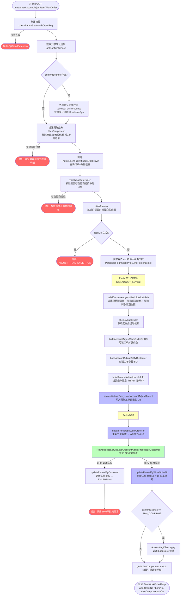

# 工单调账-提交调账工单

## 基本信息

| 项目 | 内容 |
|------|------|
| 接口路径 | `POST /customerAccountAdjust/startWorkOrder` |
| Controller | `CustomerAccountAdjustController#startWorkOrder` |
| Service | `CustomerAccountAdjustService#startWorkOrder` |
| 业务描述 | 客户维度调账（纵向调账），创建调账工单并发起 BPM 审批流 |

---

## 请求参数

### StartWorkOrderReq

| 字段 | 类型 | 必填 | 说明 |
|------|------|------|------|
| requestType | RequestTypeEnum | ✅ | 请求类型（R=贷后，RD=贷后+经办人，其他） |
| handledId | Long | 条件必填 | 经办人ID（requestType 为 R/RD 时必填） |
| adjustDirection | DirectionEnum | ✅ | 调账方向（UP=调增，DOWN=调减） |
| adjustType | String | ✅ | 调整分类 |
| adjustReason | String | ✅ | 调账原因 |
| adjustTotalAmount | Integer | ✅ | 本次调账总金额（>0） |
| adjustExceed | AdjustExceedEnum | ✅ | 调整范围 |
| description | String | ✅ | 减免说明 |
| expireDayAutoAdjust | Integer | ❌ | 约定期内（天）未还款自动调增 |
| riskAmountRate | Integer | 条件必填 | 推荐金额比例-贷后输出（R 且非特殊减免时必填） |
| riskExceedAmount | Integer | 条件必填 | 贷后输出对应调整范围的金额（R 且非特殊减免时必填） |
| annexPaths | List\<String\> | ❌ | 附件文件路径列表 |
| annexSource | String | ❌ | 附件来源 |
| bizSerial | String | ❌ | 业务流水号（赋强公证场景由 RD 传入） |
| operator | String | ❌ | 发单人 |
| realOperator | String | ❌ | 实际操作人 |
| orderInfoList | List\<AccountAdjustTrial\> | ✅ | 调整的订单列表 |

### AccountAdjustTrial（订单信息）

| 字段 | 类型 | 必填 | 说明 |
|------|------|------|------|
| orderNo | String | ✅ | 订单号 |
| feeTotal | Integer | ✅ | 订单总息费 |
| maxAdjustAmount | Integer | ❌ | 订单最高可减免金额 |
| adjustAmount | Integer | ❌ | 订单减免金额 |
| totalLeftFee | Integer | ✅ | 订单剩余应还利息 |
| totalLeftInterest | Integer | ✅ | 订单剩余应还罚息 |
| totalLeftLateFee | Integer | ✅ | 订单剩余应还违约金 |
| totalLeftWarrantyFee | Integer | ✅ | 订单剩余应还担保费 |
| totalLeftEarlySettle | Integer | ✅ | 订单剩余应还提前结清手续费 |
| totalLeftAmcFee | Integer | ✅ | 订单剩余应还资产管理咨询费 |
| confirmScence | ConfirmScenceEnum | ❌ | 外部确认场景（如 FPN_CONFIRM=赋强公证） |
| stagePlanInfoList | List\<PlanInfos\> | ✅ | 调整的分期列表 |

### PlanInfos（分期信息）

| 字段 | 类型 | 必填 | 说明 |
|------|------|------|------|
| stagePlanNo | String | ✅ | 分期号 |
| exceedStatus | String | ❌ | 分期逾期状态 |
| obtainedLabel | String | ❌ | 获取标 |
| adjustComponentInfos | List\<AdjustComponentInfo\> | ✅ | 调整成分列表 |

### AdjustComponentInfo（成分明细）

| 字段 | 类型 | 必填 | 说明 |
|------|------|------|------|
| components | ComponentsEnum | ✅ | 成分类型 |
| amount | Integer | ✅ | 调整金额 |
| leftAmount | Integer | ✅ | 调整前剩余应还金额 |

---

## 响应参数

### StartWorkOrderResp

| 字段 | 类型 | 说明 |
|------|------|------|
| workOrderNo | String | 调账工单号 |
| bpmNo | String | BPM 审批流工单号 |
| orderComponentsInfos | List\<OrderComponentsInfo\> | 订单调整明细列表 |

### OrderComponentsInfo

| 字段 | 类型 | 说明 |
|------|------|------|
| orderNo | String | 订单号 |
| scheduledAmount | Integer | 订单应还金额 |
| leftAmount | Integer | 调整前剩余未还金额 |
| adjustAmount | Integer | 订单调整金额 |
| afterScheduledAmount | Integer | 调整后剩余应还金额 |
| afterLeftAmount | Integer | 调整后剩余未还金额 |
| adjustComponentInfos | List\<AdjustComponentInfo\> | 成分调整明细 |

---

## 关键业务状态

| 状态 | 枚举 | 说明 |
|------|------|------|
| 审批中 | WorkOrderStatusEnum.APPROVING | 工单创建成功并发起 BPM 后更新为此状态 |
| 异常 | WorkOrderStatusEnum.EXCEPTION | BPM 调用失败时回滚为此状态 |

---

## 数据库交互

| 操作     | 表                                                 | 说明                           |
| ------ | ------------------------------------------------- | ---------------------------- |
| INSERT | 调账工单表（accountAdjustProxy.saveAccountAdjustRecord） | 创建调账工单记录                     |
| UPDATE | 调账工单表                                             | 更新工单状态为 APPROVING（BPM 发起前）   |
| UPDATE | 调账工单表                                             | 更新 BPM 任务号 taskNo（BPM 发起成功后） |
| UPDATE | 调账工单表                                             | 更新工单状态为 EXCEPTION（BPM 调用失败时） |
| INSERT | 经办信息表（adjustHandleInfoRepository）                 | 贷后请求（R/RD）时保存经办信息            |

---

## 外部系统调用

| 系统 | 调用方式 | 说明 |
|------|------|------|
| 贷款核心 TnqBill | `TnqBillClientProxy.findByUidBillsV2` | 查询订单信息（含分期列表），分两次调用：confirmScence 校验一次、主流程一次 |
| 贷款核心 Bill | `BillClientProxy.getMaxOverDueDays` | 获取客户最大逾期天数 |
| 用户画像 | `PersonasFeignClientProxy.findPersonasInfo` | 获取客户画像信息，用于组装 BPM 审批流参数 |
| BPM 审批流 | `FlowplusRpcService.startAccountAdjustProcessByCustomer` | 发起客户维度调账审批流 |
| 协商还款 | `NegotiateRepayServiceImpl.checkOrderNegotiating` | 校验订单是否在协商还款中 |
| LoanCore 锁单 | `AccountingClient.apply` | 赋强公证场景（FPN_CONFIRM）工单发起后调用 loancore 锁单 |
| Redis 分布式锁 | `DistributedLock.lock/unlock` | Key: `ADJUST_KEY:uid`，防止并发提交 |

---

## 流程图

---

## checkAdjustOrder 业务规则校验详情

`checkAdjustOrder` 包含以下多项校验，任一失败均抛出异常：

| 校验项 | 方法 | 说明 |
|--------|------|------|
| 重新试算最大可调金额 | `checkAdjustAmount` | 仅 DOWN 方向 + 灰度开关开启时执行 |
| 不允许调账的资方 | `accountAdjustService.checkByBank` | 校验订单资方是否允许调账 |
| 被诈骗客户校验 | `accountAdjustService.checkCheatedUsersByCustomer` | 特定调整分类下不允许对诈骗客户调账 |
| 还款中分期状态 | `accountAdjustService.checkStagePlanStatusByCustomer` | 还款中不允许账务调整 |
| 订单分期状态 | `accountAdjustService.checkOrderPlanStatusByCustomer` | 出让/核销/核销处理中不能调账 |
| 灵活还款产品 | `accountAdjustService.checkSupportAnyRepayIndByCustomer` | 灵活还款产品不支持调账 |
| 资金配置中心 | `accountAdjustService.checkCapitalRulByCustomer` | 资金配置中心规则校验 |
| 调账中状态 | `accountAdjustService.accountAdjustCheckByCustomer` | 已有进行中的调账工单则拒绝 |
| 系统规则校验 | `accountAdjustService.checkAdjustAccountSubmitDataByCustomer` | 调账提交数据规则校验（仅有调账成分的分期） |

---

## 并发控制

- **Redis 分布式锁**：Key = `String.format(Constants.ADJUST_KEY, uid)`，以客户 uid 为维度加锁
- **锁范围**：覆盖分期并发校验、工单 BO 创建、DB 写入等核心操作
- **锁释放**：`finally` 块保证异常时也能释放锁
- **锁内异常处理**：捕获所有 Exception，统一抛出 `CjjClientException(12001, ...)`

---

## 赋强公证（FPN_CONFIRM）特殊处理

1. 所有订单的 `confirmScence` 必须一致，否则抛出异常
2. 发起工单成功后，调用 `AccountingClient.apply` 对原始订单列表进行锁单
3. `bizSerial` 由前端（RD 请求）传入，用于锁单请求

---

## 代码位置

| 文件 | 路径 |
|------|------|
| Controller | `accountingoperation/src/main/java/cn/caijiajia/accountingoperation/controller/CustomerAccountAdjustController.java` |
| Service | `accountingoperation/src/main/java/cn/caijiajia/accountingoperation/service/accountadjust/customer/CustomerAccountAdjustService.java` |
| Request DTO | `accountingoperation-common/src/main/java/cn/caijiajia/accountingoperation/common/req/accountadjust/customer/StartWorkOrderReq.java` |
| Response DTO | `accountingoperation-common/src/main/java/cn/caijiajia/accountingoperation/common/resp/accountadjust/customer/StartWorkOrderResp.java` |
| OrderComponentsInfo | `accountingoperation-common/src/main/java/cn/caijiajia/accountingoperation/common/bo/OrderComponentsInfo.java` |