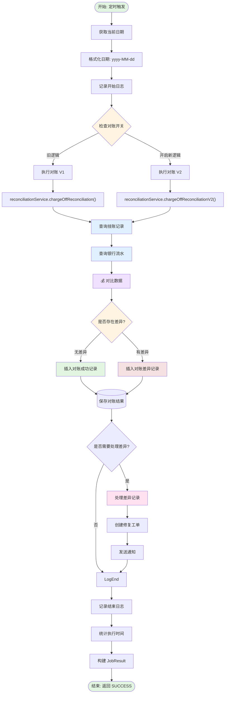
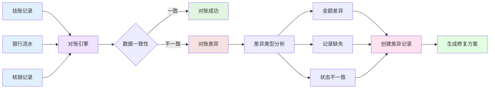

# 销账对账任务

## 任务信息

| 属性 | 值 |
|-----|---|
| 任务名称 | 销账对账 |
| 任务类 | `ChargeOffReconciliationJob` |
| 注解 | `@JobInfo` |
| 继承 | `JobExecutor` |
| 分片支持 | 否 |

## 任务描述

该任务负责执行销账对账，核对挂账、核销记录与银行流水的一致性，发现并处理差异。

---

## 业务流程图



## 对账数据流程



---

## 调度参数

### 输入参数

| 参数名 | 类型 | 必填 | 说明 |
|-------|------|------|------|
| externalData | String | 否 | 外部参数（未使用） |

### 内部参数

| 参数名 | 说明 | 示例值 |
|-------|------|-------|
| date | 对账日期 | 当前日期（yyyy-MM-dd 格式） |

---

## 调用方法

### 核心方法调用链

```
ChargeOffReconciliationJob.execute(externalData)
    ↓
获取当前日期: LocalDate.now().format(DATE_FORMAT_WITH_HYPHEN)
    ↓
记录开始日志: "-------------销帐对账开始执行{}-------------"
    ↓
检查开关: configs.getChargeOffLogReconSwitch()
    ↓
    ├── true → reconciliationService.chargeOffReconciliationV2()
    └── false → reconciliationService.chargeOffReconciliation()
        ↓
        ├── 查询挂账记录
        │   └── charge_off_trans_log
        ├── 查询银行流水
        │   └── over_flow_payment
        ├── 查询核销记录
        │   └── charge_off_write_off_log
        ├── 数据对比
        │   ├── 金额对比
        │   ├── 记录数对比
        │   └── 状态对比
        ├── 生成对账结果
        │   ├── 成功记录
        │   └── 差异记录
        └── 保存对账结果
            └── charge_off_reconciliation_log
    ↓
记录结束日志: "-------------销帐对账执行结束{}----总耗时{}--------"
    ↓
返回 JobResult(SUCCESS_CODE, SUCCESS_MESSAGE)
```

### 关键 Service 方法

| 方法 | 说明 | Service |
|-----|------|---------|
| `chargeOffReconciliation()` | 执行对账（旧版） | `ReconciliationService` |
| `chargeOffReconciliationV2()` | 执行对账（新版） | `ReconciliationService` |

---

## 数据库交互

### 涉及的表

| 表名 | 操作 | 说明 |
|-----|------|------|
| `charge_off_trans_log` | SELECT | 挂账交易日志 |
| `over_flow_payment` | SELECT | 银行流水（溢缴款） |
| `charge_off_write_off_log` | SELECT | 核销日志 |
| `charge_off_reconciliation_log` | INSERT | 对账日志 |

### 核心查询 SQL

```sql
-- 查询挂账记录（按日期）
SELECT *
FROM charge_off_trans_log
WHERE DATE(create_time) = #{date}
  AND status = 'ACTIVE';

-- 查询银行流水（按日期）
SELECT *
FROM over_flow_payment
WHERE DATE(create_time) = #{date}
  AND status = 'ACTIVE';

-- 查询核销记录（按日期）
SELECT *
FROM charge_off_write_off_log
WHERE DATE(create_time) = #{date}
  AND status = 'SUCCESS';

-- 插入对账成功记录
INSERT INTO charge_off_reconciliation_log (
    reconciliation_date,
    reconciliation_type,
    charge_off_amount,
    bank_flow_amount,
    write_off_amount,
    status,
    create_time
) VALUES (
    #{date},
    'CHARGE_OFF',
    #{chargeOffAmount},
    #{bankFlowAmount},
    #{writeOffAmount},
    'SUCCESS',
    NOW()
);

-- 插入对账差异记录
INSERT INTO charge_off_reconciliation_log (
    reconciliation_date,
    reconciliation_type,
    charge_off_amount,
    bank_flow_amount,
    write_off_amount,
    diff_amount,
    diff_desc,
    status,
    create_time
) VALUES (
    #{date},
    'CHARGE_OFF',
    #{chargeOffAmount},
    #{bankFlowAmount},
    #{writeOffAmount},
    #{diffAmount},
    #{diffDesc},
    'DIFF',
    NOW()
);
```

---

## 关键业务状态

### 对账状态 (status)

| 状态 | 说明 |
|-----|------|
| SUCCESS | 对账成功 |
| DIFF | 对账差异 |
| FIXED | 差异已修复 |

### 差异类型

| 差异类型 | 说明 | 处理方式 |
|---------|------|---------|
| AMOUNT_DIFF | 金额不一致 | 创建修复工单 |
| RECORD_MISSING | 记录缺失 | 补充记录 |
| STATUS_MISMATCH | 状态不一致 | 更新状态 |

---

## 对账规则

### V1 对账逻辑

1. **挂账金额 vs 银行流水金额**
   - 查询挂账记录总金额
   - 查询银行流水总金额
   - 对比两者是否一致

2. **核销金额 vs 挂账金额**
   - 查询核销记录总金额
   - 查询挂账记录总金额
   - 对比两者是否一致

3. **记录数校验**
   - 挂账记录数
   - 银行流水记录数
   - 核销记录数

### V2 对账逻辑（增强版）

1. **更精细的金额匹配**
   - 按渠道分组对账
   - 按币种分组对账
   - 按业务类型分组对账

2. **流水号匹配**
   - 挂账流水号与银行流水号匹配
   - 核销流水号与挂账流水号匹配

3. **状态一致性检查**
   - 挂账状态
   - 流水状态
   - 核销状态

---

## 配置项

| 配置项 | 说明 | 默认值 |
|-------|------|-------|
| `chargeOffLogReconSwitch` | 对账逻辑开关 | false（旧版） |

---

## 监控指标

| 指标 | 说明 | 目标值 |
|-----|------|-------|
| 任务执行时间 | 任务执行总时长 | < 10分钟 |
| 对账成功率 | 对账成功的比例 | > 95% |
| 差异处理率 | 差异处理完成比例 | 100% |

---

## 日志记录

### 关键日志

| 日志内容 | 说明 |
|---------|------|
| `-------------销帐对账开始执行{}-------------` | 对账开始 |
| `-------------销帐对账执行结束{}----总耗时{}--------` | 对账结束，包含耗时 |
| `对账成功，日期：{}` | 对账成功 |
| `对账差异，日期：{}，差异：{}` | 对账差异 |

---

## 相关任务

| 任务 | 说明 |
|-----|------|
| `ChargeOffReconciliationFixJob` | 销账对账修复任务 |
| `GetBankFlowToChargeUpJob` | 获取银行流水到挂账 |

---

## 相关接口

| 接口 | 说明 |
|-----|------|
| `POST /reconciliation/generate` | 生成对账记录 |
| `POST /reconciliation/query` | 查询对账结果 |
| `POST /reconciliation/handling` | 对账差异处理 |

---

## 相关文档

- [项目工程结构](../../01-项目工程结构.md)
- [数据库结构](../../02-数据库结构.md)
- [接口流程索引](../../03-接口流程索引.md)

---

**文档版本:** v1.0
**最后更新:** 2025-02-24
**维护人员:** Claude Code
