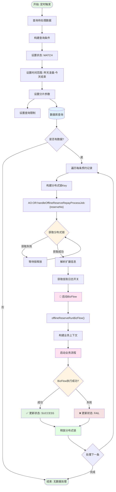
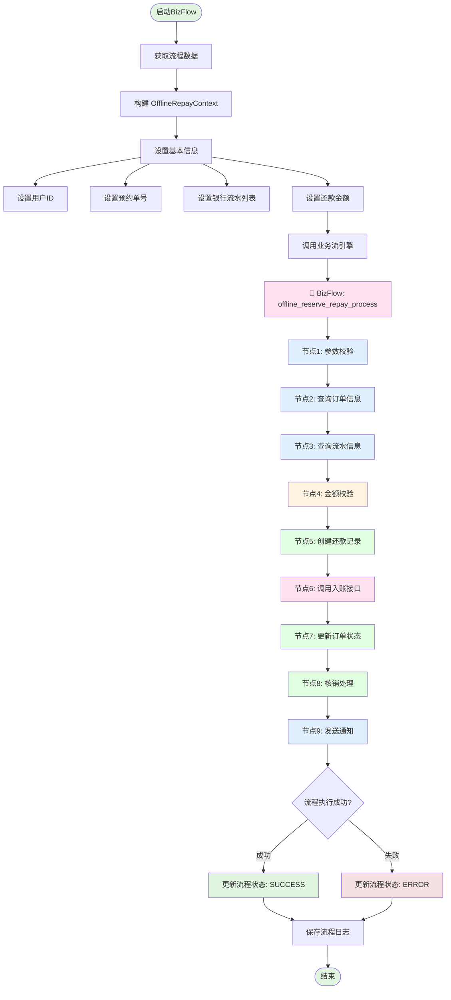
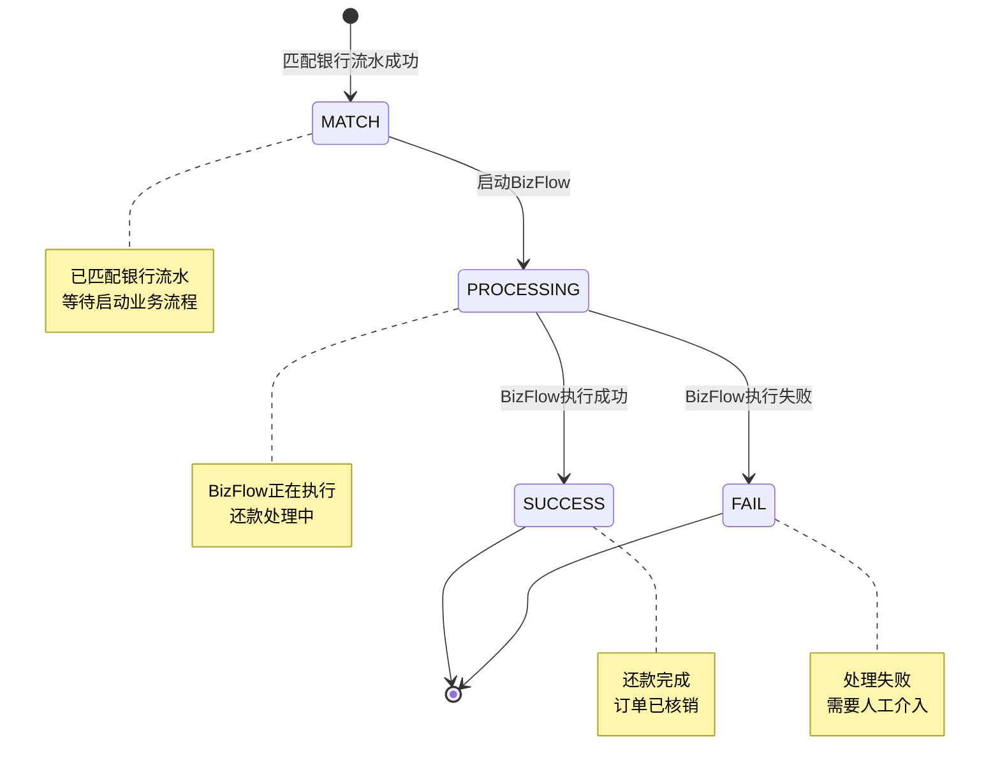

# 处理线下预约还款流程任务

## 任务信息

| 属性 | 值 |
|-----|---|
| 任务名称 | 处理线下预约还款流程 |
| 任务类 | `HandleOfflineReserveRepayProcessJob` |
| 注解 | `@JobInfo(jobName = "handleOfflineReserveRepayProcessJob")` |
| 继承 | `BaseJob<OfflineRepayReserveProcess>` |
| 分片支持 | 是 |

## 任务描述

该任务负责处理已匹配银行流水的线下预约还款记录，启动线下还款业务流程（BizFlow），完成还款入账、核销等后续处理。

---

## 业务流程图



## BizFlow 处理流程



---

## 调度参数

### 输入参数

| 参数名 | 类型 | 说明 | 来源 |
|-------|------|------|-----|
| shardingTotal | Integer | 分片总数 | 调度框架传入 |
| shardingItem | Integer | 当前分片项 | 调度框架传入 |
| limit | int | 每次查询限制数量 | 默认值 |

### 查询条件

| 条件 | 说明 | 示例值 |
|-----|------|-------|
| reserveStatus | 预约状态 | `MATCH`（匹配成功） |
| startTime | 开始时间 | 昨天凌晨 00:00:00 |
| endTime | 结束时间 | 今天 23:59:59 |
| shardingTotal | 分片总数 | 配置值 |
| shardingItem | 当前分片 | 配置值 |

---

## 调用方法

### 核心方法调用链

```
HandleOfflineReserveRepayProcessJob.process()
    ↓
获取分布式锁 Key: distributedLockKey()
    ↓
HandleOfflineReserveRepayProcessService.getOfflineProcessExt() - 解析扩展信息
    ↓
handleOfflineReserveRepayProcessService.offlineReserveRunBizFlow() - 启动业务流
    ↓
    ├── 构建业务上下文 (OfflineRepayContext)
    ├── 设置业务参数
    └── 调用 BizFlow 引擎
        ├── offline_reserve_repay_process 业务流
        ├── 执行各节点处理逻辑
        ├── 调用贷款系统入账接口
        ├── 更新订单状态
        └── 处理核销逻辑
    ↓
更新预约状态
```

### 关键 Service 方法

| 方法 | 说明 | Service |
|-----|------|---------|
| `queryNeedHandleData()` | 查询待处理数据 | `OfflineReserveQueryService` |
| `distributedLockKey()` | 构建分布式锁Key | 本类实现 |
| `getOfflineProcessExt()` | 解析扩展信息 | `HandleOfflineReserveRepayProcessService` |
| `offlineReserveRunBizFlow()` | 运行业务流程 | `HandleOfflineReserveRepayProcessService` |

---

## 数据库交互

### 涉及的表

| 表名 | 操作 | 说明 |
|-----|------|------|
| `offline_repay_reserve_process` | SELECT/UPDATE | 预约还款流程主表 |
| `offline_repay_order_info` | INSERT | 线下还款订单信息 |
| `repay_order` | INSERT | 还款订单表 |
| `order repayment_plan` | UPDATE | 还款计划表 |
| `biz_flow_execution_log` | INSERT | 业务流程执行日志 |

### 核心查询 SQL

```sql
-- 查询待处理的预约数据（MATCH 状态）
SELECT *
FROM offline_repay_reserve_process
WHERE reserve_status = 'MATCH'
  AND create_time >= #{startTime}
  AND create_time <= #{endTime}
  AND MOD(id, #{shardingTotal}) = #{shardingItem}
LIMIT #{limit};
```

### 更新操作

```sql
-- 更新预约状态为 PROCESSING
UPDATE offline_repay_reserve_process
SET reserve_status = 'PROCESSING',
    update_time = NOW()
WHERE reserve_no = #{reserveNo};

-- 更新预约状态为 SUCCESS
UPDATE offline_repay_reserve_process
SET reserve_status = 'SUCCESS',
    complete_time = NOW(),
    update_time = NOW()
WHERE reserve_no = #{reserveNo};

-- 更新预约状态为 FAIL
UPDATE offline_repay_reserve_process
SET reserve_status = 'FAIL',
    error_desc = #{errorMsg},
    update_time = NOW()
WHERE reserve_no = #{reserveNo};
```

---

## 关键业务状态

### 预约状态 (reserve_status)

| 状态 | 说明 | 触发条件 |
|-----|------|---------|
| MATCH | 匹配成功 | 已匹配到银行流水 |
| PROCESSING | 处理中 | BizFlow 正在执行 |
| SUCCESS | 成功 | BizFlow 执行成功 |
| FAIL | 失败 | BizFlow 执行失败 |

### 状态流转图



---

## 分布式锁

### 锁配置

| 配置项 | 值 | 说明 |
|-------|---|------|
| 锁 Key | `AO:OR:handleOfflineReserveRepayProcessJob:{reserveNo}` | 预约单级别锁 |
| 锁前缀 | `AO:OR:handleOfflineReserveRepayProcessJob:` | 任务前缀 |

### 锁使用流程

```
1. 构建锁 Key: distributedLockKey(bo)
2. 获取分布式锁: distributedLock.lock(lockKey)
3. 启动 BizFlow: offlineReserveRunBizFlow(bo, switch)
4. BizFlow 执行完成
5. 释放分布式锁: distributedLock.unlock(lockKey)
```

---

## 外部系统调用

### 贷款系统 (Loan)

| 接口 | 说明 | 调用时机 |
|-----|------|---------|
| `repayApply()` | 还款入账申请 | BizFlow 节点调用 |
| `queryOrderDetail()` | 查询订单详情 | BizFlow 节点调用 |
| `updateOrderStatus()` | 更新订单状态 | BizFlow 节点调用 |

---

## BizFlow 业务流

### offline_reserve_repay_process

该业务流是线下还款的核心流程，包含以下主要节点：

| 节点编码 | 节点名称 | 说明 |
|---------|---------|------|
| `offlineRepayParamCheckProcess` | 参数校验 | 校验还款参数合法性 |
| `offlineRepayQueryOrderProcess` | 查询订单信息 | 查询待还款订单 |
| `offlineRepayQueryBankFlowProcess` | 查询流水信息 | 查询银行流水详情 |
| `offlineRepayAmountValidateProcess` | 金额校验 | 校验还款金额 |
| `offlineRepayCreateRecordProcess` | 创建还款记录 | 创建还款订单记录 |
| `offlineRepayAccountInProcess` | 调用入账接口 | 调用贷款系统入账 |
| `offlineRepayUpdateOrderProcess` | 更新订单状态 | 更新订单为已还款 |
| `offlineRepayWriteOffProcess` | 核销处理 | 执行核销逻辑 |
| `offlineRepayNotifyProcess` | 发送通知 | 发送还款成功通知 |

详细流程请参考：[线下还款业务流程详情](../../05-业务流详情/offline_reserve_repay_process.md)

---

## 扩展信息 (extend)

扩展信息使用 JSON 格式存储，包含以下字段：

| 字段名 | 类型 | 说明 |
|-------|------|------|
| `newMatchChargeUpLogSwitch` | Boolean | 是否使用新的匹配挂账日志开关 |

```json
{
  "newMatchChargeUpLogSwitch": true
}
```

---

## 配置项

| 配置项 | 说明 | 默认值 |
|-------|------|-------|
| `newMatchChargeUpLogSwitch` | 新匹配挂账日志开关 | false |

---

## 监控指标

| 指标 | 说明 | 目标值 |
|-----|------|-------|
| 任务执行时间 | 任务执行总时长 | < 10分钟 |
| BizFlow 成功率 | BizFlow 执行成功比例 | > 95% |
| 数据库查询次数 | 单次任务查询次数 | < 50次 |
| 锁等待时间 | 分布式锁等待时间 | < 30秒 |

---

## 相关任务

| 任务 | 说明 |
|-----|------|
| `MatchOfflineReserveRepayInfoJob` | 匹配预约还款与银行流水 |
| `SyncReserveInfoFromLoanJob` | 从贷款系统同步预约信息 |

---

## 相关业务流

| 业务流 | BizKey | 说明 |
|-------|--------|------|
| 线下还款业务流程 | `offline_reserve_repay_process` | 预约线下还款主流程 |

---

## 相关文档

- [项目工程结构](../../01-项目工程结构.md)
- [数据库结构](../../02-数据库结构.md)
- [接口流程索引](../../03-接口流程索引.md)
- [业务流索引](../../05-业务流索引.md)
- [线下还款业务流程详情](../../05-业务流详情/offline_reserve_repay_process.md)
- [匹配线下预约还款信息任务](./matchOfflineReserveRepayInfoJob.md)

---

**文档版本:** v1.0
**最后更新:** 2025-02-24
**维护人员:** Claude Code
