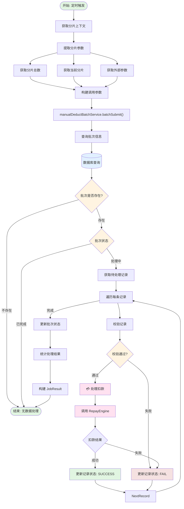
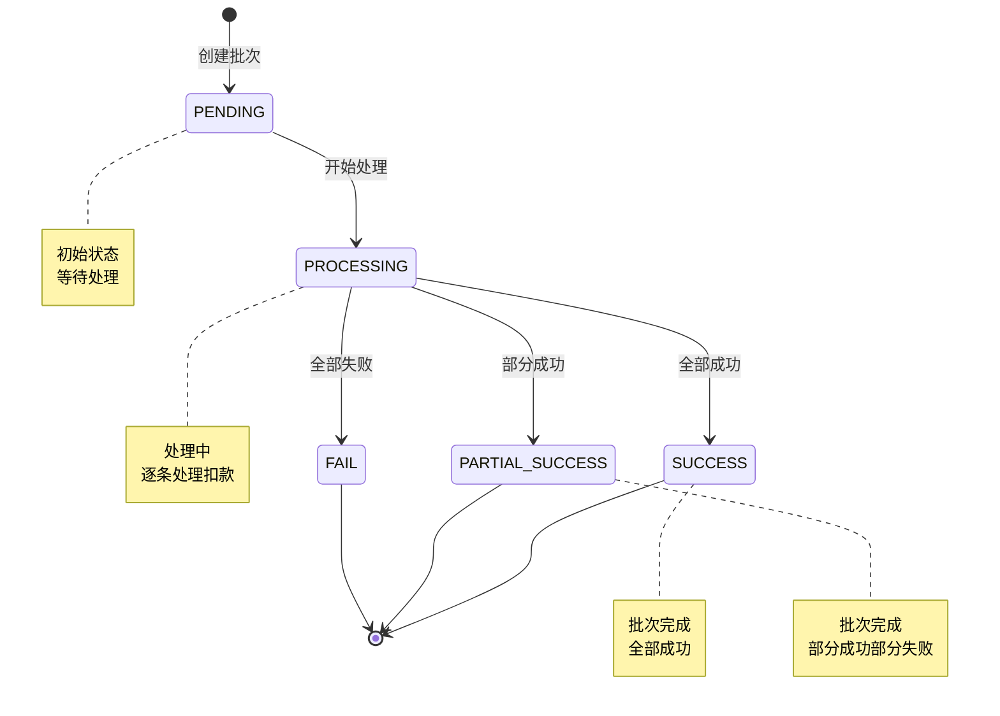

# 人工扣款批量处理任务

## 任务信息

| 属性 | 值 |
|-----|---|
| 任务名称 | 人工扣款批量处理 |
| 任务类 | `ManualDeductBatchDealJob` |
| 注解 | `@JobInfo(jobName = "manualDeductBatchDealJob")` |
| 继承 | `JobExecutor` |
| 分片支持 | 是 |

## 任务描述

该任务负责批量处理人工扣款请求，支持分片处理，适用于大批量扣款场景。

---

## 业务流程图



## 批次处理流程



---

## 调度参数

### 输入参数

| 参数名 | 类型 | 必填 | 说明 |
|-------|------|------|------|
| shardingTotal | Integer | 是 | 分片总数 |
| shardingItem | Integer | 是 | 当前分片项 |
| externalData | String | 否 | 外部参数（批次号等） |

### ShardingContext

```java
public class ShardingContext {
    private Integer shardingTotal;  // 分片总数
    private Integer shardingItem;   // 当前分片项（从0开始）
}
```

---

## 调用方法

### 核心方法调用链

```
ManualDeductBatchDealJob.execute(shardingContext, externalData)
    ↓
提取分片参数:
    ├── shardingContext.getShardingTotal()
    ├── shardingContext.getShardingItem()
    └── externalData
    ↓
ManualDeductBatchService.batchSubmit(shardingTotal, shardingItem, externalData)
    ↓
    ├── 解析外部参数（批次号）
    ├── 查询批次信息
    ├── 查询待处理记录（按分片）
    ├── 遍历每条记录
    │   ├── 校验记录
    │   ├── 调用 RepayEngine 扣款
    │   └── 更新记录状态
    ├── 统计处理结果
    └── 更新批次状态
    ↓
返回 JobResult(SUCCESS_CODE, SUCCESS_MESSAGE)
```

### 关键 Service 方法

| 方法 | 说明 | Service |
|-----|------|---------|
| `batchSubmit()` | 批量提交扣款 | `ManualDeductBatchService` |

---

## 数据库交互

### 涉及的表

| 表名 | 操作 | 说明 |
|-----|------|------|
| `manual_deduct_batch` | SELECT/UPDATE | 批次信息表 |
| `manual_deduct_record` | SELECT/UPDATE | 扣款记录表 |
| `manual_deduct_order` | INSERT | 扣款订单表 |

### 核心查询 SQL

```sql
-- 查询批次信息
SELECT *
FROM manual_deduct_batch
WHERE batch_no = #{batchNo};

-- 查询待处理记录（按分片）
SELECT *
FROM manual_deduct_record
WHERE batch_no = #{batchNo}
  AND status = 'PENDING'
  AND MOD(id, #{shardingTotal}) = #{shardingItem}
LIMIT #{limit};

-- 更新记录状态为成功
UPDATE manual_deduct_record
SET status = 'SUCCESS',
    order_no = #{orderNo},
    update_time = NOW()
WHERE id = #{id};

-- 更新记录状态为失败
UPDATE manual_deduct_record
SET status = 'FAIL',
    error_msg = #{errorMsg},
    update_time = NOW()
WHERE id = #{id};

-- 更新批次状态
UPDATE manual_deduct_batch
SET status = #{status},
    processed_count = #{processedCount},
    success_count = #{successCount},
    fail_count = #{failCount},
    update_time = NOW()
WHERE batch_no = #{batchNo};
```

---

## 关键业务状态

### 批次状态 (batch_status)

| 状态 | 说明 |
|-----|------|
| PENDING | 待处理 |
| PROCESSING | 处理中 |
| SUCCESS | 成功 |
| PARTIAL_SUCCESS | 部分成功 |
| FAIL | 失败 |

### 记录状态 (record_status)

| 状态 | 说明 |
|-----|------|
| PENDING | 待处理 |
| SUCCESS | 成功 |
| FAIL | 失败 |

---

## 分片规则

### 分片逻辑

```java
// 使用 id 取模进行分片
AND MOD(id, #{shardingTotal}) = #{shardingItem}

// 示例：
// shardingTotal = 3
// shardingItem = 0 → id % 3 = 0 的记录
// shardingItem = 1 → id % 3 = 1 的记录
// shardingItem = 2 → id % 3 = 2 的记录
```

---

## 外部系统调用

### RepayEngine（还款引擎）

| 接口 | 说明 | 调用时机 |
|-----|------|---------|
| `repayApply()` | 还款申请 | 处理每条扣款记录时 |

---

## 配置项

| 配置项 | 说明 | 默认值 |
|-------|------|-------|
| limit | 每次查询限制数量 | 100 |

---

## 监控指标

| 指标 | 说明 | 目标值 |
|-----|------|-------|
| 任务执行时间 | 任务执行总时长 | < 15分钟 |
| 批次处理成功率 | 批次处理成功的比例 | > 90% |
| 记录处理成功率 | 记录处理成功的比例 | > 85% |

---

## 相关任务

| 任务 | 说明 |
|-----|------|
| `ManualDeductBatchRequestJob` | 人工扣款批量请求任务 |

---

## 相关接口

| 接口 | 说明 |
|-----|------|
| `POST /manual_deduction/batchManualDeduct` | 批量扣款 |

---

## 相关业务流

| 业务流 | BizKey | 说明 |
|-------|--------|------|
| 人工扣款提交流程 | `manualDeductSubmitFlow` | 人工扣款提交流程 |

---

## 相关文档

- [项目工程结构](../../01-项目工程结构.md)
- [数据库结构](../../02-数据库结构.md)
- [接口流程索引](../../03-接口流程索引.md)
- [业务流索引](../../05-业务流索引.md)
- [人工扣款提交流程](../../05-业务流详情/manualDeductSubmitFlow.md)

---

**文档版本:** v1.0
**最后更新:** 2025-02-24
**维护人员:** Claude Code
