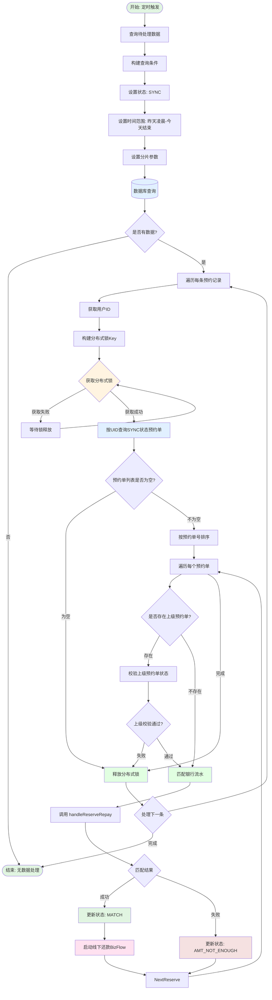
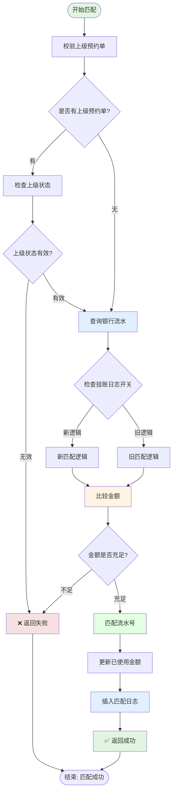
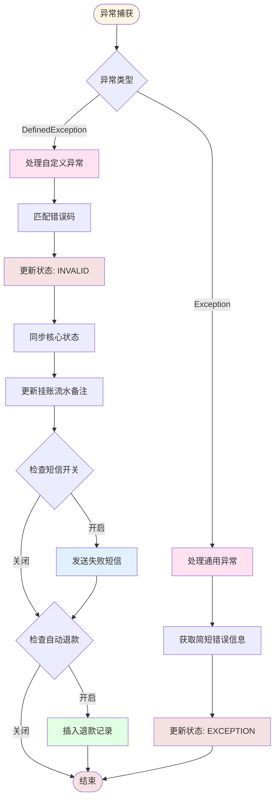
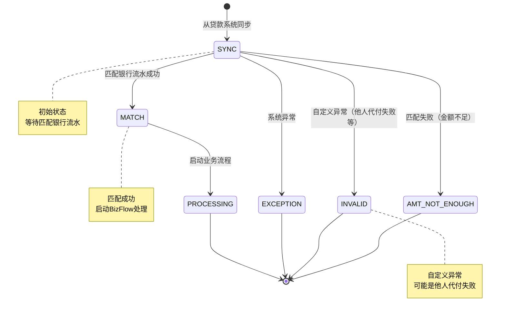

# 匹配线下预约还款信息任务

## 任务信息

| 属性 | 值 |
|-----|---|
| 任务名称 | 匹配线下预约还款信息 |
| 任务类 | `MatchOfflineReserveRepayInfoJob` |
| 注解 | `@JobInfo(jobName = "matchOfflineReserveRepayInfoJob")` |
| 继承 | `BaseJob<OfflineRepayReserveProcess>` |
| 分片支持 | 是 |

## 任务描述

该任务负责将线下预约还款信息与银行流水进行匹配，是线下还款自动化流程中的核心环节。任务会查询状态为 `SYNC`（已同步）的预约还款记录，通过用户维度加锁后，按预约单号顺序匹配银行流水。

---

## 业务流程图



## 匹配银行流水详细流程



## 异常处理流程



---

## 调度参数

### 输入参数

| 参数名 | 类型 | 说明 | 来源 |
|-------|------|------|-----|
| shardingTotal | Integer | 分片总数 | 调度框架传入 |
| shardingItem | Integer | 当前分片项 | 调度框架传入 |
| limit | int | 每次查询限制数量 | 默认值 |

### 查询条件

| 条件 | 说明 | 示例值 |
|-----|------|-------|
| reserveStatus | 预约状态 | `SYNC` |
| startTime | 开始时间 | 昨天凌晨 00:00:00 |
| endTime | 结束时间 | 今天 23:59:59 |
| shardingTotal | 分片总数 | 配置值 |
| shardingItem | 当前分片 | 配置值 |

---

## 调用方法

### 核心方法调用链

```
MatchOfflineReserveRepayInfoJob.process()
    ↓
distributedLock.lock() - 获取分布式锁
    ↓
offlineRepayReserveStoreService.selectOfflineRepayReserveProcessByUid() - 查询预约单
    ↓
MatchOfflineReserveRepayInfoJob.match() - 匹配处理
    ↓
handleReserveRepay.checkSuperiorReserveNoStatus() - 校验上级预约单
    ↓
handleReserveRepay.handleReserveRepay() - 执行匹配
    ↓
handleOfflineReserveRepayProcessService.offlineReserveRunBizFlow() - 启动业务流
    ↓
distributedLock.unlock() - 释放分布式锁
```

### 关键 Service 方法

| 方法 | 说明 | Service |
|-----|------|---------|
| `queryNeedHandleData()` | 查询待处理数据 | `OfflineReserveQueryService` |
| `selectOfflineRepayReserveProcessByUid()` | 按UID查询预约单 | `OfflineRepayReserveStoreService` |
| `checkSuperiorReserveNoStatus()` | 校验上级预约单 | `MatchOfflineReserveRepayInfoService` |
| `handleReserveRepay()` | 处理预约还款匹配 | `MatchOfflineReserveRepayInfoService` |
| `offlineReserveRunBizFlow()` | 运行业务流程 | `HandleOfflineReserveRepayProcessService` |
| `updateStatus()` | 更新预约状态 | `OfflineRepayReserveStoreService` |
| `saveOfflineRepayReserveInfo()` | 同步核心状态 | `OfflineReserveRepayClientProxy` |
| `updateOverFlowPaymentRemark()` | 更新流水备注 | `OverFlowPaymentService` |

---

## 数据库交互

### 涉及的表

| 表名 | 操作 | 说明 |
|-----|------|------|
| `offline_repay_reserve_process` | SELECT/UPDATE | 预约还款流程主表 |
| `over_flow_payment` | SELECT/UPDATE | 溢缴款（银行流水）表 |
| `offline_repay_reserve_match_log` | INSERT | 预约匹配日志表 |
| `refund_bank_enterprises` | INSERT | 退款记录表 |

### 核心查询 SQL

```sql
-- 查询待处理的预约数据
SELECT *
FROM offline_repay_reserve_process
WHERE reserve_status = 'SYNC'
  AND create_time >= #{startTime}
  AND create_time <= #{endTime}
  AND MOD(id, #{shardingTotal}) = #{shardingItem}
LIMIT #{limit};

-- 按UID查询预约单
SELECT *
FROM offline_repay_reserve_process
WHERE uid = #{uid}
  AND reserve_status = 'SYNC'
ORDER BY reserve_no ASC;

-- 查询银行流水
SELECT *
FROM over_flow_payment
WHERE uid = #{uid}
  AND status = 'ACTIVE'
  AND used_amount < total_amount;
```

### 更新操作

```sql
-- 更新预约状态为 MATCH
UPDATE offline_repay_reserve_process
SET reserve_status = 'MATCH',
    update_time = NOW()
WHERE reserve_no = #{reserveNo};

-- 更新预约状态为 AMT_NOT_ENOUGH
UPDATE offline_repay_reserve_process
SET reserve_status = 'AMT_NOT_ENOUGH',
    error_desc = '金额不足',
    update_time = NOW()
WHERE reserve_no = #{reserveNo};

-- 更新已使用金额
UPDATE over_flow_payment
SET used_amount = used_amount + #{amount},
    update_time = NOW()
WHERE bank_serial = #{bankSerial};
```

---

## 关键业务状态

### 预约状态 (reserve_status)

| 状态 | 说明 | 触发条件 |
|-----|------|---------|
| SYNC | 已同步 | 从贷款系统同步成功 |
| MATCH | 匹配成功 | 匹配到银行流水 |
| AMT_NOT_ENOUGH | 金额不足 | 匹配失败，金额不够 |
| INVALID | 失效 | 自定义异常导致失效 |
| EXCEPTION | 异常 | 系统异常 |

### 状态流转图



---

## 分布式锁

### 锁配置

| 配置项 | 值 | 说明 |
|-------|---|------|
| 锁 Key | `AO:OR:matchOfflineReserveRepayInfoJob:{reserveNo}` | 预约单级别锁 |
| 锁前缀 | `AO:OR:matchOfflineReserveRepayInfoJob:` | 任务前缀 |
| UID 锁 | `OFFLINE_REPAY_RESERVE_LOCK:{uid}` | 用户维度锁 |

### 锁使用流程

```
1. 按 UID 获取锁: distributedLock.lock(Constants.OFFLINE_REPAY_RESERVE_LOCK + uid)
2. 查询该 UID 下所有 SYNC 状态的预约单
3. 按预约单号排序（先预约的先处理）
4. 逐个处理预约单
5. 释放 UID 锁: distributedLock.unlock(redisKey)
```

---

## 外部系统调用

### 贷款系统 (Loan)

| 接口 | 说明 | 调用时机 |
|-----|------|---------|
| `saveOfflineRepayReserveInfo()` | 保存/更新预约信息 | 状态变更时同步核心 |
| `queryOfflineRepayReserveInfo()` | 查询预约信息 | 发送失败短信前查询详情 |

### 短信服务

| 场景 | 说明 | 开关控制 |
|-----|------|---------|
| 他人代付失败通知 | 他人代还失败时发送短信 | `sendOtherPayFailSwitch` |

---

## 特殊业务逻辑

### 他人代付失败处理

当发生 `DefinedException` 异常且错误码为他人代付相关时：

1. **更新预约状态** → `INVALID`
2. **同步核心状态** → 调用 Loan 系统更新
3. **更新流水备注** → 标记为 `OHTER_REPAY`（他人代付）
4. **发送失败短信** → 通知还款人
5. **插入退款记录** → 创建 `refund_bank_enterprises` 记录

### 自动退款逻辑

```java
// 检查自动退款开关
CommonRuleElementObject commonRule = workShopService.queryCommonRule();
if(commonRule != null && commonRule.getIsAutoRefund()) {
    // 查询银行流水
    List<OverFlowPayment> flows = overFlowPaymentService
        .queryOverFlowPaymentByBankSerialList(bankSerialList);
    // 创建退款记录
    flows.forEach(flow -> {
        RefundBankEnterprises refund = new RefundBankEnterprises();
        refund.setOrigRefundNo(reserveNo);
        refund.setBankSerial(flow.getBankSerial());
        refund.setRefundChannel(RefundChannelEnum.BANKS_ENTERPRISES.name());
        refund.setOriginType(RefundBankEnterPrisesOriginEnum.AUTO_REFUND.name());
        // ... 保存退款记录
    });
}
```

---

## 配置项

| 配置项 | 说明 | 默认值 |
|-------|------|-------|
| `sendOtherPayFailSwitch` | 他人代付失败短信开关 | - |
| `isAutoRefund` | 自动退款开关 | - |
| `backChannel` | 退款渠道 | - |

---

## 监控指标

| 指标 | 说明 | 目标值 |
|-----|------|-------|
| 任务执行时间 | 任务执行总时长 | < 5分钟 |
| 匹配成功率 | 匹配成功的比例 | > 80% |
| 数据库查询次数 | 单次任务查询次数 | < 100次 |
| 锁等待时间 | 分布式锁等待时间 | < 30秒 |

---

## 相关任务

| 任务 | 说明 |
|-----|------|
| `HandleOfflineReserveRepayProcessJob` | 处理匹配成功的预约单 |
| `SyncReserveInfoFromLoanJob` | 从贷款系统同步预约信息 |

---

## 相关业务流

| 业务流 | BizKey | 说明 |
|-------|--------|------|
| 线下还款业务流程 | `offline_reserve_repay_process` | 预约线下还款主流程 |

---

## 相关文档

- [项目工程结构](../../01-项目工程结构.md)
- [数据库结构](../../02-数据库结构.md)
- [接口流程索引](../../03-接口流程索引.md)
- [业务流索引](../../05-业务流索引.md)
- [线下还款业务流程详情](../../05-业务流详情/offline_reserve_repay_process.md)

---

**文档版本:** v1.0
**最后更新:** 2025-02-24
**维护人员:** Claude Code
