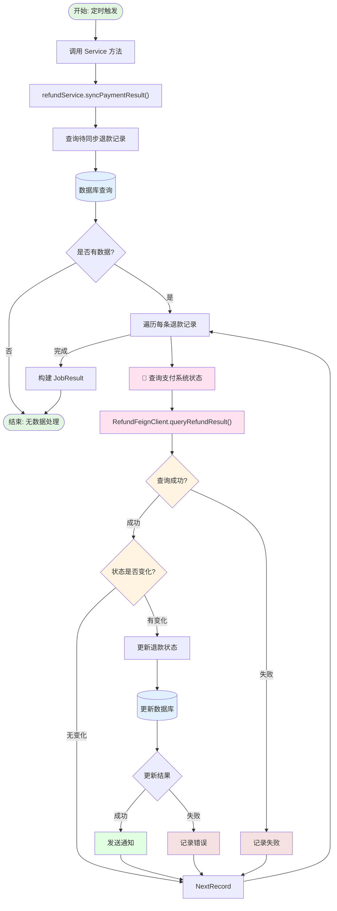
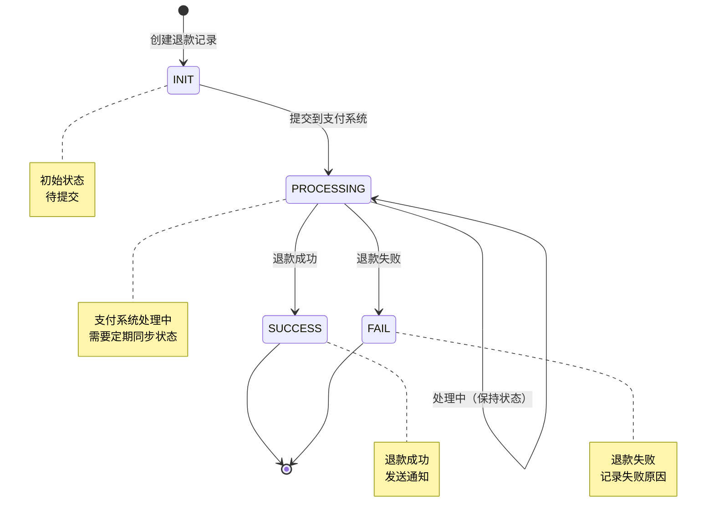

# 退款结果同步任务

## 任务信息

| 属性 | 值 |
|-----|---|
| 任务名称 | 退款结果同步 |
| 任务类 | `RefundResultSyncJob` |
| 注解 | `@JobInfo` |
| 继承 | `JobExecutor` |
| 分片支持 | 否 |

## 任务描述

该任务负责同步退款处理结果，从支付系统查询退款状态并更新到会计核算运营系统。

---

## 业务流程图



## 退款状态同步流程



---

## 调度参数

### 输入参数

| 参数名 | 类型 | 必填 | 说明 |
|-------|------|------|------|
| externalData | String | 否 | 外部参数（未使用） |

---

## 调用方法

### 核心方法调用链

```
RefundResultSyncJob.execute(externalData)
    ↓
RefundService.syncPaymentResult()
    ↓
    ├── 查询待同步的退款记录
    │   └── 状态为 PROCESSING 的退款
    ├── 遍历每条退款记录
    ├── 调用支付系统查询退款状态
    │   └── RefundFeignClient.queryRefundResult(refundNo)
    ├── 比较状态是否变化
    ├── 更新本地状态
    └── 发送通知（如果状态变化）
        ├── 站内消息
        └── 短信通知（可选）
    ↓
返回 JobResult(SUCCESS_CODE, SUCCESS_MESSAGE)
```

### 关键 Service 方法

| 方法 | 说明 | Service |
|-----|------|---------|
| `syncPaymentResult()` | 同步支付结果 | `RefundService` |

---

## 数据库交互

### 涉及的表

| 表名 | 操作 | 说明 |
|-----|------|------|
| `refund_bank_enterprises` | SELECT/UPDATE | 退款记录表 |

### 核心查询 SQL

```sql
-- 查询待同步的退款记录
SELECT *
FROM refund_bank_enterprises
WHERE status = 'PROCESSING'
  AND create_time >= #{startTime}
  AND create_time <= #{endTime};
```

### 更新操作

```sql
-- 更新退款状态为成功
UPDATE refund_bank_enterprises
SET status = 'SUCCESS',
    complete_time = NOW(),
    update_time = NOW()
WHERE refund_no = #{refundNo};

-- 更新退款状态为失败
UPDATE refund_bank_enterprises
SET status = 'FAIL',
    error_msg = #{errorMsg},
    complete_time = NOW(),
    update_time = NOW()
WHERE refund_no = #{refundNo};
```

---

## 关键业务状态

### 退款状态 (status)

| 状态 | 说明 | 来源系统 |
|-----|------|---------|
| INIT | 初始状态 | 本地创建 |
| PROCESSING | 处理中 | 提交到支付系统后 |
| SUCCESS | 成功 | 支付系统返回 |
| FAIL | 失败 | 支付系统返回 |

---

## 外部系统调用

### 支付系统 (Payment)

| 接口 | 说明 | 调用方 |
|-----|------|-------|
| `queryRefundResult()` | 查询退款结果 | `RefundFeignClient` |

---

## 配置项

无特殊配置项。

---

## 监控指标

| 指标 | 说明 | 目标值 |
|-----|------|-------|
| 任务执行时间 | 任务执行总时长 | < 5分钟 |
| 同步成功率 | 同步成功的比例 | > 95% |
| 接口调用次数 | 支付系统接口调用次数 | < 1000次/次 |

---

## 相关任务

| 任务 | 说明 |
|-----|------|
| `RefundChannelSyncJob` | 退款渠道同步任务 |

---

## 相关接口

| 接口 | 说明 |
|-----|------|
| `POST /refund/charge-up/submit` | 提交退款 |
| `POST /refund/charge-up/audit-query` | 审核查询 |

---

## 相关文档

- [项目工程结构](../../01-项目工程结构.md)
- [数据库结构](../../02-数据库结构.md)
- [接口流程索引](../../03-接口流程索引.md)

---

**文档版本:** v1.0
**最后更新:** 2025-02-24
**维护人员:** Claude Code
