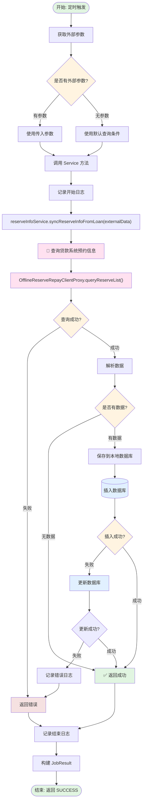
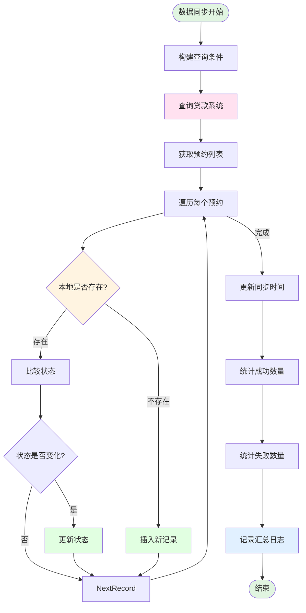

# 同步贷款系统预约信息任务

## 任务信息

| 属性 | 值 |
|-----|---|
| 任务名称 | 同步贷款系统预约信息 |
| 任务类 | `SyncReserveInfoFromLoanJob` |
| 注解 | `@JobInfo(jobName = "syncReserveInfoFromLoanJob")` |
| 继承 | `JobExecutor` |
| 分片支持 | 否 |

## 任务描述

该任务负责从贷款系统（Loan）同步线下预约还款信息到会计核算运营系统（AO），确保两边数据的一致性。

---

## 业务流程图



## 数据同步流程



---

## 调度参数

### 输入参数

| 参数名 | 类型 | 必填 | 说明 |
|-------|------|------|------|
| externalData | String | 否 | 外部参数，可作为查询条件 |

### externalData 参数格式

```json
{
  "startTime": "2025-02-23 00:00:00",
  "endTime": "2025-02-23 23:59:59",
  "uid": "123456",
  "reserveStatus": "SYNC"
}
```

---

## 调用方法

### 核心方法调用链

```
SyncReserveInfoFromLoanJob.execute(externalData)
    ↓
记录日志: "syncReserveInfoFromLoanJob开始执行处理逻辑，参数{}"
    ↓
OfflineRepayReserveInfoService.syncReserveInfoFromLoan(externalData)
    ↓
    ├── 解析外部参数
    ├── 构建查询条件
    ├── 调用贷款系统查询接口
    └── 处理同步结果
        ├── 遍历预约列表
        ├── 判断本地是否存在
        ├── 插入新记录或更新已有记录
        └── 记录同步日志
    ↓
返回 JobResult(SUCCESS_CODE, SUCCESS_MESSAGE)
```

### 关键 Service 方法

| 方法 | 说明 | Service |
|-----|------|---------|
| `syncReserveInfoFromLoan()` | 同步预约信息 | `OfflineRepayReserveInfoService` |

---

## 数据库交互

### 涉及的表

| 表名 | 操作 | 说明 |
|-----|------|------|
| `offline_repay_reserve_process` | INSERT/UPDATE | 预约还款流程主表 |

### 核心操作 SQL

```sql
-- 查询本地是否存在该预约单
SELECT *
FROM offline_repay_reserve_process
WHERE reserve_no = #{reserveNo};

-- 插入新预约记录
INSERT INTO offline_repay_reserve_process (
    reserve_no,
    uid,
    reserve_status,
    reserve_amount,
    bank_serial_list,
    create_time,
    update_time
) VALUES (
    #{reserveNo},
    #{uid},
    'SYNC',
    #{reserveAmount},
    #{bankSerialList},
    NOW(),
    NOW()
);

-- 更新预约记录状态
UPDATE offline_repay_reserve_process
SET reserve_status = #{newStatus},
    update_time = NOW()
WHERE reserve_no = #{reserveNo};
```

---

## 关键业务状态

### 预约状态 (reserve_status)

| 状态 | 说明 | 来源 |
|-----|------|------|
| SYNC | 已同步 | 从贷款系统同步后的初始状态 |
| MATCH | 匹配成功 | 匹配到银行流水 |
| PROCESSING | 处理中 | BizFlow 正在执行 |
| SUCCESS | 成功 | BizFlow 执行成功 |
| FAIL | 失败 | BizFlow 执行失败 |

### 状态流转

```
[贷款系统] → SYNC → [会计运营系统]
    ↓
  MATCH（匹配银行流水）
    ↓
  PROCESSING（BizFlow 处理中）
    ↓
  SUCCESS / FAIL
```

---

## 外部系统调用

### 贷款系统 (Loan)

| 接口 | 说明 | 调用方 |
|-----|------|-------|
| `queryReserveList()` | 查询预约列表 | `OfflineReserveRepayClientProxy` |

---

## 数据映射

### 贷款系统 → 会计运营系统

| 贷款系统字段 | 会计运营系统字段 | 说明 |
|------------|----------------|------|
| reserveNo | reserve_no | 预约单号 |
| uid | uid | 用户ID |
| reserveStatus | reserve_status | 预约状态 |
| reserveAmount | reserve_amount | 预约金额 |
| bankSerialList | bank_serial_list | 银行流水号列表 |
| createTime | create_time | 创建时间 |
| updateTime | update_time | 更新时间 |

---

## 配置项

无特殊配置项。

---

## 监控指标

| 指标 | 说明 | 目标值 |
|-----|------|-------|
| 任务执行时间 | 任务执行总时长 | < 3分钟 |
| 同步成功率 | 同步成功的比例 | > 98% |
| 数据一致性 | 两边数据一致性 | 100% |

---

## 日志记录

### 关键日志

| 日志内容 | 说明 |
|---------|------|
| `syncReserveInfoFromLoanJob开始执行处理逻辑，参数{}` | 任务开始 |
| `同步预约信息成功，数量：{}` | 同步成功 |
| `同步预约信息失败，reserveNo：{}` | 同步失败 |

---

## 相关任务

| 任务 | 说明 |
|-----|------|
| `MatchOfflineReserveRepayInfoJob` | 匹配预约还款与银行流水（依赖此任务） |
| `HandleOfflineReserveRepayProcessJob` | 处理匹配成功的预约单 |

---

## 相关业务流

| 业务流 | BizKey | 说明 |
|-------|--------|------|
| 线下还款业务流程 | `offline_reserve_repay_process` | 预约线下还款主流程 |

---

## 相关文档

- [项目工程结构](../../01-项目工程结构.md)
- [数据库结构](../../02-数据库结构.md)
- [接口流程索引](../../03-接口流程索引.md)
- [业务流索引](../../05-业务流索引.md)
- [匹配线下预约还款信息任务](./matchOfflineReserveRepayInfoJob.md)
- [处理线下预约还款流程任务](./handleOfflineReserveRepayProcessJob.md)

---

**文档版本:** v1.0
**最后更新:** 2025-02-24
**维护人员:** Claude Code
