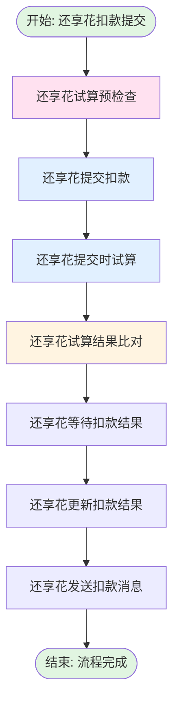

# 还享花人工扣款提交流程 (enjoyManualDeductSubmit)

## 业务流概述

**BizKey:** `enjoyManualDeductSubmit`
**V15 Code:** `PF-custaccountenjoyManualDeductSubmit_migrate`
**说明:** 还享花人工扣款提交流程

**业务场景:**
还享花是特定渠道的人工扣款产品，有独立的扣款流程。该流程处理还享花渠道的扣款提交。

---

## 流程架构图

---

## 流程节点

| 节点名称 | 节点编码 | 实现类 | 说明 |
|---------|---------|--------|------|
| 还享花提交扣款 | enjoySubmitDeductProcess | EnjoySubmitDeductProcess | 调用还享花扣款接口 |
| 还享花提交试算 | enjoySubmitTrailProcess | EnjoySubmitTrailProcess | 提交时进行试算 |
| 还享花试算比对 | enjoySubmitTrailCompareProcess | EnjoySubmitTrailCompareProcess | 比对试算结果 |
| 还享花等待结果 | enjoySubmitWaitResultProcess | EnjoySubmitWaitResultProcess | 等待扣款结果 |
| 还享花更新结果 | enjoySubmitUpdateResultProcess | EnjoySubmitUpdateResultProcess | 更新扣款结果 |
| 还享花发送消息 | enjoySubmitSendMsgProcess | EnjoySubmitSendMsgProcess | 发送通知消息 |

---

## 与人工扣款主流程的区别

| 特性 | 人工扣款主流程 | 还享花流程 |
|-----|--------------|-----------|
| 渠道限制 | 支持多渠道 | 仅还享花渠道 |
| 扣款接口 | RepayEngine通用接口 | 还享花专用接口 |
| 试算时机 | 提交前试算 | 提交时试算 |
| 卡号要求 | 必须有卡号 | 可以为空（特殊渠道） |

---

## 相关文档

- [人工扣款提交流程](manualDeductSubmitFlow.md)
- [还享花试算流程](enjoyManualDeductionTrail.md)

---

**文档版本:** v1.0
**最后更新:** 2025-02-24
