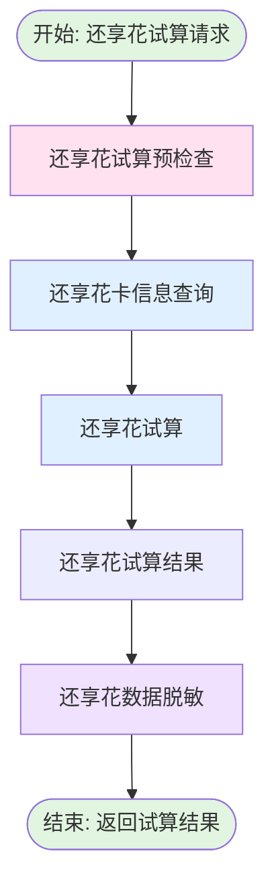

# 还享花人工扣款试算流程 (enjoyManualDeductionTrail)

## 业务流概述

**BizKey:** `enjoyManualDeductionTrail`
**V15 Code:** `PF-custaccountenjoyManualDeductionTrail_migrate`
**说明:** 还享花人工扣款试算流程

**业务场景:**
还享花渠道的试算流程，计算还享花订单的还款金额。

---

## 流程架构图

---

## 流程节点

| 节点名称 | 节点编码 | 实现类 | 说明 |
|---------|---------|--------|------|
| 还享花试算预检查 | enjoyTrailPreCheckProcess | EnjoyTrailPreCheckProcess | 试算前置校验 |
| 还享花试算 | enjoyTrailProcess | EnjoyTrailProcess | 调用试算服务 |
| 还享花试算结果 | enjoyTrailResultProcess | EnjoyTrailResultProcess | 处理试算结果 |
| 还享花卡处理 | enjoyCardProcess | EnjoyCardProcess | 查询银行卡信息 |
| 还享花数据脱敏 | enjoyDataMaskingProcess | EnjoyDataMaskingProcess | 数据脱敏 |

---

## 与人工扣款试算主流程的区别

| 特性 | 人工扣款主流程 | 还享花流程 |
|-----|--------------|-----------|
| 渠道限制 | 支持多渠道 | 仅还享花渠道 |
| 试算接口 | RepayFront通用接口 | 还享花专用接口 |
| 部分还款 | 可能支持 | 不支持 |
| 默认银行卡 | 支持设置 | 不支持 |

---

## 相关文档

- [人工扣款试算流程](manualDeductTrailFlow.md)
- [还享花扣款提交流程](enjoyManualDeductSubmit.md)

---

**文档版本:** v1.0
**最后更新:** 2025-02-24
