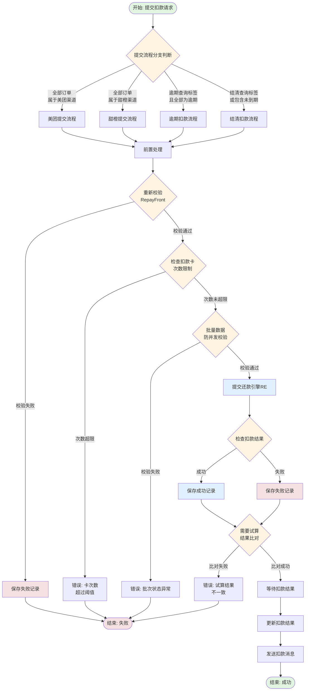
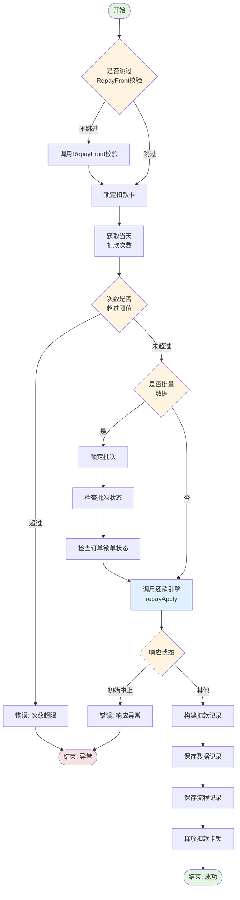

# 人工扣款提交流程 (manualDeductSubmitFlow)

## 业务流概述

**BizKey:** `manualDeductSubmitFlow`
**V15 Code:** `PF-custaccountmanualDeductSubmitFlow_migrate`
**说明:** 人工扣款提交扣款的主流程

**业务场景:**
运营人员通过人工扣款功能，对用户的逾期或未到期订单发起扣款操作。系统根据订单类型、渠道、扣款标签等条件，自动选择不同的扣款流程分支。

---

## 流程架构图



---

## 流程节点详解

### 节点1: 提交流程分支判断

**节点编码:** `manualDeductSubmitFlowDecideProcess`
**实现类:** `ManualDeductSubmitFlowDecideProcess`
**Spring Bean:** `manualDeductSubmitFlowDecideProcess`

**功能说明:**
根据订单渠道、扣款标签、订单逾期状态等条件，决定后续流程分支。

**输入参数:**
- `ManualDeductContext` - 扣款上下文
  - `ordersInfoList` - 订单信息列表
  - `submitReq.deductTag` - 扣款标签（O=逾期查询，A=结清查询）

**业务规则:**

| 条件 | 分支 | 说明 |
|-----|------|------|
| 全部订单渠道 = MEITUAN | PROCESSID_P004 | 美团流程 |
| 全部订单渠道 = TCJR | PROCESSID_P005 | 甜橙流程 |
| 扣款标签 = O 且全部为逾期 | PROCESSID_P006 | 逾期流程 |
| 扣款标签 = A 或包含未到期 | PROCESSID_P007 | 结清流程 |

**关键代码:**
```java
// 判断是否全部为美团订单
boolean includeMeuTuan = ordersInfoList.stream()
    .allMatch(item -> ApiChannelEnum.MEITUAN.name().equals(item.getChannel()));

// 判断是否全部为甜橙订单
boolean includeTCJR = ordersInfoList.stream()
    .allMatch(item -> ApiChannelEnum.TCJR.name().equals(item.getChannel()));

// 判断是否包含未到期分期
boolean isSettle = isSettle(ordersInfoList, manualDeductContext);
```

**输出:**
- `ProcessResult` - 包含下一个流程节点的标识

**业务状态:**
- 无状态变更
- 设置上下文参数（uid, orderNoList, deductNo, batchNo等）

---

### 节点2: 前置处理

**节点编码:** `manualDeductPreSubmitProcess`
**实现类:** `ManualDeductPreSubmitProcess`
**Spring Bean:** `manualDeductPreSubmitProcess`

**功能说明:**
组装扣款请求参数，构建 `RepayApplySubmitReq` 对象。

**输入参数:**
- `ManualDeductContext` - 扣款上下文
  - `acutalOrderInfoList` - 实际订单信息列表
  - `planInfoMap` - 计划信息映射
  - `trailPlanInfoBos` - 试算计划信息列表
  - `submitReq.deductCardId` - 扣款卡ID

**处理逻辑:**
1. 遍历实际订单列表
2. 为每个订单构建 `StagePlanItem`
3. 计算总扣款金额
4. 构建 `PayItem`（支付项）
5. 设置扩展信息（扣款类型、灰度标签等）
6. 增强拆单信息

**关键代码:**
```java
RepayApplySubmitReq req = RepayApplySubmitReq.builder()
    .uid(manualDeductContext.getSubmitReq().getUid())
    .bizSerial(UUID.randomUUID().toString())
    .requestSource(Constants.SYSTEMNAME)
    .repayType(RepayType.BY_STAGE_PLAN)
    .repayWay(RepayWay.MANUAL_DEDUCT)
    .sceneCode(manualDeductContext.getSceneCode())
    .repayAmount(repayAmount)
    .stagePlanItemList(stagePlanItems)
    .payItemList(payItems)
    .extInfoMap(extInfoMap)
    .build();
```

**输出:**
- `ManualDeductContext.repayApplySubmitReq` - 还款申请请求对象
- `ManualDeductContext.deductExecNo` - 扣款执行号

**数据库交互:** 无

---

### 节点3: 提交扣款

**节点编码:** `manualDeductSubmitDeductProcess`
**实现类:** `ManualDeductSubmitDeductProcess`
**Spring Bean:** `manualDeductSubmitDeductProcess`

**功能说明:**
调用还款引擎（RE）发起扣款，并处理扣款结果。

**输入参数:**
- `ManualDeductContext.repayApplySubmitReq` - 还款申请请求

**处理流程:**



**关键业务规则:**

1. **RepayFront 重新校验**
   - 防止打包扣款情况
   - 调用 `trailCallRepayFront` 方法

2. **扣款卡次数限制**
   - Redis 锁定扣款卡
   - 查询当天扣款次数
   - 超过阈值则拒绝

3. **批量数据防并发**
   - 检查批次状态
   - 防止重复提交
   - 检查订单锁单状态

4. **提交还款引擎**
   - 调用 `repayFeignClientProxy.repayApply`
   - 获取扣款结果

5. **保存扣款记录**
   - `manual_deduct_data_record` - 数据记录表
   - `manual_deduction_flow` - 扣款流程表

**关键代码:**
```java
// 锁定扣款卡
String key = adFunctions.getDeductCardCntnKey(payInstrumentNo, date);
distributedLock.lock(key);

// 检查扣款次数
Long deductNum = getDeductCardNum(key);
if (deductNum >= configs.getManualDeductConfigBo().getCardMaxDeductNum()) {
    throw new CjjClientException(12001, "扣款卡次数超过当天阀值");
}

// 提交扣款
RepayApplySubmitResp repayApplySubmitResp = repayFeignClientProxy.repayApply(repayApplySubmitReq);

// 保存记录
ManualDeductDataRecord record = buildManualDeductDataRecord(context, result, errorMsg);
List<ManualDeductionFlow> flows = buildManualDeductionFlow(context, status, caption);
saveManualDeductSubmitInfo(record, flows);
```

**数据库交互:**

| 操作 | 表 | 说明 |
|-----|---|------|
| INSERT | `manual_deduct_data_record` | 扣款数据记录 |
| INSERT | `manual_deduction_flow` | 扣款流程记录 |

**外部系统调用:**
- **RepayFront** - 重新校验（`checkCommonService.callRepayFront`）
- **RepayEngine (RE)** - 提交扣款（`repayFeignClientProxy.repayApply`）
- **TNQ** - 查询订单状态（`tnqBillClientProxy.findByUidOrOrder`）

**输出:**
- `ManualDeductContext.repayApplySubmitResp` - 还款申请响应

**业务状态变更:**
- `manual_deduct_data_record.status` - SUCCESS/FAILURE
- `manual_deduction_flow.status` -扣款状态

---

### 节点4: 试算结果比对

**节点编码:** `manualDeductSubmitTrailCompareProcess`
**实现类:** `ManualDeductSubmitTrailCompareProcess`
**Spring Bean:** `manualDeductSubmitTrailCompareProcess`

**功能说明:**
将提交扣款时的结果与试算结果进行比对，确保金额一致。

**输入参数:**
- `ManualDeductContext.trailPlanInfoBos` - 试算结果
- `ManualDeductContext.repayApplySubmitResp` - 扣款响应

**比对规则:**
- 本金金额一致
- 利息金额一致
- 费用金额一致
- 总金额一致

**输出:**
- 比对成功: 继续下一个节点
- 比对失败: 流程终止，返回错误

---

### 节点5: 等待扣款结果

**节点编码:** `manualDeductSubmitWaitResultProcess`
**实现类:** `ManualDeductSubmitWaitResultProcess`
**Spring Bean:** `manualDeductSubmitWaitResultProcess`

**功能说明:**
异步等待还款引擎返回最终扣款结果。

**处理逻辑:**
1. 轮询查询扣款状态
2. 超时时间配置
3. 状态为终态时返回

---

### 节点6: 更新扣款结果

**节点编码:** `manualDeductSubmitUpdateResultProcess`
**实现类:** `ManualDeductSubmitUpdateResultProcess`
**Spring Bean:** `manualDeductSubmitUpdateResultProcess`

**功能说明:**
将扣款结果更新到数据库记录。

**数据库交互:**

| 操作 | 表 | 说明 |
|-----|---|------|
| UPDATE | `manual_deduct_data_record` | 更新扣款状态 |
| UPDATE | `manual_deduction_flow` | 更新流程状态 |

---

### 节点7: 发送扣款消息

**节点编码:** `manualDeductSubmitSendMsgProcess`
**实现类:** `ManualDeductSubmitSendMsgProcess`
**Spring Bean:** `manualDeductSubmitSendMsgProcess`

**功能说明:**
发送扣款结果通知消息。

**消息类型:**
- 短信通知
- 站内信通知
- 其他通知方式

---

## 数据库交互汇总

### 涉及的表

| 表名 | 用途 | 操作 |
|-----|------|------|
| `manual_deduct_data_record` | 扣款数据记录 | INSERT, UPDATE |
| `manual_deduction_flow` | 扣款流程记录 | INSERT, UPDATE |
| `manual_deduct_batch` | 批次信息 | SELECT |
| `manual_deduct_task` | 扣款任务 | SELECT |

### 关键字段说明

**manual_deduct_data_record (扣款数据记录表)**

| 字段名 | 类型 | 说明 |
|-------|------|------|
| id | BIGINT | 主键 |
| deduct_no | VARCHAR | 扣款编号 |
| uid | VARCHAR | 用户ID |
| order_no | VARCHAR | 订单号 |
| repay_amount | DECIMAL | 还款金额 |
| status | VARCHAR | 状态：SUCCESS/FAILURE |
| error_msg | VARCHAR | 错误信息 |
| create_time | DATETIME | 创建时间 |

**manual_deduction_flow (扣款流程表)**

| 字段名 | 类型 | 说明 |
|-------|------|------|
| id | BIGINT | 主键 |
| biz_serial | VARCHAR | 业务流水号 |
| flow_status | VARCHAR | 流程状态 |
| stage | VARCHAR | 当前阶段 |
| create_time | DATETIME | 创建时间 |
| update_time | DATETIME | 更新时间 |

---

## 外部系统调用

### RepayFront（还款前台）

**调用时机:** 重新校验订单

**接口:** `checkCommonService.callRepayFront`

**作用:**
- 验证订单状态
- 验证还款金额
- 验证还款规则

### RepayEngine（还款引擎 RE）

**调用时机:** 提交扣款

**接口:** `repayFeignClientProxy.repayApply`

**作用:**
- 发起扣款请求
- 返回扣款结果

### TNQ（贷款系统）

**调用时机:** 查询订单状态

**接口:** `tnqBillClientProxy.findByUidOrOrder`

**作用:**
- 查询订单信息
- 检查锁单状态

---

## 业务状态流转

```mermaid
stateDiagram-v2
    [*] --> 提交请求
    提交请求 --> 流程分支判断
    流程分支判断 --> 前置处理
    前置处理 --> 重新校验
    重新校验 --> 扣款卡次数检查
    扣款卡次数检查 --> 批量数据校验
    批量数据校验 --> 提交扣款
    提交扣款 --> 等待结果
    等待结果 --> 成功: 扣款成功
    等待结果 --> 失败: 扣款失败

    成功 --> 更新记录
    失败 --> 更新记录
    更新记录 --> 发送消息
    发送消息 --> [*]

    重新校验 --> 校验失败: 保存失败记录
    扣款卡次数检查 --> 次数超限: 返回错误
    批量数据校验 --> 并发冲突: 返回错误
    校验失败 --> [*]
    次数超限 --> [*]
    并发冲突 --> [*]
```



---

## 关键业务规则

### 规则1: 渠道分流

不同渠道的订单走不同的流程：
- 美团（MEITUAN）- 独立流程
- 甜橙（TCJR）- 独立流程
- 其他渠道 - 通用流程

### 规则2: 逾期/未到期分流

- 逾期订单 - 走逾期流程
- 未到期订单 - 走结清流程
- 混合订单 - 走结清流程

### 规则3: 扣款卡次数限制

- 每张卡每天扣款次数有限制
- 使用 Redis 分布式锁控制
- 配置化阈值：`configs.getManualDeductConfigBo().getCardMaxDeductNum()`

### 规则4: 批量数据防并发

- 批次级别锁
- 防止重复提交
- 检查订单锁单状态

### 规则5: RepayFront 重新校验

- 防止打包扣款
- 拆单后重新校验
- 确保业务规则

---

## 异常处理

### 异常1: RepayFront 校验失败

**处理方式:**
- 如果是结清分期，保存失败记录
- 其他情况直接抛出异常

### 异常2: 扣款卡次数超限

**错误码:** 12001
**错误信息:** "扣款卡次数超过当天阀值"
**处理方式:** 直接返回错误

### 异常3: 批次重复提交

**错误码:** 9999
**错误信息:** "批次重复提交"
**处理方式:** 检查批次状态，防止重复

### 异常4: 订单锁单

**错误信息:** "订单正在还款中，稍后再试"
**处理方式:** 检查订单的 payFlag 字段

---

## 性能优化

### 1. 分布式锁优化

**扣款卡级别锁:**
```java
String key = adFunctions.getDeductCardCntnKey(payInstrumentNo, date);
distributedLock.lock(key);
```

**批次级别锁:**
```java
String redisKey = String.format(Constants.MANUAL_BATCH_KEY, batchId);
distributedLock.lock(redisKey);
```

### 2. 批量查询

订单信息批量查询，避免 N+1 问题

### 3. 异步处理

扣款结果异步轮询，不阻塞主流程

---

## 监控指标

| 指标 | 说明 | 目标值 |
|-----|------|-------|
| 扣款成功率 | 扣款成功占比 | > 95% |
| 平均处理时长 | 从提交到完成的时间 | < 30s |
| RepayFront 调用成功率 | 校验成功率 | > 99% |
| RE 调用成功率 | 扣款成功率 | > 95% |
| 并发冲突率 | 重复提交/锁单占比 | < 1% |

---

## 相关文档

- [项目工程结构](01-项目工程结构.md)
- [数据库结构](02-数据库结构.md)
- [人工扣款试算流程](manualDeductTrailFlow.md)
- [还享花扣款提交流程](enjoyManualDeductSubmit.md)

---

**文档版本:** v1.0
**最后更新:** 2025-02-24
**维护人员:** Claude Code
