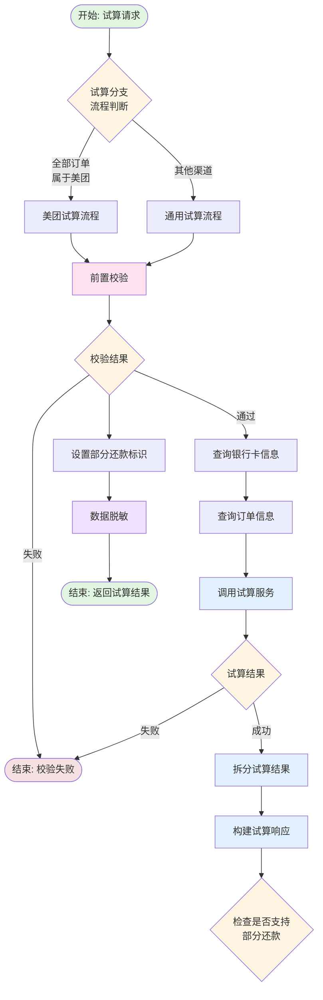
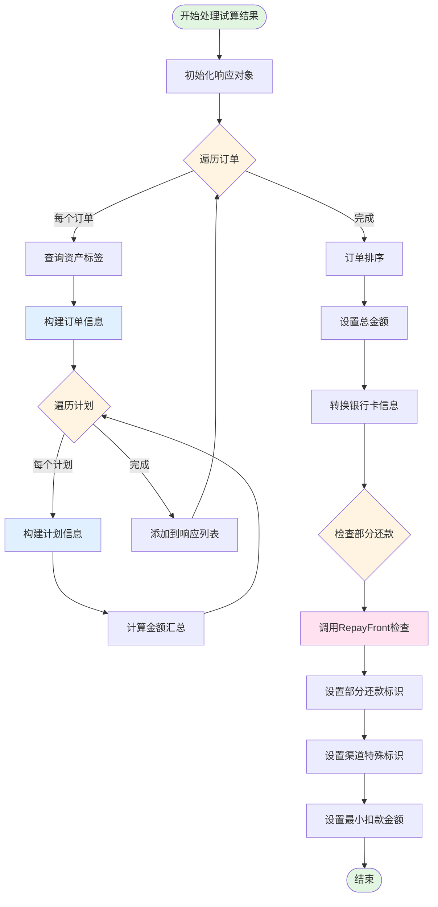
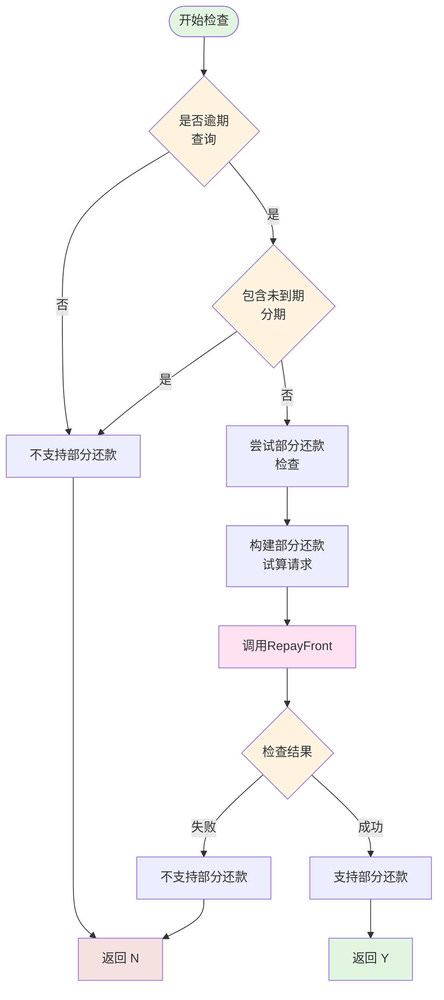
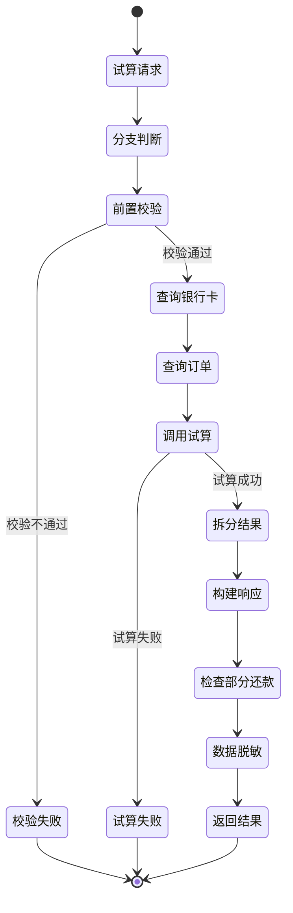

# 人工扣款试算流程 (manualDeductTrailFlow)

## 业务流概述

**BizKey:** `manualDeductTrailFlow`
**V15 Code:** `PF-custaccountmanualDeductTrailFlow_migrate`
**说明:** 人工扣款试算流程

**业务场景:**
运营人员在发起人工扣款前，先进行试算操作。试算会计算订单的应还金额（本金、利息、费用等），查询可用的银行卡，并判断是否支持部分还款。

---

## 流程架构图



---

## 流程节点详解

### 节点1: 试算分支判断

**节点编码:** `manualDeductTrailFlowDecideProcess`
**实现类:** `ManualDeductTrailFlowDecideProcess`
**Spring Bean:** `manualDeductTrailFlowDecideProcess`

**功能说明:**
根据订单渠道决定试算流程分支。

**分支规则:**

| 条件 | 分支 | 说明 |
|-----|------|------|
| 全部订单渠道 = MEITUAN | 美团试算流程 | 美团有独立的试算逻辑 |
| 其他渠道 | 通用试算流程 | 标准试算流程 |

---

### 节点2: 前置校验

**节点编码:** `manualDeductTrailPreCheckProcess`
**实现类:** `ManualDeductTrailPreCheckProcess`
**Spring Bean:** `manualDeductTrailPreCheckProcess`

**功能说明:**
试算前的业务规则校验。

**校验规则:**
1. 订单状态校验
2. 用户权限校验
3. 订单归属校验
4. 其他业务规则校验

**输入参数:**
- `ManualDeductContext.trailReq` - 试算请求

**输出:**
- 校验成功: 继续下一个节点
- 校验失败: 流程终止，返回错误

---

### 节点3: 查询银行卡信息

**节点编码:** `manualDeductCardProcess`
**实现类:** `ManualDeductCardProcess`
**Spring Bean:** `manualDeductCardProcess`

**功能说明:**
查询用户可用的银行卡信息，包括默认卡。

**处理逻辑:**
1. 调用卡引擎查询用户银行卡
2. 获取订单默认银行卡
3. 构建银行卡列表

**输出:**
- `ManualDeductContext.orderSupportCardMap` - 订单支持的银行卡映射
- `ManualDeductContext.orderDefaultCardMap` - 订单默认卡映射

**外部系统调用:**
- **CardEngine** - 查询银行卡信息

---

### 节点4: 查询订单信息

**节点编码:** `manualDeductOrderInfoQueryProcess`
**实现类:** `ManualDeductOrderInfoQueryProcess`
**Spring Bean:** `manualDeductOrderInfoQueryProcess`

**功能说明:**
查询订单详细信息，包括订单、计划、资产等信息。

**处理逻辑:**
1. 批量查询订单信息
2. 查询计划信息
3. 查询资产信息
4. 构建订单信息映射

**输出:**
- `ManualDeductContext.ordersInfoMap` - 订单信息映射
- `ManualDeductContext.planInfoMap` - 计划信息映射

**数据库交互:**
- 查询订单相关表

**外部系统调用:**
- **TNQ** - 查询订单信息

---

### 节点5: 调用试算服务

**节点编码:** `manualDeductTrailProcess`
**实现类:** `ManualDeductTrailProcess` (需要确认)
**Spring Bean:** `manualDeductTrailProcess`

**功能说明:**
调用试算服务计算还款金额。

**处理逻辑:**
1. 构建试算请求
2. 调用 RepayFront 试算接口
3. 获取试算结果

**试算内容:**
- 剩余本金
- 剩余利息
- 剩余费用
- 担保费（内部/外部）
- 提前结清手续费
- 逾期罚息
- 滞纳金
- 其他费用

**输出:**
- `ManualDeductContext.trailPlanInfoBos` - 试算计划信息列表

**外部系统调用:**
- **RepayFront** - 试算接口

---

### 节点6: 拆分试算结果

**节点编码:** `manualDeductTrailSpitProcess`
**实现类:** `ManualDeductTrailSpitProcess`
**Spring Bean:** `manualDeductTrailSpitProcess`

**功能说明:**
对试算结果进行拆分和处理。

**处理逻辑:**
1. 按订单拆分试算结果
2. 按计划拆分试算结果
3. 计算金额明细

---

### 节点7: 试算结果处理

**节点编码:** `manualDeductResultProcess`
**实现类:** `ManualDeductTrailResultProcess`
**Spring Bean:** `manualDeductResultProcess`

**功能说明:**
构建试算结果响应，包含订单信息、计划信息、银行卡信息等。

**输入参数:**
- `ManualDeductContext.ordersInfoMap` - 订单信息映射
- `ManualDeductContext.planInfoMap` - 计划信息映射
- `ManualDeductContext.trailPlanInfoBos` - 试算计划信息列表
- `ManualDeductContext.orderSupportCardMap` - 支持的银行卡映射
- `ManualDeductContext.orderDefaultCardMap` - 默认银行卡映射

**处理流程图:**



**关键代码逻辑:**

```java
// 1. 遍历试算结果，按订单分组
Map<String, List<TrailPlanInfoBo>> trailMap =
    trailPlanInfoBos.stream().collect(Collectors.groupingBy(TrailPlanInfoBo::getOrderNo));

// 2. 遍历每个订单
for (Map.Entry<String, List<TrailPlanInfoBo>> entry : trailMap.entrySet()) {
    String orderNo = entry.getKey();
    List<TrailPlanInfoBo> planList = entry.getValue();

    // 查询资产标签
    Map<Integer, AssetLabelDTO> labelMap = queryObtainTag(orderNo, assetId);

    // 构建订单信息
    ManualDeductionTrailResp.OrderInfo orderInfo = new ManualDeductionTrailResp.OrderInfo();
    orderInfo.setOrderNo(orderNo);
    orderInfo.setBusinessType(...);
    orderInfo.setChannel(...);

    // 遍历计划
    for (TrailPlanInfoBo planBo : planList) {
        // 构建计划信息
        ManualDeductionTrailResp.PlanInfo planInfo = buildPlanInfo(planBo, planInfoMap, labelMap);

        // 累加金额
        leftPrincipal = AmountUtil.null2ZeroAdd(leftPrincipal, planInfo.getLeftPrincipal());
        leftFee = AmountUtil.null2ZeroAdd(leftFee, planInfo.getLeftFee());
        // ... 其他金额累加
    }
}

// 3. 设置响应
trailResp.setOrderInfoList(orderInfoList);
trailResp.setDeductAmount(leftTotalAmount);
trailResp.setLeftPrincipal(leftPrincipal);
// ... 其他字段

// 4. 转换银行卡信息
List<CardVo> cardVos = convertCardVo(cardBos, orderDefaultCardMap);
trailResp.setCardVoList(cardVos);

// 5. 检查是否支持部分还款
String canPartDeduct = canPartDeduct(manualDeductContext, trailMap, orderInfoList);
trailResp.setCanPartDeduct(canPartDeduct);
```

**输出:**
- `ManualDeductContext.trailResp` - 试算响应对象

**试算响应结构:**

```java
ManualDeductionTrailResp {
    // 金额汇总
    deductAmount: Integer,           // 扣款金额
    leftTotalAmount: Integer,        // 剩余总金额
    leftPrincipal: Integer,          // 剩余本金
    leftFee: Integer,                // 剩余利息
    leftWarrantyFee: Integer,        // 剩余担保费
    leftEarlySettleFee: Integer,     // 剩余提前结清手续费
    leftLateFee: Integer,            // 剩余逾期罚息
    leftPentyFee: Integer,           // 剩余滞纳金
    leftCompFee: Integer,            // 剩余代偿费
    leftAmcFee: Integer,             // 剩余资产管理费

    // 订单列表
    orderInfoList: List<OrderInfo>,

    // 银行卡列表
    cardVoList: List<CardVo>,

    // 其他标识
    canPartDeduct: String,           // 是否支持部分还款 Y/N
    cardNumberBeEmpty: String,       // 卡号是否可以为空 Y/N
    minDeductAmount: Integer,        // 最小扣款金额
    operatorGroup: String            // 操作组
}
```

**外部系统调用:**
- **StandingBook** - 查询资产标签（`queryObtainTag`）
- **RepayFront** - 检查是否支持部分还款（`callRepayFront`）

---

### 节点8: 数据脱敏

**节点编码:** `manualDeductDataMaskingProcess`
**实现类:** `ManualDeductDataMaskingProcess`
**Spring Bean:** `manualDeductDataMaskingProcess`

**功能说明:**
对敏感数据进行脱敏处理。

**脱敏字段:**
- 银行卡号
- 身份证号
- 手机号
- 其他敏感信息

---

## 部分还款检查详解

### 检查逻辑

**方法:** `canPartDeduct()`

**判断规则:**



**关键代码:**

```java
private String canPartDeduct(ManualDeductContext context,
                             Map<String, List<TrailPlanInfoBo>> trailMap,
                             List<OrderInfo> orderInfoList) {
    boolean isOverdue = DeductTagEnum.O.name().equals(context.getTrailReq().getDeductTag());

    // 打包部分还款场景（逾期，且包含未到期分期），默认不支持
    for (OrderInfo orderInfo : orderInfoList) {
        List<PlanInfo> planInfoList = orderInfo.getPlanInfoList();
        Optional<Date> first = planInfoList.stream()
            .map(PlanInfo::getPmtDueDate)
            .filter(repayDate -> DateUtil.compareDate(repayDate, new Date()) > 0)
            .findFirst();
        if (first.isPresent() && isOverdue) {
            return Indicator.N.name(); // 不支持部分还款
        }
    }

    // 逾期查询，尝试部分还款
    return isOverdue ?
        (tryCanPartDeduct(context, trailMap) ? Indicator.Y.name() : Indicator.N.name()) :
        Indicator.N.name(); // 结清查询不支持部分还款
}
```

**试算检查:**

```java
private boolean tryCanPartDeduct(ManualDeductContext context,
                                Map<String, List<TrailPlanInfoBo>> trailMap) {
    // 构建试算请求（金额减半）
    List<RepayOrderVo> repayOrderVoList = new ArrayList<>();
    trailMap.forEach((k, v) -> {
        RepayOrderVo vo = new RepayOrderVo();
        vo.setOrderNo(k);
        vo.setUid(ordersInfoMap.get(k).getUid());

        List<StagePlanVo> stagePlanVos = v.stream().map(it -> {
            StagePlanVo planVo = new StagePlanVo();
            planVo.setPlanNo(it.getStagePlanNo());
            // 实还金额 = 剩余金额 / 2（模拟部分还款）
            planVo.setRepayAmount(it.getTotalLeftAmount() != null ?
                (int) Math.floor(it.getTrailLeftAmount() / 2) : 0);
            planVo.setLeftAmount(it.getTotalLeftAmount());
            // ... 其他字段
            return planVo;
        }).collect(Collectors.toList());

        vo.setStagePlanVos(stagePlanVos);
        repayOrderVoList.add(vo);
    });

    // 调用 RepayFront 检查
    try {
        checkCommonService.callRepayFront(RepayWay.MANUAL_DEDUCT, repayOrderVoList);
        return true; // 支持部分还款
    } catch (Exception e) {
        return false; // 不支持部分还款
    }
}
```

---

## 数据库交互

### 涉及的表

| 表名 | 用途 | 操作 |
|-----|------|------|
| `manual_deduction_flow` | 扣款流程记录 | SELECT |
| 订单相关表 | 查询订单信息 | SELECT |

---

## 外部系统调用

### RepayFront（还款前台）

**调用时机:**
1. 部分还款检查
2. 试算计算

**接口:**
- `checkCommonService.callRepayFront` - 业务规则校验
- 试算接口 - 计算还款金额

### TNQ（贷款系统）

**调用时机:**
- 查询订单信息

### CardEngine（卡引擎）

**调用时机:**
- 查询银行卡信息

### StandingBook（台账）

**调用时机:**
- 查询资产标签

---

## 业务状态流转



---

## 关键业务规则

### 规则1: 渠道分流

- 美团渠道 - 独立试算流程
- 其他渠道 - 通用试算流程

### 规则2: 部分还款支持

| 场景 | 是否支持部分还款 |
|-----|----------------|
| 结清查询（标签=A） | ❌ 不支持 |
| 逾期查询 + 包含未到期分期 | ❌ 不支持 |
| 逾期查询 + 全部逾期 | ✅ 可能支持（需RepayFront检查） |

### 规则3: 甜橙渠道特殊处理

- 甜橙渠道允许扣款卡号为空
- 其他渠道必须有扣款卡

### 规则4: 最小扣款金额

- 根据操作组配置最小扣款金额
- 低于最小金额不允许扣款

---

## 异常处理

### 异常1: 前置校验失败

**处理方式:** 直接返回错误，不继续后续流程

### 异常2: 订单不存在

**错误信息:** "订单不存在"
**处理方式:** 返回错误

### 异常3: 试算失败

**错误信息:** 试算服务返回的错误信息
**处理方式:** 返回错误

### 异常4: RepayFront 检查失败

**处理方式:**
- 部分还款检查失败时，设置 `canPartDeduct = N`

---

## 性能优化

### 1. 批量查询

订单信息、计划信息批量查询，避免 N+1 问题

### 2. 并行处理

多个订单的试算可以并行处理

### 3. 缓存优化

- 订单信息缓存
- 银行卡信息缓存

---

## 监控指标

| 指标 | 说明 | 目标值 |
|-----|------|-------|
| 试算成功率 | 试算成功占比 | > 99% |
| 平均响应时间 | 试算接口响应时间 | < 2s |
| RepayFront 调用成功率 | 检查成功率 | > 99% |

---

## 相关文档

- [项目工程结构](01-项目工程结构.md)
- [数据库结构](02-数据库结构.md)
- [人工扣款提交流程](manualDeductSubmitFlow.md)
- [还享花试算流程](enjoyManualDeductionTrail.md)

---

**文档版本:** v1.0
**最后更新:** 2025-02-24
**维护人员:** Claude Code
