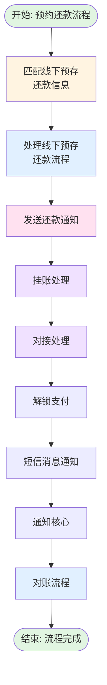
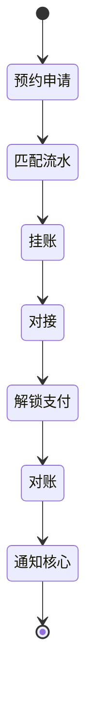

# 预约线下还款主流程 (offline_reserve_repay_process)

## 业务流概述

**BizKey:** `offline_reserve_repay_process`
**V15 Code:** `PF-custaccountoffline_reserve_repay_process_migrate`
**说明:** 预约线下还款主流程

**业务场景:**
用户预约线下还款后，系统自动匹配银行流水，完成还款入账流程。

---

## 流程架构图

---

## 流程节点

| 节点名称 | 节点编码 | 实现类 | 说明 |
|---------|---------|--------|------|
| 线下还款申请 | offlineRepayApplyProcess | OfflineRepayApplyProcess | 线下还款申请处理 |
| 线下还款结果 | offlineRepayResultProcess | OfflineRepayResultProcess | 线下还款结果处理 |
| 挂账 | offlineRepayChargeOffProcess | OfflineRepayChargeOffProcess | 挂账处理 |
| 对接 | offlineRepayDockingProcess | OfflineRepayDockingProcess | 对接处理 |
| 短信消息 | offlineRepaySmsMsgProcess | OfflineRepaySmsMsgProcess | 短信通知 |
| 通知核心 | offlineRepayNoticeCoreProcess | OfflineRepayNoticeCoreProcess | 核心通知 |
| 解锁支付 | offlineRepayUnlockPaymentProcess | OfflineRepayUnlockPaymentProcess | 解锁支付 |
| 对账流程 | stmtFlowProcess | StmtFlowProcess | 对账处理 |

---

## 流程详解

### 节点1: 线下还款申请

**实现类:** `OfflineRepayApplyProcess`

**功能说明:**
处理线下还款申请，创建工单记录。

**数据库交互:**
- INSERT `offline_repay_work_order`
- INSERT `offline_repay_order_info`

---

### 节点2: 线下还款结果

**实现类:** `OfflineRepayResultProcess`

**功能说明:**
处理线下还款结果，更新工单状态。

**数据库交互:**
- UPDATE `offline_repay_work_order`

---

### 节点3: 挂账

**实现类:** `OfflineRepayChargeOffProcess`

**功能说明:**
将还款金额挂账处理，记录到挂账日志。

**数据库交互:**
- INSERT `charge_off_trans_log`
- INSERT `charge_off_work_order`

**业务状态:**
- `offline_repay_work_order.status` → CHARGED_OFF

---

### 节点4: 对接

**实现类:** `OfflineRepayDockingProcess`

**功能说明:**
与核心系统对接，同步还款信息。

**外部系统调用:**
- 核心系统 - 同步还款

---

### 节点5: 短信消息

**实现类:** `OfflineRepaySmsMsgProcess`

**功能说明:**
发送短信通知用户。

**消息类型:**
- 还款成功通知
- 还款失败通知

---

### 节点6: 通知核心

**实现类:** `OfflineRepayNoticeCoreProcess`

**功能说明:**
通知核心系统还款完成。

**外部系统调用:**
- 核心系统 - 通知接口

---

### 节点7: 解锁支付

**实现类:** `OfflineRepayUnlockPaymentProcess`

**功能说明:**
解锁支付功能，允许用户继续操作。

---

### 节点8: 对账流程

**实现类:** `StmtFlowProcess`

**功能说明:**
生成对账记录。

**数据库交互:**
- INSERT `reconciliation`
- INSERT `reconciliation_operation_log`

---

## 数据库交互

### 涉及的表

| 表名 | 用途 | 操作 |
|-----|------|------|
| `offline_repay_work_order` | 线下还款工单 | INSERT, UPDATE |
| `offline_repay_order_info` | 订单信息 | INSERT, UPDATE |
| `offline_repay_reserve_info` | 预存信息 | SELECT, UPDATE |
| `offline_repay_reserve_process` | 预存流程 | INSERT, UPDATE |
| `charge_off_trans_log` | 挂账交易日志 | INSERT |
| `charge_off_work_order` | 挂账工单 | INSERT |
| `reconciliation` | 对账记录 | INSERT |
| `bank_trans_flow_info` | 银行流水 | SELECT, UPDATE |

---

## 外部系统调用

| 系统 | 接口 | 说明 |
|-----|------|------|
| 核心系统 | 对接接口 | 同步还款信息 |
| 核心系统 | 通知接口 | 通知还款完成 |
| 短信系统 | 发送短信 | 发送用户通知 |

---

## 业务状态流转

---

## 相关调度任务

| 任务名称 | 说明 |
|---------|------|
| MatchOfflineReserveRepayInfoJob | 匹配预存信息与银行流水 |
| HandleOfflineReserveRepayProcessJob | 处理匹配后的预存流程 |
| SyncReserveInfoFromLoanJob | 从贷款系统同步预存信息 |
| EmailOfflineReserveRepayInfoJob | 预存还款邮件通知 |
| OfflineReserveRepayNotifyJob | 预存还款失效提醒 |

---

## 关键业务规则

### 规则1: 预存信息匹配

- 根据用户ID、金额、时间匹配银行流水
- 匹配成功后锁定流水
- 防止重复匹配

### 规则2: 挂账规则

- 还款金额先挂账
- 后续通过销账流程处理
- 记录详细的挂账日志

### 规则3: 对账规则

- 每笔还款生成对账记录
- 记录对账差异
- 支持对账修复

---

## 异常处理

### 异常1: 流水匹配失败

**处理方式:** 等待下次调度任务重新匹配

### 异常2: 对接失败

**处理方式:** 记录错误，等待重试

### 异常3: 挂账失败

**处理方式:** 回滚流程，记录错误

---

## 监控指标

| 指标 | 说明 | 目标值 |
|-----|------|-------|
| 匹配成功率 | 流水匹配成功占比 | > 95% |
| 平均处理时长 | 从匹配到对账完成时间 | < 24h |
| 对账差异率 | 对账差异占比 | < 1% |

---

## 相关文档

- [项目工程结构](01-项目工程结构.md)
- [数据库结构](02-数据库结构.md)
- [调度任务索引](04-调度任务索引.md)

---

**文档版本:** v1.0
**最后更新:** 2025-02-24
