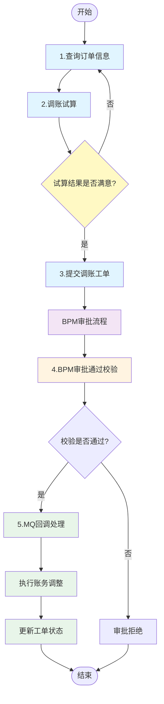
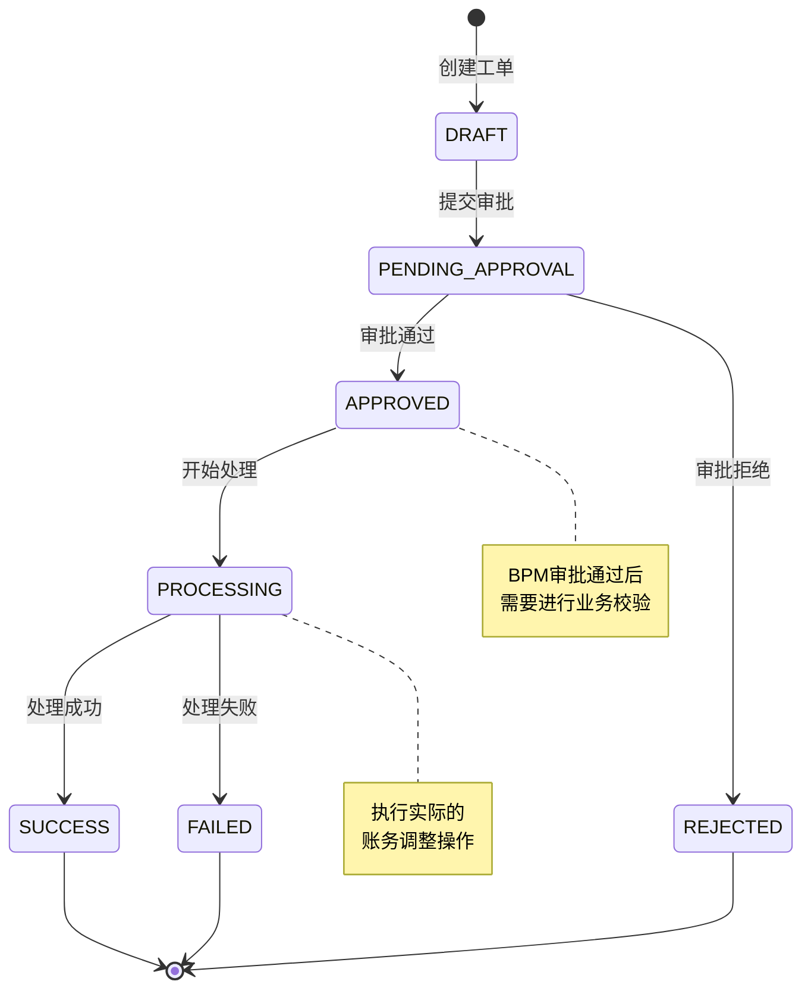

# 工单调账核心流程

## 流程概述

工单调账（Account Adjust Work Order）是会计核算运营系统中用于处理客户账务调整的核心功能。该流程支持**调增**和**调减**两种操作方向，通过 BPM 审批流系统进行审批，审批通过后执行实际的账务调整。

**业务场景**:
- 客户账务异常需要调整
- 系统错误导致账务数据需要修正
- 业务规则变更需要批量调整账务
- 客户投诉处理需要调整账务

**流程目标**:
- 确保调账操作的合规性和可追溯性
- 通过审批流程控制调账权限
- 保证账务调整的数据一致性

**涉及系统模块**:
- accountingoperation (会计核算运营系统)
- flowplus (BPM审批流系统)
- tnq-bill (订单账单系统)
- 消息队列 (RabbitMQ)

---

## 流程图

### 完整业务流程



### 状态流转图



---

## 涉及接口列表

| 序号 | 接口名称 | 路径 | 方法 | 详细文档 |
|------|---------|------|------|---------|
| 1 | 查询订单信息 | `/customerAccountAdjust/queryCustomerOrderInfo` | POST | 见下方接口详情 |
| 2 | 调账试算 | `/customerAccountAdjust/trial` | POST | 见下方接口详情 |
| 3 | 提交调账工单 | `/customerAccountAdjust/startWorkOrder` | POST | 见下方接口详情 |
| 4 | BPM审批校验 | `/accountAdjust/bpmApprovedCheck` | GET | 见下方接口详情 |

### 接口调用顺序

```
queryCustomerOrderInfo (查询订单)
       ↓
trial (调账试算，可多次调用)
       ↓
startWorkOrder (提交工单)
       ↓
[BPM审批流程，异步]
       ↓
bpmApprovedCheck (审批通过后回调校验)
       ↓
[MQ消息回调]
       ↓
执行账务调整
```

---

## 接口详情

### 1. 查询订单信息

**接口路径**: `POST /customerAccountAdjust/queryCustomerOrderInfo`

**Controller**: `CustomerAccountAdjustController:52-55`

**Service**: `CustomerAccountAdjustService.queryCustomerOrderInfo():303`

**核心处理逻辑**:
1. 参数校验
2. 部门权限校验
3. 客户策略数据增强 (客服/Ares请求)
4. 调用 `TnqBillClientProxy` 查询订单信息
5. 处理订单信息与调账试算

**数据库操作**:
- 查询 `tnq_bill` 系统获取订单账单信息

**外部调用**:
- `TnqBillClientProxy.getByUidBillsV2()` - 查询订单账单信息

---

### 2. 调账试算

**接口路径**: `POST /customerAccountAdjust/trial`

**Controller**: `CustomerAccountAdjustController:63-67`

**Service**: `CustomerAccountAdjustService.customerTrial():465`

**核心处理逻辑**:
1. 入参校验
2. 获取试算订单
3. 执行试算逻辑，计算调整后的金额

**用途**:
- 在提交工单前，模拟调账操作对订单金额的影响
- 支持前端实时预览调账结果

---

### 3. 提交调账工单

**接口路径**: `POST /customerAccountAdjust/startWorkOrder`

**Controller**: `CustomerAccountAdjustController:69-73`

**Service**: `CustomerAccountAdjustService.startWorkOrder():736`

**核心处理逻辑**:
1. **参数校验** (`checkParamStartWorkOrderReq:2181`)
2. **获取外部确认场景** (`getConfirmScence:876`)
3. **查询订单信息** (`getOrderList`)
4. **金额校验** (`checkAdjustAmount:2823`)
5. **订单校验** (`checkAdjustOrder:833`)
6. **组件过滤** (`filterComponent:2243`)
7. **构建调账业务对象** (`buildAccountAdjustBoByCustomer`)
8. **提交 BPM 工单**

**数据库操作**:
- 插入 `account_adjust_work_order` - 工单信息表
- 插入 `account_adjust_trans_log` - 交易日志表

**外部调用**:
- `FlowPlusRpcService.startWorkOrder()` - 提交BPM工单
- `TnqBillClientProxy.getByUidBillsV2()` - 查询订单信息

---

### 4. BPM审批校验

**接口路径**: `GET /accountAdjust/bpmApprovedCheck`

**Controller**: `AccountAdjustController:90-96`

**Service**: `AccountAdjustService.bpmApprovedCheck():3196`

**核心处理逻辑**:
1. 根据任务号查询工单信息
2. 校验工单是否存在
3. 查询交易日志
4. 校验交易日志
5. 验证订单信息
6. 检查调增调减金额

**校验内容**:
- 调账金额合法性
- 订单状态是否变更
- 分期信息是否一致
- 调增金额不能大于调减总金额

**数据库操作**:
- 查询 `account_adjust_work_order` 表
- 查询 `account_adjust_trans_log` 表

---

## 涉及业务流

### BPM 审批流

**业务流类型**: BPM审批流 (FlowPlus)

**触发时机**: 提交调账工单后

**审批节点**:
1. 经办人提交
2. 审批人审批
3. 审批通过回调校验 (`bpmApprovedCheck`)
4. 校验通过后发送MQ消息

**工单类型**: `CUSTOMER_ACCOUNT_ADJUST`

---

## MQ消息配置

### 消息配置

**Exchange**: `flowplus.exchange.workOrder2`

**RoutingKey**: `customer_adjust.STATUS_APPROVED`

**Queue**: `accountingoperation.queue.receiveFlowplusMessage`

**配置文件**: `applicationContext.xml:80-84`

```xml
<cjjrabbit:queue name="accountingoperation.queue.receiveFlowplusMessage"/>
<rabbit:topic-exchange name="flowplus.exchange.workOrder2">
    <rabbit:bindings>
        <rabbit:binding queue="accountingoperation.queue.receiveFlowplusMessage"
                        pattern="customer_adjust.#"/>
    </rabbit:bindings>
</rabbit:topic-exchange>
```

### 消息格式

**消息类**: `FlowplusWorkOrderMsg`

**路径**: `accountingoperation-common/src/main/java/cn/caijiajia/accountingoperation/common/msg/FlowplusWorkOrderMsg.java`

```java
public class FlowplusWorkOrderMsg {
    private String workOrderNo;      // 工单号
    private String orderNo;          // 任务号
    private String operator;         // 审核人
    private String status;           // 工单状态(APPROVED=审批通过)
    private String orderType;        // 工单类型(CUSTOMER_ACCOUNT_ADJUST)
    private String rejectReason;     // 踢退原因
    private String operatorUid;      // 工单发起人
    private String startUid;         // 工单发起人
}
```

### 消费者处理

**消费者类**: `AccountingoperationConsumer`

**方法**: `receiveFlowplusMessage(String message):97`

**处理流程**:
1. 解析 MQ 消息为 `FlowplusWorkOrderMsg` 对象
2. 根据 `orderType` 分发到对应处理器
3. 调用 `AccountAdjustService.onReceiveFlowPlusMessage():2819`
4. 执行回调处理 `callback():2469`
5. 获取分布式锁
6. 根据工单状态执行相应操作:
   - `APPROVED`: 执行调账操作
   - `REJECTED`: 标记工单为已拒绝

---

## 数据库交互

### 涉及的数据表

#### account_adjust_work_order
调账工单信息表

```sql
CREATE TABLE account_adjust_work_order (
    id                    BIGINT PRIMARY KEY,
    work_order_no         VARCHAR(64)  NOT NULL COMMENT '工单号',
    task_no               VARCHAR(64)  COMMENT 'BPM任务号',
    uid                   VARCHAR(32)  NOT NULL COMMENT '客户UID',
    adjust_direction      VARCHAR(16)  NOT NULL COMMENT '调整方向(UP/DOWN)',
    adjust_type           VARCHAR(64)  COMMENT '调整类型',
    adjust_reason         VARCHAR(255) COMMENT '调整原因',
    total_adjust_amount   INT          COMMENT '总调整金额(分)',
    work_order_status     VARCHAR(32)  NOT NULL COMMENT '工单状态',
    annex_paths           TEXT         COMMENT '附件路径(JSON数组)',
    operator              VARCHAR(64)  COMMENT '操作人',
    create_time           DATETIME     NOT NULL DEFAULT CURRENT_TIMESTAMP,
    update_time           DATETIME     NOT NULL DEFAULT CURRENT_TIMESTAMP ON UPDATE CURRENT_TIMESTAMP,
    INDEX idx_work_order_no (work_order_no),
    INDEX idx_task_no (task_no),
    INDEX idx_uid (uid)
) COMMENT '调账工单信息表';
```

#### account_adjust_trans_log
调账交易日志表

```sql
CREATE TABLE account_adjust_trans_log (
    id                    BIGINT PRIMARY KEY,
    work_order_no         VARCHAR(64)  NOT NULL COMMENT '工单号',
    stage_order_no        VARCHAR(64)  NOT NULL COMMENT '订单号',
    stage_plan_no         VARCHAR(64)  COMMENT '分期号',
    raw_amount            INT          COMMENT '原始金额(分)',
    adjust_amount         INT          COMMENT '调整金额(分)',
    adjust_direction      VARCHAR(16)  COMMENT '调整方向',
    fee                   INT          DEFAULT 0 COMMENT '费用(分)',
    interest              INT          DEFAULT 0 COMMENT '利息(分)',
    late_fee              INT          DEFAULT 0 COMMENT '逾期费用(分)',
    warranty_fee          INT          DEFAULT 0 COMMENT '担保费(分)',
    amc_fee               INT          DEFAULT 0 COMMENT 'AMC费用(分)',
    early_settle_fee      INT          DEFAULT 0 COMMENT '提前结清手续费(分)',
    extend               TEXT         COMMENT '扩展信息(JSON)',
    create_time           DATETIME     NOT NULL DEFAULT CURRENT_TIMESTAMP,
    INDEX idx_work_order_no (work_order_no),
    INDEX idx_stage_order_no (stage_order_no)
) COMMENT '调账交易日志表';
```

### 数据流转

```
查询订单 (tnq_bill系统)
    ↓
提交工单 (account_adjust_work_order)
    ↓
交易日志 (account_adjust_trans_log)
    ↓
BPM审批 (flowplus系统)
    ↓
审批通过 (校验订单状态)
    ↓
执行调账 (更新账务系统)
    ↓
更新工单状态 (account_adjust_work_order)
```

---

## 关键业务规则

### 调整方向 (DirectionEnum)

| 枚举值 | 说明 | 业务含义 |
|--------|------|----------|
| UP | 调增 | 增加客户应还金额 |
| DOWN | 调减 | 减少客户应还金额 |

### 调整范围 (AdjustExceedEnum)

- 指定调整的金额成分范围
- 可以包含本金、利息、费用、逾期费用等

### 请求类型 (RequestTypeEnum)

| 枚举值 | 说明 | 使用场景 |
|--------|------|----------|
| O | 客服请求 | 客服系统发起 |
| C | Ares请求 | Ares系统发起 |
| R | 贷后请求 | 贷后系统发起 |
| RD | 贷后预约还款 | 贷后预约还款场景 |

### 确认场景 (ConfirmScenceEnum)

- 某些调账操作需要外部确认(如资方确认)
- 影响工单审批流程

### 金额校验规则

1. **调账金额必须大于0**: 本次调账金额不能为0
2. **最大可调金额限制**: 不能超过系统配置的最大可调金额
3. **调增不能大于调减**: 同一工单中，调增金额不能大于调减总金额
4. **订单状态一致性**: 订单状态从查询到提交不能发生变化

---

## 异常处理

### 异常场景

| 异常场景 | 错误码 | 处理方式 |
|---------|--------|----------|
| 工单不存在 | 12001 | 提示工单不存在，建议踢退或联系开发 |
| 订单号不能为空 | 999 | 前端校验，提示必填 |
| 调账金额为0 | - | 后端校验，抛出异常 |
| 订单状态变更 | - | 提示订单已变化，请重新查询 |
| 超过最大可调金额 | - | 提示超过可调金额上限 |
| BPM审批拒绝 | - | 标记工单为已拒绝，记录拒绝原因 |

### 回滚机制

1. **工单提交失败**: 不创建数据库记录
2. **BPM审批失败**: 工单状态标记为已拒绝
3. **账务调整失败**:
   - 工单状态标记为处理失败
   - 记录失败原因
   - 支持人工重试

---

## 关键代码路径

### Controller 层

**CustomerAccountAdjustController**
- 路径: `accountingoperation/src/main/java/cn/caijiajia/accountingoperation/controller/CustomerAccountAdjustController.java`
- 接口:
  - `queryCustomerOrderInfo():52` - 查询订单信息
  - `customerTrial():63` - 调账试算
  - `startWorkOrder():69` - 提交调账工单

**AccountAdjustController**
- 路径: `accountingoperation/src/main/java/cn/caijiajia/accountingoperation/controller/AccountAdjustController.java`
- 接口:
  - `bpmApprovedCheck():90` - BPM审批校验

### Service 层

**CustomerAccountAdjustService**
- 路径: `accountingoperation/src/main/java/cn/caijiajia/accountingoperation/service/accountadjust/customer/CustomerAccountAdjustService.java`
- 方法:
  - `queryCustomerOrderInfo():303` - 查询订单信息
  - `customerTrial():465` - 调账试算
  - `startWorkOrder():736` - 提交调账工单
  - `checkParamStartWorkOrderReq():2181` - 参数校验
  - `checkAdjustAmount():2823` - 金额校验

**AccountAdjustService**
- 路径: `accountingoperation/src/main/java/cn/caijiajia/accountingoperation/service/accountadjust/AccountAdjustService.java`
- 方法:
  - `bpmApprovedCheck():3196` - BPM审批校验
  - `onReceiveFlowPlusMessage():2819` - MQ消息处理
  - `callback():2469` - 回调处理

### Consumer 层

**AccountingoperationConsumer**
- 路径: `accountingoperation/src/main/java/cn/caijiajia/accountingoperation/consumer/AccountingoperationConsumer.java`
- 方法:
  - `receiveFlowplusMessage():97` - MQ消息消费

### 消息对象

**FlowplusWorkOrderMsg**
- 路径: `accountingoperation-common/src/main/java/cn/caijiajia/accountingoperation/common/msg/FlowplusWorkOrderMsg.java`

---

## 相关文档

- [核心流程索引](../06-核心流程索引.md)
- [项目工程结构](../01-项目工程结构.md)
- [数据库结构](../02-数据库结构.md)
- [接口流程索引](../03-接口流程索引.md)
- [业务流索引](../05-业务流索引.md)

---

## 更新记录

| 日期 | 版本 | 说明 |
|------|------|------|
| 2025-02-24 | v1.0 | 初始版本，创建工单调账核心流程文档 |
| 2025-02-24 | v1.1 | 优化文档结构，符合核心流程文档规范 |
