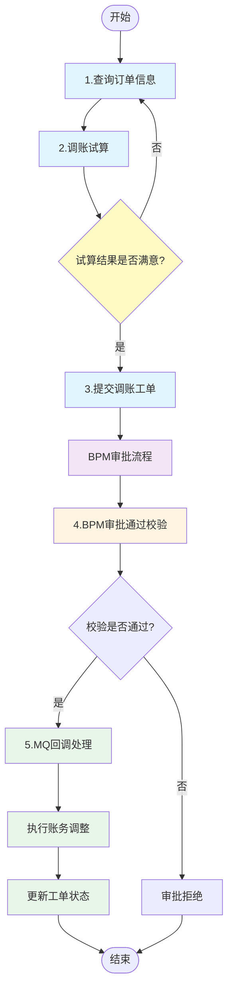
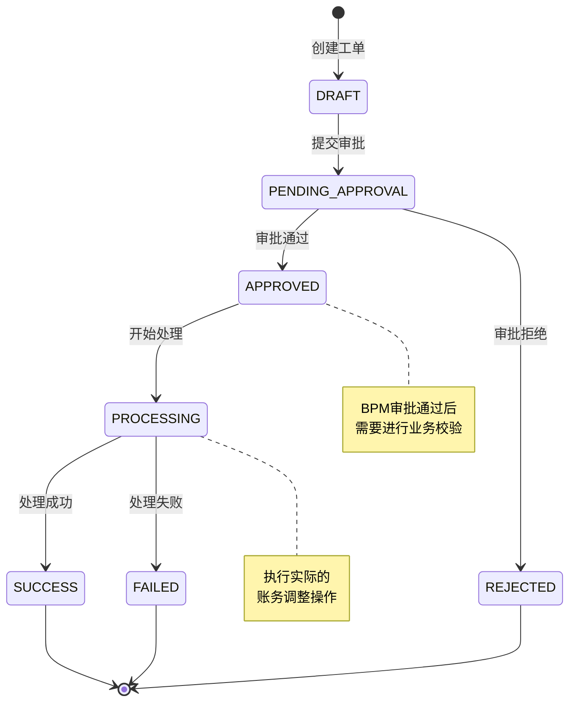

# 工单调账核心流程

## 流程概述

工单调账（Account Adjust Work Order）是会计核算运营系统中用于处理客户账务调整的核心功能。该流程支持**调增**和**调减**两种操作方向，通过 BPM 审批流系统进行审批，审批通过后执行实际的账务调整。

**业务场景**:
- 客户账务异常需要调整
- 系统错误导致账务数据需要修正
- 业务规则变更需要批量调整账务
- 客户投诉处理需要调整账务

**流程目标**:
- 确保调账操作的合规性和可追溯性
- 通过审批流程控制调账权限
- 保证账务调整的数据一致性

**涉及系统模块**:
- accountingoperation (会计核算运营系统)
- flowplus (BPM审批流系统)
- tnq-bill (订单账单系统)
- 消息队列 (RabbitMQ)

---

## 流程图

### 完整业务流程



### 状态流转图



---

## 涉及接口列表

| 序号  | 接口名称    | 路径                                              | 方法   | 详细文档    |
| --- | ------- | ----------------------------------------------- | ---- | ------- |
| 1   | 查询订单信息  | `/customerAccountAdjust/queryCustomerOrderInfo` | POST | [[03-接口流程详情/工单调账/queryCustomerOrderInfo-查询订单信息]] |
| 2   | 调账试算    | `/customerAccountAdjust/trial`                  | POST | [[03-接口流程详情/工单调账/customerTrial-调账试算]] |
| 3   | 提交调账工单  | `/customerAccountAdjust/startWorkOrder`         | POST | [[03-接口流程详情/工单调账/startWorkOrder-提交调账工单]] |
| 4   | BPM审批校验 | `/accountAdjust/bpmApprovedCheck`               | GET  | [[03-接口流程详情/工单调账/bpmApprovedCheck-BPM审批校验]] |

### 接口调用顺序

```
queryCustomerOrderInfo (查询订单)
       ↓
trial (调账试算，可多次调用)
       ↓
startWorkOrder (提交工单)
       ↓
[BPM审批流程，异步]
       ↓
bpmApprovedCheck (审批通过后回调校验)
       ↓
[MQ消息回调]
       ↓
执行账务调整
```

---

## 接口详情

### 1. 查询订单信息

**接口路径**: `POST /customerAccountAdjust/queryCustomerOrderInfo`

**Controller**: `CustomerAccountAdjustController:52-55`

**Service**: `CustomerAccountAdjustService.queryCustomerOrderInfo():303-320`

**详细文档**: [[03-接口流程详情/工单调账/queryCustomerOrderInfo-查询订单信息]]

#### 请求参数（QueryCustomerOrderInfoReq）

| 字段 | 类型 | 必填 | 说明 |
|------|------|------|------|
| requestType | RequestTypeEnum | 是 | 请求来源：O-运营，C-客服，R-贷后，RD-预约还款，N-协商还款 |
| phone | String | 条件 | 手机号（O系统4选1） |
| uid | String | 条件 | 用户ID（C/R/RD系统必传，O系统4选1） |
| customerNo | String | 条件 | 客户号（O系统4选1） |
| orderNo | String | 条件 | 订单号（N系统必传，O系统4选1） |
| availableAdjustAmount | Integer | 条件 | 剩余可用额度（R系统必传，单位：分） |
| handledId | Long | 条件 | 经办ID（R系统必传） |
| adjustExceed | AdjustExceedEnum | 否 | 调整范围：ALL/OVERDUE/NOT_OVERDUE |
| orderType | AjustOrderTypeEnum | 否 | 调整产品：ALL/ORDER/STMT |
| adjustDirection | DirectionEnum | 否 | 调账方向：DOWN/UP |
| adjustType | String | 否 | 调整分类 |
| orderNoList | List\<String\> | 否 | 调整订单号列表（预约线下还款场景） |
| internalHandleId | String | 否 | 内部经办ID |

#### 响应参数（QueryCustomerOrderInfoResp）

| 字段 | 类型 | 说明 |
|------|------|------|
| uidMaxAdjustAmount | Integer | 用户最高可调减金额（分） |
| orderMaxAdjustAmount | Integer | 订单最高可调减金额汇总（分） |
| uid | String | 用户ID |
| expireDayAutoAdjust | Integer | 约定期内（天）未还款自动调增 |
| riskAmountRate | Integer | 推荐金额比例（百分比） |
| riskExceedAmount | Integer | 调整范围对应的金额（分） |
| containExceedPlan | Boolean | 是否包含逾期订单 |
| orderInfoList | List\<OrderInfoResp\> | 订单信息列表（含分期、成分明细） |

#### 核心处理逻辑
1. **参数校验**（checkParamQueryCustomerOrderInfoReq:1372）— 按 requestType 分类校验
2. **部门权限校验**（getDepartmentAuthority）
3. **客户策略数据增强**（enhanceAresCustomerInfo:514）— C/R 请求调用贷后系统
4. **查询订单信息**（getOrderList:394）— 三阶段过滤：无可调成分 → 前置过滤 → 业务过滤
5. **获取调减规则**（getAdjustRuleAndFilterCapitalRule:659）— 调用资金配置中心 + 算费服务
6. **调账试算**（getAdjustRuleAndTrail:2080）— adjustAmount > 0 时执行
7. **构建响应并排序**（orderSort:1903）— 逾期订单优先，早申请订单优先

#### 数据库操作
- 纯查询，不写数据库；数据来源均为外部 RPC

#### 外部调用

| 系统 | 接口 | 说明 |
|------|------|------|
| TnqBill 贷款系统 | `TnqBillClientV2.tnqBillV2` | 查询订单及分期信息 |
| TnqBill 贷款系统 | `TnqBillClientV2.getMaxOverDueDays` | 获取客户最大逾期天数 |
| 贷后系统（Ares） | `ReductionProx.getFrontDataAndCheckCustomer` | 获取减免前置数据（C/R 请求） |
| 资金配置中心 | `AccountAdjustService.filterCapitalRuleByCustomer` | 过滤不可调减成分 |
| 算费服务 | `AccountAdjustV1Service.getDownAdjustRule` | 获取调减规则（成分百分比） |
| 算费服务 | `AccountAdjustV1Service.getAdjustRuleAndTrail` | 调账试算 |

---

### 2. 调账试算

**接口路径**: `POST /customerAccountAdjust/trial`

**Controller**: `CustomerAccountAdjustController:63-67`

**Service**: `CustomerAccountAdjustService.customerTrial():465`

**详细文档**: [[03-接口流程详情/工单调账/customerTrial-调账试算]]

#### 请求参数（CustomerTrialReq）

| 字段 | 类型 | 必填 | 说明 |
|------|------|------|------|
| requestType | RequestTypeEnum | 是 | 请求来源类型 |
| adjustExceed | AdjustExceedEnum | 是 | 调整范围（O-逾期/U-逾期+M0/A-全部） |
| adjustDirection | DirectionEnum | 是 | 调账方向：UP/DOWN |
| adjustType | String | 是 | 调整分类 |
| orderInfoList | List\<AdjustOrderTrialReq\> | 是 | 调整订单列表（含分期号） |
| handledId | Long | 否 | 经办ID（R/C 请求传入） |
| availableAdjustAmount | Integer | 否 | 剩余可用额度（分） |
| exceedStatusAmount | Integer | 否 | 调整范围对应的金额（分） |
| adjustTotalAmount | Integer | 否 | 本次调整总金额（不传则查最大可减免） |
| orderType | AjustOrderTypeEnum | 否 | 调整产品类型 |
| internalHandleId | String | 否 | 内部经办ID |

#### 响应参数
与查询订单信息响应结构相同（`QueryCustomerOrderInfoResp`），包含各分期调整前/调整/调整后的成分明细。

#### 核心处理逻辑
1. **入参校验**（checkParamTrailReq + 部门权限 + 调增不支持多笔校验）
2. **获取试算订单**（filterCustomerTrialOrderList）— 按分期号过滤前端指定分期
3. **贷后策略增强**（enhanceAresCustomerInfo）— R/RD 非特殊减免时调用
4. **处理订单试算**（handleOrderAndAdjustTrial）— 订单过滤 → 获取调减规则 → 执行试算

**关键业务规则**:
- 调增方向（UP）时，`orderInfoList` 只允许传一笔订单
- 特殊减免（SPECIAL_REDUCE）不依赖贷后策略
- `adjustTotalAmount` 不传时取最大可减免值

**数据库操作**: 纯查询/计算接口，不写入数据库

#### 外部调用

| 系统 | 接口 | 说明 |
|------|------|------|
| TnqBill 贷款系统 | `TnqBillClientProxy.findByUidBillsV2` | 按订单号查询账单数据 |
| 贷后系统（Ares） | `ReductionProx.getFrontDataAndCheckCustomer` | 获取贷后减免前置数据 |
| 资金配置中心 | `AccountAdjustService.filterCapitalRuleByCustomer` | 过滤资金规则 |
| 算费服务 | `AccountAdjustV1Service.getDownAdjustRule` | 获取成分百分比调减规则 |
| 算费服务 | `AccountAdjustV1Service.getAdjustRuleAndTrail` | 执行试算，计算各分期减免金额 |

---

### 3. 提交调账工单

**接口路径**: `POST /customerAccountAdjust/startWorkOrder`

**Controller**: `CustomerAccountAdjustController:69-73`

**Service**: `CustomerAccountAdjustService.startWorkOrder():736`

**详细文档**: [[03-接口流程详情/工单调账/startWorkOrder-提交调账工单]]

#### 请求参数（StartWorkOrderReq）

| 字段 | 类型 | 必填 | 说明 |
|------|------|------|------|
| requestType | RequestTypeEnum | 是 | 请求类型 |
| adjustDirection | DirectionEnum | 是 | 调账方向：UP/DOWN |
| adjustType | String | 是 | 调整分类 |
| adjustReason | String | 是 | 调账原因 |
| adjustTotalAmount | Integer | 是 | 本次调账总金额（>0，单位：分） |
| adjustExceed | AdjustExceedEnum | 是 | 调整范围 |
| description | String | 是 | 减免说明 |
| orderInfoList | List\<AccountAdjustTrial\> | 是 | 调整订单列表（含分期、成分明细） |
| handledId | Long | 条件 | 经办人ID（R/RD 必填） |
| riskAmountRate | Integer | 条件 | 推荐金额比例（R 且非特殊减免时必填） |
| riskExceedAmount | Integer | 条件 | 调整范围对应金额（R 且非特殊减免时必填） |
| expireDayAutoAdjust | Integer | 否 | 约定期内自动调增天数 |
| annexPaths | List\<String\> | 否 | 附件路径列表 |
| annexSource | String | 否 | 附件来源 |
| bizSerial | String | 否 | 业务流水号（赋强公证场景由 RD 传入） |
| operator | String | 否 | 发单人 |
| realOperator | String | 否 | 实际操作人 |

#### 响应参数（StartWorkOrderResp）

| 字段 | 类型 | 说明 |
|------|------|------|
| workOrderNo | String | 调账工单号 |
| bpmNo | String | BPM 审批流工单号 |
| orderComponentsInfos | List\<OrderComponentsInfo\> | 订单调整明细列表 |

**OrderComponentsInfo 字段**：订单号、应还金额、调整前剩余未还、调整金额、调整后应还、调整后剩余未还、成分明细。

#### 核心处理逻辑
1. **参数校验**（checkParamStartWorkOrderReq:2181）
2. **获取外部确认场景**（getConfirmScence:876）— 赋强公证等场景校验
3. **过滤调账成分**（filterComponent:2243）— 移除无成分/调减为0的订单
4. **查询订单信息**（TnqBillClientProxy.findByUidBillsV2）
5. **协商还款校验**（validNegotiateOrder）
6. **Redis分布式加锁**（Key: `ADJUST_KEY:uid`）
7. **分期并发校验**（validConcurrencyAndBackTotalLeftPrin）— 过滤已结清+校验分期变化
8. **业务规则多维校验**（checkAdjustOrder:833）— 见下表
9. **构建工单BO**（buildAccountAdjustBoByCustomer）
10. **写入数据库**（accountAdjustProxy.saveAccountAdjustRecord）
11. **解分布式锁**
12. **更新工单状态** → `APPROVING`
13. **发起BPM审批流**（FlowplusRpcService.startAccountAdjustProcessByCustomer）
14. **更新工单taskNo**（BPM成功），或更新为 `EXCEPTION`（BPM失败）
15. **赋强公证锁单**（FPN_CONFIRM 场景，调用 AccountingClient.apply）

#### checkAdjustOrder 业务规则校验

| 校验项 | 方法 | 说明 |
|--------|------|------|
| 重新试算最大可调金额 | checkAdjustAmount | DOWN 方向 + 灰度开关开启时执行 |
| 不允许调账的资方 | checkByBank | 资方黑名单校验 |
| 被诈骗客户校验 | checkCheatedUsersByCustomer | 特定调整分类不允许对诈骗客户调账 |
| 还款中分期状态 | checkStagePlanStatusByCustomer | payFlag='Y' 不允许调账 |
| 订单分期状态 | checkOrderPlanStatusByCustomer | 出让/核销/核销处理中不能调账 |
| 灵活还款产品 | checkSupportAnyRepayIndByCustomer | 灵活还款产品不支持调账 |
| 资金配置中心规则 | checkCapitalRulByCustomer | 资金配置中心规则校验 |
| 调账中状态 | accountAdjustCheckByCustomer | 已有进行中工单则拒绝 |
| 系统规则校验 | checkAdjustAccountSubmitDataByCustomer | 调账提交数据规则校验 |

#### 数据库操作

| 操作 | 表 | 说明 |
|------|-----|------|
| INSERT | `account_adjust_work_order` | 创建调账工单记录 |
| UPDATE | `account_adjust_work_order` | 更新工单状态为 APPROVING |
| UPDATE | `account_adjust_work_order` | 更新 BPM taskNo |
| UPDATE | `account_adjust_work_order` | 更新状态为 EXCEPTION（BPM失败时） |
| INSERT | 经办信息表 | 贷后请求（R/RD）保存经办信息 |

#### 外部调用

| 系统 | 接口 | 说明 |
|------|------|------|
| TnqBill 贷款系统 | `TnqBillClientProxy.findByUidBillsV2` | 查询订单+分期信息（两次调用） |
| TnqBill 贷款系统 | `BillClientProxy.getMaxOverDueDays` | 获取客户最大逾期天数 |
| 用户画像系统 | `PersonasFeignClientProxy.findPersonasInfo` | 获取客户画像（组装BPM参数用） |
| BPM 审批流 | `FlowplusRpcService.startAccountAdjustProcessByCustomer` | 发起调账审批流 |
| 协商还款 | `NegotiateRepayServiceImpl.checkOrderNegotiating` | 校验订单是否协商还款中 |
| LoanCore | `AccountingClient.apply` | 赋强公证场景锁单 |
| Redis | `DistributedLock.lock/unlock` | 防并发提交（Key: ADJUST_KEY:uid） |

#### 并发控制
- 以客户 uid 为维度加 Redis 分布式锁
- 锁范围覆盖：分期校验、工单BO创建、DB写入
- `finally` 块保证异常时也能释放锁
- 锁内异常统一封装为 `CjjClientException(12001, ...)`

---

### 4. BPM审批校验

**接口路径**: `GET /accountAdjust/bpmApprovedCheck`

**Controller**: `AccountAdjustController:90-96`

**Service**: `AccountAdjustService.bpmApprovedCheck():3196`

**详细文档**: [[03-接口流程详情/工单调账/bpmApprovedCheck-BPM审批校验]]

#### 请求参数

| 参数 | 类型 | 必填 | 说明 |
|------|------|------|------|
| taskNo | String | 是 | BPM任务号（`@NotBlank` 校验） |

#### 响应参数（CheckAdjustUpMoreThanTotalDownAmountResp）

| 字段 | 类型 | 说明 |
|------|------|------|
| flag | boolean | `true`=显示提示框（调增金额超出历史累计调减），`false`=不显示 |

> **注意**：`flag=true` 仅表示需要向审批人弹出提示框，不代表禁止审批通过，最终由人工决定。

#### 核心处理逻辑
1. **查询调账工单**（accountAdjustProxy.queryWorkOrderRecoredByTaskNo）— 不存在则抛异常
2. **校验工单状态**（checkWorkOrderStatus:2011）— 只允许 `APPROVING` 状态
3. **查询调账流水**（accountAdjustProxy.queryTransLogRecoredByWorkOrderNo）
4. **校验流水状态**（checkAccountAdjustTransLogInfo:2116）— 所有流水必须为 `DOING`
5. **订单维度校验**（verifyOrderInfoWhenAccountAdjustPass:2055）— 按订单逐个校验：
   - 查询 TnqBill 获取实时订单信息（过滤 PAY_OFF 分期）
   - 订单不能为 SOLD（已出让）
   - 所有分期 `payFlag` 不能为 `Y`（还款处理中）
   - 调整金额 > 0 的分期状态必须为 `LENDING`
   - 各成分调减金额不超过剩余应还金额
6. **调增金额校验**（checkAdjustUpAdjustDownAmount:3139）— 仅 UP 方向执行：
   - 查询历史调减账务记录（`account_adjust_fee_account`）
   - 逐成分比较：本次调增 > 0 且历史累计调减 < 0 → `flag=true`
   - 比较成分：利息、担保费、提前结清手续费、违约金、罚息

**校验内容**:
- 调账金额合法性
- 订单状态是否变更（不能为 SOLD）
- 分期是否还款中（payFlag 校验）
- 分期状态是否为 LENDING
- 调增金额不能大于历史调减总金额（flag 提示）

#### 数据库操作

| 表 | 操作 | 条件 |
|-----|------|------|
| `account_adjust_work_order` | SELECT | `task_no = ?` |
| `account_adjust_trans_log` | SELECT | `work_order_no = ?` |
| `account_adjust_fee_account` | SELECT | `stage_plan_no IN (?)` （调增方向时） |

> 本接口为纯校验查询接口，无写操作。

#### 外部调用

| 系统 | 接口 | 说明 |
|------|------|------|
| TnqBill 贷款系统 | `tnqBillClient.tnqBill(TNQBillReqFeign)` | 查询实时订单信息（过滤 PAY_OFF 分期） |

---

## 涉及业务流

### BPM 审批流

**业务流类型**: BPM审批流 (FlowPlus)

**触发时机**: 提交调账工单后

**审批节点**:
1. 经办人提交
2. 审批人审批
3. 审批通过回调校验 (`bpmApprovedCheck`)
4. 校验通过后发送MQ消息

**工单类型**: `CUSTOMER_ACCOUNT_ADJUST`

---

## MQ消息配置

### 消息配置

**Exchange**: `flowplus.exchange.workOrder2`

**RoutingKey**: `customer_adjust.STATUS_APPROVED`

**Queue**: `accountingoperation.queue.receiveFlowplusMessage`

**配置文件**: `applicationContext.xml:80-84`

```xml
<cjjrabbit:queue name="accountingoperation.queue.receiveFlowplusMessage"/>
<rabbit:topic-exchange name="flowplus.exchange.workOrder2">
    <rabbit:bindings>
        <rabbit:binding queue="accountingoperation.queue.receiveFlowplusMessage"
                        pattern="customer_adjust.#"/>
    </rabbit:bindings>
</rabbit:topic-exchange>
```

### 消息格式

**消息类**: `FlowplusWorkOrderMsg`

**路径**: `accountingoperation-common/src/main/java/cn/caijiajia/accountingoperation/common/msg/FlowplusWorkOrderMsg.java`

```java
public class FlowplusWorkOrderMsg {
    private String workOrderNo;      // 工单号
    private String orderNo;          // 任务号
    private String operator;         // 审核人
    private String status;           // 工单状态(APPROVED=审批通过)
    private String orderType;        // 工单类型(CUSTOMER_ACCOUNT_ADJUST)
    private String rejectReason;     // 踢退原因
    private String operatorUid;      // 工单发起人
    private String startUid;         // 工单发起人
}
```

### 消费者处理

**消费者类**: `AccountingoperationConsumer`

**方法**: `receiveFlowplusMessage(String message):97`

**处理流程**:
1. 解析 MQ 消息为 `FlowplusWorkOrderMsg` 对象
2. 根据 `orderType` 分发到对应处理器
3. 调用 `AccountAdjustService.onReceiveFlowPlusMessage():2819`
4. 执行回调处理 `callback():2469`
5. 获取分布式锁
6. 根据工单状态执行相应操作:
   - `APPROVED`: 执行调账操作
   - `REJECTED`: 标记工单为已拒绝

---

## 数据库交互

### 涉及的数据表

#### account_adjust_work_order
调账工单信息表

```sql
CREATE TABLE account_adjust_work_order (
    id                    BIGINT PRIMARY KEY,
    work_order_no         VARCHAR(64)  NOT NULL COMMENT '工单号',
    task_no               VARCHAR(64)  COMMENT 'BPM任务号',
    uid                   VARCHAR(32)  NOT NULL COMMENT '客户UID',
    adjust_direction      VARCHAR(16)  NOT NULL COMMENT '调整方向(UP/DOWN)',
    adjust_type           VARCHAR(64)  COMMENT '调整类型',
    adjust_reason         VARCHAR(255) COMMENT '调整原因',
    total_adjust_amount   INT          COMMENT '总调整金额(分)',
    work_order_status     VARCHAR(32)  NOT NULL COMMENT '工单状态',
    annex_paths           TEXT         COMMENT '附件路径(JSON数组)',
    operator              VARCHAR(64)  COMMENT '操作人',
    create_time           DATETIME     NOT NULL DEFAULT CURRENT_TIMESTAMP,
    update_time           DATETIME     NOT NULL DEFAULT CURRENT_TIMESTAMP ON UPDATE CURRENT_TIMESTAMP,
    INDEX idx_work_order_no (work_order_no),
    INDEX idx_task_no (task_no),
    INDEX idx_uid (uid)
) COMMENT '调账工单信息表';
```

#### account_adjust_trans_log
调账交易日志表

```sql
CREATE TABLE account_adjust_trans_log (
    id                    BIGINT PRIMARY KEY,
    work_order_no         VARCHAR(64)  NOT NULL COMMENT '工单号',
    stage_order_no        VARCHAR(64)  NOT NULL COMMENT '订单号',
    stage_plan_no         VARCHAR(64)  COMMENT '分期号',
    raw_amount            INT          COMMENT '原始金额(分)',
    adjust_amount         INT          COMMENT '调整金额(分)',
    adjust_direction      VARCHAR(16)  COMMENT '调整方向',
    fee                   INT          DEFAULT 0 COMMENT '费用(分)',
    interest              INT          DEFAULT 0 COMMENT '利息(分)',
    late_fee              INT          DEFAULT 0 COMMENT '逾期费用(分)',
    warranty_fee          INT          DEFAULT 0 COMMENT '担保费(分)',
    amc_fee               INT          DEFAULT 0 COMMENT 'AMC费用(分)',
    early_settle_fee      INT          DEFAULT 0 COMMENT '提前结清手续费(分)',
    extend               TEXT         COMMENT '扩展信息(JSON)',
    create_time           DATETIME     NOT NULL DEFAULT CURRENT_TIMESTAMP,
    INDEX idx_work_order_no (work_order_no),
    INDEX idx_stage_order_no (stage_order_no)
) COMMENT '调账交易日志表';
```

### 数据流转

```
查询订单 (tnq_bill系统)
    ↓
提交工单 (account_adjust_work_order)
    ↓
交易日志 (account_adjust_trans_log)
    ↓
BPM审批 (flowplus系统)
    ↓
审批通过 (校验订单状态)
    ↓
执行调账 (更新账务系统)
    ↓
更新工单状态 (account_adjust_work_order)
```

---

## 关键业务规则

### 调整方向 (DirectionEnum)

| 枚举值 | 说明 | 业务含义 |
|--------|------|----------|
| UP | 调增 | 增加客户应还金额 |
| DOWN | 调减 | 减少客户应还金额 |

### 调整范围 (AdjustExceedEnum)

| 枚举值 | 说明 |
|--------|------|
| ALL（A） | 全部订单 |
| OVERDUE（O） | 只查询逾期分期 |
| NOT_OVERDUE（U） | 逾期计划及M0当期 |

### 请求类型 (RequestTypeEnum)

| 枚举值 | 说明 | 使用场景 |
|--------|------|----------|
| O | 运营系统 | 运营系统发起，4选1查询参数 |
| C | 客服系统 | 客服系统发起，uid必传 |
| R | 贷后系统（Ares） | 贷后系统发起，uid+handledId+availableAdjustAmount必传 |
| RD | 贷后预约还款 | 贷后预约还款场景，uid必传 |
| N | 协商还款 | 协商还款场景，orderNo必传 |

### 确认场景 (ConfirmScenceEnum)

| 枚举值 | 说明 |
|--------|------|
| FPN_CONFIRM | 赋强公证场景，工单发起后需调用 LoanCore 锁单 |

- 同一工单所有订单的 `confirmScence` 必须一致
- `bizSerial` 由前端（RD 请求）传入，用于锁单请求

### 工单状态 (WorkOrderStatusEnum)

| 状态值 | 说明 |
|--------|------|
| APPROVING | 审批中（提交 BPM 后更新为此状态） |
| EXCEPTION | BPM 调用失败时设置 |
| APPROVED | 审批通过 |
| REJECTED | 审批拒绝 |

### 流水锁定状态 (WorkOrderLockEnum)

| 状态值 | 说明 | BPM审批校验行为 |
|--------|------|----------------|
| DOING | 处理中 | 允许通过 |
| 其他 | 异常状态 | 抛出异常，请踢退 |

### 订单过滤三阶段规则（查询订单信息/调账试算）

**第一阶段：查询后立即过滤**（getOrderList 中）
1. `filterNoUnpaidAmt` — 仅调减方向，过滤非本金成分未还金额为0的分期

**第二阶段：订单前置过滤**（filterPreOrderList）
1. 过滤已结清分期（PAYOFF）
2. 过滤已退汇分期（FAILED）
3. 过滤分期为空的订单
4. 过滤不能调账的订单（filterNotAdjustOrderNo）：
   - 不允许调账的资方
   - 还款中分期（payFlag='Y'）
   - 出让/核销/核销处理中状态
   - 灵活还款产品
   - 已在调账中的订单

**第三阶段：业务过滤**（handleOrderAndAdjustTrial 中）
1. 再次过滤已结清分期
2. 过滤协商还款中订单
3. 按调整范围过滤（adjustExceed）
4. 按调整产品过滤（orderType）
5. 订单数量上限限制

### 最高可减免金额计算规则

| 请求类型 | 计算规则 |
|---------|---------|
| O系统 | 直接返回订单可减免总金额 |
| C客服+无逾期订单 | 返回订单可减免总金额，且不返回 uidMaxAdjustAmount |
| Ares特殊减免 | 返回订单可减免总金额 |
| C客服系统 | min(订单可减免总金额, 调整范围金额) |
| R贷后系统 | min(订单可减免总金额, 剩余可用额度, 调整范围金额) |

### 金额校验规则

1. **调账金额必须大于0**: 本次调账金额不能为0
2. **最大可调金额限制**: 不能超过系统配置的最大可调金额
3. **调增不能大于调减**: 同一工单中，调增金额超过历史调减金额时会弹出提示框（flag=true），但不强制拦截
4. **订单状态一致性**: 订单状态从查询到提交不能发生变化
5. **调增单笔限制**: 调增方向只允许传入一笔订单

---

## 异常处理

### 异常场景

| 异常场景 | 错误码 | 处理方式 |
|---------|--------|----------|
| 工单不存在 | 12001 | 提示工单不存在，建议踢退或联系开发 |
| 工单状态非APPROVING | 12001 | 提示工单状态异常，请踢退 |
| 调账流水为空或异常 | 12001 | 提示流水异常，建议踢退或联系开发 |
| 订单号不能为空 | 999 | 前端校验，提示必填 |
| 任务号为空 | - | `@NotBlank` 参数校验：任务号不能为空 |
| 调账金额为0 | - | 后端校验，抛出异常 |
| 订单状态变更（已出让SOLD） | 12001 | 提示当前订单已出让，不能调账 |
| 分期还款中（payFlag=Y） | 12001 | 提示分期在还款处理中，请稍后再试 |
| 分期状态非LENDING | 12001 | 提示第X期状态为XX，不能调账 |
| 找不到需调整分期 | 12001 | 提示查找不到需要调整的分期，请核对分期状态 |
| 超过最大可调金额 | - | 提示超过可调金额上限 |
| 调增单笔限制 | - | 调增方向只允许传一笔订单 |
| 存在协商还款中订单 | - | 提示存在协商还款中的订单，拒绝提交 |
| BPM审批拒绝 | - | 工单状态标记为 REJECTED，记录拒绝原因 |
| BPM调用失败 | - | 工单状态标记为 EXCEPTION，提示调用BPM审批流异常 |
| 赋强公证场景confirmScence不一致 | - | 抛出异常，所有订单confirmScence必须相同 |
| 并发提交（Redis锁竞争失败） | 12001 | 提示并发操作，请稍后重试 |

### 回滚机制

1. **工单提交失败**: 不创建数据库记录
2. **BPM审批失败**: 工单状态标记为 EXCEPTION
3. **BPM审批拒绝**: 工单状态标记为 REJECTED，记录拒绝原因（MQ回调处理）
4. **账务调整失败**:
   - 工单状态标记为处理失败
   - 记录失败原因
   - 支持人工重试

---

## 关键代码路径

### Controller 层

**CustomerAccountAdjustController**
- 路径: `accountingoperation/src/main/java/cn/caijiajia/accountingoperation/controller/CustomerAccountAdjustController.java`
- 接口:
  - `queryCustomerOrderInfo():52-55` - 查询订单信息
  - `customerTrial():63-67` - 调账试算
  - `startWorkOrder():69-73` - 提交调账工单

**AccountAdjustController**
- 路径: `accountingoperation/src/main/java/cn/caijiajia/accountingoperation/controller/AccountAdjustController.java`
- 接口:
  - `bpmApprovedCheck():90-96` - BPM审批校验

### Service 层

**CustomerAccountAdjustService**
- 路径: `accountingoperation/src/main/java/cn/caijiajia/accountingoperation/service/accountadjust/customer/CustomerAccountAdjustService.java`
- 方法:
  - `queryCustomerOrderInfo():303-320` - 查询订单信息
  - `customerTrial():465-479` - 调账试算
  - `startWorkOrder():736` - 提交调账工单
  - `checkParamQueryCustomerOrderInfoReq():1372-1392` - 查询参数校验
  - `checkParamStartWorkOrderReq():2181` - 提交工单参数校验
  - `checkAdjustAmount():2823` - 金额校验
  - `enhanceAresCustomerInfo():514-538` - 贷后策略数据增强
  - `filterPreOrderList():429-440` - 订单前置过滤
  - `filterNotAdjustOrderNo():2502-2519` - 过滤不能调账的订单
  - `handleOrderAndAdjustTrial():548-589` - 处理订单信息与调账试算
  - `getAdjustRuleAndFilterCapitalRule():659-678` - 获取调减规则并过滤资金规则
  - `calRealMaxDeductibleAmount():1918-1953` - 计算最高可减免金额

**AccountAdjustService**
- 路径: `accountingoperation/src/main/java/cn/caijiajia/accountingoperation/service/accountadjust/AccountAdjustService.java`
- 方法:
  - `bpmApprovedCheck():3196` - BPM审批校验
  - `checkWorkOrderStatus():2011` - 工单状态校验
  - `checkAccountAdjustTransLogInfo():2116` - 流水状态校验
  - `verifyOrderInfoWhenAccountAdjustPass():2055` - 订单维度校验
  - `checkAdjustUpAdjustDownAmount():3139` - 调增金额校验
  - `onReceiveFlowPlusMessage():2819` - MQ消息处理
  - `callback():2469` - 回调处理

### Consumer 层

**AccountingoperationConsumer**
- 路径: `accountingoperation/src/main/java/cn/caijiajia/accountingoperation/consumer/AccountingoperationConsumer.java`
- 方法:
  - `receiveFlowplusMessage():97` - MQ消息消费

### DTO 层

**Request DTOs**
- `QueryCustomerOrderInfoReq`: `accountingoperation-common/.../req/accountadjust/customer/QueryCustomerOrderInfoReq.java`
- `CustomerTrialReq`: `accountingoperation-common/.../req/accountadjust/customer/CustomerTrialReq.java`
- `StartWorkOrderReq`: `accountingoperation-common/.../req/accountadjust/customer/StartWorkOrderReq.java`

**Response DTOs**
- `QueryCustomerOrderInfoResp`: `accountingoperation-common/.../resp/accountadjust/customer/QueryCustomerOrderInfoResp.java`
- `StartWorkOrderResp`: `accountingoperation-common/.../resp/accountadjust/customer/StartWorkOrderResp.java`
- `CheckAdjustUpMoreThanTotalDownAmountResp`: `accountingoperation-common/.../resp/accountadjust/CheckAdjustUpMoreThanTotalDownAmountResp.java`

### 消息对象

**FlowplusWorkOrderMsg**
- 路径: `accountingoperation-common/src/main/java/cn/caijiajia/accountingoperation/common/msg/FlowplusWorkOrderMsg.java`

---

## 相关文档

- [[06-核心流程索引]] — 核心流程索引
- [[03-接口流程索引]] — 接口流程索引
- [[03-接口流程详情/工单调账/queryCustomerOrderInfo-查询订单信息]] — 查询订单信息接口详情
- [[03-接口流程详情/工单调账/customerTrial-调账试算]] — 调账试算接口详情
- [[03-接口流程详情/工单调账/startWorkOrder-提交调账工单]] — 提交调账工单接口详情
- [[03-接口流程详情/工单调账/bpmApprovedCheck-BPM审批校验]] — BPM审批校验接口详情
- [[05-业务流索引]] — 业务流索引
- [[01-项目工程结构]] — 项目工程结构
- [[02-数据库结构]] — 数据库结构

---

## 更新记录

| 日期 | 版本 | 说明 |
|------|------|------|
| 2025-02-24 | v1.0 | 初始版本，创建工单调账核心流程文档 |
| 2025-02-24 | v1.1 | 优化文档结构，符合核心流程文档规范 |
| 2026-03-30 | v2.0 | 整合接口文档实现详情：补充完整请求/响应参数、外部调用系统、业务规则（三阶段订单过滤、最高可减免金额计算规则、并发控制、赋强公证特殊处理）、异常场景表，更新代码路径和相关文档链接 |
