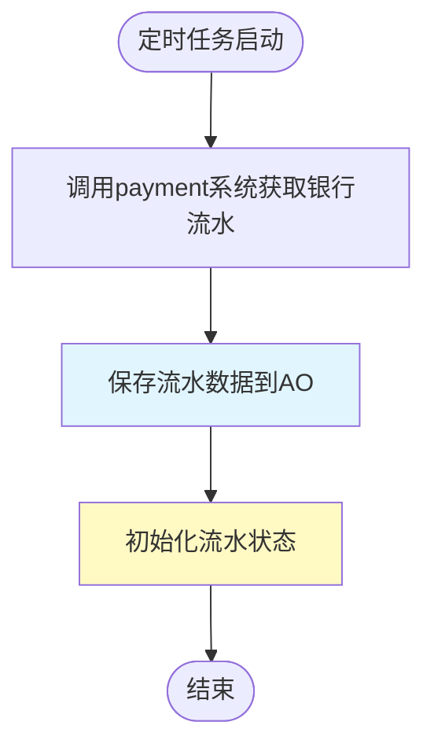
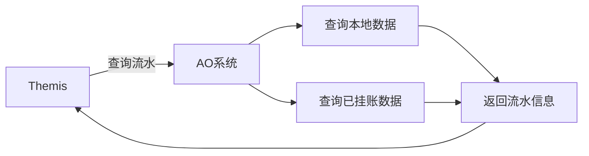
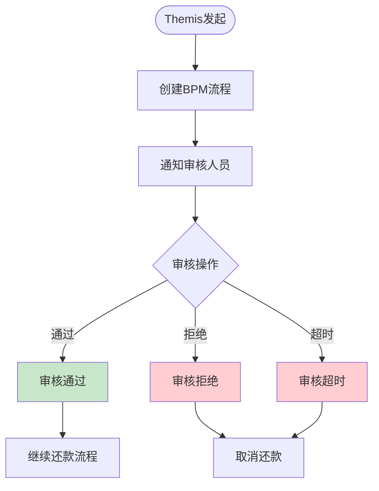
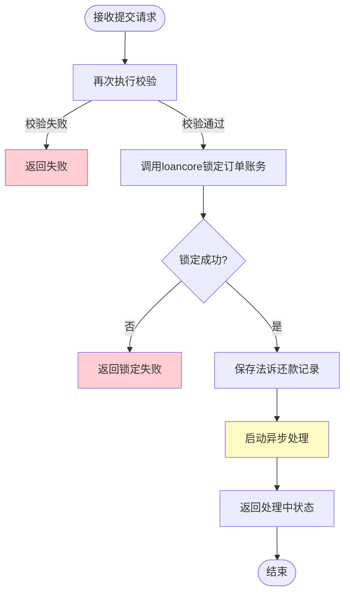
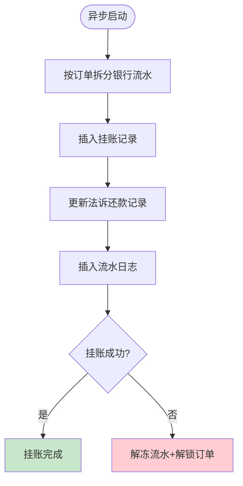
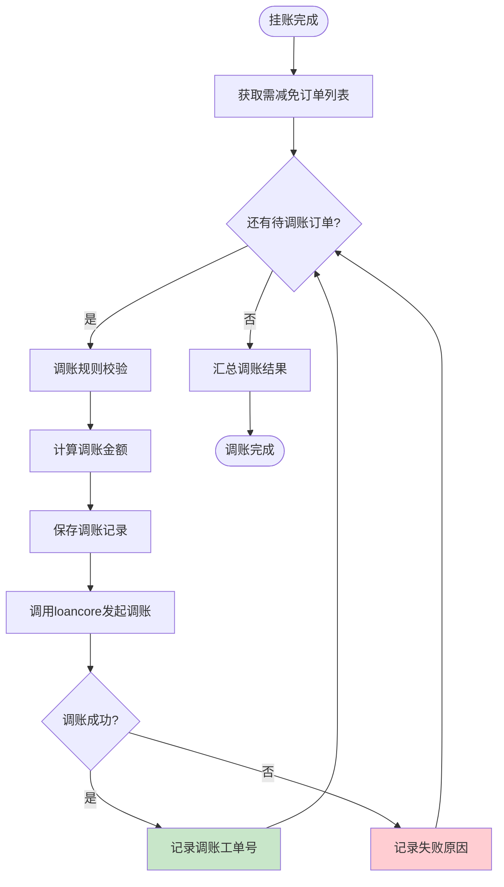
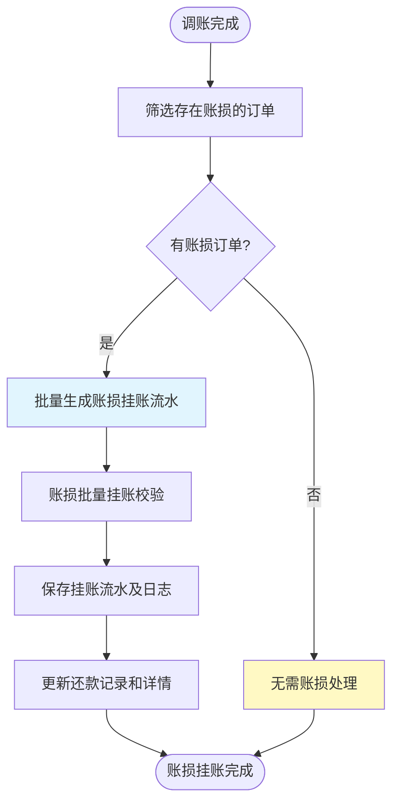
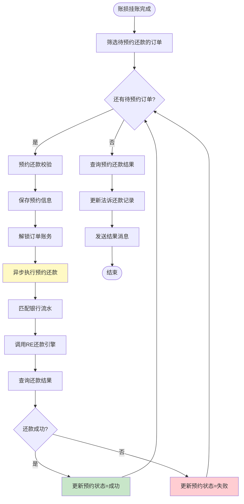
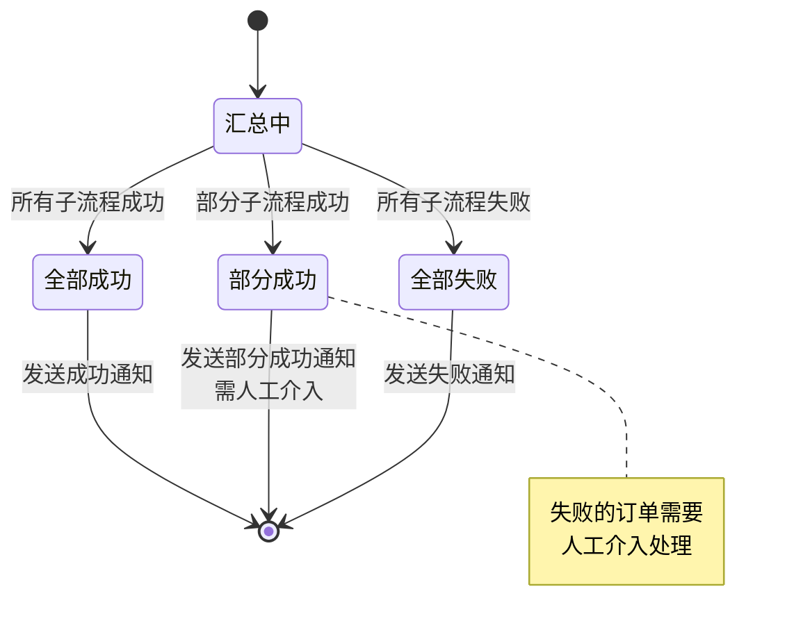
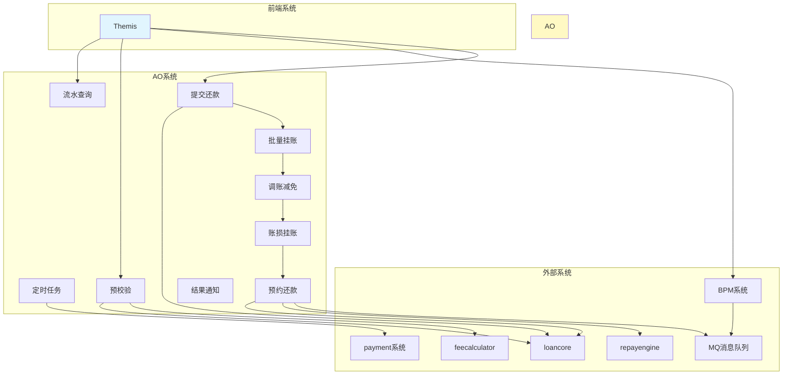

# 法诉自动入账 - 功能模块清单

## 模块概览

```
┌─────────────────────────────────────────────────────────────┐
│                    法诉自动入账系统架构                       │
├─────────────────────────────────────────────────────────────┤
│                                                             │
│  ┌──────────┐    ┌──────────┐    ┌──────────┐             │
│  │ 定时任务 │───▶│  预校验  │───▶│ BPM审核  │             │
│  └──────────┘    └──────────┘    └──────────┘             │
│                          │                                  │
│                          ▼                                  │
│                   ┌──────────┐                             │
│                   │ 提交还款 │                             │
│                   └──────────┘                             │
│                          │                                  │
│                          ▼                                  │
│         ┌────────────────┼────────────────┐                │
│         │                │                │                │
│         ▼                ▼                ▼                │
│  ┌──────────┐      ┌──────────┐      ┌──────────┐         │
│  │ 批量挂账 │      │  调账减免 │      │ 账损挂账 │         │
│  └──────────┘      └──────────┘      └──────────┘         │
│                                           │                 │
│                                           ▼                 │
│                                    ┌──────────┐            │
│                                    │ 预约还款 │            │
│                                    └──────────┘            │
│                                           │                 │
│                                           ▼                 │
│                                    ┌──────────┐            │
│                                    │ 结果通知 │            │
│                                    └──────────┘            │
│                                                             │
└─────────────────────────────────────────────────────────────┘
```

---

## 模块1: 定时任务模块

### 功能描述
定时查询银行流水并初始化数据到AO系统。

### 触发方式
- 定时任务触发

### 输入参数
| 参数名 | 类型 | 说明 |
|--------|------|------|
| 银行账户 | String | 指定查询的银行账户 |
| 是否挂账标识 | Boolean | 是否已挂账 |

### 处理流程


### 接口调用
- **调用系统**: payment系统
- **操作**: 获取银行流水

### 数据存储
- 流水数据保存至AO系统（此阶段不做挂账处理）

---

## 模块2: 流水查询模块

### 功能描述
查询银行流水信息及已挂账金额。

### 接口信息
- **接口路径**: `/queryBankFlowInfo`
- **请求方**: Themis系统
- **响应方**: AO系统

### 处理流程


### 返回数据
- 银行流水基本信息
- 已挂账金额明细

---

## 模块3: 预校验模块

### 功能描述
对法诉自动入账进行全面的前置校验，确保业务数据准确性。

### 接口信息
- **接口路径**: `/preCheck`
- **请求方**: Themis系统
- **响应方**: AO系统

### 输入参数
| 参数名 | 类型 | 说明 |
|--------|------|------|
| 银行流水号 | String | 用于还款的流水号 |
| 订单列表 | List<String> | 待还款订单号列表 |

### 校验项清单

#### 基础校验
| 序号 | 校验项 | 校验规则 | 失败提示 |
|------|--------|----------|----------|
| 1 | 收款银行账户 | 必须为法诉指定账户 | 收款账户非法诉指定账户 |
| 2 | 银行流水号 | 流水号存在且余额充足 | 流水号不存在或余额不足 |

#### 订单维度校验
| 序号 | 校验项 | 校验规则 | 失败提示 |
|------|--------|----------|----------|
| 3 | 订单存在性 | 订单存在且未结清 | 订单不存在或已结清 |
| 4 | 法诉订单 | 必须是法诉订单 | 非法诉订单不支持此流程 |
| 5 | 订单锁定 | 订单未被锁定 | 订单已锁定，无法操作 |
| 6 | 流程状态 | 未在法诉自动入账流程中 | 订单已在处理中 |
| 7 | 重复订单 | 同一流水号不包含重复订单 | 存在重复订单 |
| 8 | 部分还款 | 支持部分还款校验 | 订单不支持部分还款 |

#### 金额校验
| 序号 | 校验项 | 校验规则 | 失败提示 |
|------|--------|----------|----------|
| 9 | 结清/账损一致性 | 结清与账损数据一致 | 结清/账损数据不一致 |
| 10 | 待还金额 | 待还金额计算正确 | 待还金额异常 |
| 11 | 挂账流水余额 | 指定订单挂账余额充足 | 挂账流水余额不足 |

#### 规则校验
| 序号 | 校验项 | 校验规则 | 失败提示 |
|------|--------|----------|----------|
| 12 | 账期制 | 符合账期制规则 | 不符合账期制要求 |
| 13 | 账损规则 | 符合账损规则 | 不符合账损规则 |

### 计算逻辑

```
┌─────────────────────────────────────────────────────┐
│                   调账试算与账损计算                  │
├─────────────────────────────────────────────────────┤
│                                                     │
│  Step 1: 调用feecalculator发起调账试算               │
│  ────────────────────────────────────               │
│  → 获取订单可调减总金额                              │
│                                                     │
│  Step 2: 计算各订单账损金额                          │
│  ────────────────────────────────────               │
│  账损金额 = max(                                    │
│    应还总金额 - 调减金额 - 还款提交金额,             │
│    0                                               │
│  )                                                 │
│                                                     │
└─────────────────────────────────────────────────────┘
```

### 外部系统依赖
| 系统 | 接口/操作 | 用途 |
|------|-----------|------|
| loancore | 查询订单 | 获取订单信息 |
| feecalculator | 调账试算 | 获取可调减金额 |

---

## 模块4: BPM审核流程模块

### 功能描述
通过BPM系统进行人工审核，确保法诉自动入账的合规性。

### 流程图


### 审核结果处理
| 结果 | 处理动作 | 后续流程 |
|------|----------|----------|
| 通过 | 继续还款流程 | 进入提交还款模块 |
| 拒绝 | 取消还款 | 结束流程 |
| 超时 | 取消还款 | 结束流程 |

---

## 模块5: 提交还款模块

### 功能描述
校验通过后正式提交还款，锁定订单账务，启动异步处理。

### 接口信息
- **接口路径**: `/submitRepay`
- **请求方**: Themis系统
- **响应方**: AO系统

### 处理流程


### 校验复用
- 复用预校验模块的所有校验逻辑

### 外部系统依赖
| 系统 | 接口 | 用途 |
|------|------|------|
| loancore | `/accounting/apply` | 订单账务锁定 |

### 数据存储
- **法诉还款记录表**: `litigation_repay_record`

---

## 模块6: 异步处理核心模块

> **注意**: 以下四个子流程在提交成功后由AO系统异步执行

### 6.1 批量挂账流程

#### 功能描述
将银行流水按订单拆分成多笔挂账记录。

#### 流程图


#### 处理逻辑
1. 按订单拆分银行流水
2. 批量插入挂账记录
3. 更新法诉还款记录和银行流水日志

#### 数据表
| 表名 | 用途 |
|------|------|
| `charge_up_trans_log` | 挂账日志表 |
| `over_flow_payment` | 挂账记录表 |
| `litigation_repay_record` | 法诉还款记录表 |

---

### 6.2 调账减免流程

#### 功能描述
对需要减免的订单逐个发起调账。

#### 流程图


#### 处理逻辑
1. 获取所有需进行减免的订单
2. 循环处理每个订单：
   - 调账规则校验
   - 计算调账金额
   - 保存调账记录
   - 调用loancore发起调账
   - 保存调账结果

#### 数据表
| 表名 | 用途 |
|------|------|
| `account_adjust_work_order` | 调账工单表 |
| `account_adjust_trans_log` | 调账交易日志表 |
| `litigation_repay_detail` | 法诉还款详情表 |

#### 外部依赖
- **loancore**: 发起调账

---

### 6.3 账损挂账流程

#### 功能描述
对有账损的订单批量生成账损挂账。

#### 流程图


#### 处理逻辑
1. 筛选存在账损的订单
2. 批量生成账损挂账流水
3. 账损批量挂账校验
4. 保存账损挂账记录及日志
5. 更新法诉还款记录和详情

#### 数据表
| 表名 | 用途 |
|------|------|
| `charge_up_work_order` | 挂账工单表 |
| `charge_up_trans_log` | 挂账日志表 |
| `over_flow_payment` | 挂账记录表 |
| `litigation_repay_record` | 法诉还款记录表 |
| `litigation_repay_detail` | 法诉还款详情表 |

---

### 6.4 预约还款流程

#### 功能描述
对扣除调账/账损后仍需还款的订单发起预约还款。

#### 流程图


#### 处理逻辑
1. 筛选待预约还款的订单
2. 循环处理每个订单：
   - 预约还款校验
   - 保存预约信息
   - 调用loancore解锁订单账务
   - 匹配银行流水
   - 调用repayengine提交RE还款（新增法诉标识）
   - 查询并更新还款结果
3. 汇总所有预约结果
4. 更新法诉还款记录
5. 发送结果消息

#### 数据表
| 表名 | 用途 |
|------|------|
| `offline_repay_reserve_info` | 预约还款表 |
| `offline_repay_reserve_detail` | 预约详情表 |
| `offline_repay_reserve_process` | 线下还款预约流程表 |
| `litigation_repay_detail` | 法诉还款详情表 |

#### 外部依赖
| 系统 | 接口/操作 | 用途 |
|------|-----------|------|
| loancore | `/accounting/cancel` | 订单账务解锁 |
| repayengine | 提交还款 | 执行还款 |
| repayengine | 查询结果 | 获取还款状态 |

---

## 模块7: 结果汇总与通知模块

### 功能描述
汇总所有异步子流程的执行结果，更新最终状态并通知用户。

### 状态机图


### 结果处理

| 最终状态 | 判断条件 | 通知动作 | 人工介入 |
|----------|----------|----------|----------|
| 成功 | 所有子流程全部成功 | 发送成功通知（绿色） | 否 |
| 部分成功 | 至少一个子流程成功 | 发送部分成功通知（黄色） | 是 |
| 失败 | 所有子流程失败 | 发送失败通知（红色） | 是 |

### 消息通知
- **通知方式**: MQ消息队列
- **接收系统**: Themis系统
- **通知内容**:
  - 还款记录ID
  - 最终状态
  - 各子流程执行详情
  - 失败原因（如有）

---

## 系统交互关系图



---

## 数据表清单

### 新增表
| 表名 | 说明 | 模块 |
|------|------|------|
| `litigation_repay_record` | 法诉还款记录表 | 提交还款 |
| `litigation_repay_detail` | 法诉还款详情表 | 调账/账损/预约 |

### 已有表（需适配）
| 表名 | 说明 | 模块 |
|------|------|------|
| `charge_up_trans_log` | 挂账日志表 | 批量挂账/账损挂账 |
| `over_flow_payment` | 挂账记录表 | 批量挂账/账损挂账 |
| `charge_up_work_order` | 挂账工单表 | 账损挂账 |
| `account_adjust_work_order` | 调账工单表 | 调账减免 |
| `account_adjust_trans_log` | 调账交易日志表 | 调账减免 |
| `offline_repay_reserve_info` | 预约还款表 | 预约还款 |
| `offline_repay_reserve_detail` | 预约详情表 | 预约还款 |
| `offline_repay_reserve_process` | 线下还款预约流程表 | 预约还款 |

---

## 异常处理机制

### 1. 挂账失败
- 解冻银行流水
- 解锁订单
- 记录失败原因
- 发送失败通知

### 2. 调账失败
- 记录失败订单和原因
- 继续处理其他订单
- 最终标记为部分成功

### 3. 还款失败
- 记录失败订单和原因
- 标记预约状态为失败
- 需人工介入处理

### 4. 锁定失败
- 直接返回失败
- 不启动异步流程
- 通知用户锁定失败

---

## 附录: 接口汇总

| 接口路径 | 请求方 | 用途 | 所属模块 |
|----------|--------|------|----------|
| `/queryBankFlowInfo` | Themis | 查询银行流水信息 | 流水查询 |
| `/preCheck` | Themis | 预校验 | 预校验 |
| `/submitRepay` | Themis | 提交还款 | 提交还款 |

---

*最后更新: 2025-02-25*
*关联文档: [[原始需求]]*
