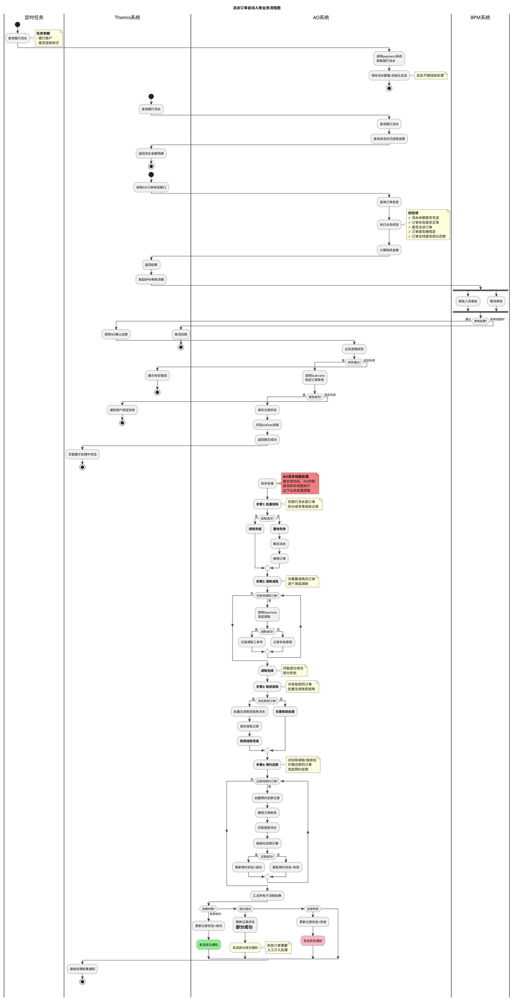
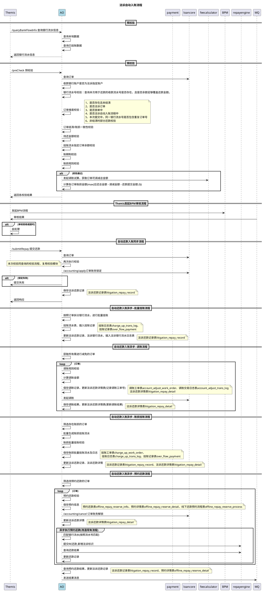

```plantuml
@startuml
title 法诉订单自动入账业务流程图

|定时任务|
start
:查询银行流水;
note right
  **任务参数**
  - 银行账户
  - 是否挂账标识
end note

|Themis系统|
|AO系统|
 :调用payment系统\n获取银行流水;
  :保存流水数据,初始化状态;
  note right
    此处不做挂账处理
  end note
  stop


|Themis系统|
start
:查询银行流水;
|AO系统|
:查询银行流水;
:查询该流水已挂账金额;
|Themis系统|
:返回流水金额明细;
stop
|Themis系统|
start
:调用AO订单校验接口;

|AO系统|
:查询订单信息;
:执行业务校验;
note right
  **校验项**
  ✓ 流水余额是否充足
  ✓ 订单状态是否正常
  ✓ 是否法诉订单
  ✓ 订单是否被锁定
  ✓ 订单支持是否部分还款
end note
 :计算账损金额;

  |Themis系统|
  :返回结果;


    :发起BPM审核流程;

    |BPM系统|
    fork
      :审核人员审批;
    fork again
      :等待审核;
    end fork

    if (审核结果?) then (通过)
      |Themis系统|
      :调用AO确认还款;

      |AO系统|
      :业务逻辑校验;

      if (校验通过?) then (是)
        :调用loancore\n锁定订单账务;

        if (锁定成功?) then (是)
          :保存记录状态;
          :开启bizflow流程;
          :返回提交成功;

          |Themis系统|
          :页面展示处理中状态;
          stop

          |AO系统|
          :异步处理;
          note right #LightCoral
            **AO异步线程处理**
            提交成功后，AO内部
            启动异步线程执行
            以下业务处理逻辑
          end note

           :**步骤1: 批量挂账**;
          note right
            将银行流水按订单
            拆分成多笔挂账记录
          end note

          if (挂账成功?) then (是)
            :**挂账完成**;
          else (否)
            :**整体失败**;
            :解冻流水;
            :解锁订单;
          endif

          |AO系统|
          :**步骤2: 调账减免**;
          note right
            对需要减免的订单
            逐个发起调账
          end note

          while (还有待调账订单?) is (是)
            :调用loancore\n发起调账;

            if (调账成功?) then (是)
              :记录调账工单号;
            else (否)
              :记录失败原因;
            endif
          endwhile (否)

          :**调账完成**;
          note right
            可能部分成功
            部分失败
          end note

          :**步骤3: 账损挂账**;
          note right
            对有账损的订单
            批量生成账损挂账
          end note

          if (存在账损订单?) then (是)
            :批量生成账损挂账流水;
            :保存挂账记录;
            :**账损挂账完成**;
          else (否)
            :**无需账损处理**;
          endif

          :**步骤4: 预约还款**;
          note right
            对扣除调账/账损后
            仍需还款的订单
            发起预约还款
          end note

          while (还有待预约订单?) is (是)
            :创建预约还款记录;
            :解锁订单账务;
            :匹配挂账流水;
            :调用RE还款引擎;

            if (还款成功?) then (是)
              :更新预约状态=成功;
            else (否)
              :更新预约状态=失败;
            endif
          endwhile (否)

          :汇总所有子流程结果;

          if (结果判断?) then (全部成功)
            :更新记录状态=成功;
            #LightGreen:发送成功通知;
          else if(部分成功)
            :更新记录状态\n=部分成功;
            #LightYellow:发送部分成功通知;
            note right
              失败订单需要
              人工介入处理
            end note
          else if(全部失败)
            :更新记录状态=失败;
            #LightPink:发送失败通知;
          endif

          |Themis系统|
          :接收处理结果通知;
          stop
 |AO系统|
        else (锁定失败)

          |Themis系统|
          :通知用户锁定失败;
          stop
        endif

      else (校验失败)
        |Themis系统|
        :展示校验错误;
        stop
      endif

    else (拒绝或超时)
      |Themis系统|
      :取消还款;
      stop


    endif


'legend right
'  |<#LightGreen> 成功 |
'  |<#LightYellow> 部分成功 |
'  |<#LightPink> 失败 |
'
'  **关键节点**
'  • 三次校验: 试算、预还款、确认还款
'  • 三次锁定: 流水冻结、订单锁定、挂账
'  • 四个异步子流程: 挂账、调账、账损、预约
'
'  **状态流转**
'  待审核 → 处理中 → 成功/部分成功/失败
'
'  **异常分支**
'  审核拒绝 → 已取消
'  锁定失败 → 锁定失败
'endlegend

@enduml
```

```plantuml
@startuml
title 法诉自动入账流程

' 定义参与者顺序：从左到右依次为 定时任务、Themis、AO

participant "Themis" as Themis
participant "AO" as AO #LightBlue
participant "payment" as payment
participant "loancore" as loancore
participant "feecalculator" as feecalculator
participant "BPM" as BPM
participant "repayengine" as repayengine
participant "MQ" as MQ


==预校验==
Themis -> AO:/queryBankFlowInfo 查询银行流水信息
AO -> AO: 查询本地数据
AO -> AO:查询已挂账数据
AO --> Themis:返回银行流水信息


==预校验==
Themis -> AO:/preCheck 预校验
AO -> loancore: 查询订单
AO -> AO:收款银行账户是否为法诉指定账户
AO -> AO:银行流水号校验：查询本次用于还款的收款流水号是否存在，且是否余额足够覆盖还款金额。
AO -> AO:订单维度校验：
note right
    1、是否存在且未结清
    2、是否法诉订单
    3、是否锁单中
    4、是否法诉自动入账流程中
    5、本次提交中，同一银行流水号是否包含重复订单号
    6、非结清时部分还款校验
end note

AO -> AO:订单结清/账损一致性校验
AO -> AO:待还金额校验
AO -> AO:挂账流水指定订单余额校验
AO -> AO:账期制校验
AO -> AO:账损规则校验
alt 校验通过
AO -> feecalculator:发起调账试算，获取订单可调减总金额
AO -> AO:计算各订单账损金额(max(应还总金额 - 调减金额 - 还款提交金额,0))
end
AO --> Themis:返回各校验结果

==Themis发起BPM审核流程==
'Themis -> AO:/tryRepayIncome 预还款入账,锁定银行流水金额
'AO -> AO:再次执行校验
'note left:本次校验同查询的校验流程，复用校验模块
'alt 校验通过
'
'AO -> feecalculator:发起调账试算，获取订单可调减总金额
'AO -> AO:计算各订单账损金额(max(应还总金额 - 调减金额 - 还款提交金额,0))
'AO -> AO:冻结银行流水
'AO -> AO:保存还款记录、还款订单详情
'note right: 法诉还款记录表litigation_repay_record \n 法诉还款详情表litigation_repay_detail
'end
'AO --> Themis:返回结果
'alt 预还款通过
Themis -> BPM: 发起BPM流程
MQ -> Themis: 审核结果
alt 审核拒绝或超时
Themis -> Themis:自处理

end
==自动还款入账同步流程==
Themis -> AO:/submitRepay 提交还款

AO -> loancore: 查询订单
AO -> AO:再次执行校验
note left:本次校验同查询的校验流程，复用校验模块
AO -> loancore: /accounting/apply订单账务锁定
 alt 锁定失败
    AO -> Themis: 提交失败
  end

AO -> AO: 保存法诉还款记录
note right: 法诉还款记录表litigation_repay_record
AO -> Themis: 返回响应


==自动还款入账异步--批量挂账流程==
AO -> AO:按照订单拆分银行流水，进行批量挂账
AO -> AO:挂账流水表、插入挂账记录
note right: 挂账日志表charge_up_trans_log、\n 挂账记录表over_flow_payment
AO -> AO: 更新法诉还款记录、法诉银行流水，插入法诉银行流水日志表
note right: 法诉还款记录表litigation_repay_record


==自动还款入账异步--调账流程==
AO -> AO:获取所有需进行减免的订单
loop 订单
AO -> AO:调账规则校验
AO -> AO:计算调账金额
AO -> AO:保存调账记录，更新法诉还款详情表(记录调账工单号)
note right: 调账工单表account_adjust_work_order、调账交易日志表account_adjust_trans_log \n 法诉还款详情表litigation_repay_detail
AO -> loancore:发起调账
AO -> AO:保存调账结果，更新法诉还款详情表(更新调账结果)
note right: 法诉还款详情表litigation_repay_detail

end
==自动还款入账异步--账损挂账流程==
AO -> AO:筛选存在账损的订单
AO -> AO:批量生成账损挂账流水
AO -> AO:账损批量挂账校验
AO -> AO:保存账损批量挂账流水及日志
note right: 挂账工单表charge_up_work_order、\n 挂账日志表charge_up_trans_log、挂账记录表over_flow_payment
AO -> AO:更新法诉还款记录、法诉还款详情
note right: 法诉还款记录表litigation_repay_record、法诉还款详情表litigation_repay_detail

==自动还款入账异步--预约还款流程==
AO -> AO:筛选待预约还款的订单
loop 订单
    AO -> AO:预约还款校验
    AO -> AO:保存预约信息
    note right: 预约还款表offline_repay_reserve_info、预约详情表offline_repay_reserve_detail、线下还款预约流程表offline_repay_reserve_process
    AO -> loancore:/accounting/cancel 订单账务解锁
    AO -> AO:更新法诉还款详情
    note right: 法诉还款详情表litigation_repay_detail
    group 异步执行预约还款(改造现有流程)
        AO -> AO:匹配银行流水(按照流水号匹配)
        AO -> repayengine:提交RE还款,新增法诉标识
        AO -> repayengine:查询还款结果
        AO -> AO:更新还款记录
    end
end

AO -> AO:查询预约还款结果，更新法诉还款记录
note right: 法诉还款记录表litigation_repay_record、预约详情表offline_repay_reserve_detail
AO -> MQ:发送结果消息

@enduml
```

