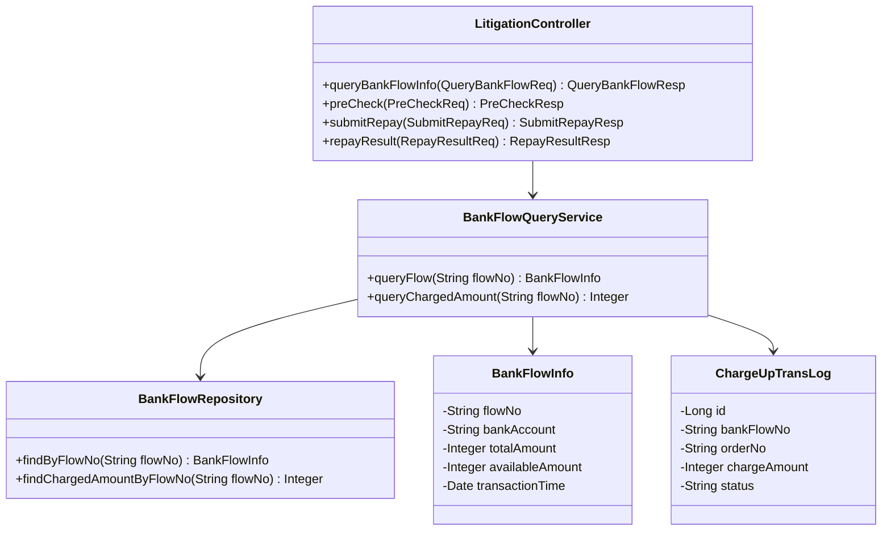
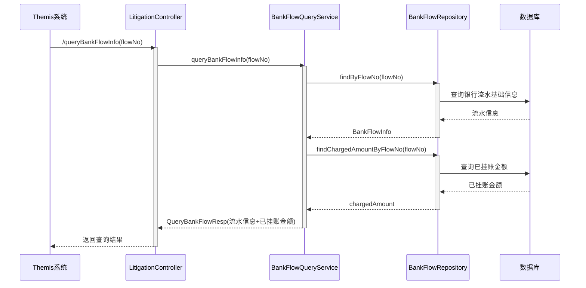
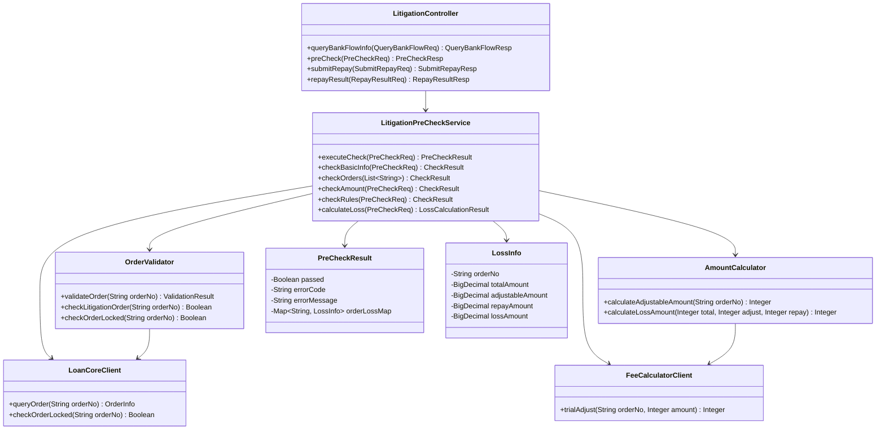
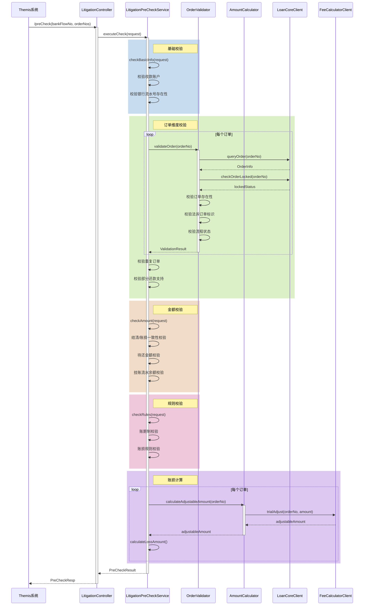
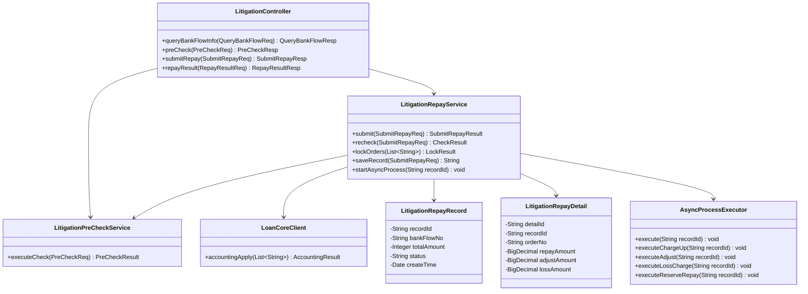
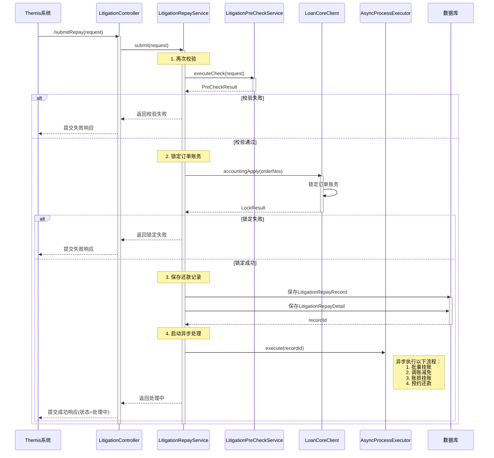
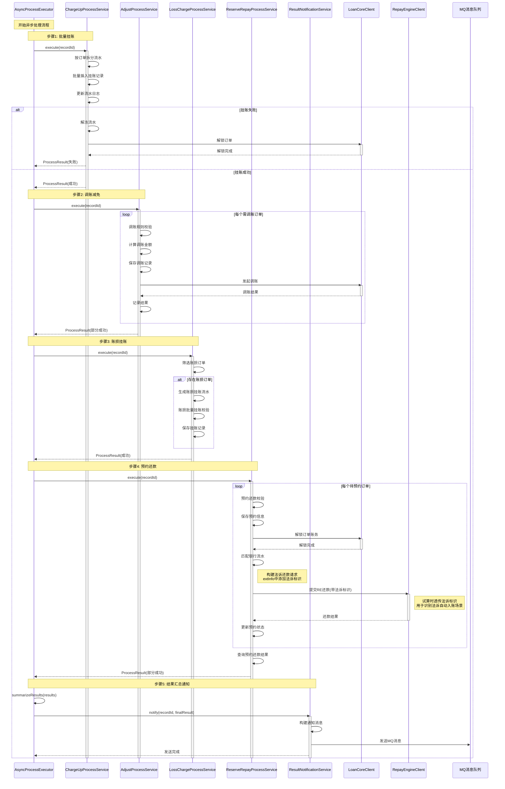
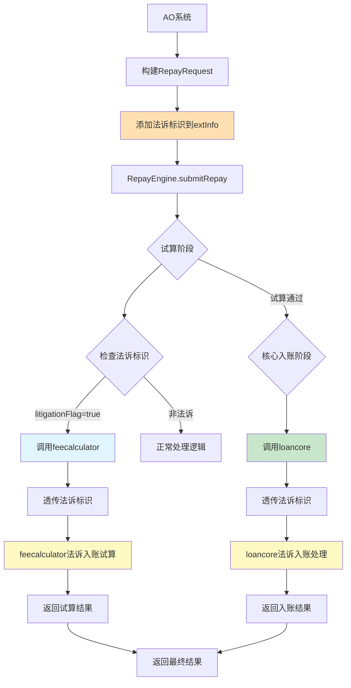
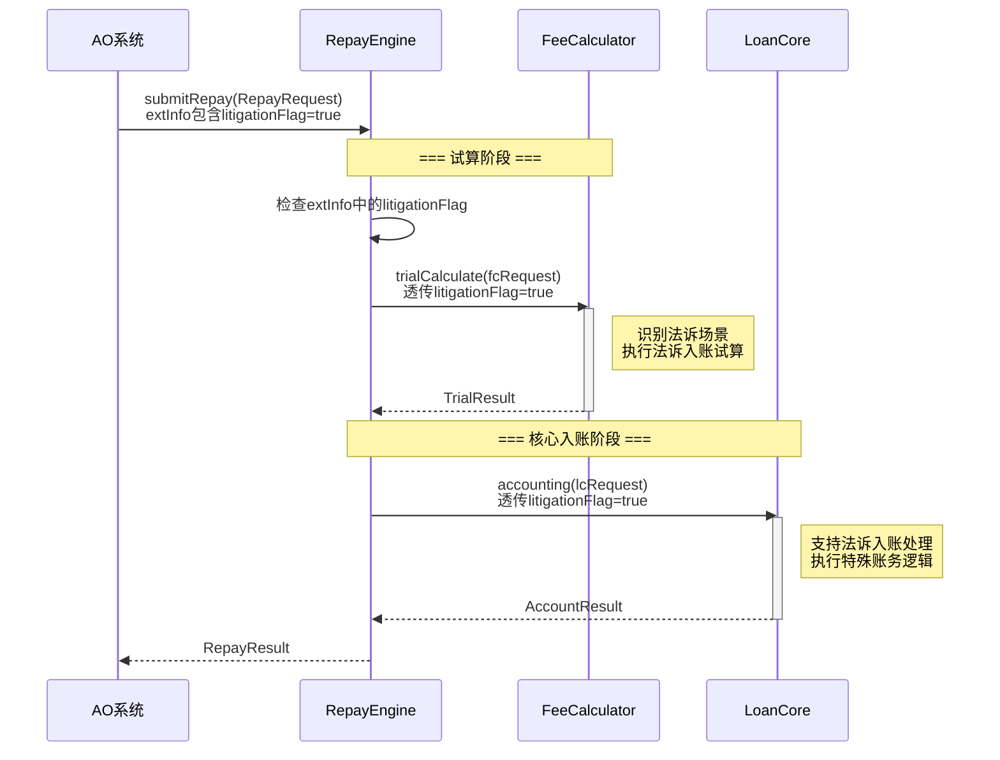

```mermaid
classDiagram
    class AsyncProcessExecutor {
        +execute(String recordId) void
        -executeChargeUp(String recordId) ProcessResult
        -executeAdjust(String recordId) ProcessResult
        -executeLossCharge(String recordId) ProcessResult
        -executeReserveRepay(String recordId) ProcessResult
        -summarizeResults(List~ProcessResult~) FinalResult
    }

    class ChargeUpProcessService {
        +execute(String recordId) ProcessResult
        +splitFlowByOrders(String recordId) List~ChargeUpRecord~
        +batchChargeUp(List~ChargeUpRecord~) Boolean
        +updateFlowLog(List~ChargeUpRecord~) void
        +rollbackOnFailure(String recordId) void
    }

    class AdjustProcessService {
        +execute(String recordId) ProcessResult
        +getAdjustOrders(String recordId) List~OrderInfo~
        +processOrderAdjust(OrderInfo) AdjustResult
        +saveAdjustRecord(AdjustRecord) void
        +callLoanCoreAdjust(AdjustRecord) Boolean
    }

    class LossChargeProcessService {
        +execute(String recordId) ProcessResult
        +getLossOrders(String recordId) List~OrderInfo~
        +generateLossFlow(List~OrderInfo~) List~LossFlowRecord~
        +validateLossCharge(List~LossFlowRecord~) Boolean
        +saveLossRecords(List~LossFlowRecord~) void
    }

    class ReserveRepayProcessService {
        +execute(String recordId) ProcessResult
        +getReserveOrders(String recordId) List~OrderInfo~
        +processOrderReserve(OrderInfo) ReserveResult
        +createReserveRecord(OrderInfo) String
        +unlockOrder(String orderNo) void
        +executeReserveRepayAsync(String reserveId) void
        +matchFlowAndRepay(String reserveId) RepayResult
        +buildLitigationExtInfo(String bizSerial, String orderNo) Map~String,Object~
    }

    class RepayEngineClient {
        +submitRepay(RepayRequest) RepayResult
        +queryResult(String reserveId) RepayResult
    }

    class RepayRequest {
        -String reserveId
        -String orderNo
        -Map~String,Object~ extInfo
        +setExtInfo(String key, Object value) void
        +getExtInfo() Map~String,Object~
        +getLitigationFlag() Boolean
    }

    class FeeCalculatorClient {
        +trialCalculate(FeecalculatorTrialRequest) TrialResult
    }

    class FeecalculatorTrialRequest {
        -String orderNo
        -Integer repayAmount
        -Boolean litigationFlag
        -String litigationBizSerial
        +setLitigationFlag(Boolean) void
        +setLitigationBizSerial(String) void
    }

    class LoanCoreClient {
        +accounting(LoancoreAccountRequest) AccountResult
    }

    class LoancoreAccountRequest {
        -String orderNo
        -Integer repayAmount
        -Boolean litigationFlag
        -String litigationBizSerial
        +setLitigationFlag(Boolean) void
        +setLitigationBizSerial(String) void
    }

    class ResultNotificationService {
        +notify(String recordId, FinalResult result) void
        +buildNotification(String recordId, FinalResult result) NotificationMessage
        +sendToMQ(NotificationMessage) void
    }

    class ProcessResult {
        -String processName
        -Boolean success
        -List~String~ successOrders
        -List~FailInfo~ failOrders
        -String message
    }

    class FailInfo {
        -String orderNo
        -String errorCode
        -String errorMessage
    }

    AsyncProcessExecutor --> ChargeUpProcessService
    AsyncProcessExecutor --> AdjustProcessService
    AsyncProcessExecutor --> LossChargeProcessService
    AsyncProcessExecutor --> ReserveRepayProcessService
    AsyncProcessExecutor --> ResultNotificationService
    AsyncProcessExecutor --> ProcessResult
    ChargeUpProcessService --> ProcessResult
    AdjustProcessService --> ProcessResult
    LossChargeProcessService --> ProcessResult
    ReserveRepayProcessService --> ProcessResult
    ProcessResult --> FailInfo
```

# AO系统-法诉自动入账详细设计V1.0

## 目录

（自动生成目录）

---

## 背景

### 需求（必填）
[[原始需求]]

### 概要设计（如有概要设计必须填写）
[[功能模块清单]]

### 术语表

| 术语 | 解释 |
|------|------|
| AO系统 | 会计运营系统（Accounting Operation） |
| 法诉订单 | 通过法律诉讼途径进行催收的订单 |
| 挂账 | 将收款金额暂时挂起，不直接核销到具体订单 |
| 账损 | 订单无法收回的金额损失 |
| 调账 | 对订单金额进行调整的操作 |
| 预约还款 | 预先安排还款计划，按计划执行扣款 |
| RE还款引擎 | Repay Engine，还款处理引擎 |

### 设计前提

1. **业务约束**：
   - 法诉订单还款必须经过BPM审核流程
   - 收款账户必须是法诉指定账户
   - 支持部分还款场景
   - 调账和账损处理可能部分失败

2. **技术约束**：
   - 使用现有AO系统的挂账、调账、预约还款能力
   - 异步处理流程需保证幂等性和可追溯性
   - 与loancore、feecalculator、repayengine等系统保持现有集成方式

3. **性能约束**：
   - 批量挂账需支持高并发场景
   - 异步流程处理时间需控制在可接受范围内

---

## 「AO系统」的功能设计（必填）

| 功能名 | 功能描述 | 功能分级 |
|--------|----------|----------|
| 流水查询模块 | 提供银行流水及已挂账金额查询功能 | B-支撑功能 |
| 预校验模块 | 对法诉自动入账进行全面的前置校验 | A-核心功能 |
| 提交还款模块 | 校验通过后正式提交还款，锁定订单账务 | A-核心功能 |
| 批量挂账流程 | 将银行流水按订单拆分成多笔挂账记录 | A-核心功能 |
| 调账减免流程 | 对需要减免的订单逐个发起调账 | A-核心功能 |
| 账损挂账流程 | 对有账损的订单批量生成账损挂账 | A-核心功能 |
| 预约还款流程 | 对扣除调账/账损后仍需还款的订单发起预约还款 | A-核心功能 |
| 结果汇总与通知 | 汇总所有异步子流程的执行结果，更新最终状态并通知 | B-支撑功能 |

---

## 「流水查询模块」设计

### 功能设计

#### 类图

##### 各功能核心类图



##### 各功能核心类说明

| 类名 | 作用说明 | 设计模式 |
|------|----------|----------|
| LitigationController | 法诉接口控制器，统一管理流水查询、预校验、提交还款接口 | MVC模式 |
| BankFlowQueryService | 流水查询核心服务，整合流水信息和已挂账金额查询 | 服务层模式 |
| BankFlowInfo | 银行流水信息实体，封装流水基本数据 | 值对象模式 |
| ChargeUpTransLog | 挂账日志实体（复用现有表），记录挂账流水历史 | 实体模式 |
| BankFlowRepository | 流水数据访问层，负责数据库查询操作 | 仓储模式 |

#### 时序图

##### 系统流程时序图



##### 系统流程图说明

**业务场景**：Themis系统查询法诉还款可用的银行流水信息

**流程说明**：
1. Themis系统调用AO系统的`/queryBankFlowInfo`接口，传入银行流水号
2. AO系统查询本地存储的银行流水基础信息
3. AO系统查询该流水已挂账的金额明细
4. 汇总返回流水总额、可用余额（总额-已挂账）和挂账明细

**注意点**：
- 本模块仅做数据查询，不进行任何状态变更
- 可用余额 = 流水总额 - 已挂账金额
- 支持查询历史挂账记录明细

### 接口详细设计（必填）

#### AO系统-流水查询接口

**接口路径**：`POST /accountingoperation/litigationAutoIncome/queryBankFlow`

**接口版本**：V0.3

**接口描述**：查询银行流水信息及已挂账金额

**【接口定义参数规范】**

**Header参数**：

| 参数名 | 类型 | 长度 | 必输 | 说明 |
|--------|------|------|------|------|
| Content-Type | String | - | Y | application/json |

**Query参数**：无

**Path参数**：无

**Request Body参数**：

| 参数名 | 类型 | 必输 | 说明 |
|--------|------|------|------|
| receiveCardNo | String | Y | 收款卡号 |
| bankSerials | String[] | Y | 银行收款流水号数组 |

**Request Body样例**：
```json
{
  "receiveCardNo": "6222021234567890",
  "bankSerials": ["BF202502250001", "BF202502250002"]
}
```

**Response Body参数**：

| 参数名 | 类型 | 必输 | 说明 |
|--------|------|------|------|
| code | Integer | Y | 响应码 |
| message | String | Y | 响应消息 |
| bankFlowList | Object[] | Y | 银行流水列表 |
| bankFlowList[].bankSerial | String | Y | 银行流水号 |
| bankFlowList[].bankName | String | Y | 银行名称 |
| bankFlowList[].transDate | String | Y | 交易日期 |
| bankFlowList[].transTime | String | Y | 交易时间 |
| bankFlowList[].transAmount | Integer | Y | 交易金额（单位：分） |
| bankFlowList[].paymentAccount | String | Y | 付款账号 |
| bankFlowList[].paymentName | String | Y | 付款人名称 |
| bankFlowList[].receiptCardNo | String | Y | 收款卡号 |
| bankFlowList[].channel | String | Y | 渠道 |
| bankFlowList[].availableAmount | Integer | Y | 可用金额（单位：分） |
| bankFlowList[].usedAmount | Integer | Y | 已用金额（单位：分） |
| bankFlowList[].createdAt | String | Y | 创建时间 |
| bankFlowList[].updatedAt | String | Y | 更新时间 |

**Response Body样例**：
```json
{
  "code": 0,
  "message": "success",
  "bankFlowList": [
    {
      "bankSerial": "BF202502250001",
      "bankName": "工商银行",
      "transDate": "2025-02-25",
      "transTime": "10:30:00",
      "transAmount": 1000000,
      "paymentAccount": "6222012345678901",
      "paymentName": "张三",
      "receiptCardNo": "6222021234567890",
      "channel": "ONLINE",
      "availableAmount": 800000,
      "usedAmount": 200000,
      "createdAt": "2025-02-25T10:30:00",
      "updatedAt": "2025-02-25T10:30:00"
    }
  ]
}
```

**接口评估**：

- **预估最高QPS**：100 QPS，中等RequestBody
- **熔断和限流设计**：
  - 使用Sentinel进行接口限流，QPS阈值设为150
  - 降级方案：当查询超时或失败时，返回错误提示，不影响业务主流程
- **异常抛出**：
  - 流水号不存在时返回业务错误码（不为null对象）
  - 数据库异常时返回系统错误码
- **接口变更影响**：
  - 新增接口，无兼容性问题
  - 调用链：Themis -> AO

---

## 「预校验模块」设计

### 功能设计

预校验模块负责对法诉自动入账进行全面的前置校验，包含四大类校验：基础校验、订单维度校验、金额校验、规则校验，最终计算各订单账损金额。

```
┌─────────────────────────────────────────────────────────────┐
│                   预校验执行策略                              │
├─────────────────────────────────────────────────────────────┤
│                                                             │
│  校验步骤级别（串行）:                                       │
│  ┌────────┐   ┌────────┐   ┌────────┐   ┌────────┐         │
│  │基础校验 │──▶│订单校验 │──▶│金额校验 │──▶│规则校验 │         │
│  └────────┘   └────────┘   └────────┘   └────────┘         │
│       │                                           │         │
│       ▼                                           ▼         │
│  ┌────────┐   ┌────────┐                              │
│  │账损计算 │   │返回结果 │                              │
│  └────────┘   └────────┘                              │
│                                                             │
│  订单级别（并发）:                                           │
│  ┌────────┐                                                │
│  │订单校验 │  ┌──┐ ┌──┐ ┌──┐ ┌──┐ ┌──┐ ┌──┐             │
│  │        │  │01│ │02│ │03│ │...│ │49│ │50│             │
│  │        │  └──┘ └──┘ └──┘ └──┘ └──┘ └──┘  (线程池)   │
│  └────────┘                                                │
│                                                             │
│  ┌────────┐                                                │
│  │调账试算 │  ┌──┐ ┌──┐ ┌──┐ ┌──┐ ┌──┐                   │
│  │        │  │01│ │02│ │03│ │...│ │30│                   │
│  │        │  └──┘ └──┘ └──┘ └──┘ └──┘  (线程池)         │
│  └────────┘                                                │
│                                                             │
└─────────────────────────────────────────────────────────────┘
```

> **执行策略**：
> - **校验步骤级别**：严格串行执行
>   - 基础校验 → 订单校验 → 金额校验 → 规则校验 → 账损计算
> - **订单级别**：多线程并发处理
>   - 每个校验步骤内部可使用线程池并发处理多个订单
>   - 例如：订单校验有50个订单，可启动10个线程并发校验
>   - 例如：调账试算有30个订单，可启动5个线程并发调用feecalculator

#### 类图

##### 各功能核心类图



##### 各功能核心类说明

| 类名 | 作用说明 | 设计模式 |
|------|----------|----------|
| LitigationController | 法诉接口控制器，统一管理流水查询、预校验、提交还款接口 | MVC模式 |
| LitigationPreCheckService | 预校验核心服务，编排各类校验逻辑 | 服务层模式、策略模式 |
| OrderValidator | 订单校验器，负责订单维度的各类校验 | 验证器模式 |
| AmountCalculator | 金额计算器，负责调账试算和账损计算 | 计算器模式 |
| FeeCalculatorClient | 费用计算客户端，调用feecalculator系统 | 外观模式 |
| LoanCoreClient | loancore客户端，查询订单信息 | 外观模式 |
| PreCheckResult | 预校验结果对象 | 值对象模式 |
| LossInfo | 账损信息对象 | 值对象模式 |

#### 时序图

##### 系统流程时序图



##### 系统流程图说明

**业务场景**：Themis系统发起法诉自动入账预校验

**流程说明**：
1. Themis系统调用预校验接口，传入银行流水号和订单列表
2. AO系统执行四大类校验：
   - **基础校验**：收款账户、流水号校验
   - **订单维度校验**：订单状态、法诉标识、锁定状态等
   - **金额校验**：结清/账损一致性、待还金额、挂账余额
   - **规则校验**：账期制、账损规则
3. 调用feecalculator进行调账试算
4. 计算各订单账损金额
5. 返回校验结果和账损信息

**执行策略**：
> **校验步骤级别**：严格串行执行
> - 基础校验 → 订单校验 → 金额校验 → 规则校验 → 账损计算
>
> **订单级别**：多线程并发处理
> - 每个校验步骤内部可使用线程池并发处理多个订单
> - 例如：订单校验有50个订单，可启动10个线程并发校验
> - 例如：调账试算有30个订单，可启动5个线程并发调用feecalculator

**注意点**：
- 所有校验项遵循"快速失败"原则，任一校验失败立即返回
- 调账试算失败不影响校验通过，但账损金额为0
- 校验结果需记录详细的失败原因
- 订单级并发处理需注意外部系统（loancore、feecalculator）的调用限流

### 接口详细设计（必填）

#### AO系统-预校验接口

**接口路径**：`POST /accountingoperation/litigationAutoIncome/preCheck`

**接口描述**：法诉自动入账预校验

**版本**：V0.3

**【接口定义参数规范】**

**Header参数**：

| 参数名 | 类型 | 长度 | 必输 | 说明 |
|--------|------|------|------|------|
| Content-Type | String | - | Y | application/json |
| X-Request-Id | String | 64 | Y | 请求追踪ID |

**Request Body参数**：

| 参数名 | 类型 | 长度 | 必输 | 说明 |
|--------|------|------|------|------|
| operator | String | 50 | Y | 操作人工号 |
| receiveCardNo | String | 50 | Y | 收款卡号 |
| litigationOrders | List | 100 | Y | 法诉订单列表，最多100个 |
| litigationOrders[].bankSerial | String | 64 | Y | 银行流水号 |
| litigationOrders[].orderNo | String | 50 | Y | 订单号 |
| litigationOrders[].repayAmount | Integer | - | Y | 还款金额（分） |

**Request Body样例**：
```json
{
  "operator": "admin",
  "receiveCardNo": "6222021234567890",
  "litigationOrders": [
    {
      "bankSerial": "BF202502250001",
      "orderNo": "O001",
      "repayAmount": 30000
    },
    {
      "bankSerial": "BF202502250001",
      "orderNo": "O002",
      "repayAmount": 20000
    }
  ]
}
```

**Response Body参数**：

| 参数名 | 类型 | 必输 | 说明 |
|--------|------|------|------|
| code | String | Y | 响应码，000000表示成功 |
| message | String | Y | 响应消息 |
| data | Object | Y | 响应数据 |
| data.passed | Boolean | Y | 校验是否通过 |
| data.failReason | String | N | 失败原因（校验不通过时返回） |
| data.orderCheckInfo | List | Y | 订单校验信息列表 |
| data.orderCheckInfo[].orderNo | String | Y | 订单号 |
| data.orderCheckInfo[].totalAmount | Integer | Y | 应还总金额（分） |
| data.orderCheckInfo[].adjustableAmount | Integer | Y | 可调减金额（分） |
| data.orderCheckInfo[].repayAmount | Integer | Y | 本次还款金额（分） |
| data.orderCheckInfo[].lossAmount | Integer | Y | 账损金额（分） |

**Response Body样例（成功）**：
```json
{
  "code": "000000",
  "message": "success",
  "data": {
    "passed": true,
    "orderCheckInfo": [
      {
        "orderNo": "O001",
        "totalAmount": 5000000,
        "adjustableAmount": 1000000,
        "repayAmount": 3000000,
        "lossAmount": 1000000
      },
      {
        "orderNo": "O002",
        "totalAmount": 2000000,
        "adjustableAmount": 0,
        "repayAmount": 2000000,
        "lossAmount": 0
      }
    ]
  }
}
```

**Response Body样例（失败）**：
```json
{
  "code": "000000",
  "message": "success",
  "data": {
    "passed": false,
    "failReason": "订单O003非法诉订单",
    "orderCheckInfo": []
  }
}
```

**接口评估**：

- **预估最高QPS**：50 QPS，中等RequestBody
- **熔断和限流设计**：
  - 使用Sentinel进行接口限流，QPS阈值设为80
  - 降级方案：feecalculator不可用时，返回可调减金额为0
- **异常抛出**：
  - 校验失败返回业务错误（passed=false，不为null）
  - 系统异常返回系统错误码
- **接口变更影响**：
  - 新增接口，无兼容性问题
  - 调用链：Themis -> AO -> loancore/feecalculator

---

## 「提交还款模块」设计

### 功能设计

#### 类图

##### 各功能核心类图



##### 各功能核心类说明

| 类名                        | 作用说明                        | 设计模式  |
| ------------------------- | --------------------------- | ----- |
| LitigationController      | 法诉接口控制器，统一管理流水查询、预校验、提交还款接口 | MVC模式 |
| LitigationRepayService    | 提交还款核心服务                    | 服务层模式 |
| LitigationPreCheckService | 复用预校验服务                     | 复用模式  |
| LoanCoreClient            | loancore客户端，锁定订单账务          | 外观模式  |
| LitigationRepayRecord     | 法诉还款记录实体                    | 实体模式  |
| LitigationRepayDetail     | 法诉还款详情实体                    | 实体模式  |
| AsyncProcessExecutor      | 异步流程执行器                     | 命令模式  |

#### 时序图

##### 系统流程时序图



##### 系统流程图说明

**业务场景**：Themis系统提交法诉自动入账请求

**流程说明**：
1. **再次校验**：复用预校验模块的所有校验逻辑
2. **锁定订单账务**：调用loancore的`/accounting/apply`接口锁定
3. **保存还款记录**：写入法诉还款记录表和详情表
4. **启动异步处理**：触发异步执行器，处理后续流程

**注意点**：
- 再次校验确保数据未被修改
- 锁定失败则直接返回，不启动异步流程
- 异步处理在后台执行，前端显示"处理中"状态

### 接口详细设计（必填）

#### AO系统-提交还款接口

**接口路径**：`POST /accountingoperation/litigationAutoIncome/submitRepay`

**接口描述**：提交法诉自动入账

**版本**：V0.3

**【接口定义参数规范】**

**Header参数**：

| 参数名 | 类型 | 长度 | 必输 | 说明 |
|--------|------|------|------|------|
| Content-Type | String | - | Y | application/json |
| X-Request-Id | String | 64 | Y | 请求追踪ID |

**Request Body参数**：

| 参数名 | 类型 | 长度 | 必输 | 说明 |
|--------|------|------|------|------|
| operator | String | 50 | Y | 操作人工号 |
| receiveCardNo | String | 50 | Y | 收款卡号 |
| litigationOrders | List<Object> | 100 | Y | 法诉订单列表，最多100个 |
| litigationOrders[].bankSerial | String | 64 | Y | 银行流水号 |
| litigationOrders[].orderNo | String | 50 | Y | 订单号 |
| litigationOrders[].repayAmount | Integer | - | Y | 还款金额（分） |
| litigationOrders[].adjustAmount | Integer | - | N | 调减金额（分） |
| litigationOrders[].lossAmount | Integer | - | N | 账损金额（分） |

**Request Body样例**：
```json
{
  "operator": "admin",
  "receiveCardNo": "6222021234567890",
  "litigationOrders": [
    {
      "bankSerial": "BF202502250001",
      "orderNo": "O001",
      "repayAmount": 3000000,
      "adjustAmount": 1000000,
      "lossAmount": 1000000
    },
    {
      "bankSerial": "BF202502250001",
      "orderNo": "O002",
      "repayAmount": 2000000,
      "adjustAmount": 0,
      "lossAmount": 0
    }
  ]
}
```

**Response Body参数**：

| 参数名 | 类型 | 必输 | 说明 |
|--------|------|------|------|
| code | String | Y | 响应码，000000表示成功 |
| message | String | Y | 响应消息 |
| data | Object | Y | 响应数据 |
| data.recordId | String | Y | 还款记录ID |
| data.status | String | Y | 状态：PROCESSING-处理中 |

**Response Body样例（成功）**：
```json
{
  "code": "000000",
  "message": "提交成功",
  "data": {
    "recordId": "LRR202502250001",
    "status": "PROCESSING"
  }
}
```

**Response Body样例（校验失败）**：
```json
{
  "code": "400001",
  "message": "订单O003非法诉订单",
  "data": null
}
```

**接口评估**：

- **预估最高QPS**：20 QPS，中等RequestBody
- **熔断和限流设计**：
  - 使用Sentinel进行接口限流，QPS阈值设为30
  - 降级方案：loancore不可用时，返回锁定失败
- **异常抛出**：
  - 业务校验失败返回具体错误码
  - 系统异常返回500错误
- **接口变更影响**：
  - 新增接口，无兼容性问题
  - 调用链：Themis -> AO -> loancore

---

#### AO系统-还款结果查询接口

**接口路径**：`POST /accountingoperation/litigationAutoIncome/repayResult`

**接口描述**：查询法诉自动入账还款结果

**版本**：V0.3

**【接口定义参数规范】**

**Header参数**：

| 参数名 | 类型 | 长度 | 必输 | 说明 |
|--------|------|------|------|------|
| Content-Type | String | - | Y | application/json |
| X-Request-Id | String | 64 | Y | 请求追踪ID |

**Request Body参数**：

| 参数名 | 类型 | 长度 | 必输 | 说明 |
|--------|------|------|------|------|
| operator | String | 50 | Y | 操作人工号 |
| recordId | String | 64 | Y | 还款记录ID |

**Request Body样例**：
```json
{
  "operator": "admin",
  "recordId": "LRR202502250001"
}
```

**Response Body参数**：

| 参数名 | 类型 | 必输 | 说明 |
|--------|------|------|------|
| code | String | Y | 响应码，000000表示成功 |
| message | String | Y | 响应消息 |
| data | Object | Y | 响应数据 |
| data.recordId | String | Y | 还款记录ID |
| data.status | String | Y | 状态：SUCCESS-成功，FAILED-失败，PROCESSING-处理中 |
| data.failReason | String | N | 失败原因（失败时返回） |
| data.orderResults | List | Y | 订单结果列表 |
| data.orderResults[].orderNo | String | Y | 订单号 |
| data.orderResults[].status | String | Y | 订单状态：SUCCESS-成功，FAILED-失败，PROCESSING-处理中 |
| data.orderResults[].failReason | String | N | 订单失败原因 |
| data.orderResults[].chargeAmount | Integer | Y | 挂账金额（分） |
| data.orderResults[].adjustAmount | Integer | Y | 调减金额（分） |
| data.orderResults[].lossAmount | Integer | Y | 账损金额（分） |
| data.orderResults[].repayAmount | Integer | Y | 还款金额（分） |

**Response Body样例（成功）**：
```json
{
  "code": "000000",
  "message": "success",
  "data": {
    "recordId": "LRR202502250001",
    "status": "SUCCESS",
    "orderResults": [
      {
        "orderNo": "O001",
        "status": "SUCCESS",
        "chargeAmount": 1000000,
        "adjustAmount": 1000000,
        "lossAmount": 1000000,
        "repayAmount": 2000000
      },
      {
        "orderNo": "O002",
        "status": "SUCCESS",
        "chargeAmount": 0,
        "adjustAmount": 0,
        "lossAmount": 0,
        "repayAmount": 2000000
      }
    ]
  }
}
```

**Response Body样例（部分失败）**：
```json
{
  "code": "000000",
  "message": "success",
  "data": {
    "recordId": "LRR202502250001",
    "status": "FAILED",
    "failReason": "部分订单处理失败，需人工介入",
    "orderResults": [
      {
        "orderNo": "O001",
        "status": "SUCCESS",
        "chargeAmount": 1000000,
        "adjustAmount": 1000000,
        "lossAmount": 1000000,
        "repayAmount": 2000000
      },
      {
        "orderNo": "O002",
        "status": "FAILED",
        "failReason": "还款失败，银行流水不足",
        "chargeAmount": 0,
        "adjustAmount": 0,
        "lossAmount": 0,
        "repayAmount": 0
      }
    ]
  }
}
```

**Response Body样例（处理中）**：
```json
{
  "code": "000000",
  "message": "success",
  "data": {
    "recordId": "LRR202502250001",
    "status": "PROCESSING",
    "orderResults": []
  }
}
```

**接口评估**：

- **预估最高QPS**：100 QPS，小RequestBody
- **熔断和限流设计**：
  - 使用Sentinel进行接口限流，QPS阈值设为150
  - 无降级方案，仅查询数据库
- **异常抛出**：
  - 记录不存在返回业务错误
  - 系统异常返回500错误
- **接口变更影响**：
  - 新增接口，无兼容性问题
  - 调用链：Themis -> AO（仅查询本地数据库）

---

## 「异步处理核心模块」设计

### 功能设计

异步处理核心模块包含四个子流程：批量挂账、调账减免、账损挂账、预约还款。

```
┌─────────────────────────────────────────────────────────────┐
│                   异步处理执行策略                            │
├─────────────────────────────────────────────────────────────┤
│                                                             │
│  步骤级别（串行）:                                           │
│  ┌─────────┐    ┌─────────┐    ┌─────────┐    ┌─────────┐  │
│  │批量挂账  │───▶│调账减免  │───▶│账损挂账  │───▶│预约还款  │  │
│  └─────────┘    └─────────┘    └─────────┘    └─────────┘  │
│                                                             │
│  订单级别（并发）:                                           │
│  ┌─────────┐                                                │
│  │调账减免  │  ┌──┐ ┌──┐ ┌──┐ ┌──┐ ┌──┐ ┌──┐             │
│  │         │  │01│ │02│ │03│ │...│ │99│ │100│            │
│  │         │  └──┘ └──┘ └──┘ └──┘ └──┘ └──┘  (线程池)    │
│  └─────────┘                                                │
│                                                             │
│  ┌─────────┐                                                │
│  │预约还款  │  ┌──┐ ┌──┐ ┌──┐ ┌──┐ ┌──┐                   │
│  │         │  │01│ │02│ │03│ │...│ │50│                   │
│  │         │  └──┘ └──┘ └──┘ └──┘ └──┘  (线程池)         │
│  └─────────┘                                                │
│                                                             │
└─────────────────────────────────────────────────────────────┘
```

> **重要约束**：这四个子流程**必须严格按顺序执行**，每个步骤完成后才能开始下一步骤。
>
> **执行顺序说明**：
> 1. **批量挂账** → 先将银行流水按订单拆分挂账
> 2. **调账减免** → 基于挂账成功后的数据进行调账
> 3. **账损挂账** → 对扣除调账后仍有账损的订单进行账损挂账
> 4. **预约还款** → 最后对仍需还款的订单发起预约还款
>
> **原因**：后续步骤依赖前序步骤的结果数据，顺序执行确保数据一致性和业务正确性。
>
> **并发策略**：
> - **步骤级别**：严格串行执行（步骤1 → 步骤2 → 步骤3 → 步骤4）
> - **订单级别**：每个步骤内部可**多线程并发**处理多个订单
>   - 例如：调账减免步骤有100个订单，可启动10个线程并发处理
>   - 例如：预约还款步骤有50个订单，可启动5个线程并发处理

#### 类图

##### 各功能核心类图



##### 各功能核心类说明

| 类名 | 作用说明 | 设计模式 |
|------|----------|----------|
| AsyncProcessExecutor | 异步流程执行器，编排四个子流程 | 模板方法模式 |
| ChargeUpProcessService | 批量挂账处理服务 | 策略模式 |
| AdjustProcessService | 调账减免处理服务 | 策略模式 |
| LossChargeProcessService | 账损挂账处理服务 | 策略模式 |
| ReserveRepayProcessService | 预约还款处理服务 | 策略模式 |
| ResultNotificationService | 结果通知服务 | 观察者模式 |
| ProcessResult | 子流程处理结果对象 | 值对象模式 |
| FailInfo | 失败信息对象 | 值对象模式 |

#### 时序图

##### 系统流程时序图



##### 系统流程图说明

**业务场景**：提交成功后，AO系统异步执行法诉自动入账的完整流程

**流程说明**：
1. **批量挂账**：将银行流水按订单拆分并挂账，失败则整体回滚
2. **调账减免**：对需减免订单逐个调账，记录成功/失败
3. **账损挂账**：对有账损的订单批量生成账损挂账流水
4. **预约还款**：对仍需还款的订单发起预约还款
   - 构建还款请求时，在扩展字段（extInfo）中添加法诉自动入账标识
   - 提交RE还款时，该标识会在试算阶段透传给repayengine
   - repayengine根据法诉标识识别法诉自动入账场景，进行相应处理
5. **结果通知**：汇总所有子流程结果，发送MQ通知

**法诉标识传递说明**：
> **关键设计**：预约还款提交RE还款时，必须传递法诉自动入账标识
>
> **标识传递路径**：
> 1. AO系统构建RepayRequest时，调用`buildLitigationExtInfo(bizSerial)`方法
> 2. 在extInfo中添加：`litigationFlag=true`，`litigationBizSerial={业务流水号}`
> 3. RepayEngineClient.submitRepay()时携带extInfo
> 4. repayengine在试算阶段接收extInfo，识别法诉场景
> 5. repayengine根据法诉标识进行特殊处理（如跳过某些校验、使用特殊规则等）
>
> **extInfo结构示例**：
> ```json
> {
>   "litigationFlag": true,
>   "litigationBizSerial": "LRR202502250001",
>   "litigationOrderNo": "O001"
> }
> ```
>
> **联调要点**：
> - 需与repayengine确认extInfo的接收和解析逻辑
> - 确认试算阶段法诉标识的正确传递和使用
> - 验证repayengine对法诉场景的特殊处理逻辑

**执行策略**：
> **步骤级别**：严格串行执行
> - 步骤1完成 → 步骤2 → 步骤3 → 步骤4 → 步骤5
>
> **订单级别**：多线程并发处理
> - 每个步骤内部可使用线程池并发处理多个订单
> - 例如：调账步骤处理100个订单，可启动10个线程并发执行
> - 例如：预约还款步骤处理50个订单，可启动5个线程并发执行
>
> **依赖关系**：
> - 步骤2（调账）依赖步骤1（挂账）的流水拆分结果
> - 步骤3（账损）依赖步骤1和2的数据计算结果
> - 步骤4（预约）依赖步骤1-3的处理结果才能确定待还金额
>
> **失败处理**：
> - 步骤1失败：整体回滚，流程结束
> - 步骤2-4失败：记录失败但继续执行后续步骤（部分成功）

**注意点**：
- 挂账失败会导致整个流程失败，需回滚
- 调账和还款可能部分失败，需记录详细失败原因
- 最终状态可能是：全部成功、部分成功、全部失败
- 订单级并发处理需注意线程安全和事务隔离

#### 法诉标识传递设计

**设计背景**：预约还款流程调用repayengine时，需要标识法诉自动入账场景。repayengine使用该标识：
1. **试算阶段**：透传给feecalculator，告诉feecalculator要做法诉入账试算
2. **核心入账阶段**：透传给loancore，告诉loancore要支持法诉入账

**标识传递全链路**：



**extInfo字段结构**：

| 字段名 | 类型 | 说明 |
|--------|------|------|
| litigationFlag | Boolean | 法诉标识，固定值true |
| litigationBizSerial | String | 法诉业务流水号（bizSerial） |
| litigationOrderNo | String | 法诉订单号 |

**extInfo样例**：
```json
{
  "litigationFlag": true,
  "litigationBizSerial": "LRR202502250001",
  "litigationOrderNo": "O001"
}
```

**关键方法说明**：

**ReserveRepayProcessService.buildLitigationExtInfo()**
```java
/**
 * 构建法诉还款扩展信息
 * @param bizSerial 法诉业务流水号
 * @param orderNo 订单号
 * @return 扩展信息Map
 */
private Map<String, Object> buildLitigationExtInfo(String bizSerial, String orderNo) {
    Map<String, Object> extInfo = new HashMap<>();
    extInfo.put("litigationFlag", true);
    extInfo.put("litigationBizSerial", bizSerial);
    extInfo.put("litigationOrderNo", orderNo);
    return extInfo;
}
```

**调用流程**：
```java
// 1. 构建RepayRequest
RepayRequest request = new RepayRequest();
request.setReserveId(reserveId);
request.setOrderNo(orderNo);

// 2. 添加法诉标识到扩展字段
Map<String, Object> extInfo = buildLitigationExtInfo(bizSerial, orderNo);
request.setExtInfo(extInfo);

// 3. 调用repayengine提交还款
RepayResult result = repayEngineClient.submitRepay(request);
```

**repayengine处理说明**：

##### 1. 试算阶段（透传给feecalculator）

**处理流程**：
1. repayengine从RepayRequest的extInfo中获取`litigationFlag`标识
2. 识别为法诉自动入账场景后，调用feecalculator试算接口
3. 将法诉标识透传给feecalculator

**透传给feecalculator的参数结构**：
```java
// feecalculator试算请求
FeecalculatorTrialRequest fcRequest = new FeecalculatorTrialRequest();
fcRequest.setOrderNo(orderNo);
fcRequest.setRepayAmount(repayAmount);

// 透传法诉标识
if (Boolean.TRUE.equals(extInfo.get("litigationFlag"))) {
    fcRequest.setLitigationFlag(true);
    fcRequest.setLitigationBizSerial((String) extInfo.get("litigationBizSerial"));
}
```

**feecalculator法诉试算处理**：
- 根据`litigationFlag=true`识别法诉入账场景
- 使用法诉入账的试算规则（区别于普通还款）
- 返回法诉场景下的试算结果

##### 2. 核心入账阶段（透传给loancore）

**处理流程**：
1. 试算通过后，repayengine发起核心入账
2. 调用loancore入账接口时，透传法诉标识
3. loancore根据法诉标识进行特殊处理

**透传给loancore的参数结构**：
```java
// loancore入账请求
LoancoreAccountRequest lcRequest = new LoancoreAccountRequest();
lcRequest.setOrderNo(orderNo);
lcRequest.setRepayAmount(repayAmount);
lcRequest.setTrialResult(trialResult);

// 透传法诉标识
if (Boolean.TRUE.equals(extInfo.get("litigationFlag"))) {
    lcRequest.setLitigationFlag(true);
    lcRequest.setLitigationBizSerial((String) extInfo.get("litigationBizSerial"));
}
```

**loancore法诉入账处理**：
- 根据`litigationFlag=true`识别法诉入账场景
- 支持法诉入账的特殊账务处理逻辑
- 返回法诉场景下的入账结果

**时序图（完整链路）**：



**联调要点**：

| 联调系统 | 联调内容 | 验证点 |
|---------|---------|--------|
| repayengine | extInfo接收和解析逻辑 | 确认能正确获取litigationFlag |
| repayengine | feecalculator试算调用 | 确认法诉标识正确透传 |
| feecalculator | 法诉入账试算 | 确认根据标识使用法诉试算规则 |
| repayengine | loancore入账调用 | 确认法诉标识正确透传 |
| loancore | 法诉入账支持 | 确认支持法诉入账的特殊处理 |

**测试场景**：
1. 法诉标识正常传递，feecalculator试算正确
2. 法诉标识正常传递，loancore入账成功
3. 法诉标识缺失或为false，走正常流程
4. 端到端测试：完整法诉自动入账流程

---

## MQ设计

### 生产消息1

#### 法诉还款结果通知消息

**Exchange**：`accountingoperation.exchange.litigationRepayResult`

**消息体：**

| 字段名 | 类型 | 含义 |
|--------|------|------|
| bizSerial | String | 请求流水号 |
| bpmApprovalNo | String | 审批BPM单号 |
| repayAmount | Integer | 还款提交金额（单位：分） |
| repaySuccessAmount | Integer | 还款成功金额（单位：分） |
| repayStatus | String | 还款状态：SUCCESS-还款成功，PART_SUCCESS-部分成功，FAILED-还款失败 |
| errorCode | String | 错误码 |
| errorMsg | String | 错误信息 |
| operator | String | 操作人 |
| orderList | List | 订单明细 |
| orderList[].uid | String | 用户标识 |
| orderList[].orderNo | String | 订单号 |
| orderList[].bankSerialNo | String | 银行收款流水号 |
| orderList[].repayAmount | Integer | 还款金额（单位：分） |
| orderList[].settle | String | 是否结清（Y-是，N-否） |
| orderList[].accountLoss | String | 是否账损（Y-是，N-否） |
| orderList[].adjustAmount | Integer | 调减金额（单位：分） |
| orderList[].accountLossAmount | Integer | 账损金额（单位：分） |
| orderList[].accountLossRatio | BigDecimal | 贷后允许账损比例 |
| orderList[].relatedAdjustNo | String | 关联调账业务流水号 |
| orderList[].relatedAccountLossNo | String | 关联账损挂账流水号 |
| orderList[].relatedPaymentSerial | String | 关联拆分挂账流水号 |
| orderList[].relatedReserveNo | String | 关联还款预约单号 |
| orderList[].repayStatus | String | 状态 |
| orderList[].failStage | String | 失败环节 |
| orderList[].errorCode | String | 错误码 |
| orderList[].errorMsg | String | 错误信息 |

**消息体样例（全部成功）：**
```json
{
  "bizSerial": "LRR202502250001",
  "bpmApprovalNo": "BPM202502250001",
  "repayAmount": 5000000,
  "repaySuccessAmount": 5000000,
  "repayStatus": "SUCCESS",
  "errorCode": null,
  "errorMsg": null,
  "operator": "admin",
  "orderList": [
    {
      "uid": "U001",
      "orderNo": "O001",
      "bankSerialNo": "BF202502250001",
      "repayAmount": 3000000,
      "settle": "Y",
      "accountLoss": "Y",
      "adjustAmount": 1000000,
      "accountLossAmount": 1000000,
      "accountLossRatio": 0.2,
      "relatedAdjustNo": "ADJ001",
      "relatedAccountLossNo": "LOSS001",
      "relatedPaymentSerial": "PAY001",
      "relatedReserveNo": "RES001",
      "repayStatus": "SUCCESS",
      "failStage": null,
      "errorCode": null,
      "errorMsg": null
    },
    {
      "uid": "U002",
      "orderNo": "O002",
      "bankSerialNo": "BF202502250001",
      "repayAmount": 2000000,
      "settle": "Y",
      "accountLoss": "N",
      "adjustAmount": 0,
      "accountLossAmount": 0,
      "accountLossRatio": 0,
      "relatedAdjustNo": null,
      "relatedAccountLossNo": null,
      "relatedPaymentSerial": "PAY002",
      "relatedReserveNo": "RES002",
      "repayStatus": "SUCCESS",
      "failStage": null,
      "errorCode": null,
      "errorMsg": null
    }
  ]
}
```

**消息体样例（部分失败）：**
```json
{
  "bizSerial": "LRR202502250002",
  "bpmApprovalNo": "BPM202502250002",
  "repayAmount": 5000000,
  "repaySuccessAmount": 3000000,
  "repayStatus": "PART_SUCCESS",
  "errorCode": "PARTIAL_FAILED",
  "errorMsg": "部分订单还款失败，需人工介入",
  "operator": "admin",
  "orderList": [
    {
      "uid": "U001",
      "orderNo": "O001",
      "bankSerialNo": "BF202502250002",
      "repayAmount": 3000000,
      "settle": "Y",
      "accountLoss": "Y",
      "adjustAmount": 1000000,
      "accountLossAmount": 1000000,
      "accountLossRatio": 0.2,
      "relatedAdjustNo": "ADJ001",
      "relatedAccountLossNo": "LOSS001",
      "relatedPaymentSerial": "PAY001",
      "relatedReserveNo": "RES001",
      "repayStatus": "SUCCESS",
      "failStage": null,
      "errorCode": null,
      "errorMsg": null
    },
    {
      "uid": "U002",
      "orderNo": "O002",
      "bankSerialNo": "BF202502250002",
      "repayAmount": 2000000,
      "settle": "N",
      "accountLoss": "N",
      "adjustAmount": 0,
      "accountLossAmount": 0,
      "accountLossRatio": 0,
      "relatedAdjustNo": null,
      "relatedAccountLossNo": null,
      "relatedPaymentSerial": "PAY002",
      "relatedReserveNo": "RES002",
      "repayStatus": "FAILED",
      "failStage": "RESERVE_REPAY",
      "errorCode": "FLOW_MATCH_FAILED",
      "errorMsg": "流水匹配失败"
    }
  ]
}
```

**使用场景**：法诉自动入账全部流程完成后，通知Themis系统最终处理结果

**消费方应用名**：Themis系统

**流程图：**


---

## 调度任务设计

| 调度任务名称 | 应用名 | 并发数 | 执行周期 | JobExecutorClass | 调度任务说明 |
|--------------|--------|--------|----------|------------------|--------------|
| 银行流水同步任务 | ao-service | 最大全局并发数：1<br>最大单节点并发数：1 | trgger：CRON=0 0/10 * * * ? | cn.caijj.ao.job.BankFlowSyncJob.class | 定时从payment系统获取银行流水并保存到AO系统，支持指定银行账户和挂账标识过滤 |

#### 调度任务流程图


---

## 配置项设计

### 业务配置项

| 配置编码 | 配置值 | 说明 | 配置来源 |
|----------|--------|------|----------|
| litigation.litigation_account_list | 6222021234567890,6222021234567891 | 法诉指定收款账户列表，支持多个 | 页面配置 |
| litigation.enable_auto_repay | true | 法诉自动入账功能开关 | 页面配置 |
| litigation.bpm_timeout_minutes | 30 | BPM审核超时时间（分钟） | 页面配置 |
| litigation.adjust_retry_times | 3 | 调账失败重试次数 | 接口配置 |
| litigation.reserve_repay_timeout_seconds | 300 | 预约还款超时时间（秒） | 接口配置 |
| litigation.batch_charge_up_size | 100 | 批量挂账批次大小 | 接口配置 |

**配置项说明**：

1. **litigation.litigation_account_list**
   - **必要性**：用于校验收款账户是否为法诉指定账户
   - **可维护性**：账户列表清晰，用逗号分隔
   - **稳定性**：账户信息变更频率低，由财务部门发起变更

2. **litigation.enable_auto_repay**
   - **必要性**：功能开关，用于紧急情况下关闭法诉自动入账
   - **可维护性**：布尔值，含义明确
   - **稳定性**：非紧急情况不频繁变更

3. **litigation.bpm_timeout_minutes**
   - **必要性**：控制BPM审核流程的超时时间
   - **可维护性**：分钟数，易于理解
   - **稳定性**：根据业务需求调整，变更频率低

---

## 数据结构设计

### 数据库表设计

#### 新增表

**表1：法诉还款记录表（litigation_repay_record）**

```sql
CREATE TABLE `litigation_repay_record` (
    `id` bigint(20) NOT NULL auto_increment COMMENT '主键ID',
    `biz_serial` varchar(64) NOT NULL COMMENT '法诉还款业务流水号',
    `bpm_approval_no` varchar(64) NULL COMMENT '审批BPM单号',
    `repay_amount` int(11) NOT NULL DEFAULT '0' COMMENT '还款提交金额(单位:分)',
    `repay_success_amount` int(11) NOT NULL DEFAULT '0' COMMENT '还款成功金额(单位:分)',
    `create_id` varchar(64) NULL COMMENT '操作人ID',
    `operator` varchar(128) NULL COMMENT '操作人',
    `repay_status` varchar(32) NOT NULL COMMENT '还款状态,INIT-初始化,INIT_ABORT-工单审批未通过,PROCESSING-还款处理中,SUCCESS-还款成功,PART_SUCCESS-部分成功,FAILED-还款失败',
    `error_code` varchar(64) NULL COMMENT '错误码',
    `error_msg` varchar(500) NULL COMMENT '错误信息',
    `ext_info` json NULL COMMENT '扩展信息',
    `created_by` varchar(64) NULL COMMENT '创建人',
    `created_at` datetime NOT NULL DEFAULT CURRENT_TIMESTAMP COMMENT '创建时间',
    `updated_by` varchar(64) NULL COMMENT '更新人',
    `updated_at` datetime NOT NULL DEFAULT CURRENT_TIMESTAMP on update CURRENT_TIMESTAMP COMMENT '更新时间',
    PRIMARY KEY (`id`),
    UNIQUE KEY `uk_biz_srl` (`biz_serial`) USING BTREE,
    KEY `idx_bpm_no` (`bpm_approval_no`) USING BTREE,
    KEY `idx_opr_sta` (`operator`,`repay_status`) USING BTREE,
    KEY `idx_crt_at` (`created_at`) USING BTREE,
    KEY `idx_upd_at` (`updated_at`) USING BTREE
) ENGINE=InnoDB AUTO_INCREMENT=1 CHARSET=utf8mb4 COMMENT='法诉还款记录表';
```

**字段说明**：

| 字段名 | 类型 | 说明 |
|--------|------|------|
| id | BIGINT | 主键ID，自增 |
| biz_serial | VARCHAR(64) | 法诉还款业务流水号，业务唯一标识 |
| bpm_approval_no | VARCHAR(64) | 审批BPM单号 |
| repay_amount | INT | 还款提交金额（单位：分） |
| repay_success_amount | INT | 还款成功金额（单位：分） |
| create_id | VARCHAR(64) | 操作人ID |
| operator | VARCHAR(128) | 操作人 |
| repay_status | VARCHAR(32) | 还款状态：INIT-初始化，INIT_ABORT-工单审批未通过，PROCESSING-还款处理中，SUCCESS-还款成功，PART_SUCCESS-部分成功，FAILED-还款失败 |
| error_code | VARCHAR(64) | 错误码 |
| error_msg | VARCHAR(500) | 错误信息 |
| ext_info | JSON | 扩展信息，存储业务扩展数据 |
| created_by | VARCHAR(64) | 创建人 |
| created_at | DATETIME | 创建时间 |
| updated_by | VARCHAR(64) | 更新人 |
| updated_at | DATETIME | 更新时间 |

**索引说明**：
- `uk_biz_srl`：业务流水号唯一索引，保证业务幂等性
- `idx_bpm_no`：BPM审批单号索引，用于关联BPM流程查询
- `idx_opr_sta`：操作人+状态组合索引，用于查询用户操作历史
- `idx_crt_at`：创建时间索引，用于按时间范围查询
- `idx_upd_at`：更新时间索引，用于查询更新记录

**表数据增量情况评估**：
- 每天预计增加500-1000行数据

**表2：法诉还款详情表（litigation_repay_detail）**

```sql
CREATE TABLE `litigation_repay_detail` (
    `id` bigint(20) NOT NULL auto_increment COMMENT '主键ID',
    `biz_serial` varchar(64) NOT NULL COMMENT '请求流水号',
    `uid` varchar(64) NOT NULL COMMENT '用户标识',
    `order_no` varchar(64) NOT NULL COMMENT '还款订单号',
    `bank_serial_no` varchar(64) NOT NULL COMMENT '银行收款流水号',
    `repay_amount` int(11) NULL COMMENT '还款金额(单位:分)',
    `settle` char(1) NOT NULL COMMENT '是否结清(Y-是,N-否)',
    `account_loss` char(1) NOT NULL COMMENT '是否账损(Y-是,N-否)',
    `litigation_day_remain_principal` int(11) NULL COMMENT '剩余未还本金(单位:分)',
    `adjust_amount` int(11) NULL COMMENT '调减金额(单位:分)',
    `account_loss_amount` int(11) NULL COMMENT '账损金额(单位:分)',
    `account_loss_ratio` decimal(10,4) NULL COMMENT '贷后允许账损比例',
    `bpm_approval_no` varchar(64) NULL COMMENT '审批BPM单号',
    `related_adjust_no` varchar(64) NULL COMMENT '关联调账业务流水号',
    `related_account_loss_no` varchar(64) NULL COMMENT '关联账损挂账流水号',
    `related_payment_serial` varchar(64) NULL COMMENT '关联拆分挂账流水号',
    `related_reserve_no` varchar(64) NULL COMMENT '关联还款预约单号',
    `repay_status` varchar(32) NULL COMMENT '状态',
    `fail_stage` varchar(64) NULL COMMENT '失败环节',
    `error_code` varchar(64) NULL COMMENT '错误码',
    `error_msg` varchar(255) NULL COMMENT '错误信息',
    `ext_info` json NULL COMMENT '扩展信息',
    `created_by` varchar(64) NULL COMMENT '创建人',
    `created_at` datetime NOT NULL DEFAULT CURRENT_TIMESTAMP COMMENT '创建时间',
    `updated_by` varchar(64) NULL COMMENT '更新人',
    `updated_at` datetime NOT NULL DEFAULT CURRENT_TIMESTAMP on update CURRENT_TIMESTAMP COMMENT '更新时间',
    PRIMARY KEY (`id`),
    KEY `idx_uid` (`uid`) USING BTREE,
    KEY `idx_biz_srl` (`biz_serial`) USING BTREE,
    KEY `idx_ord_no` (`order_no`) USING BTREE,
    KEY `idx_crt_at` (`created_at`) USING BTREE,
    KEY `idx_upd_at` (`updated_at`) USING BTREE,
    KEY `idx_res_no` (`related_reserve_no`) USING BTREE
) ENGINE=InnoDB AUTO_INCREMENT=1 CHARSET=utf8mb4 COMMENT='法诉还款自动入账订单表';
```

**字段说明**：

| 字段名 | 类型 | 说明 |
|--------|------|------|
| id | BIGINT | 主键ID，自增 |
| biz_serial | VARCHAR(64) | 请求流水号，关联主表 |
| uid | VARCHAR(64) | 用户标识 |
| order_no | VARCHAR(64) | 还款订单号 |
| bank_serial_no | VARCHAR(64) | 银行收款流水号 |
| repay_amount | INT | 还款金额（单位：分） |
| settle | CHAR(1) | 是否结清（Y-是，N-否） |
| account_loss | CHAR(1) | 是否账损（Y-是，N-否） |
| litigation_day_remain_principal | INT | 剩余未还本金（单位：分） |
| adjust_amount | INT | 调减金额（单位：分） |
| account_loss_amount | INT | 账损金额（单位：分） |
| account_loss_ratio | DECIMAL(10,4) | 贷后允许账损比例 |
| bpm_approval_no | VARCHAR(64) | 审批BPM单号 |
| related_adjust_no | VARCHAR(64) | 关联调账业务流水号 |
| related_account_loss_no | VARCHAR(64) | 关联账损挂账流水号 |
| related_payment_serial | VARCHAR(64) | 关联拆分挂账流水号 |
| related_reserve_no | VARCHAR(64) | 关联还款预约单号 |
| repay_status | VARCHAR(32) | 状态：SUCCESS-成功，FAILED-失败，PROCESSING-处理中 |
| fail_stage | VARCHAR(64) | 失败环节，记录具体在哪个阶段失败 |
| error_code | VARCHAR(64) | 错误码 |
| error_msg | VARCHAR(255) | 错误信息 |
| ext_info | JSON | 扩展信息 |
| created_by | VARCHAR(64) | 创建人 |
| created_at | DATETIME | 创建时间 |
| updated_by | VARCHAR(64) | 更新人 |
| updated_at | DATETIME | 更新时间 |

**索引说明**：
- `idx_uid`：用户标识索引，用于查询用户订单
- `idx_biz_srl`：业务流水号索引，用于关联主表查询
- `idx_ord_no`：订单号索引，用于订单查询
- `idx_crt_at`：创建时间索引
- `idx_upd_at`：更新时间索引
- `idx_res_no`：关联还款预约单号索引，用于关联预约还款表

**表数据增量情况评估**：
- 每天预计增加2000-5000行数据（一个还款记录包含多个订单）

#### 已有表（需适配）

以下表为AO系统已有表，本次需适配以支持法诉自动入账场景：

**表3：挂账日志表（charge_up_trans_log）**

需增加字段：
- `biz_type` VARCHAR(32)：业务类型，区分法诉场景（LITIGATION）
- `record_id` VARCHAR(64)：关联法诉还款记录ID

**表4：挂账记录表（over_flow_payment）**

需增加字段：
- `biz_type` VARCHAR(32)：业务类型
- `record_id` VARCHAR(64)：关联法诉还款记录ID

**表5：挂账工单表（charge_up_work_order）**

需增加字段：
- `biz_type` VARCHAR(32)：业务类型，支持账损挂账（LOSS_CHARGE）
- `record_id` VARCHAR(64)：关联法诉还款记录ID

**表6：调账工单表（account_adjust_work_order）**

需增加字段：
- `biz_type` VARCHAR(32)：业务类型，区分法诉调账
- `record_id` VARCHAR(64)：关联法诉还款记录ID
- `detail_id` VARCHAR(64)：关联法诉还款详情ID

**表7：调账交易日志表（account_adjust_trans_log）**

需增加字段：
- `biz_type` VARCHAR(32)：业务类型
- `record_id` VARCHAR(64)：关联法诉还款记录ID

**表8：预约还款表（offline_repay_reserve_info）**

需增加字段：
- `biz_type` VARCHAR(32)：业务类型，区分法诉预约（LITIGATION）
- `record_id` VARCHAR(64)：关联法诉还款记录ID
- `litigation_flag` TINYINT：法诉标识，1-法诉订单

**表9：预约详情表（offline_repay_reserve_detail）**

需增加字段：
- `litigation_flag` TINYINT：法诉标识

**表10：线下还款预约流程表（offline_repay_reserve_process）**

需增加字段：
- `litigation_flag` TINYINT：法诉标识

#### 数据库表结构变更影响性分析

本次变更涉及：

1. **新增表**：2张新表，无影响性评估
2. **已有表增加字段**：8张表增加字段

**影响性评估**：

| 表名 | 变更类型 | 影响评估 |
|------|----------|----------|
| charge_up_trans_log | 增加字段 | 低影响，新增字段为可空字段 |
| over_flow_payment | 增加字段 | 低影响，新增字段为可空字段 |
| charge_up_work_order | 增加字段 | 低影响，新增字段为可空字段 |
| account_adjust_work_order | 增加字段 | 低影响，新增字段为可空字段 |
| account_adjust_trans_log | 增加字段 | 低影响，新增字段为可空字段 |
| offline_repay_reserve_info | 增加字段 | 低影响，新增字段为可空字段 |
| offline_repay_reserve_detail | 增加字段 | 低影响，新增字段为可空字段 |
| offline_repay_reserve_process | 增加字段 | 低影响，新增字段为可空字段 |

**数仓协调**：需通知数仓团队新增表和字段变更

---

## 运维设计

### 灰度切换方案设计

本次功能为全新功能，不存在新老版本并行的情况，无需灰度切换方案。

### 系统和业务监控告警设计

#### 接口监控

1. **流水查询接口监控**
   - **告警指标**：接口响应时间
   - **告警指标生成逻辑**：记录接口调用耗时
   - **告警内容**：流水查询接口响应超时
   - **告警规则**：histogram_quantile(0.95, http_server_requests_seconds{uri="/api/ao/litigation/queryBankFlowInfo"}) > 3

2. **预校验接口监控**
   - **告警指标**：预校验失败率
   - **告警指标生成逻辑**：预校验失败次数 / 总调用次数
   - **告警内容**：预校验失败率过高
   - **告警规则**：sum(rate(litigation_precheck_failed_total[5m])) / sum(rate(litigation_precheck_total[5m])) > 0.5

3. **提交还款接口监控**
   - **告警指标**：提交失败次数
   - **告警指标生成逻辑**：记录提交失败的业务错误码
   - **告警内容**：法诉还款提交失败
   - **告警规则**：sum(increase(litigation_submit_failed_total[1m])) > 10

#### 业务监控

1. **异步流程处理监控**
   - **告警指标**：异步处理失败率
   - **告警指标生成逻辑**：处理失败记录数 / 总处理记录数
   - **告警内容**：法诉还款异步处理失败
   - **告警规则**：sum(rate(litigation_async_failed_total[5m])) / sum(rate(litigation_async_total[5m])) > 0.3

2. **调账失败监控**
   - **告警指标**：调账失败次数
   - **告警指标生成逻辑**：记录调账调用loancore失败次数
   - **告警内容**：法诉还款调账失败
   - **告警规则**：sum(increase(litigation_adjust_failed_total[1m])) > 5

3. **预约还款失败监控**
   - **告警指标**：预约还款失败次数
   - **告警指标生成逻辑**：记录预约还款调用repayengine失败次数
   - **告警内容**：法诉预约还款失败
   - **告警规则**：sum(increase(litigation_reserve_failed_total[1m])) > 5

4. **MQ消息发送监控**
   - **告警指标**：MQ消息发送失败
   - **告警指标生成逻辑**：记录MQ消息发送失败次数
   - **告警内容**：法诉还款结果通知发送失败
   - **告警规则**：sum(increase(litigation_mq_send_failed_total[1m])) > 0

#### 数据库监控

1. **表数据量监控**
   - **告警指标**：法诉还款记录表数据量
   - **告警内容**：litigation_repay_record表数据量过大
   - **告警规则**：litigation_repay_record_count > 1000000

---

## 权限设计

本功能为后端系统功能，不涉及O系统权限设计。

---

## 技术改造识别

| 技术改造项概要 | 涉及功能 | 风险和影响评估 | 技术改造项REQ | 计划整改完成时间 |
|----------------|----------|----------------|---------------|------------------|
| 预约还款流程需增加法诉标识支持 | 预约还款流程 | 需与repayengine联调，确保法诉标识正确传递 | REQ-LITIGATION-001 | 2025-03-15 |
| 现有挂账表需适配法诉场景 | 批量挂账/账损挂账 | 需评估对现有业务的影响，确保数据正确性 | REQ-LITIGATION-002 | 2025-03-01 |

---

## 参考资料

- [[原始需求]]
- [[功能模块清单]]
- [数据结构变更设计评审标准v2.9](http://wiki.caijj.net/pages/viewpage.action?pageId=186638813)
- [1.限流服务-用户手册](http://wiki.caijj.net/pages/viewpage.action?pageId=128187340)
- [系统设计规范V2.1-指标监控](http://wiki.caijj.net/pages/viewpage.action?pageId=128187340#B5.3.2%E7%B3%BB%E7%BB%9F%E8%AE%BE%E8%AE%A1%E8%A7%84%E8%8C%83V2.1-%E6%8C%87%E6%A0%87%E7%9B%91%E6%8E%A7)

---

## 附录：接口汇总

本章节汇总法诉自动入账功能的所有接口。

| 接口路径 | 请求方法 | 接口名称 | 请求方 | 用途 | 所属模块 |
|----------|---------|----------|--------|------|----------|
| `/accountingoperation/litigationAutoIncome/queryBankFlow` | POST | 流水查询接口 | Themis | 查询银行流水信息及已挂账金额 | 流水查询模块 |
| `/accountingoperation/litigationAutoIncome/preCheck` | POST | 预校验接口 | Themis | 法诉自动入账预校验 | 预校验模块 |
| `/accountingoperation/litigationAutoIncome/submitRepay` | POST | 提交还款接口 | Themis | 提交法诉自动入账 | 提交还款模块 |
| `/accountingoperation/litigationAutoIncome/repayResult` | POST | 还款结果查询接口 | Themis | 查询法诉自动入账还款结果 | 结果通知模块 |

**接口路径前缀**：`/accountingoperation/litigationAutoIncome/`

**接口版本**：V0.3

**金额单位说明**：所有金额相关字段均使用"分"作为单位（Integer类型），而非"元"。

---

*文档版本：V1.1*
*创建时间：2025-02-25*
*最后更新：2025-02-25*
*作者：Claude*
*更新说明：根据API平台TASK-202512020003接口设计更新接口参数结构*
