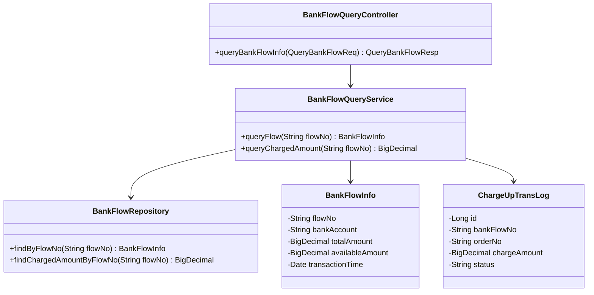
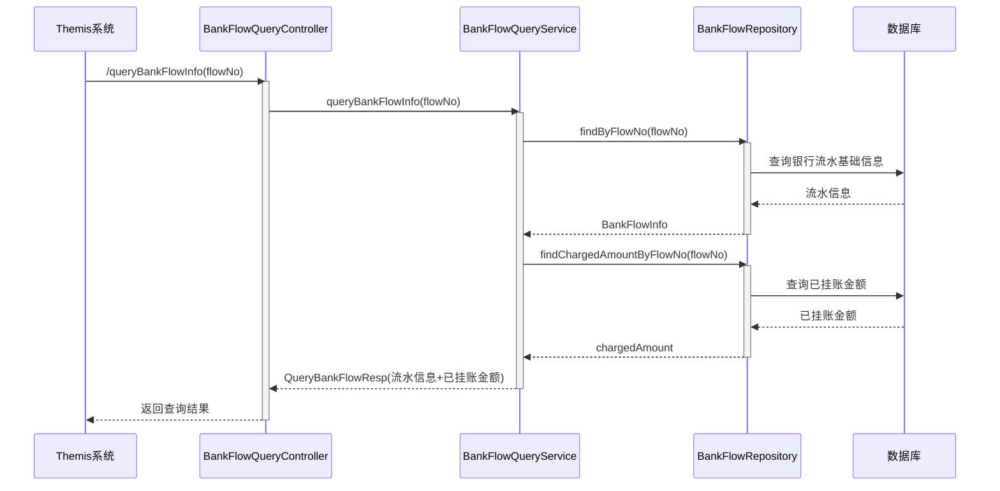
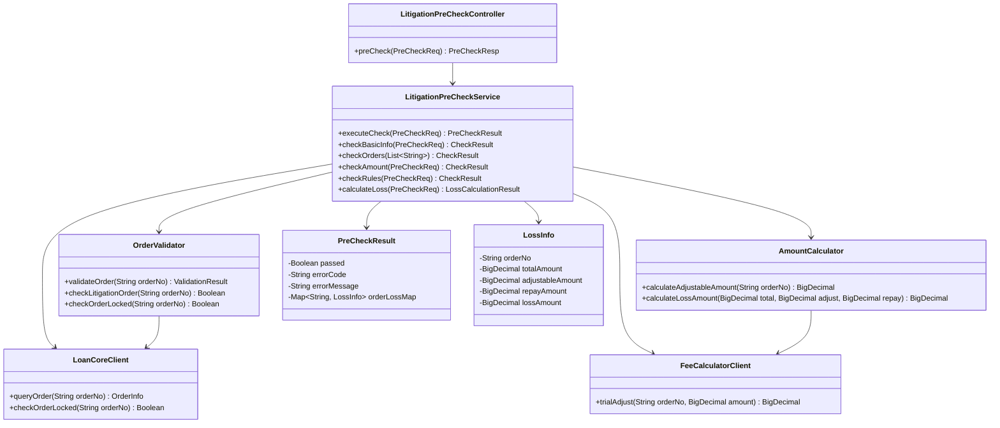
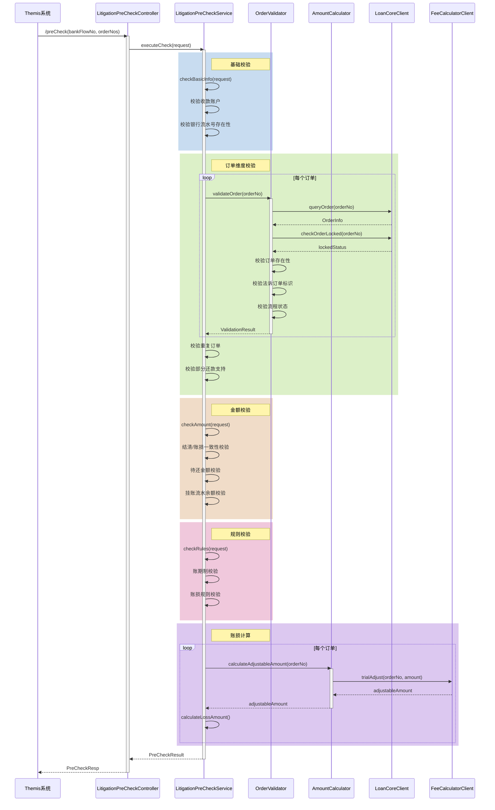
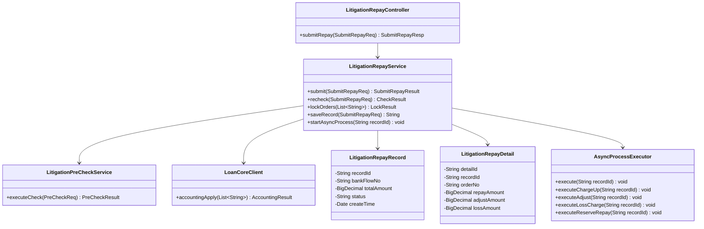
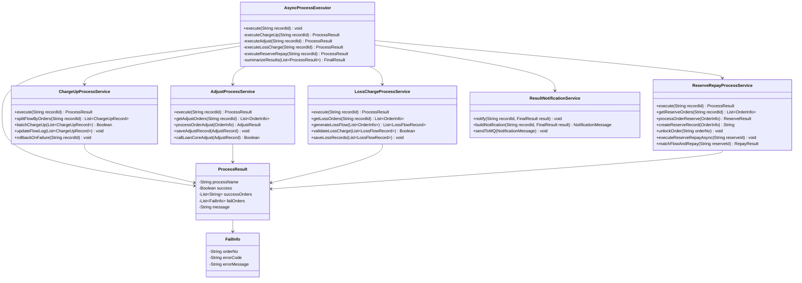
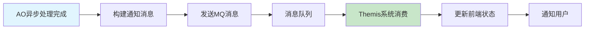
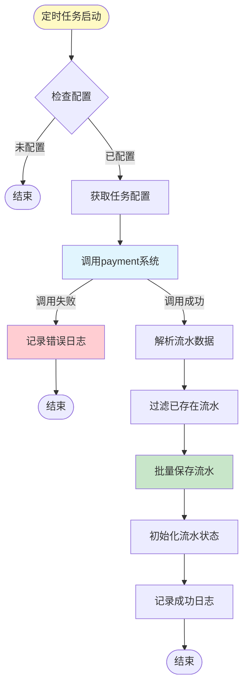

# AO系统-法诉自动入账详细设计V1.0

## 目录

（自动生成目录）

---

## 背景

### 需求（必填）
[[原始需求]]

### 概要设计（如有概要设计必须填写）
[[功能模块清单]]

### 术语表

| 术语 | 解释 |
|------|------|
| AO系统 | 会计运营系统（Accounting Operation） |
| 法诉订单 | 通过法律诉讼途径进行催收的订单 |
| 挂账 | 将收款金额暂时挂起，不直接核销到具体订单 |
| 账损 | 订单无法收回的金额损失 |
| 调账 | 对订单金额进行调整的操作 |
| 预约还款 | 预先安排还款计划，按计划执行扣款 |
| RE还款引擎 | Repay Engine，还款处理引擎 |

### 设计前提

1. **业务约束**：
   - 法诉订单还款必须经过BPM审核流程
   - 收款账户必须是法诉指定账户
   - 支持部分还款场景
   - 调账和账损处理可能部分失败

2. **技术约束**：
   - 使用现有AO系统的挂账、调账、预约还款能力
   - 异步处理流程需保证幂等性和可追溯性
   - 与loancore、feecalculator、repayengine等系统保持现有集成方式

3. **性能约束**：
   - 批量挂账需支持高并发场景
   - 异步流程处理时间需控制在可接受范围内

---

## 「AO系统」的功能设计（必填）

| 功能名 | 功能描述 | 功能分级 |
|--------|----------|----------|
| 流水查询模块 | 提供银行流水及已挂账金额查询功能 | B-支撑功能 |
| 预校验模块 | 对法诉自动入账进行全面的前置校验 | A-核心功能 |
| 提交还款模块 | 校验通过后正式提交还款，锁定订单账务 | A-核心功能 |
| 批量挂账流程 | 将银行流水按订单拆分成多笔挂账记录 | A-核心功能 |
| 调账减免流程 | 对需要减免的订单逐个发起调账 | A-核心功能 |
| 账损挂账流程 | 对有账损的订单批量生成账损挂账 | A-核心功能 |
| 预约还款流程 | 对扣除调账/账损后仍需还款的订单发起预约还款 | A-核心功能 |
| 结果汇总与通知 | 汇总所有异步子流程的执行结果，更新最终状态并通知 | B-支撑功能 |

---

## 「流水查询模块」设计

### 功能设计

#### 类图

##### 各功能核心类图



##### 各功能核心类说明

| 类名 | 作用说明 | 设计模式 |
|------|----------|----------|
| BankFlowQueryController | 对外暴露的查询接口控制器，接收Themis系统的查询请求 | MVC模式 |
| BankFlowQueryService | 流水查询核心服务，整合流水信息和已挂账金额查询 | 服务层模式 |
| BankFlowInfo | 银行流水信息实体，封装流水基本数据 | 值对象模式 |
| ChargeUpTransLog | 挂账日志实体（复用现有表），记录挂账流水历史 | 实体模式 |
| BankFlowRepository | 流水数据访问层，负责数据库查询操作 | 仓储模式 |

#### 时序图

##### 系统流程时序图



##### 系统流程图说明

**业务场景**：Themis系统查询法诉还款可用的银行流水信息

**流程说明**：
1. Themis系统调用AO系统的`/queryBankFlowInfo`接口，传入银行流水号
2. AO系统查询本地存储的银行流水基础信息
3. AO系统查询该流水已挂账的金额明细
4. 汇总返回流水总额、可用余额（总额-已挂账）和挂账明细

**注意点**：
- 本模块仅做数据查询，不进行任何状态变更
- 可用余额 = 流水总额 - 已挂账金额
- 支持查询历史挂账记录明细

### 接口详细设计（必填）

#### AO系统-流水查询接口

**接口路径**：`POST /api/ao/litigation/queryBankFlowInfo`

**接口描述**：查询银行流水信息及已挂账金额

**【接口定义参数规范】**

**Header参数**：

| 参数名 | 类型 | 长度 | 必输 | 说明 |
|--------|------|------|------|------|
| Content-Type | String | - | Y | application/json |
| X-Request-Id | String | 64 | Y | 请求追踪ID |

**Query参数**：无

**Path参数**：无

**Request Body参数**：

| 参数名 | 类型 | 长度 | 必输 | 说明 |
|--------|------|------|------|------|
| bankFlowNo | String | 64 | Y | 银行流水号 |

**Request Body样例**：
```json
{
  "bankFlowNo": "BF202502250001"
}
```

**Response Body参数**：

| 参数名 | 类型 | 必输 | 说明 |
|--------|------|------|------|
| code | String | Y | 响应码，000000表示成功 |
| message | String | Y | 响应消息 |
| data | Object | Y | 响应数据 |
| data.flowNo | String | Y | 银行流水号 |
| data.bankAccount | String | Y | 收款银行账户 |
| data.totalAmount | BigDecimal | Y | 流水总金额 |
| data.chargedAmount | BigDecimal | Y | 已挂账金额 |
| data.availableAmount | BigDecimal | Y | 可用余额（总额-已挂账） |
| data.transactionTime | String | Y | 交易时间（yyyy-MM-dd HH:mm:ss） |
| data.chargeDetails | List | Y | 挂账明细列表 |
| data.chargeDetails[].orderNo | String | Y | 订单号 |
| data.chargeDetails[].chargeAmount | BigDecimal | Y | 挂账金额 |

**Response Body样例**：
```json
{
  "code": "000000",
  "message": "success",
  "data": {
    "flowNo": "BF202502250001",
    "bankAccount": "6222021234567890",
    "totalAmount": 100000.00,
    "chargedAmount": 20000.00,
    "availableAmount": 80000.00,
    "transactionTime": "2025-02-25 10:30:00",
    "chargeDetails": [
      {
        "orderNo": "O001",
        "chargeAmount": 20000.00
      }
    ]
  }
}
```

**接口评估**：

- **预估最高QPS**：100 QPS，无大的请求/响应Body
- **熔断和限流设计**：
  - 使用Sentinel进行接口限流，QPS阈值设为150
  - 降级方案：当查询超时或失败时，返回错误提示，不影响业务主流程
- **异常抛出**：
  - 流水号不存在时返回业务错误码（不为null对象）
  - 数据库异常时返回系统错误码
- **接口变更影响**：
  - 新增接口，无兼容性问题
  - 调用链：Themis -> AO

---

## 「预校验模块」设计

### 功能设计

#### 类图

##### 各功能核心类图



##### 各功能核心类说明

| 类名 | 作用说明 | 设计模式 |
|------|----------|----------|
| LitigationPreCheckController | 预校验接口控制器 | MVC模式 |
| LitigationPreCheckService | 预校验核心服务，编排各类校验逻辑 | 服务层模式、策略模式 |
| OrderValidator | 订单校验器，负责订单维度的各类校验 | 验证器模式 |
| AmountCalculator | 金额计算器，负责调账试算和账损计算 | 计算器模式 |
| FeeCalculatorClient | 费用计算客户端，调用feecalculator系统 | 外观模式 |
| LoanCoreClient | loancore客户端，查询订单信息 | 外观模式 |
| PreCheckResult | 预校验结果对象 | 值对象模式 |
| LossInfo | 账损信息对象 | 值对象模式 |

#### 时序图

##### 系统流程时序图



##### 系统流程图说明

**业务场景**：Themis系统发起法诉自动入账预校验

**流程说明**：
1. Themis系统调用预校验接口，传入银行流水号和订单列表
2. AO系统执行四大类校验：
   - **基础校验**：收款账户、流水号校验
   - **订单维度校验**：订单状态、法诉标识、锁定状态等
   - **金额校验**：结清/账损一致性、待还金额、挂账余额
   - **规则校验**：账期制、账损规则
3. 调用feecalculator进行调账试算
4. 计算各订单账损金额
5. 返回校验结果和账损信息

**注意点**：
- 所有校验项遵循"快速失败"原则，任一校验失败立即返回
- 调账试算失败不影响校验通过，但账损金额为0
- 校验结果需记录详细的失败原因

### 接口详细设计（必填）

#### AO系统-预校验接口

**接口路径**：`POST /api/ao/litigation/preCheck`

**接口描述**：法诉自动入账预校验

**【接口定义参数规范】**

**Header参数**：

| 参数名 | 类型 | 长度 | 必输 | 说明 |
|--------|------|------|------|------|
| Content-Type | String | - | Y | application/json |
| X-Request-Id | String | 64 | Y | 请求追踪ID |

**Request Body参数**：

| 参数名 | 类型 | 长度 | 必输 | 说明 |
|--------|------|------|------|------|
| bankFlowNo | String | 64 | Y | 银行流水号 |
| orderNos | List<String> | 100 | Y | 订单号列表，最多100个 |

**Request Body样例**：
```json
{
  "bankFlowNo": "BF202502250001",
  "orderNos": ["O001", "O002", "O003"]
}
```

**Response Body参数**：

| 参数名 | 类型 | 必输 | 说明 |
|--------|------|------|------|
| code | String | Y | 响应码，000000表示成功 |
| message | String | Y | 响应消息 |
| data | Object | Y | 响应数据 |
| data.passed | Boolean | Y | 校验是否通过 |
| data.failReason | String | N | 失败原因（校验不通过时返回） |
| data.failType | String | N | 失败类型：BASIC/ORDER/AMOUNT/RULE |
| data.orderLossInfo | List | Y | 订单账损信息列表 |
| data.orderLossInfo[].orderNo | String | Y | 订单号 |
| data.orderLossInfo[].totalAmount | BigDecimal | Y | 应还总金额 |
| data.orderLossInfo[].adjustableAmount | BigDecimal | Y | 可调减金额 |
| data.orderLossInfo[].repayAmount | BigDecimal | Y | 本次还款金额 |
| data.orderLossInfo[].lossAmount | BigDecimal | Y | 账损金额 |

**Response Body样例（成功）**：
```json
{
  "code": "000000",
  "message": "success",
  "data": {
    "passed": true,
    "orderLossInfo": [
      {
        "orderNo": "O001",
        "totalAmount": 50000.00,
        "adjustableAmount": 10000.00,
        "repayAmount": 30000.00,
        "lossAmount": 10000.00
      },
      {
        "orderNo": "O002",
        "totalAmount": 20000.00,
        "adjustableAmount": 0,
        "repayAmount": 20000.00,
        "lossAmount": 0
      }
    ]
  }
}
```

**Response Body样例（失败）**：
```json
{
  "code": "000000",
  "message": "success",
  "data": {
    "passed": false,
    "failReason": "订单O003非法诉订单",
    "failType": "ORDER",
    "orderLossInfo": []
  }
}
```

**接口评估**：

- **预估最高QPS**：50 QPS，中等RequestBody
- **熔断和限流设计**：
  - 使用Sentinel进行接口限流，QPS阈值设为80
  - 降级方案：feecalculator不可用时，返回可调减金额为0
- **异常抛出**：
  - 校验失败返回业务错误（passed=false，不为null）
  - 系统异常返回系统错误码
- **接口变更影响**：
  - 新增接口，无兼容性问题
  - 调用链：Themis -> AO -> loancore/feecalculator

---

## 「提交还款模块」设计

### 功能设计

#### 类图

##### 各功能核心类图



##### 各功能核心类说明

| 类名 | 作用说明 | 设计模式 |
|------|----------|----------|
| LitigationRepayController | 提交还款接口控制器 | MVC模式 |
| LitigationRepayService | 提交还款核心服务 | 服务层模式 |
| LitigationPreCheckService | 复用预校验服务 | 复用模式 |
| LoanCoreClient | loancore客户端，锁定订单账务 | 外观模式 |
| LitigationRepayRecord | 法诉还款记录实体 | 实体模式 |
| LitigationRepayDetail | 法诉还款详情实体 | 实体模式 |
| AsyncProcessExecutor | 异步流程执行器 | 命令模式 |

#### 时序图

##### 系统流程时序图

```mermaid
sequenceDiagram
    participant T as Themis系统
    participant C as LitigationRepayController
    participant S as LitigationRepayService
    participant PS as LitigationPreCheckService
    participant LC as LoanCoreClient
    participant AE as AsyncProcessExecutor
    participant DB as 数据库

    T->>C: /submitRepay(request)
    activate C

    C->>S: submit(request)
    activate S

    rect rgb(240, 200, 200)
    note right of S: 1. 再次校验
    S->>PS: executeCheck(request)
    activate PS
    PS-->>S: PreCheckResult
    deactivate PS

    alt 校验失败
        S-->>C: 返回校验失败
        C-->>T: 提交失败响应
        deactivate S
        deactivate C
    end
    end

    rect rgb(200, 240, 200)
    note right of S: 2. 锁定订单账务
    S->>LC: accountingApply(orderNos)
    activate LC
    LC->>LC: 锁定订单账务
    LC-->>S: LockResult
    deactivate LC

    alt 锁定失败
        S-->>C: 返回锁定失败
        C-->>T: 提交失败响应
        deactivate S
        deactivate C
    end
    end

    rect rgb(200, 200, 240)
    note right of S: 3. 保存还款记录
    S->>DB: 保存LitigationRepayRecord
    S->>DB: 保存LitigationRepayDetail
    DB-->>S: recordId
    end

    rect rgb(240, 240, 200)
    note right of S: 4. 启动异步处理
    S->>AE: execute(recordId)
    activate AE
    note right of AE: 异步执行以下流程：<br/>1. 批量挂账<br/>2. 调账减免<br/>3. 账损挂账<br/>4. 预约还款
    end
    end

    S-->>C: 返回处理中
    deactivate S
    C-->>T: 提交成功响应(状态=处理中)
    deactivate C
```

##### 系统流程图说明

**业务场景**：Themis系统提交法诉自动入账请求

**流程说明**：
1. **再次校验**：复用预校验模块的所有校验逻辑
2. **锁定订单账务**：调用loancore的`/accounting/apply`接口锁定
3. **保存还款记录**：写入法诉还款记录表和详情表
4. **启动异步处理**：触发异步执行器，处理后续流程

**注意点**：
- 再次校验确保数据未被修改
- 锁定失败则直接返回，不启动异步流程
- 异步处理在后台执行，前端显示"处理中"状态

### 接口详细设计（必填）

#### AO系统-提交还款接口

**接口路径**：`POST /api/ao/litigation/submitRepay`

**接口描述**：提交法诉自动入账

**【接口定义参数规范】**

**Header参数**：

| 参数名 | 类型 | 长度 | 必输 | 说明 |
|--------|------|------|------|------|
| Content-Type | String | - | Y | application/json |
| X-Request-Id | String | 64 | Y | 请求追踪ID |

**Request Body参数**：

| 参数名 | 类型 | 长度 | 必输 | 说明 |
|--------|------|------|------|------|
| bankFlowNo | String | 64 | Y | 银行流水号 |
| orderList | List<Object> | 100 | Y | 订单列表 |
| orderList[].orderNo | String | 32 | Y | 订单号 |
| orderList[].repayAmount | BigDecimal | 18,2 | Y | 还款金额 |
| orderList[].adjustAmount | BigDecimal | 18,2 | N | 调减金额 |
| orderList[].lossAmount | BigDecimal | 18,2 | N | 账损金额 |

**Request Body样例**：
```json
{
  "bankFlowNo": "BF202502250001",
  "orderList": [
    {
      "orderNo": "O001",
      "repayAmount": 30000.00,
      "adjustAmount": 10000.00,
      "lossAmount": 10000.00
    },
    {
      "orderNo": "O002",
      "repayAmount": 20000.00,
      "adjustAmount": 0,
      "lossAmount": 0
    }
  ]
}
```

**Response Body参数**：

| 参数名 | 类型 | 必输 | 说明 |
|--------|------|------|------|
| code | String | Y | 响应码，000000表示成功 |
| message | String | Y | 响应消息 |
| data | Object | Y | 响应数据 |
| data.recordId | String | Y | 还款记录ID |
| data.status | String | Y | 状态：PROCESSING-处理中 |

**Response Body样例（成功）**：
```json
{
  "code": "000000",
  "message": "提交成功",
  "data": {
    "recordId": "LRR202502250001",
    "status": "PROCESSING"
  }
}
```

**Response Body样例（校验失败）**：
```json
{
  "code": "400001",
  "message": "订单O003非法诉订单",
  "data": null
}
```

**接口评估**：

- **预估最高QPS**：20 QPS，中等RequestBody
- **熔断和限流设计**：
  - 使用Sentinel进行接口限流，QPS阈值设为30
  - 降级方案：loancore不可用时，返回锁定失败
- **异常抛出**：
  - 业务校验失败返回具体错误码
  - 系统异常返回500错误
- **接口变更影响**：
  - 新增接口，无兼容性问题
  - 调用链：Themis -> AO -> loancore

---

## 「异步处理核心模块」设计

### 功能设计

异步处理核心模块包含四个子流程：批量挂账、调账减免、账损挂账、预约还款。这四个子流程按顺序执行，最终汇总结果通知。

#### 类图

##### 各功能核心类图



##### 各功能核心类说明

| 类名 | 作用说明 | 设计模式 |
|------|----------|----------|
| AsyncProcessExecutor | 异步流程执行器，编排四个子流程 | 模板方法模式 |
| ChargeUpProcessService | 批量挂账处理服务 | 策略模式 |
| AdjustProcessService | 调账减免处理服务 | 策略模式 |
| LossChargeProcessService | 账损挂账处理服务 | 策略模式 |
| ReserveRepayProcessService | 预约还款处理服务 | 策略模式 |
| ResultNotificationService | 结果通知服务 | 观察者模式 |
| ProcessResult | 子流程处理结果对象 | 值对象模式 |
| FailInfo | 失败信息对象 | 值对象模式 |

#### 时序图

##### 系统流程时序图

```mermaid
sequenceDiagram
    participant AE as AsyncProcessExecutor
    participant CU as ChargeUpProcessService
    participant AD as AdjustProcessService
    participant LC as LossChargeProcessService
    participant RR as ReserveRepayProcessService
    participant RN as ResultNotificationService
    participant LCClient as LoanCoreClient
    participant RE as RepayEngineClient
    participant MQ as MQ消息队列

    AE->>AE: execute(recordId)

    rect rgb(200, 220, 240)
    note right of AE: 步骤1: 批量挂账
    AE->>CU: execute(recordId)
    activate CU
    CU->>CU: 按订单拆分流水
    CU->>CU: 批量插入挂账记录
    CU->>CU: 更新流水日志

    alt 挂账失败
        CU->>CU: 解冻流水
        CU->>LCClient: 解锁订单
        CU-->>AE: ProcessResult(失败)
        deactivate CU
        AE->>RN: notify(recordId, 全部失败)
        RN->>MQ: 发送失败通知
        AE-->>AE: 结束流程
    else 挂账成功
        CU-->>AE: ProcessResult(成功)
        deactivate CU
    end
    end

    rect rgb(220, 240, 200)
    note right of AE: 步骤2: 调账减免
    AE->>AD: execute(recordId)
    activate AD

    loop 每个需调账订单
        AD->>AD: 调账规则校验
        AD->>AD: 计算调账金额
        AD->>AD: 保存调账记录
        AD->>LCClient: 发起调账
        LCClient-->>AD: 调账结果
        AD->>AD: 记录结果
    end

    AD-->>AE: ProcessResult(部分成功)
    deactivate AD
    end

    rect rgb(240, 220, 200)
    note right of AE: 步骤3: 账损挂账
    AE->>LC: execute(recordId)
    activate LC
    LC->>LC: 筛选账损订单

    alt 存在账损订单
        LC->>LC: 生成账损挂账流水
        LC->>LC: 账损批量挂账校验
        LC->>LC: 保存挂账记录
    end

    LC-->>AE: ProcessResult(成功)
    deactivate LC
    end

    rect rgb(240, 200, 220)
    note right of AE: 步骤4: 预约还款
    AE->>RR: execute(recordId)
    activate RR

    loop 每个待预约订单
        RR->>RR: 预约还款校验
        RR->>RR: 保存预约信息
        RR->>LCClient: 解锁订单账务

        par 异步执行预约还款
            RR->>RR: 匹配银行流水
            RR->>RE: 提交RE还款
            RE-->>RR: 还款结果
            RR->>RR: 更新预约状态
        end
    end

    RR->>RR: 查询预约还款结果
    RR-->>AE: ProcessResult(部分成功)
    deactivate RR
    end

    rect rgb(220, 200, 240)
    note right of AE: 步骤5: 结果汇总通知
    AE->>AE: summarizeResults(results)
    AE->>RN: notify(recordId, finalResult)
    activate RN
    RN->>RN: 构建通知消息
    RN->>MQ: 发送MQ消息
    RN-->>AE: 发送完成
    deactivate RN
    end
```

##### 系统流程图说明

**业务场景**：提交成功后，AO系统异步执行法诉自动入账的完整流程

**流程说明**：
1. **批量挂账**：将银行流水按订单拆分并挂账，失败则整体回滚
2. **调账减免**：对需减免订单逐个调账，记录成功/失败
3. **账损挂账**：对有账损的订单批量生成账损挂账流水
4. **预约还款**：对仍需还款的订单发起预约还款
5. **结果通知**：汇总所有子流程结果，发送MQ通知

**注意点**：
- 挂账失败会导致整个流程失败，需回滚
- 调账和还款可能部分失败，需记录详细失败原因
- 最终状态可能是：全部成功、部分成功、全部失败

---

## MQ设计

### 生产消息1

#### 法诉还款结果通知消息

**消息体：**

| 字段名 | 类型 | 含义 |
|--------|------|------|
| recordId | String | 还款记录ID |
| bankFlowNo | String | 银行流水号 |
| finalStatus | String | 最终状态：SUCCESS/PARTIAL_SUCCESS/FAILURE |
| totalAmount | BigDecimal | 还款总金额 |
| successAmount | BigDecimal | 成功金额 |
| failAmount | BigDecimal | 失败金额 |
| chargeUpStatus | String | 挂账状态 |
| adjustStatus | String | 调账状态 |
| lossChargeStatus | String | 账损挂账状态 |
| reserveRepayStatus | String | 预约还款状态 |
| processDetails | List<Object> | 处理详情 |
| processDetails[].orderNo | String | 订单号 |
| processDetails[].processName | String | 处理流程名称 |
| processDetails[].status | String | 订单处理状态 |
| processDetails[].amount | BigDecimal | 处理金额 |
| processDetails[].errorMsg | String | 错误信息 |
| createTime | String | 创建时间 |

**消息体样例：**
```json
{
  "recordId": "LRR202502250001",
  "bankFlowNo": "BF202502250001",
  "finalStatus": "PARTIAL_SUCCESS",
  "totalAmount": 50000.00,
  "successAmount": 30000.00,
  "failAmount": 20000.00,
  "chargeUpStatus": "SUCCESS",
  "adjustStatus": "PARTIAL_SUCCESS",
  "lossChargeStatus": "SUCCESS",
  "reserveRepayStatus": "PARTIAL_SUCCESS",
  "processDetails": [
    {
      "orderNo": "O001",
      "processName": "预约还款",
      "status": "SUCCESS",
      "amount": 30000.00,
      "errorMsg": null
    },
    {
      "orderNo": "O002",
      "processName": "预约还款",
      "status": "FAILURE",
      "amount": 20000.00,
      "errorMsg": "流水匹配失败"
    }
  ],
  "createTime": "2025-02-25 15:30:00"
}
```

**使用场景**：法诉自动入账全部流程完成后，通知Themis系统最终处理结果

**消费方应用名**：Themis系统

**流程图：**



---

## 调度任务设计

| 调度任务名称 | 应用名 | 并发数 | 执行周期 | JobExecutorClass | 调度任务说明 |
|--------------|--------|--------|----------|------------------|--------------|
| 银行流水同步任务 | ao-service | 最大全局并发数：1<br>最大单节点并发数：1 | trgger：CRON=0 0/10 * * * ? | cn.caijj.ao.job.BankFlowSyncJob.class | 定时从payment系统获取银行流水并保存到AO系统，支持指定银行账户和挂账标识过滤 |

#### 调度任务流程图



---

## 配置项设计

### 业务配置项

| 配置编码 | 配置值 | 说明 | 配置来源 |
|----------|--------|------|----------|
| litigation.litigation_account_list | 6222021234567890,6222021234567891 | 法诉指定收款账户列表，支持多个 | 页面配置 |
| litigation.enable_auto_repay | true | 法诉自动入账功能开关 | 页面配置 |
| litigation.bpm_timeout_minutes | 30 | BPM审核超时时间（分钟） | 页面配置 |
| litigation.adjust_retry_times | 3 | 调账失败重试次数 | 接口配置 |
| litigation.reserve_repay_timeout_seconds | 300 | 预约还款超时时间（秒） | 接口配置 |
| litigation.batch_charge_up_size | 100 | 批量挂账批次大小 | 接口配置 |

**配置项说明**：

1. **litigation.litigation_account_list**
   - **必要性**：用于校验收款账户是否为法诉指定账户
   - **可维护性**：账户列表清晰，用逗号分隔
   - **稳定性**：账户信息变更频率低，由财务部门发起变更

2. **litigation.enable_auto_repay**
   - **必要性**：功能开关，用于紧急情况下关闭法诉自动入账
   - **可维护性**：布尔值，含义明确
   - **稳定性**：非紧急情况不频繁变更

3. **litigation.bpm_timeout_minutes**
   - **必要性**：控制BPM审核流程的超时时间
   - **可维护性**：分钟数，易于理解
   - **稳定性**：根据业务需求调整，变更频率低

---

## 数据结构设计

### 数据库表设计

#### 新增表

**表1：法诉还款记录表（litigation_repay_record）**

| 字段名 | 类型 | 长度 | 允许空 | 主键 | 说明 |
|--------|------|------|--------|------|------|
| id | BIGINT | - | N | Y | 主键ID |
| record_id | VARCHAR | 64 | N | N | 还款记录ID（业务主键） |
| bank_flow_no | VARCHAR | 64 | N | N | 银行流水号 |
| bank_account | VARCHAR | 32 | N | N | 收款银行账户 |
| total_amount | DECIMAL | 18,2 | N | N | 还款总金额 |
| order_count | INT | - | N | N | 订单数量 |
| status | VARCHAR | 32 | N | N | 状态：PROCESSING/SUCCESS/PARTIAL_SUCCESS/FAILURE/CANCELLED |
| charge_up_status | VARCHAR | 32 | Y | N | 挂账状态 |
| adjust_status | VARCHAR | 32 | Y | N | 调账状态 |
| loss_charge_status | VARCHAR | 32 | Y | N | 账损挂账状态 |
| reserve_repay_status | VARCHAR | 32 | Y | N | 预约还款状态 |
| bpm_process_id | VARCHAR | 64 | Y | N | BPM流程ID |
| creator | VARCHAR | 64 | N | N | 创建人 |
| create_time | DATETIME | - | N | N | 创建时间 |
| updater | VARCHAR | 64 | Y | N | 更新人 |
| update_time | DATETIME | - | Y | N | 更新时间 |

**索引设计**：
- PRIMARY KEY (`id`)
- UNIQUE KEY `uk_record_id` (`record_id`)
- KEY `idx_bank_flow_no` (`bank_flow_no`)
- KEY `idx_status` (`status`)
- KEY `idx_create_time` (`create_time`)

**表数据增量情况评估**：
- 每天预计增加500-1000行数据

**表2：法诉还款详情表（litigation_repay_detail）**

| 字段名 | 类型 | 长度 | 允许空 | 主键 | 说明 |
|--------|------|------|--------|------|------|
| id | BIGINT | - | N | Y | 主键ID |
| detail_id | VARCHAR | 64 | N | N | 详情ID（业务主键） |
| record_id | VARCHAR | 64 | N | N | 还款记录ID |
| order_no | VARCHAR | 32 | N | N | 订单号 |
| repay_amount | DECIMAL | 18,2 | N | N | 还款金额 |
| adjust_amount | DECIMAL | 18,2 | Y | N | 调减金额 |
| loss_amount | DECIMAL | 18,2 | Y | N | 账损金额 |
| adjust_work_no | VARCHAR | 64 | Y | N | 调账工单号 |
| adjust_status | VARCHAR | 32 | Y | N | 调账状态 |
| adjust_msg | VARCHAR | 512 | Y | N | 调账结果消息 |
| reserve_id | VARCHAR | 64 | Y | N | 预约还款ID |
| reserve_status | VARCHAR | 32 | Y | N | 预约状态 |
| reserve_msg | VARCHAR | 512 | Y | N | 预约结果消息 |
| create_time | DATETIME | - | N | N | 创建时间 |
| update_time | DATETIME | - | Y | N | 更新时间 |

**索引设计**：
- PRIMARY KEY (`id`)
- UNIQUE KEY `uk_detail_id` (`detail_id`)
- KEY `idx_record_id` (`record_id`)
- KEY `idx_order_no` (`order_no`)

**表数据增量情况评估**：
- 每天预计增加2000-5000行数据（一个还款记录包含多个订单）

#### 已有表（需适配）

以下表为AO系统已有表，本次需适配以支持法诉自动入账场景：

**表3：挂账日志表（charge_up_trans_log）**

需增加字段：
- `biz_type` VARCHAR(32)：业务类型，区分法诉场景（LITIGATION）
- `record_id` VARCHAR(64)：关联法诉还款记录ID

**表4：挂账记录表（over_flow_payment）**

需增加字段：
- `biz_type` VARCHAR(32)：业务类型
- `record_id` VARCHAR(64)：关联法诉还款记录ID

**表5：挂账工单表（charge_up_work_order）**

需增加字段：
- `biz_type` VARCHAR(32)：业务类型，支持账损挂账（LOSS_CHARGE）
- `record_id` VARCHAR(64)：关联法诉还款记录ID

**表6：调账工单表（account_adjust_work_order）**

需增加字段：
- `biz_type` VARCHAR(32)：业务类型，区分法诉调账
- `record_id` VARCHAR(64)：关联法诉还款记录ID
- `detail_id` VARCHAR(64)：关联法诉还款详情ID

**表7：调账交易日志表（account_adjust_trans_log）**

需增加字段：
- `biz_type` VARCHAR(32)：业务类型
- `record_id` VARCHAR(64)：关联法诉还款记录ID

**表8：预约还款表（offline_repay_reserve_info）**

需增加字段：
- `biz_type` VARCHAR(32)：业务类型，区分法诉预约（LITIGATION）
- `record_id` VARCHAR(64)：关联法诉还款记录ID
- `litigation_flag` TINYINT：法诉标识，1-法诉订单

**表9：预约详情表（offline_repay_reserve_detail）**

需增加字段：
- `litigation_flag` TINYINT：法诉标识

**表10：线下还款预约流程表（offline_repay_reserve_process）**

需增加字段：
- `litigation_flag` TINYINT：法诉标识

#### 数据库表结构变更影响性分析

本次变更涉及：

1. **新增表**：2张新表，无影响性评估
2. **已有表增加字段**：8张表增加字段

**影响性评估**：

| 表名 | 变更类型 | 影响评估 |
|------|----------|----------|
| charge_up_trans_log | 增加字段 | 低影响，新增字段为可空字段 |
| over_flow_payment | 增加字段 | 低影响，新增字段为可空字段 |
| charge_up_work_order | 增加字段 | 低影响，新增字段为可空字段 |
| account_adjust_work_order | 增加字段 | 低影响，新增字段为可空字段 |
| account_adjust_trans_log | 增加字段 | 低影响，新增字段为可空字段 |
| offline_repay_reserve_info | 增加字段 | 低影响，新增字段为可空字段 |
| offline_repay_reserve_detail | 增加字段 | 低影响，新增字段为可空字段 |
| offline_repay_reserve_process | 增加字段 | 低影响，新增字段为可空字段 |

**数仓协调**：需通知数仓团队新增表和字段变更

---

## 运维设计

### 灰度切换方案设计

本次功能为全新功能，不存在新老版本并行的情况，无需灰度切换方案。

### 系统和业务监控告警设计

#### 接口监控

1. **流水查询接口监控**
   - **告警指标**：接口响应时间
   - **告警指标生成逻辑**：记录接口调用耗时
   - **告警内容**：流水查询接口响应超时
   - **告警规则**：histogram_quantile(0.95, http_server_requests_seconds{uri="/api/ao/litigation/queryBankFlowInfo"}) > 3

2. **预校验接口监控**
   - **告警指标**：预校验失败率
   - **告警指标生成逻辑**：预校验失败次数 / 总调用次数
   - **告警内容**：预校验失败率过高
   - **告警规则**：sum(rate(litigation_precheck_failed_total[5m])) / sum(rate(litigation_precheck_total[5m])) > 0.5

3. **提交还款接口监控**
   - **告警指标**：提交失败次数
   - **告警指标生成逻辑**：记录提交失败的业务错误码
   - **告警内容**：法诉还款提交失败
   - **告警规则**：sum(increase(litigation_submit_failed_total[1m])) > 10

#### 业务监控

1. **异步流程处理监控**
   - **告警指标**：异步处理失败率
   - **告警指标生成逻辑**：处理失败记录数 / 总处理记录数
   - **告警内容**：法诉还款异步处理失败
   - **告警规则**：sum(rate(litigation_async_failed_total[5m])) / sum(rate(litigation_async_total[5m])) > 0.3

2. **调账失败监控**
   - **告警指标**：调账失败次数
   - **告警指标生成逻辑**：记录调账调用loancore失败次数
   - **告警内容**：法诉还款调账失败
   - **告警规则**：sum(increase(litigation_adjust_failed_total[1m])) > 5

3. **预约还款失败监控**
   - **告警指标**：预约还款失败次数
   - **告警指标生成逻辑**：记录预约还款调用repayengine失败次数
   - **告警内容**：法诉预约还款失败
   - **告警规则**：sum(increase(litigation_reserve_failed_total[1m])) > 5

4. **MQ消息发送监控**
   - **告警指标**：MQ消息发送失败
   - **告警指标生成逻辑**：记录MQ消息发送失败次数
   - **告警内容**：法诉还款结果通知发送失败
   - **告警规则**：sum(increase(litigation_mq_send_failed_total[1m])) > 0

#### 数据库监控

1. **表数据量监控**
   - **告警指标**：法诉还款记录表数据量
   - **告警内容**：litigation_repay_record表数据量过大
   - **告警规则**：litigation_repay_record_count > 1000000

---

## 权限设计

本功能为后端系统功能，不涉及O系统权限设计。

---

## 技术改造识别

| 技术改造项概要 | 涉及功能 | 风险和影响评估 | 技术改造项REQ | 计划整改完成时间 |
|----------------|----------|----------------|---------------|------------------|
| 预约还款流程需增加法诉标识支持 | 预约还款流程 | 需与repayengine联调，确保法诉标识正确传递 | REQ-LITIGATION-001 | 2025-03-15 |
| 现有挂账表需适配法诉场景 | 批量挂账/账损挂账 | 需评估对现有业务的影响，确保数据正确性 | REQ-LITIGATION-002 | 2025-03-01 |

---

## 参考资料

- [[原始需求]]
- [[功能模块清单]]
- [数据结构变更设计评审标准v2.9](http://wiki.caijj.net/pages/viewpage.action?pageId=186638813)
- [1.限流服务-用户手册](http://wiki.caijj.net/pages/viewpage.action?pageId=128187340)
- [系统设计规范V2.1-指标监控](http://wiki.caijj.net/pages/viewpage.action?pageId=128187340#B5.3.2%E7%B3%BB%E7%BB%9F%E8%AE%BE%E8%AE%A1%E8%A7%84%E8%8C%83V2.1-%E6%8C%87%E6%A0%87%E7%9B%91%E6%8E%A7)

---

*文档版本：V1.0*
*创建时间：2025-02-25*
*作者：Claude*
