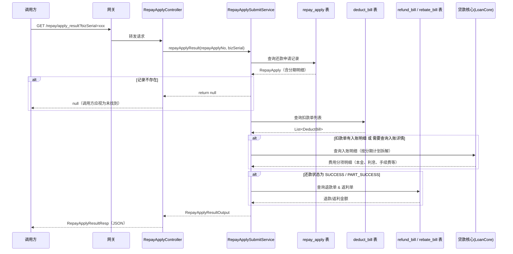

# 还款申请结果查询

## 1. 概述

| 属性 | 值 |
|------|-----|
| **接口名称** | 还款申请结果查询 |
| **接口路径** | `GET /repayengine/repay/apply_result` |
| **所属应用** | repayengine |
| **负责人** | 吴清武 |
| **版本** | V1.0 |
| **更新日期** | 2026-04-10 |
| **接口状态** | ONLINE |

---

## 2. 核心业务流程

### 2.1 业务背景

还款申请结果查询接口是 repayengine 的核心查询入口，用于查询还款申请的处理结果。由于还款采用 3 层异步架构（同步受理 → 异步扣款 → 异步入账），调用方在提交还款申请后需要通过该接口轮询或回调后主动查询还款的最终状态。

该接口支持两种查询方式：通过调用方传入的 `bizSerial`（业务流水号）或 repayengine 生成的 `repayApplyNo`（还款申请号）进行查询。返回结果包含还款状态、扣款明细（含各费用分项拆解）、退款/返现信息、失败原因等完整信息，供调用方展示还款结果或进行后续业务处理。

### 2.2 业务时序图



### 2.3 业务规则

| 规则编号 | 规则描述 | 处理方式 |
|---------|---------|---------|
| R1 | 查询参数 `bizSerial` 和 `repayApplyNo` 至少提供一个 | 两者均为空时返回 null |
| R2 | 查询优先级：`repayApplyNo` 优先于 `bizSerial` | 同时传入时使用 `repayApplyNo` 查询 |
| R3 | 退款/返利信息仅在还款成功或部分成功时聚合 | 状态为 `SUCCESS` 或 `PART_SUCCESS` 时查询 refund_bill 和 rebate_bill |
| R4 | 入账明细数据源优先从扣款单扩展信息获取 | 扣款单无明细或入账成功时，回源贷款核心查询 |
| R5 | 拆分扣款判断：扣款单数量 > 1 即视为拆分 | `repayApplySplit` 字段标识 |
| R6 | 失败标准码仅从失败/中止状态的扣款单提取 | 状态为 `DEDUCT_FAILED`、`RECORD_FAILED`、`ABORTED` 的扣款单 |

---

## 3. 接口定义

### 3.1 请求参数

| 参数名 | 类型 | 必填 | 说明 |
|--------|------|------|------|
| bizSerial | String | 否* | 提交流水号（还款申请时传入），与 repayApplyNo 二选一 |
| repayApplyNo | String | 否* | 还款流水号（repayengine 生成），与 bizSerial 二选一 |

> *至少需要提供一个参数，否则返回 null。

### 3.2 请求示例

```
GET /repayengine/repay/apply_result?repayApplyNo=RA20260410120000001
```

或

```
GET /repayengine/repay/apply_result?bizSerial=BIZ20260410120000001
```

### 3.3 响应参数

| 参数名 | 类型 | 说明 |
|--------|------|------|
| uid | String | 用户 ID |
| bizSerial | String | 提交流水号（还款申请传入） |
| repayApplyNo | String | 还款流水号（repayengine 生成） |
| lockSerial | String | 锁单序列号 |
| repayType | String | 还款类型：`BY_STAGE_PLAN`(按分期计划) / `BY_AMOUNT`(按金额) |
| repayWay | String | 还款方式：`AUTO_DEDUCT` / `MANUAL_REPAY` / `MANUAL_DEDUCT` / `AO_OFFLINE` |
| repayTag | String | 业务标签 |
| repayAmount | Integer | 还款金额（单位：分） |
| successAmount | Integer | 成功扣款金额（单位：分） |
| failureAmount | Integer | 失败扣款金额（单位：分） |
| status | String | 当前还款状态（见下方状态枚举） |
| repayApplySplit | Boolean | 是否被拆分扣款（扣款单数量 > 1） |
| requestSource | String | 请求来源 |
| stageOrderNoList | String[] | 关联订单号列表 |
| stagePlanNoList | String[] | 关联分期计划号列表 |
| stagePlanItemList | StagePlanItemVo[] | 还款项集合（见下方） |
| repayDetailList | StagePlanVo[] | 还款入账明细（见下方） |
| rebackAmount | Integer | 本次还款返现金额（含提前结清返现和优惠返现，单位：分） |
| rebackCardNo | String | 本次还款返现卡号（如有） |
| rebackChannel | String | 本次还款返现渠道 |
| reduceAmount | Integer | 订单累计减免金额（单位：分），非本次还款减免 |
| standardCodeList | String[] | 扣款单失败的标准码集合 |
| standardMessageList | String[] | 扣款单失败的标准话术集合 |
| message | String | 扣款失败原始原因 |
| extInfoMap | Map\<String, String\> | 扩展信息，需与 repayengine 约定 |
| createAt | DateTime | 还款申请时间 |
| updateAt | DateTime | 还款申请更新时间 |

#### status 状态枚举

| 状态值 | 含义 | 说明 |
|--------|------|------|
| INIT | 还款处理中 | 初始状态，正在处理 |
| INIT_ABORT | 还款提交失败 | 同步阶段校验失败 |
| PRE_LOCK | 还款待扣款 | 已锁单，等待扣款 |
| PROCESSING | 还款扣款中 | 异步扣款执行中 |
| SUCCESS | 还款成功 | 全部扣款入账成功 |
| PART_SUCCESS | 部分还款成功 | 部分扣款成功 |
| FAILURE | 还款失败 | 全部扣款失败 |

#### StagePlanItemVo（还款项）

| 参数名 | 类型 | 说明 |
|--------|------|------|
| stagePlanNo | String | 分期计划号 |
| stageOrderNo | String | 分期订单号 |
| amount | Integer | 金额（单位：分） |

#### StagePlanVo（还款入账明细）

| 参数名 | 类型 | 说明 |
|--------|------|------|
| orderNo | String | 订单号 |
| stagePlanNo | String | 分期号 |
| billNo | String | 账期号 |
| repayChannel | String | 扣款通道 |
| payChannel | String | 扣款渠道：`DOCKING` / `PAYMENT` / `GUARANTEE` / `PARTNER` / `COUPON` / `AO_OFFLINE` 等 |
| payType | String | 支付方式：`DEBIT_CARD` / `WECHAT_PAY` / `ALIPAY_SDK` / `OVER_PAY` / `BALANCE_PAY` / `COUPON_PAY` 等 |
| deductStatus | String | 扣款状态：`INIT` / `PRE_DEDUCT` / `DEDUCTING` / `DEDUCT_SUCCESS` / `DEDUCT_FAILED` / `RECORD_SUCCESS` / `RECORD_FAILED` / `ABORTED` |
| deductDesc | String | 扣款状态描述 |
| repayAmount | Integer | 实际入账金额（单位：分） |
| principle | Integer | 入账本金 |
| fee | Integer | 入账手续费 |
| lateFee | Integer | 入账滞纳金 |
| interest | Integer | 入账罚息 |
| warrantyFee | Integer | 入账保费 |
| earlySettleFee | Integer | 入账提前结清手续费 |
| amcFee | Integer | 入账资产管理咨询费 |
| changePrinciple | Integer | 调整本金 |
| changeFee | Integer | 调整手续费 |
| changeInterest | Integer | 调整罚息 |
| changeWarrantyFee | Integer | 调整保费 |
| changeEarlySettleFee | Integer | 调整提前结清手续费 |
| changeAmcFee | Integer | 调整资产管理咨询费 |

### 3.4 响应示例

**还款成功：**

```json
{
  "uid": "U123456789",
  "bizSerial": "BIZ20260410120000001",
  "repayApplyNo": "RA20260410120000001",
  "lockSerial": "LOCK20260410001",
  "repayType": "BY_STAGE_PLAN",
  "repayWay": "MANUAL_REPAY",
  "repayTag": null,
  "repayAmount": 100000,
  "successAmount": 100000,
  "failureAmount": 0,
  "status": "SUCCESS",
  "repayApplySplit": false,
  "requestSource": "APP",
  "stageOrderNoList": ["SO20260101001"],
  "stagePlanNoList": ["SP20260101001001"],
  "stagePlanItemList": [
    {
      "stagePlanNo": "SP20260101001001",
      "stageOrderNo": "SO20260101001",
      "amount": 100000
    }
  ],
  "repayDetailList": [
    {
      "orderNo": "ORD20260101001",
      "stagePlanNo": "SP20260101001001",
      "billNo": null,
      "repayChannel": "DOCKING_CHANNEL",
      "payChannel": "DOCKING",
      "payType": "DEBIT_CARD",
      "deductStatus": "RECORD_SUCCESS",
      "deductDesc": "入账成功",
      "repayAmount": 100000,
      "principle": 90000,
      "fee": 5000,
      "lateFee": 0,
      "interest": 5000,
      "warrantyFee": 0,
      "earlySettleFee": 0,
      "amcFee": 0,
      "changePrinciple": 0,
      "changeFee": 0,
      "changeInterest": 0,
      "changeWarrantyFee": 0,
      "changeEarlySettleFee": 0,
      "changeAmcFee": 0
    }
  ],
  "rebackAmount": 0,
  "rebackCardNo": null,
  "rebackChannel": null,
  "reduceAmount": 0,
  "standardCodeList": [],
  "standardMessageList": [],
  "message": null,
  "extInfoMap": {},
  "createAt": "2026-04-10T12:00:00",
  "updateAt": "2026-04-10T12:01:30"
}
```

**还款处理中：**

```json
{
  "uid": "U123456789",
  "bizSerial": "BIZ20260410120000002",
  "repayApplyNo": "RA20260410120000002",
  "lockSerial": "LOCK20260410002",
  "repayType": "BY_STAGE_PLAN",
  "repayWay": "MANUAL_REPAY",
  "repayTag": null,
  "repayAmount": 50000,
  "successAmount": 0,
  "failureAmount": 0,
  "status": "PROCESSING",
  "repayApplySplit": false,
  "requestSource": "APP",
  "stageOrderNoList": ["SO20260201001"],
  "stagePlanNoList": ["SP20260201001001"],
  "stagePlanItemList": [
    {
      "stagePlanNo": "SP20260201001001",
      "stageOrderNo": "SO20260201001",
      "amount": 50000
    }
  ],
  "repayDetailList": null,
  "rebackAmount": null,
  "rebackCardNo": null,
  "rebackChannel": null,
  "reduceAmount": 0,
  "standardCodeList": [],
  "standardMessageList": [],
  "message": null,
  "extInfoMap": {},
  "createAt": "2026-04-10T14:00:00",
  "updateAt": "2026-04-10T14:00:00"
}
```

**还款失败：**

```json
{
  "uid": "U123456789",
  "bizSerial": "BIZ20260410120000003",
  "repayApplyNo": "RA20260410120000003",
  "lockSerial": "LOCK20260410003",
  "repayType": "BY_STAGE_PLAN",
  "repayWay": "AUTO_DEDUCT",
  "repayTag": null,
  "repayAmount": 80000,
  "successAmount": 0,
  "failureAmount": 80000,
  "status": "FAILURE",
  "repayApplySplit": false,
  "requestSource": "SYSTEM",
  "stageOrderNoList": ["SO20260301001"],
  "stagePlanNoList": ["SP20260301001001"],
  "stagePlanItemList": [
    {
      "stagePlanNo": "SP20260301001001",
      "stageOrderNo": "SO20260301001",
      "amount": 80000
    }
  ],
  "repayDetailList": [
    {
      "orderNo": "ORD20260301001",
      "stagePlanNo": "SP20260301001001",
      "billNo": null,
      "repayChannel": "DOCKING_CHANNEL",
      "payChannel": "DOCKING",
      "payType": "DEBIT_CARD",
      "deductStatus": "DEDUCT_FAILED",
      "deductDesc": "余额不足",
      "repayAmount": 0,
      "principle": 0,
      "fee": 0,
      "lateFee": 0,
      "interest": 0,
      "warrantyFee": 0,
      "earlySettleFee": 0,
      "amcFee": 0,
      "changePrinciple": 0,
      "changeFee": 0,
      "changeInterest": 0,
      "changeWarrantyFee": 0,
      "changeEarlySettleFee": 0,
      "changeAmcFee": 0
    }
  ],
  "rebackAmount": null,
  "rebackCardNo": null,
  "rebackChannel": null,
  "reduceAmount": 0,
  "standardCodeList": ["E001"],
  "standardMessageList": ["银行卡余额不足，请更换支付方式"],
  "message": "余额不足",
  "extInfoMap": {},
  "createAt": "2026-04-10T16:00:00",
  "updateAt": "2026-04-10T16:02:00"
}
```

### 3.5 错误码

> 该接口为纯查询接口，自身不返回业务错误码。查询不到记录时返回 null。`standardCodeList` 和 `standardMessageList` 来自扣款单的失败信息，由支付渠道返回，非 repayengine 自身定义。

---

## 标签
#repayengine #还款 #接口文档