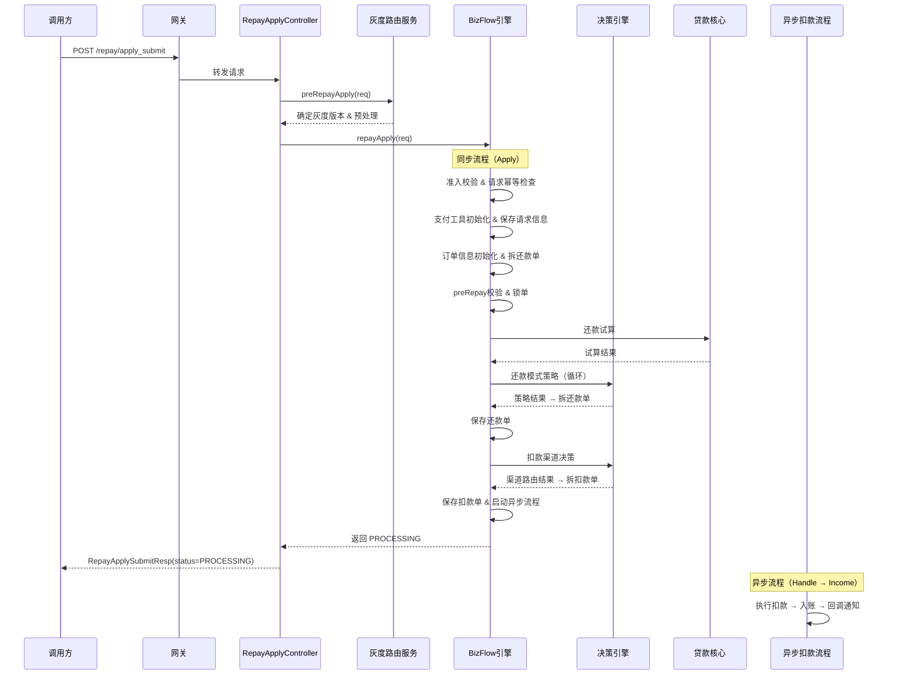
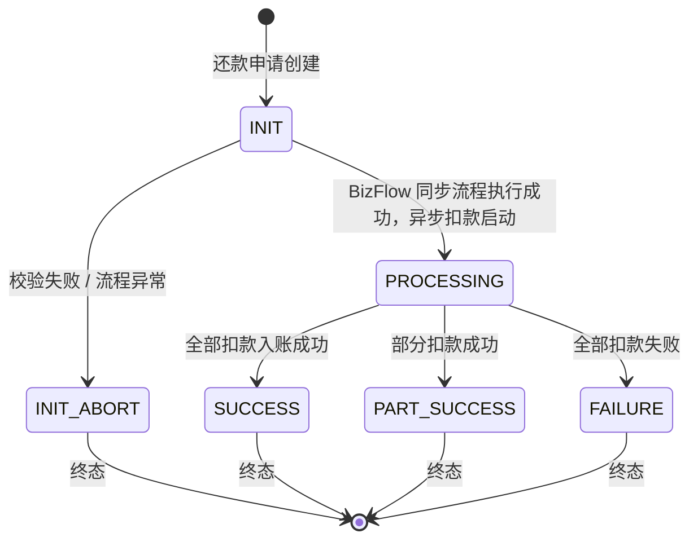
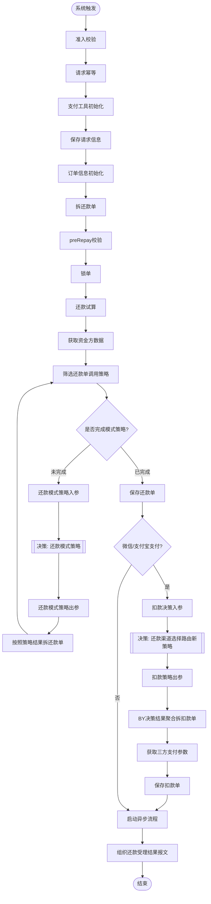
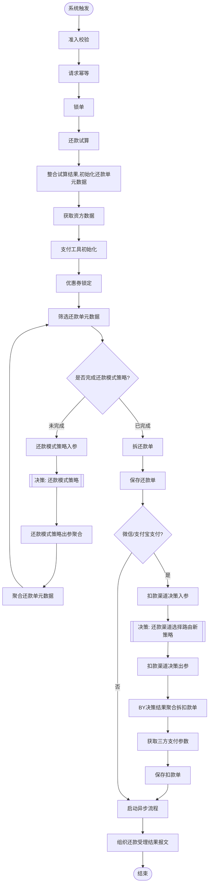

# 还款申请统一提交入口

## 1. 概述

| 属性 | 值 |
|------|-----|
| **接口名称** | 还款申请统一提交入口 |
| **接口路径** | `POST /repayengine/repay/apply_submit` |
| **所属应用** | repayengine |
| **负责人** | 王涛涛 |
| **版本** | V2.0 |
| **更新日期** | 2026-03-26 |
| **接口状态** | ONLINE |

---

## 2. 核心业务流程

### 2.1 业务背景

还款申请统一提交接口是 repayengine 的核心入口，承载所有还款场景的统一受理。调用方（如 APP、H5、后台系统）通过该接口提交还款请求，repayengine 根据资产类型（重资产/轻资产）、还款类别（分期制/账期制）和灰度版本，路由到对应的 BizFlow 计划进行处理。

该接口采用**3层异步架构**：同步受理（Apply）→ 异步扣款（Handle）→ 异步入账（Income），同步阶段完成参数校验、试算、拆单等前置处理后返回 `PROCESSING`，后续扣款和入账异步执行。支持多种还款类型（按期还款、按金额还款）、多种支付方式（银行卡、微信、支付宝、余额、优惠券等组合支付）。

### 2.2 业务时序图



### 2.3 业务规则

| 规则编号 | 规则描述 | 处理方式 |
|---------|---------|---------|
| R1 | bizSerial 幂等校验 | 同一 bizSerial 重复提交返回错误码 5005，调用方需保证唯一性 |
| R2 | 还款金额必须大于 0 | 金额 <= 0 返回错误码 5031 |
| R3 | 还款请求金额与分期明细金额一致性校验 | 不一致返回错误码 5014 |
| R4 | 还款金额与试算金额一致性校验 | 不一致返回错误码 5040 |
| R5 | 订单状态校验 | 存在"还款中"状态的分期计划时拒绝提交，返回错误码 5012 |
| R6 | 轻资产必须提供订单信息 | 轻资产场景下 stagePlanItemList 为空返回错误码 5036 |
| R7 | 不支持仅用优惠券还款 | 仅优惠券支付返回错误码 5035 |
| R8 | 暂不支持多笔订单还款（部分流程） | Order-based 流程中多笔订单返回错误码 5011 |
| R9 | 灰度路由自动匹配 | 未指定 grayVersion 时根据用户 ID 和资产类型自动路由 |
| R10 | 维护窗口拦截 | 系统维护期间拒绝还款，返回错误码 5072 |

### 2.4 状态流转



> **注意**：该接口同步返回 `PROCESSING` 或 `INIT_ABORT`，后续状态变更通过异步回调通知调用方。

### 2.5 灰度版本路由

系统支持多个业务流程版本，根据资产类型和灰度策略自动路由：

| 版本      | 流程标识                                  | 适用场景         | 状态  |
| ------- | ------------------------------------- | ------------ | --- |
| Vh4.0.0 | vh400_apply                           | 重资产还款（最新版）   | 当前  |
| Vh4.0.1 | PF-tradebiz-repayapply_orderpay_vh401 | 分期制重资产（灰度升级） | 当前  |
| Ve4.0.0 | PF-tradebiz-repayapply_enjoypay_ve400 | 账期制还款（灰度升级）  | 当前  |
| Vl3.1.0 | vl310_apply                           | 轻资产还款（异步）    | 当前  |
| Vl3.2.0 | vl320                                 | 轻资产还款（同步）    | 当前  |
| Ve3.3.0 | ve330_apply                           | 账期制还款（旧版）    | 已废弃 |
| Vr3.0.0 | vr300_apply                           | 订单制还款        | 已废弃 |
| Vh3.0.1 | vh301_apply                           | 重资产还款        | 已废弃 |
| Vh3.1.0 | vh310_apply                           | 重资产还款        | 已废弃 |

**灰度路由逻辑**：当 Vh4.0.0/Ve3.3.0 版本执行时，系统根据 `repayType`（分期制 STAGE / 账期制 BILL）和用户 UID 判断是否灰度升级到 V401/Ve400 新流程。

---

## 3. 接口定义

### 3.1 请求参数

| 参数名 | 类型 | 必填 | 说明 |
|--------|------|------|------|
| uid | String | 是 | 用户 ID |
| requestSource | String | 是 | 请求来源 |
| bizSerial | String | 是 | 提交流水号，请求方需保证唯一、保证幂等 |
| repayAmount | Integer | 是 | 还款金额（单位：分） |
| repayType | String | 是 | 还款类型：`BY_STAGE_PLAN`(按分期计划) / `BY_AMOUNT`(按金额) |
| repayWay | String | 是 | 还款方式：`AUTO_DEDUCT`(自动扣款) / `MANUAL_REPAY`(主动还款) / `MANUAL_DEDUCT`(手动扣款) / `AO_OFFLINE`(线下还款) |
| repayTag | String | 否 | 业务标签，repayengine 仅透传，不做逻辑识别 |
| billCycle | String | 否 | 账期号 |
| billNoList | String[] | 否 | 账期号列表，支持多账期还款 |
| sceneCode | String | 否 | 场景码 |
| payItemList | PayItem[] | 是 | 支付信息列表（见下方） |
| stagePlanItemList | StagePlanItem[] | 否 | 还款分期列表（见下方） |
| offLineRepayList | OffLineRepayInfo[] | 否 | 线下还款信息，`AO_OFFLINE` 支付方式时有效 |
| extInfoMap | Map\<String, String\> | 否 | 扩展信息，需与 repayengine 约定 |
| grayVersion | String | 否 | 流程灰度版本，一般不需要传 |
| grayTag | String | 否 | 灰度标记，一般不需要传 |

#### PayItem（支付信息）

| 参数名 | 类型 | 必填 | 说明 |
|--------|------|------|------|
| payType | String | 是 | 支付方式：`DEBIT_CARD`(银行卡) / `WECHAT_PAY`(微信) / `ALIPAY_SDK`(支付宝SDK) / `ALIPAY_API`(支付宝API) / `OVER_PAY`(溢缴款) / `BALANCE_PAY`(余额) / `COUPON_PAY`(优惠券) / `AO_OFFLINE_PAY`(线下) / `DEDUCT_PAY`(代扣) 等 |
| payInstrumentNo | String | 是 | 支付方式编号，根据 payType 不同含义不同，同 payType 下不可重复 |
| payAmount | Integer | 是 | 支付总金额（单位：分） |
| weChatParams | WeChatPayParams | 否 | 微信支付参数（微信支付时需要） |
| extInfoMap | Map\<String, String\> | 否 | 扩展信息，需与 repayengine 约定 |

#### WeChatPayParams（微信支付参数）

| 参数名 | 类型 | 必填 | 说明 |
|--------|------|------|------|
| subject | String | 否 | 商品描述 |
| body | String | 否 | 商品详情 |
| clientIp | String | 否 | 客户端 IP |
| tradeType | String | 否 | 交易类型，微信小程序拉起支付 SDK 时使用，慎重上送 |
| openid | String | 否 | 用户标识，`tradeType=JSAPI` 时必传 |
| bizCode | String | 否 | 业务编码 |
| packed | Boolean | 否 | 是否打包还款 |

#### StagePlanItem（还款分期明细）

| 参数名 | 类型 | 必填 | 说明 |
|--------|------|------|------|
| payType | String | 是 | 支付方式（同 PayItem.payType） |
| orderNo | String | 是 | 订单号 |
| stageOrderNo | String | 是 | 分期订单号 |
| stagePlanNo | String | 否 | 分期计划号 |
| stageNo | Integer | 否 | 分期号 |
| amount | Integer | 是 | 金额（单位：分） |
| extInfo | String | 否 | 扩展信息 |

#### OffLineRepayInfo（线下还款信息）

| 参数名 | 类型 | 必填 | 说明 |
|--------|------|------|------|
| repayOrderInfoList | RepayOrderInfo[] | 是 | 还款订单信息列表 |
| deductDetailInfoList | DeductDetailInfo[] | 是 | 扣款明细信息列表 |

#### RepayOrderInfo

| 参数名 | 类型 | 必填 | 说明 |
|--------|------|------|------|
| stageOrderNo | String | 是 | 分期订单号 |

#### DeductDetailInfo

| 参数名 | 类型 | 必填 | 说明 |
|--------|------|------|------|
| bankSerial | String | 是 | 银行流水号 |
| deductSerial | String | 是 | 扣款流水号 |
| deductSeqNo | Integer | 是 | 扣款顺序号 |
| deductAmount | Integer | 是 | 扣款金额（单位：分） |
| chargeUpChannel | String | 是 | 挂账渠道 |
| chargeUpChannelType | String | 是 | 挂账渠道类型：线上/线下 |

### 3.2 请求示例

```json
{
  "uid": "U123456789",
  "requestSource": "APP",
  "bizSerial": "BIZ20260410120000001",
  "repayAmount": 100000,
  "repayType": "BY_STAGE_PLAN",
  "repayWay": "MANUAL_REPAY",
  "sceneCode": "NORMAL_REPAY",
  "stagePlanItemList": [
    {
      "payType": "DEBIT_CARD",
      "orderNo": "ORD20260101001",
      "stageOrderNo": "SO20260101001",
      "stagePlanNo": "SP20260101001001",
      "stageNo": 1,
      "amount": 100000
    }
  ],
  "payItemList": [
    {
      "payType": "DEBIT_CARD",
      "payInstrumentNo": "CARD_001",
      "payAmount": 100000
    }
  ]
}
```

### 3.3 响应参数

| 参数名 | 类型 | 说明 |
|--------|------|------|
| bizSeries | String | 原始请求流水号 |
| repayApplyNo | String | repayengine 生成的还款申请号 |
| status | String | 还款提交状态：`PROCESSING`(处理中) / `INIT_ABORT`(提交失败) |
| desc | String | 描述信息 |
| developMsg | String | 开发描述信息，会随时改变，不可用于代码逻辑 |
| code | String | 错误码 |
| extend | Map\<String, Object\> | 扩展信息（如微信支付参数等） |
| verifyRequired | Boolean | 是否需要验码（轻资产同步流程） |
| verifyMobile | String | 验码手机号（轻资产同步流程） |

### 3.4 响应示例

**成功响应：**

```json
{
  "bizSeries": "BIZ20260410120000001",
  "repayApplyNo": "RA20260410120000001",
  "status": "PROCESSING",
  "desc": "还款处理中",
  "code": null,
  "developMsg": null,
  "extend": {},
  "verifyRequired": false,
  "verifyMobile": null
}
```

**失败响应：**

```json
{
  "bizSeries": "BIZ20260410120000001",
  "repayApplyNo": null,
  "status": "INIT_ABORT",
  "desc": "还款申请重复提交",
  "code": "5005",
  "developMsg": "bizSerial already exists",
  "extend": null,
  "verifyRequired": false,
  "verifyMobile": null
}
```

### 3.5 错误码

| 错误码 | 说明 | 处理建议 |
|--------|------|---------|
| 5005 | 还款申请重复提交 | 检查 bizSerial 是否已使用，避免重复提交 |
| 5011 | 暂不支持多笔订单还款 | 拆分为多次单笔订单还款请求 |
| 5012 | 订单状态有误，如有分期计划在还款中状态，请稍后再试 | 等待前一笔还款完成后重试 |
| 5014 | 还款请求金额检查未通过 | 检查 repayAmount 与 stagePlanItemList 金额合计是否一致 |
| 5027 | 提前结清还款金额错误 | 重新查询应还金额后提交 |
| 5030 | 溢缴款账户不可用 | 联系客服或更换支付方式 |
| 5031 | 还款金额必须大于 0 | 确保 repayAmount > 0 |
| 5035 | 暂不支持仅用优惠券还款 | 需搭配其他支付方式一起使用 |
| 5036 | 轻资产订单信息为空 | 轻资产场景必须提供 stagePlanItemList |
| 5040 | 还款金额和试算金额不一致 | 重新获取试算金额后提交 |
| 5072 | 系统维护中，暂时无法受理还款 | 等待维护窗口结束后重试 |
| 5073 | 结算系统调用出现异常 | 系统异常，稍后重试或联系技术支持 |
| 5093 | 还款处理超时 | 异步处理超时（默认 2 分钟），可查询还款结果 |
| 1000 | 通用错误 | 根据 desc 字段获取具体错误信息 |

---

## 4. BizFlow 计划配置

> 该接口通过灰度路由关联多个 BizFlow 计划，以下列出当前在线的两个主要同步流程。

### 4.1 计划概览

#### 分期制重资产 V401

| 属性 | 值 |
|------|-----|
| **计划名称** | 重资产分期制还款同步流程V401 |
| **bizKey** | `PF-tradebiz-repayapply_orderpay_vh401` |
| **平台** | tradebiz（交易流程平台） |
| **业务场景** | BIZ_SCENE_TECH_HKYQ_STATELESS |
| **触发方式** | SYSTEM_TRIGGER |
| **运行模式** | STATELESS（无状态） |
| **负责人** | 余以召 |
| **状态** | ONLINE |

#### 账期制 V400

| 属性 | 值 |
|------|-----|
| **计划名称** | 账期制V400还款同步流程 |
| **bizKey** | `PF-tradebiz-repayapply_enjoypay_ve400` |
| **平台** | tradebiz（交易流程平台） |
| **业务场景** | BIZ_SCENE_TECH_HKYQ_STATELESS |
| **触发方式** | SYSTEM_TRIGGER |
| **运行模式** | STATELESS（无状态） |
| **负责人** | 余以召 |
| **状态** | ONLINE |

### 4.2 画布流程

#### 分期制重资产 V401 同步流程



#### 账期制 V400 同步流程



### 4.3 节点配置

#### 分期制重资产 V401

| 节点名称 | 节点类型 | 处理器编码 | 异常策略 | 说明 |
|---------|---------|-----------|---------|------|
| 准入校验 | PROCESS | PH110001 | error | 参数校验、金额验证 |
| 请求幂等 | PROCESS | PH110010 | error | bizSerial 重复检查 |
| 支付工具初始化 | PROCESS | PH130080 | error | 初始化支付工具列表 |
| 保存请求信息 | PROCESS | PH130090 | error | 持久化还款申请 |
| 订单信息初始化 | PROCESS | PH130688 | error | 获取分期订单详情 |
| 拆还款单 | PROCESS | PH130817 | error | 按订单拆分还款单 |
| preRepay校验 | PROCESS | PH140010 | error | 前置业务校验 |
| 锁单 | PROCESS | PH140020 | default | 分布式锁定订单 |
| 还款试算 | PROCESS | PH140030V1 | default | 调用贷款核心试算 |
| 获取资金方数据 | PROCESS | PH140624 | default | 查询资方信息 |
| 筛选还款单调用策略 | PROCESS | PH140040 | default | 准备策略调用数据 |
| 还款模式策略入参 | PROCESS | PH140626 | default | 组装决策入参 |
| 还款模式策略 | NEWRULES | JC-202405140001 | ignore | 决策引擎：还款拆单策略 |
| 还款模式策略出参 | PROCESS | PH140628 | default | 解析决策结果 |
| 按照策略结果拆还款单 | PROCESS | PH140630 | default | 按策略拆分还款单 |
| 保存还款单 | PROCESS | PH150010 | default | 持久化还款单 |
| 扣款决策入参 | PROCESS | PH160026V1 | default | 组装扣款渠道决策入参 |
| 还款渠道选择路由新策略 | NEWRULES | JC-202405140002 | ignore | 决策引擎：扣款渠道路由 |
| 扣款策略出参 | PROCESS | PH160028V1 | default | 解析扣款渠道决策结果 |
| BY决策结果聚合拆扣款单 | PROCESS | PH160030V1 | default | 按渠道拆分扣款单 |
| 获取三方支付参数 | PROCESS | PH160060V1 | default | 获取微信/支付宝参数 |
| 保存扣款单 | PROCESS | PH160090 | default | 持久化扣款单 |
| 启动异步流程 | PROCESS | PH161010V1 | default | 触发异步 Handle 流程 |
| 组织还款受理结果报文 | PROCESS | PH161060 | default | 组装返回结果 |

#### 账期制 V400

| 节点名称 | 节点类型 | 处理器编码 | 异常策略 | 说明 |
|---------|---------|-----------|---------|------|
| 准入校验 | PROCESS | PE110001 | default | 参数校验 |
| 请求幂等 | PROCESS | PE110010 | default | bizSerial 重复检查 |
| 锁单 | PROCESS | PE110060 | default | 分布式锁定订单 |
| 还款试算 | PROCESS | PE120001 | default | 调用贷款核心试算 |
| 整合试算结果 | PROCESS | PE120006 | default | 初始化还款单元数据 |
| 获取资方数据 | PROCESS | PE120020 | default | 查询资方信息 |
| 支付工具初始化 | PROCESS | PE130080 | default | 初始化支付工具列表 |
| 优惠券锁定 | PROCESS | PE130090 | default | 锁定优惠券 |
| 筛选还款单元数据 | PROCESS | PE130100 | default | 准备策略数据 |
| 还款模式策略入参 | PROCESS | PE130626 | default | 组装决策入参 |
| 还款模式策略 | NEWRULES | JC-202405140001 | ignore | 决策引擎：还款拆单策略 |
| 还款模式策略出参聚合 | PROCESS | PE130628 | default | 解析决策结果 |
| 聚合还款单元数据 | PROCESS | PE130630 | default | 按策略聚合数据 |
| 拆还款单 | PROCESS | PE130817 | default | 拆分还款单 |
| 保存还款单 | PROCESS | PE150010 | default | 持久化还款单 |
| 扣款渠道决策入参 | PROCESS | PE160026 | default | 组装扣款渠道决策入参 |
| 还款渠道选择路由新策略 | NEWRULES | JC-202405140002 | ignore | 决策引擎：扣款渠道路由 |
| 扣款渠道决策出参 | PROCESS | PE160028 | default | 解析扣款渠道结果 |
| BY决策结果聚合拆扣款单 | PROCESS | PE160030 | default | 按渠道拆分扣款单 |
| 获取三方支付参数 | PROCESS | PE160060 | default | 获取微信/支付宝参数 |
| 保存扣款单 | PROCESS | PE160090 | default | 持久化扣款单 |
| 启动异步流程 | PROCESS | PE161010 | default | 触发异步 Handle 流程 |
| 组织还款受理结果报文 | PROCESS | PE161060 | default | 组装返回结果 |

### 4.4 关键条件判断

| 判断节点 | 条件 | 分支 |
|---------|------|------|
| 是否完成模式策略 | `repaySplitFinished == false` | 继续循环调用还款模式策略 |
| 是否完成模式策略 | `repaySplitFinished == true`（默认） | 进入保存还款单 |
| 微信/支付宝支付 | `payType == ALIPAY_SDK OR payType == WECHAT_PAY` | 走扣款渠道决策 + 获取三方支付参数 |
| 微信/支付宝支付 | 其他支付方式（默认） | 直接启动异步流程 |

### 4.5 关联子流程

| 子流程名称 | bizKey | 说明 |
|-----------|--------|------|
| 重资产分期制还款异步流程V401 | PF-tradebiz-repayhandle_orderpay_vh401 | 异步扣款主流程 |
| 重资产分期制还款入账流程V401 | PF-tradebiz-repayincome_orderpay_vh401 | 异步入账子流程 |
| 账期制V400还款异步流程 | PF-tradebiz-repayhandle_enjoypay_ve400 | 异步扣款主流程 |

### 4.6 配置注意事项

| 项目 | 说明 |
|------|------|
| 幂等控制 | 基于 bizSerial 的幂等检查，重复提交返回已有结果 |
| 分布式锁 | 轻资产同步流程使用 Redis 锁 `repay:la_sync:lock:{uid}:{stageOrderNo}` |
| 订单锁 | 重资产流程使用订单级锁，失败时触发 `StageOrderUnlockCompensateHandler` 解锁 |
| 决策引擎 | 还款模式策略(JC-202405140001) + 扣款渠道路由(JC-202405140002)，决策异常策略为 ignore |
| 异步超时 | 默认 2 分钟超时（错误码 5093） |

---

## 标签
#repayengine #还款 #接口文档