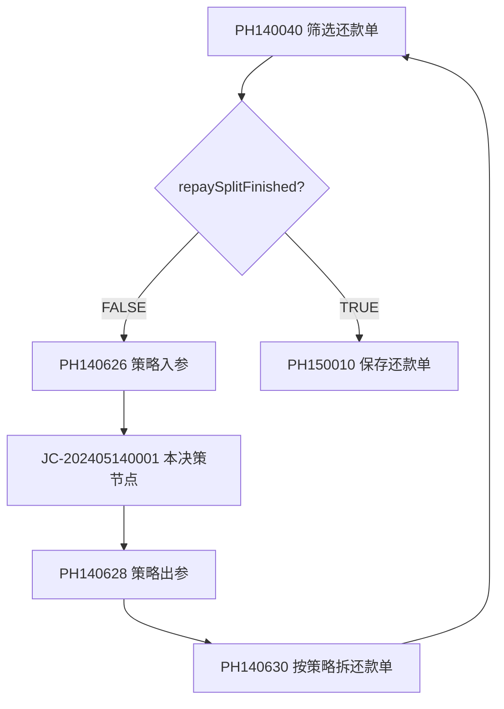

# JC-202405140001 - 还款模式策略

## 决策信息

| 属性 | 值 |
|------|------|
| **规则KEY** | JC-202405140001 |
| **规则名称** | 还款模式策略 |
| **节点类型** | NEWRULES (决策节点) |
| **决策引擎** | HENGINE |
| **所属流程** | [[重资产分期制还款同步流程V401]] |
| **当前执行版本** | 1 |
| **版本策略** | COMPLEX (复杂版本策略) |
| **异常策略** | ignore（忽略错误） |

## 功能说明

决策节点，根据用户、资方、还款方式、支付类型、扣款渠道、分期计划等多维度因素，决定还款单的拆分模式。在还款模式策略循环中被调用，可能多次执行直到所有还款单完成策略处理。

### 决策目标
1. **还款单拆分**: 决定一个还款单是否需要拆分为多个子还款单
2. **还款模式确定**: 根据资方和计划信息确定还款模式
3. **分组策略**: 按planNo进行分组，确定拆分方案

## 决策版本

### 版本 1（当前执行版本）
- **版本描述**: 导入策略版本
- **版本ID**: 173970
- **状态**: EXECUTE（���行中）
- **创建人**: 姜庆蓉
- **更新人**: 姜庆蓉

## 输入参数

由 [[PH140626]] 节点组装：

| 参数名 | 参数代码 | 类型 | 说明 |
|--------|----------|------|------|
| 用户ID | UID | string | 用户唯一标识 |
| 资方银行 | ASSET_BANK | string | 资方银行枚举名称 |
| 资方ID | ASSET_ID | string | 资方标识 |
| 还款方式 | STRATEGY_PARAM_REPAY_WAY | string | 还款方式枚举 |
| 支付类型 | STRATEGY_PARAM_PAY_TYPE | string | 支付类型枚举 |
| 扣款方式 | DEDUCT_CHANNEL_DEDUCT_WAY | string | 扣款渠道扣款方式 |
| 订单号 | DEDUCT_CHANNEL_ORDER_NO | string | 分期订单号 |
| 计划列表 | STRATEGY_PARAM_PLAN_LIST | list | RepayStrategyInputPlanBo列表 |

### 计划列表子项 (RepayStrategyInputPlanBo)

| 字段 | 说明 |
|------|------|
| planNo | 分期计划编号 |
| repayScene | 还款场景 |
| fundPayOff | 资方是否已结清 |

## 输出参数

由 [[PH140628]] 节点解析：

| 参数名 | 参数代码 | 类型 | 说明 |
|--------|----------|------|------|
| 还款单拆分列表 | STRATEGY_PARAM_REPAYMENT_BILL_LIST | list | RepayStrategyOutputBo列表 |

### 拆分列表子项 (RepayStrategyOutputBo)

| 字段 | 说明 |
|------|------|
| repaySeqNo | 还款序号（>=0） |
| planNoList | 该子还款单包含的分期计划编号列表 |

## 决策流程

```
开始
  |
获取资方银行和资方ID
  |
获取还款方式和支付类型
  |
获取扣款渠道配置
  |
获取分期计划列表（含资方结清状态）
  |
执行还款模式规则匹配
  |
确定拆分方案
  ├── 无需拆分: 返回空或单条结果
  └── 需要拆分: 返回多条结果
      ├── 每条结果指定repaySeqNo
      └── 每条结果指定包含的planNoList
  |
返回决策结果
```

## 策略循环机制

本决策节点工作在还款模式策略循环中：



- 每次循环处理一个还款单
- 决策结果>1条时，PH140630会拆分还款单
- 拆分后新还款单标记 repayStrategyFinished=TRUE
- 循环直到所有还款单完成策略处理

## 决策引擎配置

### SparklingLogic 配置
- **工作空间**: PRODUCT_OP/HK
- **路由表**: ods_pdw_loan.ods_pdw_loan_log_sparklinglogic_product_op_orc_di
- **环境**: ALI_SHUHE
- **负责人**: 26f320c0-97ab-4d14-ae3f-3f532bb3cec3
- **通知人**: 7cc6594a-e7be-484a-9f3e-b1158bc979d4

## 关联节点

| 节点 | 处理器 | 关系 | 说明 |
|------|--------|------|------|
| 筛选还款单调用策略 | [[PH140040]] | 循环控制 | 决定是否进入策略循环 |
| 还款模式策略入参 | [[PH140626]] | 上游 | 组装决策入参 |
| 还款模式策略出参 | [[PH140628]] | 下游 | 解析决策结果 |
| 按照策略结果拆还款单 | [[PH140630]] | 下游 | 执行拆分 |

## 相关文档

- [[重资产分期制还款同步流程V401]] - 所属业务流
- [[PH140626]] - 入参组装
- [[PH140628]] - 出参解析
- [[PH140630]] - 策略拆分执行
- [[JC-202405140002]] - 还款渠道选择路由新策略（另一个决策节点）

## 标签

#决策节点 #还款模式 #策略拆分 #决策引擎 #SparklingLogic #JC-202405140001