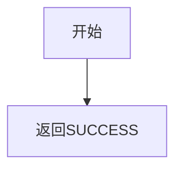

# P000000 - 预留空节点

## 节点信息

| 属性 | 值 |
|------|-----|
| **处理器代码** | P000000 |
| **节点名称** | 预留空节点 |
| **节点类型** | PROCESS |
| **所属流程** | 多个业务流共用 |
| **实现类** | RepayApplyBizFlowP000000ServiceImpl |
| **优先级** | - （无业务逻辑） |

## 功能说明

可重用的占位符节点，不包含任何业务逻辑，直接返回SUCCESS。用于业务流设计中的占位、预留扩展点或流程编排需要。

### 使用场景
- 业务流编排中的占位节点
- 为未来扩展预留的插入点
- 流程分支合并时的过渡节点

## 处理流程



## 核心业务逻辑

无。直接返回 `createSuccessProcessResult()`。

## 实现位置

```bash
repayengine-service/src/main/java/cn/caijiajia/repayengine/service/
└── repay/process/heavyasset/
    └── RepayApplyBizFlowP000000ServiceImpl.java  # 35行
```

## 在轻资产批量入账流程中的使用

本流程中有两处使用P000000：
1. **nodeKey14809039**: 扣款循环结束后、入账前的过渡节点
2. **nodeKey41084947**: 额度同步后、入账后置事件前的过渡节点

## 标签

#节点 #占位符 #空节点 #P000000