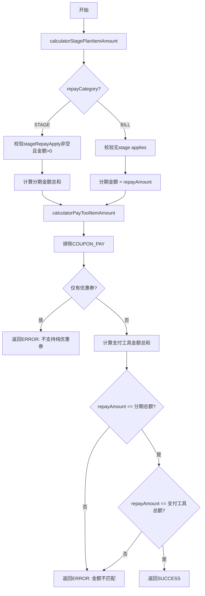

# P010002 - 验证还款金额

## 节点信息

| 属性 | 值 |
|------|-----|
| **处理器代码** | P010002 |
| **节点名称** | 验证还款金额 |
| **节点类型** | PROCESS |
| **所属流程** | [[轻资产还款受理流程同步主流程Vl3.1.0]] |
| **执行阶段** | 参数校验阶段 |
| **实现类** | RepayApplyBizFlowP010002ServiceImpl |
| **优先级** | P0（核心节点） |

## 功能说明

校验还款请求中的金额一致性：分期计划金额总和、支付工具金额总和与请求还款金额三者必须一致。同时按还款类别（STAGE/BILL）做差异化校验。

### 核心职责
1. **分期金额校验**: 按还款类别计算分期计划金额总和
2. **支付工具金额校验**: 计算支付工具金额总和，排斥纯优惠券支付
3. **三方一致性校验**: repayAmount == 分期总额 == 支付工具总额

### 适用场景
- 分期还款（STAGE）：按期还款
- 账单还款（BILL）：按账单还款

## 输入参数

| 参数名 | 参数代码 | 类型 | 来源/说明 |
|--------|----------|------|-----------|
| 还款金额 | repayAmount | Integer | 请求参数 |
| 还款类别 | repayCategory | RepayCategory | 请求参数 |
| 分期还款列表 | stageRepayApplyList | List | 请求参数 |
| 支付工具列表 | payToolItemList | List | 请求参数 |

## 处理流程



## 核心业务逻辑

### 1. 分期金额计算（calculatorStagePlanItemAmount）

**STAGE类别**:
- 校验 stageRepayApplyList 非空 → `REPAY_STAGE_PLAN_COUNT_ERROR`
- 校验每项金额 > 0 → `REPAY_AMOUNT_CAN_NOT_BE_LESS_THAN_ZERO`
- 总额 = 所有项的 amount 之和

**BILL类别**:
- 不允许有 stage applies（除预结清场景）
- 总额 = repayAmount（直接使用请求金额）

### 2. 支付工具金额计算（calculatorPayToolItemAmount）

- 排除 COUPON_PAY 类型
- 若排除后无支付工具 → `REPAY_PAY_TYPE_COUPON_ONLY_NOT_SUPPORT`
- 总额 = 所有非优惠券支付工具的 limitedAmount 之和

### 3. 一致性校验

```
repayAmount == stagePlanTotal  → 否则 REPAY_APPLY_SUBMIT_AMOUNT_ERROR
repayAmount == payToolTotal    → 否则 REPAY_APPLY_SUBMIT_AMOUNT_ERROR
```

## 异常处理

| 异常场景 | 错误码 | 说明 |
|----------|--------|------|
| 分期计划为空 | REPAY_STAGE_PLAN_COUNT_ERROR | STAGE类别必须有分期项 |
| 金额<=0 | REPAY_AMOUNT_CAN_NOT_BE_LESS_THAN_ZERO | 分期金额必须为正 |
| 金额不匹配 | REPAY_APPLY_SUBMIT_AMOUNT_ERROR | 三方金额不一致 |
| 纯优惠券 | REPAY_PAY_TYPE_COUPON_ONLY_NOT_SUPPORT | 不支持仅用优惠券 |

## 上游节点
- 系统触发（TRIGGER_METHOD）

## 下游节点
- [[P010010]] - 验证重复还款请求

## 实现位置

```
repayengine-service/src/main/java/cn/caijiajia/repayengine/service/
└── repay/process/impl/
    └── RepayApplyBizFlowP010002ServiceImpl.java  (~160行)
```

## 相关文档
- [[轻资产还款受理流程同步主流程Vl3.1.0]] - 所属业务流
- [[P010010]] - 下游重复校验

## 标签
#节点 #参数校验 #金额验证 #通用 #P010002