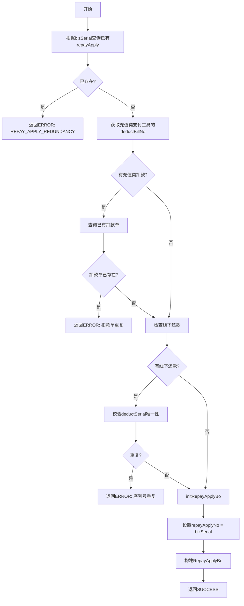

# P010010 - 验证重复还款请求

## 节点信息

| 属性 | 值 |
|------|-----|
| **处理器代码** | P010010 |
| **节点名称** | 验证重复还款请求 |
| **节点类型** | PROCESS |
| **所属流程** | [[轻资产还款受理流程同步主流程Vl3.1.0]] |
| **执行阶段** | 参数校验阶段 |
| **实现类** | RepayApplyBizFlowP010010ServiceImpl |
| **优先级** | P0（核心节点） |

## 功能说明

幂等性校验节点，防止同一还款请求被重复处理。通过业务流水号(bizSerial)和扣款单号检查重复，校验通过后初始化RepayApplyBo业务对象。

### 核心职责
1. **还款申请重复检查**: 根据bizSerial查询已有申请
2. **扣款单重复检查**: 校验充值类扣款单号唯一性
3. **线下还款序列号检查**: 校验线下还款流水号唯一性
4. **初始化业务对象**: 构建RepayApplyBo

## 输入参数

| 参数名 | 参数代码 | 类型 | 来源/说明 |
|--------|----------|------|-----------|
| 业务流水号 | bizSerial | String | 请求参数 |
| 支付工具列表 | payToolItemList | List\<PayToolItem\> | 请求参数 |
| 线下还款列表 | offlineRepayList | List | 请求参数（可选） |

## 输出参数

| 参数名 | 参数代码 | 类型 | 说明 |
|--------|----------|------|------|
| 还款业务对象 | repayApplyBo | RepayApplyBo | 初始化后设置到context |

## 处理流程



## 核心业务逻辑

### 1. 还款申请幂等校验

根据 `bizSerial` 查询数据库中的 `t_repay_apply` 表，若存在记录则为重复请求。

### 2. 扣款单重复校验

针对充值类支付工具（WECHAT_PAY, AO_OFFLINE_PAY等），其 `payInstrumentNo` 作为 `deductBillNo`，需要校验该扣款单号在 `t_deduct_bill` 表中是否已存在成功记录。

### 3. 线下还款序列号校验

针对线下还款场景，`deductSerial` 必须唯一。

### 4. Bo初始化（initRepayApplyBo）

```
RepayApplyBo:
  - repayApplyNo = bizSerial
  - 从请求对象复制其他业务字段
```

## 异常处理

| 异常场景 | 错误码 | 说明 |
|----------|--------|------|
| 还款申请已存在 | REPAY_APPLY_REDUNDANCY | bizSerial重复 |
| 扣款单已存在 | - | 充值类支付工具重复 |
| 线下序列号重复 | - | deductSerial重复 |

## 上游节点
- [[P010002]] - 验证还款金额

## 下游节点
- [[P020001]] - 保存还款申请相关信息

## 实现位置

```
repayengine-service/src/main/java/cn/caijiajia/repayengine/service/
└── repay/process/impl/
    └── RepayApplyBizFlowP010010ServiceImpl.java  (~125行)
```

## 相关文档
- [[轻资产还款受理流程同步主流程Vl3.1.0]] - 所属业务流
- [[P010002]] - 上游金额校验
- [[P020001]] - 下游保存申请

## 标签
#节点 #参数校验 #幂等 #通用 #P010010