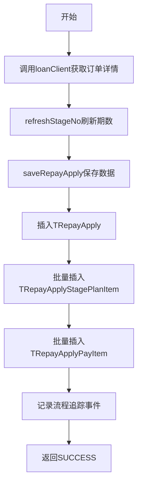

# P020001 - 保存还款申请相关信息

## 节点信息

| 属性 | 值 |
|------|-----|
| **处理器代码** | P020001 |
| **节点名称** | 保存还款申请相关信息 |
| **节点类型** | PROCESS |
| **所属流程** | [[轻资产还款受理流程同步主流程Vl3.1.0]] |
| **执行阶段** | 申请保存阶段 |
| **实现类** | RepayApplyBizFlowP020001ServiceImpl |
| **优先级** | P0（核心节点） |

## 功能说明

查询订单详情并保存还款申请记录到数据库，同时保存关联的分期计划项和支付工具项。完成后记录还款流程追踪事件。

### 核心职责
1. **查询订单详情**: 调用Loan服务获取分期订单信息
2. **刷新期数信息**: 根据订单数据刷新stageNo
3. **持久化申请**: 保存TRepayApply、TRepayApplyStagePlanItem、TRepayApplyPayItem
4. **流程追踪**: 记录还款申请事件

## 输入参数

| 参数名 | 参数代码 | 类型 | 来源/说明 |
|--------|----------|------|-----------|
| 还款业务对象 | repayApplyBo | RepayApplyBo | RepayApplyContext |
| 分期还款列表 | stageRepayApplyList | List | 请求参数 |
| 支付工具列表 | payToolItemList | List | 请求参数 |

## 输出参数

| 参数名 | 参数代码 | 类型 | 说明 |
|--------|----------|------|------|
| 无 | - | - | 数据持久化到数据库 |

## 处理流程



## 核心业务逻辑

### 1. 订单详情查询

```
loanClient.getOrderDetailNoActByConditions(conditions)
```

调用Loan服务获取分期订单的详细信息（StageOrderWrapper），用于刷新分期期数。

### 2. 刷新期数（refreshStageNo）

将Loan服务返回的最新stageNo更新到请求的分期计划项中，确保数据一致性。

### 3. 数据持久化（saveRepayApply）

三张表的写入操作：

| 表名 | 数据来源 | 写入方式 |
|------|----------|----------|
| t_repay_apply | RepayApplyBo | 单条插入 |
| t_repay_apply_stage_plan_item | stageRepayApplyList | 批量插入 |
| t_repay_apply_pay_item | payToolItemList | 批量插入 |

### 4. 流程追踪

```
repayFlowTraceProxy.repayApplyRecord(repayContext)
```

记录还款申请事件，用于流程追踪和数据分析。

## 外部服务

| 服务 | 方法 | 用途 |
|------|------|------|
| LoanClient | getOrderDetailNoActByConditions | 查询分期订单详情 |
| RepayFlowTraceProxy | repayApplyRecord | 记录流程事件 |

## 异常处理

| 异常场景 | 错误类型 | 处理方式 | 影响 |
|----------|----------|----------|------|
| Loan服务调用失败 | HttpClientException | 返回ERROR | 订单查询异常 |
| 数据库写入异常 | Exception | 返回ERROR | 持久化失败 |

## 上游节点
- [[P010010]] - 验证重复还款请求

## 下游节点
- [[P000000]] - 预留空节点 → [[P030080]] - 支付工具初始化

## 实现位置

```
repayengine-service/src/main/java/cn/caijiajia/repayengine/service/
└── repay/process/impl/
    └── RepayApplyBizFlowP020001ServiceImpl.java  (~172行)
```

## 相关文档
- [[轻资产还款受理流程同步主流程Vl3.1.0]] - 所属业务流
- [[P010010]] - 上游校验
- [[P030080]] - 下游支付初始化

## 标签
#节点 #申请保存 #数据持久化 #通用 #P020001