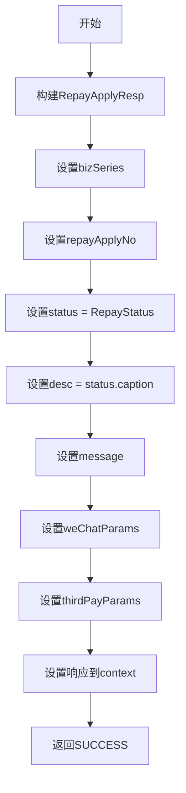

# P026000 - 组织返回报文

## 节点信息

| 属性 | 值 |
|------|-----|
| **处理器代码** | P026000 |
| **节点名称** | 组织返回报文 |
| **节点类型** | PROCESS |
| **所属流程** | [[轻资产还款受理流程同步主流程Vl3.1.0]] |
| **执行阶段** | 响应阶段 |
| **实现类** | RepayApplyBizFlowP026000ServiceImpl |
| **优先级** | P2 |

## 功能说明

构建同步响应报文（RepayApplyResp），将还款申请结果返回给调用方。包含还款申请号、处理状态、状态描述以及可选的支付参数。

### 核心职责
1. **构建响应对象**: 组装RepayApplyResp
2. **设置状态信息**: 还款状态、描述、消息
3. **附加支付参数**: 微信支付参数、三方支付参数

## 输入参数

| 参数名 | 参数代码 | 类型 | 来源/说明 |
|--------|----------|------|-----------|
| 业务流水号 | bizSerial | String | RepayApplyContext |
| 还款申请号 | repayApplyNo | String | RepayApplyBo |
| 还款状态 | repayStatus | RepayStatus | RepayApplyBo |
| 消息 | message | String | RepayApplyContext |
| 微信参数 | weChatParams | Map | RepayApplyBo |
| 三方支付参数 | thirdPayParams | Map | RepayApplyBo |

## 输出参数

| 参数名 | 参数代码 | 类型 | 说明 |
|--------|----------|------|------|
| 响应对象 | repayApplyResp | RepayApplyResp | 设置到RepayApplyContext |

## 处理流程



## 核心业务逻辑

### 响应结构

| 字段 | 类型 | 说明 |
|------|------|------|
| bizSeries | String | 业务流水号 |
| repayApplyNo | String | 还款申请号 |
| status | RepayStatus | 还款状态枚举 |
| desc | String | 状态中文描述 |
| message | String | 附加消息（错误信息等） |
| weChatParams | Map | 微信支付跳转参数（可选） |
| thirdPayParams | Map | 三方支付参数（可选） |

## 上游节点
- [[PL060999]] - 异步处理还款流程

## 下游节点
- 结束（END）

## 实现位置

```
repayengine-service/src/main/java/cn/caijiajia/repayengine/service/
└── repay/process/impl/
    └── RepayApplyBizFlowP026000ServiceImpl.java  (54行)
```

## 相关文档
- [[轻资产还款受理流程同步主流程Vl3.1.0]] - 所属业务流

## 标签
#节点 #响应构建 #通用 #P026000