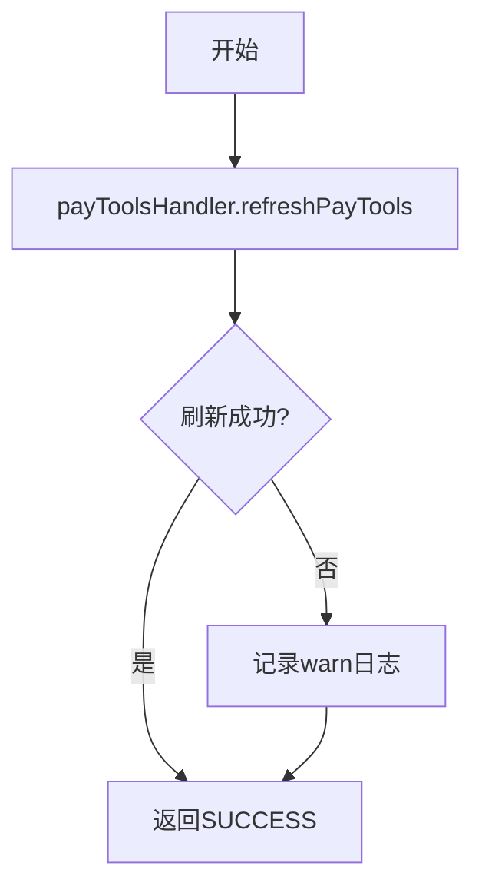

# P030080 - 支付工具初始化

## 节点信息

| 属性 | 值 |
|------|-----|
| **处理器代码** | P030080 |
| **节点名称** | 支付工具初始化 |
| **节点类型** | PROCESS |
| **所属流程** | [[轻资产还款受理流程同步主流程Vl3.1.0]] |
| **执行阶段** | 支付工具初始化阶段 |
| **实现类** | RepayApplyBizFlowP030080ServiceImpl |
| **优先级** | P1 |

## 功能说明

调用支付工具处理器刷新支付工具的余额和限额信息，确保后续拆扣款单使用最新的支付能力数据。同时初始化BizFlow流程变量。

### 核心职责
1. **刷新支付工具**: 调用PayToolsHandler获取最新余额和限额
2. **初始化流程变量**: 设置repayCategory到BizFlow facts

## 输入参数

| 参数名 | 参数代码 | 类型 | 来源/说明 |
|--------|----------|------|-----------|
| 还款上下文 | repayContext | RepayApplyContext | 包含支付工具列表 |

## 处理流程



## 核心业务逻辑

### 1. 支付工具刷新

```
payToolsHandler.refreshPayTools(repayContext)
```

向外部支付服务查询每个支付工具的：
- 当前余额（balance）
- 支付限额（limitedAmount）
- 支付工具状态

### 2. 流程变量初始化（initFacts）

将 `repayCategory` 添加到BizFlow的流程事实（facts）中，供后续决策节点使用。

## 异常处理

| 异常场景 | 错误类型 | 处理方式 | 影响 |
|----------|----------|----------|------|
| 支付服务调用异常 | CjjClientException/CjjServerException | 记录warn日志 | 不阻断流程 |

## 上游节点
- [[P000000]] - 预留空节点（实际数据来自[[P020001]]）

## 下游节点
- [[P000000]] - 预留空节点 → [[PL040010]] - 初始化轻资产分期信息

## 实现位置

```
repayengine-service/src/main/java/cn/caijiajia/repayengine/service/
└── repay/process/impl/
    └── RepayApplyBizFlowP030080ServiceImpl.java  (~75行)
```

## 相关文档
- [[轻资产还款受理流程同步主流程Vl3.1.0]] - 所属业务流
- [[P020001]] - 上游申请保存
- [[PL040010]] - 下游分期初始化

## 标签
#节点 #支付工具 #初始化 #通用 #P030080