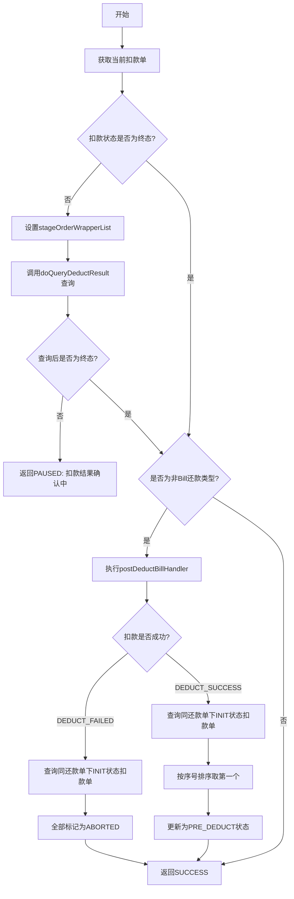

# P070030 - 扣款结果确认事件

## 节点信息

| 属性 | 值 |
|------|-----|
| **处理器代码** | P070030 |
| **节点名称** | 扣款结果确认事件 |
| **节点类型** | PROCESS |
| **所属流程** | [[轻资产还款批量入账流程Vl3.1.0]] |
| **执行阶段** | 扣款执行阶段 |
| **实现类** | RepayApplyBizFlowP070030ServiceImpl |
| **优先级** | P0（核心确认节点） |
| **异常策略** | 重试999次，间隔60秒（长轮询等待扣款结果） |

## 功能说明

查询扣款结果，根据扣款成功/失败状态处理后续扣款单的激活或废弃。这是一个**长轮询**节点，会持续重试直到获取到扣款终态。

### 核心职责
1. **查询扣款结果**: 调用扣款服务查询当前扣款单的扣款结果
2. **等待终态**: 扣款未完成时返回PAUSED，等待下一次重试
3. **成功后激活**: 扣款成功后激活同还款单下序号最小的INIT状态扣款单为PRE_DEDUCT
4. **失败后废弃**: 扣款失败后将同还款单下所有INIT状态扣款单标记为ABORTED

## 处理流程



## 核心业务逻辑

### 1. 扣款结果查询

- 如果当前扣款单不是终态（`!isFinishedStatus()`），调用 `deductService.doQueryDeductResult(currentDeductBill)` 查询
- 查询前会设置 `stageOrderWrapperList` 到扣款单ExtInfo中
- 查询后若仍非终态，返回PAUSED等待重试（最多999次，间隔60秒）

### 2. 扣款成功后的后续处理

- 查找同还款单号下所有 `INIT` 状态的扣款单
- 按 `deductSeqNo` 排序，取序号最小的
- 将其状态更新为 `PRE_DEDUCT`，使其在下一轮循环中被PL070012节点选中执行

### 3. 扣款失败后的后续处理

- 查找同还款单号下所有 `INIT` 状态的扣款单
- 全部标记为 `ABORTED`，附带失败原因："前序扣款单扣款失败"
- 这意味着同一还款单下的后续扣款不再执行

### 4. Bill类型跳过

如果还款类型是 `Bill`（还享花），则跳过后续扣款单处理，直接返回SUCCESS。

## 输入参数

| 参数名 | 参数代码 | 类型 | 来源 | 说明 |
|--------|----------|------|------|------|
| 当前扣款单号 | currentDeductBillNo | String | RepayApplyBo | 由PL070012设置 |
| 还款类型 | repayCategory | RepayCategory | RepayApplyBo | 判断是否为Bill类型 |
| 分期订单列表 | stageOrderWrapperList | List | RepayContext | 扣款结果查询辅助信息 |

## 输出参数

| 参数名 | 参数代码 | 类型 | 说明 |
|--------|----------|------|------|
| 无 | - | - | 通过更新扣款单状态影响后续节点 |

## 上游节点

- [[PL070021]] - 还款扣款事件

## 下游节点

- [[PL070032]] - 扣款后处理

## 异常处理

| 异常场景 | 处理方式 | 影响 |
|----------|----------|------|
| 扣款结果未返回 | 返回PAUSED，重试999次/60秒 | 长轮询等待 |
| 查询异常 | 全局重试策略 | 流程暂停 |
| 状态更新异常 | 全局重试策略 | 流程暂停 |

## 实现位置

```bash
repayengine-service/src/main/java/cn/caijiajia/repayengine/service/
└── repay/process/impl/
    └── RepayApplyBizFlowP070030ServiceImpl.java  # 117行
```

## 相关文档

- [[轻资产还款批量入账流程Vl3.1.0]] - 所属业务流
- [[PL070021]] - 上游扣款执行节点
- [[PL070032]] - 下游扣款后处理节点

## 标签

#节点 #扣款结果 #长轮询 #状态流转 #P070030