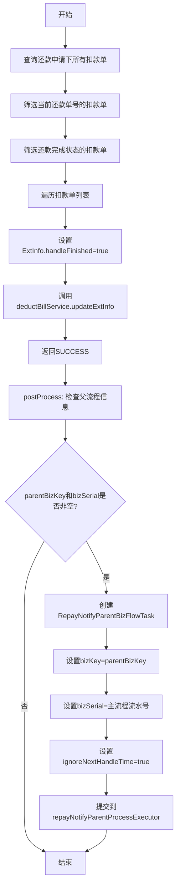

# P070999 - 还款入账后置事件

## 节点信息

| 属性 | 值 |
|------|-----|
| **处理器代码** | P070999 |
| **节点名称** | 还款入账后置事件 |
| **节点类型** | PROCESS |
| **所属流程** | [[轻资产还款批量入账流程Vl3.1.0]] |
| **执行阶段** | 后置处理阶段 |
| **实现类** | RepayApplyBizFlowP070999ServiceImpl |
| **优先级** | P0（流程收尾节点） |

## 功能说明

批量入账流程的最后一个业务节点，负责标记扣款单处理完成和异步通知父流程。

### 核心职责
1. **标记处理完成**: 将已完成还款的扣款单标记为handleFinished
2. **异步通知父流程**: 通过线程池异步通知轻资产Handle主流程继续执行

## 处理流程



## 核心业务逻辑

### 1. process - 标记扣款单处理完成

- 查询当前还款申请下的所有扣款单
- 双重筛选：
  - 还款单号 == subBizSerial（当前处理的还款单）
  - 扣款状态为还款完成（`isRepayFinished()`）
- 设置 `DeductBillExtInfo.handleFinished = true`
- 更新到数据库

### 2. postProcess - 异步通知父流程

**触发时机**: 在process成功返回后由bizflow框架调用

**通知逻辑**:
- 检查 `parentBizKey` 和 `bizSerial` 是否非空
- parentBizKey 由PL070012节点设置为 `BIZFLOW_LIGHT_V3_1_0_HANDLE`
- 创建 `RepayNotifyParentBizFlowTask` 异步任务
- 设置 `ignoreNextHandleTime=true`（忽略下一次处理时间限制，立即唤醒）
- 提交到 `repayNotifyParentProcessExecutor` 线程池执行
- 异常只记录日志，不影响当前流程

**通知目的**: 唤醒轻资产Handle主流程，告知子流程（当前批量入账流程）已完成处理。

## 输入参数

| 参数名 | 参数代码 | 类型 | 来源 | 说明 |
|--------|----------|------|------|------|
| 还款申请号 | repayApplyNo | String | RepayApplyBo | 还款申请单号 |
| 还款单号 | subBizSerial | String | RepayContext | 当前还款单号 |
| 父流程Key | parentBizKey | String | RepayApplyBo | 由PL070012设置 |
| 主流程流水号 | bizSerial | String | RepayApplyBo | 用于唤醒父流程 |

## 输出参数

| 参数名 | 参数代码 | 类型 | 说明 |
|--------|----------|------|------|
| 无 | - | - | 通过更新ExtInfo和异步通知影响外部 |

## 上游节点

- [[P000000]] - 预留空节点

## 下游节点

- 结束 (END)

## 异常处理

| 异常场景 | 处理方式 | 影响 |
|----------|----------|------|
| ExtInfo更新异常 | 全局重试策略 | 流程暂停 |
| 通知父流程异常 | 捕获异常记录日志 | 不影响当前流程 |
| 线程池拒绝 | 捕获异常记录日志 | 父流程通过自身重试机制继续 |

## 实现位置

```bash
repayengine-service/src/main/java/cn/caijiajia/repayengine/service/
└── repay/process/impl/
    └── RepayApplyBizFlowP070999ServiceImpl.java  # 115行
```

## 设计考虑

### 为什么异步通知而不是同步?
- 避免通知失败阻塞当前流程
- 父流程本身有重试机制，即使通知失败也能自行恢复
- 异步通知只是加速父流程响应，不是强依赖

### 为什么设置ignoreNextHandleTime?
- bizflow框架有默认的重试间隔
- 设置ignoreNextHandleTime=true让父流程立即被唤醒
- 提升还款整体响应速度

## 相关文档

- [[轻资产还款批量入账流程Vl3.1.0]] - 所属业务流
- [[PL070085]] - 上游额度同步节点
- [[PL070012]] - parentBizKey设置来源

## 标签

#节点 #后置处理 #父流程通知 #异步唤醒 #P070999