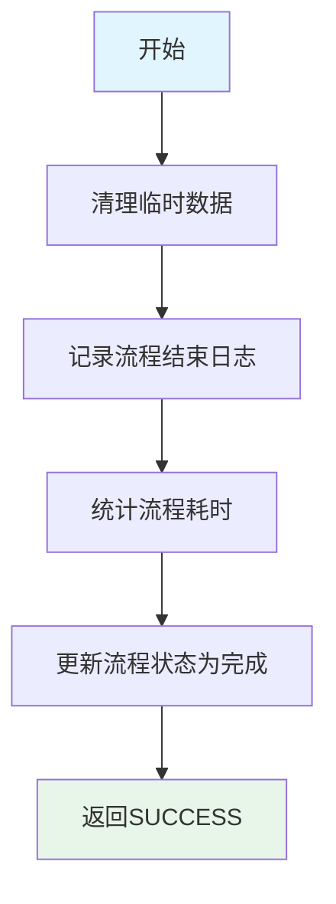

# P999999 - 收尾节点

## 节点信息

| 属性 | 值 |
|------|-----|
| **处理器代码** | P999999 |
| **节点名称** | 收尾节点 |
| **节点类型** | PROCESS |
| **所属流程** | [[账期制V400还款异步流程]] |
| **执行阶段** | 流程结束阶段 |
| **实现类** | AbstractRepayBizFlowServiceImpl (通用实现) |
| **优先级** | P2（收尾节点） |

## 功能说明

流程收尾处理,清理临时资源,记录流程结束日志,标记流程完成。

### 核心职责
1. **清理流程上下文**: 释放临时数据
2. **记录流程日志**: 记录流程完成日志
3. **统计流程耗时**: 计算总耗时
4. **标记流程完成**: 更新流程状态

### 适用场景

- **所有还款流程**: 作为所有还款流程的最后一个节点
- **流程结束**: 标识流程正常结束

## 输入参数

| 参数名 | 参数代码 | 类型 | 来源 | 说明 |
|--------|----------|------|------|------|
| 流程上下文 | processContext | ProcessContext | 流程变量 | 包含所有流程数据 |

## 输出参数

| 参数名 | 参数代码 | 类型 | 说明 |
|--------|----------|------|------|
| 无 | - | - | 收尾操作,无特定输出 |

## 处理流程



## 核心业务逻辑

### 1. 清理临时数据

**清理内容**:
- 临时缓存数据
- 大对象引用
- 不再使用的列表和Map

**目的**:
- 释放内存
- 避免内存泄漏

### 2. 记录流程结束日志

**日志内容**:
- 流程开始时间
- 流程结束时间
- 流程总耗时
- 流程执行状态
- 关键业务数据

**日志级别**: INFO

### 3. 统计流程耗时

**计算方法**:
```java
long startTime = processContext.getStartTime();
long endTime = System.currentTimeMillis();
long duration = endTime - startTime;
```

**统计指标**:
- 总耗时(毫秒)
- 各节点耗时分布
- 平均耗时

### 4. 更新流程状态

**状态更新**: `COMPLETED` (已完成)

**状态含义**:
- 流程正常结束
- 所有节点执行完成
- 无需重试

## 上游节点

- [[PE180050-发送结果消息]] - 消息已发送

## 下游节点

- **END** - 流程结束节点

## 实现位置

```bash
repayengine-service/src/main/java/cn/caijiajia/repayengine/service/
└── repay/process/impl/
    └── AbstractRepayBizFlowServiceImpl.java  # 抽象基类 (通用收尾逻辑)
```

## 设计考虑

### 1. 为什么需要收尾节点?

**原因**:
- 统一的流程结束处理
- 清理资源
- 记录日志
- 统计性能

### 2. 为什么是通用实现?

**原因**:
- 所有还款流程的收尾逻辑相似
- 避免重复代码
- 统一维护

## 相关文档

- [[账期制V400还款异步流程]] - 主流程设计
- [[PE180050-发送结果消息]] - 上游节点

## 标签

#节点 #收尾 #流程结束 #P999999