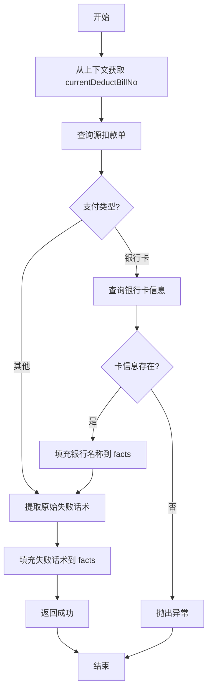

# PC170201 - 扣款失败话术策略入参

## 节点信息

| 属性 | 值 |
|------|-----|
| **节点ID** | node_1731485091872_580903 |
| **节点名称** | 扣款失败话术策略入参 |
| **处理器** | PC170201 |
| **节点类型** | PROCESS(处理器节点) |
| **所属流程** | [[扣款失败话术策略子流程]] |
| **执行阶段** | 参数准备阶段 |
| **优先级** | P1(核心节点) |

## 功能说明

从扣款单中提取失败信息,准备决策引擎所需的输入参数,包括原始失败话术、银行名称等上下文信息。

### 核心职责

1. **扣款单查询**:根据 `currentDeductBillNo` 查询源扣款单
2. **银行信息提取**:如果是银行卡扣款,查询银行名称
3. **失败信息提取**:从扣款单 extInfo 中提取原始失败话术
4. **上下文填充**:将提取的信息填充到 ProcessContext.facts 供决策引擎使用

### 适用场景

- **扣款失败场景**:扣款状态为 DEDUCT_FAILED
- **灰度范围内**:用户在话术转换灰度范围内
- **需要话术优化**:原始失败话术需要转换为用户友好文案

## 输入参数

### 上下文依赖

从 `RepayApplyContext` 中获取:

| 参数 | 类型 | 说明 | 来源 |
|------|------|------|------|
| uid | String | 用户ID | 父流程上下文 |
| currentDeductBillNo | String | 当前扣款单编号 | 父流程上下文 |

### 扣款单数据

从 `DeductBill` 中提取:

| 字段 | 类型 | 说明 |
|------|------|------|
| payType | PayType | 支付类型 |
| payInstrumentNo | String | 支付工具号(卡号) |
| extInfo.message | String | 原始失败话术 |

## 输出参数

### ProcessContext.facts

填充以下参数供决策引擎使用:

| 参数Key | 参数值 | 说明 |
|---------|--------|------|
| sourceDeductBankName | String | 扣款银行名称(仅银行卡) |
| sourceDeductFailMsg | String | 原始失败话术 |

## 处理逻辑

### initFacts 方法

```java
public void deductFailMsgInput(ProcessContext<RepayContext> processContext) {
    RepayApplyContext repayApplyContext = (RepayApplyContext) processContext.getRequestParam();

    // 1. 查询源扣款单
    DeductBill sourceDeductBill = deductBillService.getByDeductBillNo(
        repayApplyContext.getBo().getCurrentDeductBillNo()
    );

    // 2. 如果是银行卡扣款,查询银行名称
    if (PayType.DEBIT_CARD == sourceDeductBill.getPayType()) {
        CardWrapper cardWrapper = cardClient.getCardByCardNo(
            sourceDeductBill.getUid(),
            sourceDeductBill.getPayInstrumentNo()
        );

        if (cardWrapper == null || cardWrapper.getCard() == null) {
            throw REExceptionUtils.newClientException(ErrorCode.DEBIT_CARD_NOT_FOUND);
        }

        // 填充银行名称到facts
        processContext.getFacts().put(
            RouteFactConstants.STRATEGY_PARAM_SOURCE_DEDUCT_BANK_NAME,
            cardWrapper.getCard().getBankName()
        );
    }

    // 3. 提取原始失败话术
    processContext.getFacts().put(
        RouteFactConstants.STRATEGY_PARAM_SOURCE_DEDUCT_FAIL_MSG,
        sourceDeductBill.fetchExtInfo().getMessage()
    );
}
```

### process 方法

```java
@Override
public ProcessResult process(RepayApplyContext repayContext) {
    // initFacts 已在框架层完成参数准备
    return createSuccessProcessResult();
}
```

## 上下游依赖

### 上游节点

| 节点 | 关系 | 说明 |
|------|------|------|
| node_1731485087159_973121 | 必须 | 子流程开始节点 |

### 下游节点

| 节点 | 关系 | 说明 |
|------|------|------|
| node_1731485098156_272599 | 必须 | 决策引擎节点(使用本节点准备的facts) |

## 异常处理

### 异常类型

| 异常码 | 异常场景 | 处理方式 |
|--------|----------|----------|
| DEBIT_CARD_NOT_FOUND | 银行卡不存在 | 抛出客户端异常 |

### 异常处理示例

```java
// 银行卡查询异常
if (cardWrapper == null || cardWrapper.getCard() == null) {
    throw REExceptionUtils.newClientException(ErrorCode.DEBIT_CARD_NOT_FOUND);
}
```

## 实现位置

```
repayengine-service/src/main/java/cn/caijiajia/repayengine/service/repay/process/impl/
└── RepayApplyBizFlowPC170201ServiceImpl.java

repayengine-service/src/main/java/cn/caijiajia/repayengine/service/repay/impl/
└── RepayDeductFailMsgService.java
```

## 关键流程图



## 监控指标

### 关键指标

| 指标名称 | 说明 | 告警阈值 |
|----------|------|----------|
| fail_msg_input_count | 入参处理次数 | - |
| card_query_fail | 银行卡查询失败次数 | > 10/min |
| deduct_bill_not_found | 扣款单不存在次数 | > 5/min |

## 相关文档

- [[扣款失败话术策略子流程]] - 所属子流程
- [[PC170202]] - 出参处理节点
- [[决策引擎接入指南]] - HENGINE决策引擎使用文档

## 参数映射表

### RouteFactConstants 常量映射

| 常量名 | 常量值 | 说明 |
|--------|--------|------|
| STRATEGY_PARAM_SOURCE_DEDUCT_BANK_NAME | sourceDeductBankName | 扣款银行名称 |
| STRATEGY_PARAM_SOURCE_DEDUCT_FAIL_MSG | sourceDeductFailMsg | 原始失败话术 |

## 注意事项

1. **时序要求**:必须在决策引擎节点之前执行
2. **异常处理**:银行卡查询失败会抛出异常,中断流程
3. **支付类型判断**:仅银行卡扣款才查询银行信息
4. **扩展信息**:原始失败话术存储在 `DeductBill.extInfo.message` 中
5. **幂等性**:该节点可重复执行,不修改数据库

## 标签

#扣款失败 #话术策略 #入参处理 #决策引擎 #repayengine #核心节点