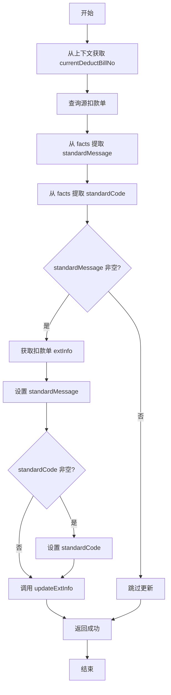

# PC170202 - 扣款失败话术策略出参

## 节点信息

| 属性 | 值 |
|------|-----|
| **节点ID** | node_1731485093372_83209 |
| **节点名称** | 扣款失败话术策略出参 |
| **处理器** | PC170202 |
| **节点类型** | PROCESS(处理器节点) |
| **所属流程** | [[扣款失败话术策略子流程]] |
| **执行阶段** | 结果输出阶段 |
| **优先级** | P1(核心节点) |

## 功能说明

从决策引擎返回的结果中提取标准化话术和错误码,并更新到扣款单的扩展信息中,供父流程使用。

### 核心职责

1. **结果提取**:从 ProcessContext.facts 中提取决策引擎返回的标准化话术和错误码
2. **扣款单更新**:将标准化话术写入扣款单的 `extInfo.standardMessage`
3. **错误码更新**:将标准化错误码写入扣款单的 `extInfo.standardCode`
4. **持久化**:调用 deductBillService 更新扣款单扩展信息

### 适用场景

- **决策成功**:决策引擎成功返回标准化话术
- **话术转换**:需要将技术性错误转换为用户友好提示
- **结果持久化**:需要保存转换后的话术供后续使用

## 输入参数

### 上下文依赖

从 `RepayApplyContext` 中获取:

| 参数 | 类型 | 说明 | 来源 |
|------|------|------|------|
| currentDeductBillNo | String | 当前扣款单编号 | 父流程上下文 |

### ProcessContext.facts

从决策引擎结果中提取:

| 参数Key | 参数值 | 说明 |
|---------|--------|------|
| deductStandardMessage | String | 标准化话术 |
| deductStandardCode | String | 标准化错误码(可选) |

## 输出参数

### 扣款单更新

更新 `DeductBill.extInfo`:

| 字段 | 类型 | 说明 |
|------|------|------|
| standardMessage | String | 标准化话术 |
| standardCode | String | 标准化错误码 |

## 处理逻辑

### initFacts 方法

```java
public void deductFailMsgOutput(ProcessContext<RepayContext> processContext) {
    RepayApplyContext repayApplyContext = (RepayApplyContext) processContext.getRequestParam();

    // 1. 查询源扣款单
    DeductBill sourceDeductBill = deductBillService.getByDeductBillNo(
        repayApplyContext.getBo().getCurrentDeductBillNo()
    );

    // 2. 从 facts 中提取决策引擎返回的标准化话术和错误码
    String standardMessage = RouteConvertUtils.parseFact(
        processContext.getFacts().get(RouteFactConstants.STRATEGY_PARAM_DEDUCT_STANDARD_MESSAGE)
    );
    String standardCode = RouteConvertUtils.parseFact(
        processContext.getFacts().get(RouteFactConstants.STRATEGY_PARAM_DEDUCT_STANDARD_CODE)
    );

    // 3. 如果有标准化话术,更新扣款单扩展信息
    if (StringUtils.isNotBlank(standardMessage)) {
        DeductBillExtInfo extInfo = sourceDeductBill.fetchExtInfo();
        extInfo.setStandardMessage(standardMessage);

        // 如果有标准化错误码,也一并更新
        if (StringUtils.isNotBlank(standardCode)) {
            extInfo.setStandardCode(standardCode);
        }

        // 持久化更新
        deductBillService.updateExtInfo(
            sourceDeductBill.getRepayApplyNo(),
            sourceDeductBill.getDeductBillNo(),
            extInfo,
            CommonConst.REPAY_ENGINE
        );
    }
}
```

### process 方法

```java
@Override
public ProcessResult process(RepayApplyContext repayContext) {
    // initFacts 已在框架层完成结果处理
    return createSuccessProcessResult();
}
```

## 上下游依赖

### 上游节点

| 节点 | 关系 | 说明 |
|------|------|------|
| node_1731485098156_272599 | 必须 | 决策引擎节���(提供标准化话术) |

### 下游节点

| 节点 | 关系 | 说明 |
|------|------|------|
| node_1731485095338_245333 | 必须 | 子流程结束节点 |

## 异常处理

### 异常类型

| 异常场景 | 处理方式 |
|----------|----------|
| 扣款单不存在 | 抛出异常,流程中断 |
| standardMessage 为空 | 跳过更新,不抛异常 |
| 数据库更新失败 | 抛出异常,流程重试 |

### 异常处理示例

```java
// 空值处理:如果没有标准化话术,跳过更新
if (StringUtils.isNotBlank(standardMessage)) {
    // 执行更新逻辑
}
```

## 实现位置

```
repayengine-service/src/main/java/cn/caijiajia/repayengine/service/repay/process/impl/
└── RepayApplyBizFlowPC170202ServiceImpl.java

repayengine-service/src/main/java/cn/caijiajia/repayengine/service/repay/impl/
└── RepayDeductFailMsgService.java
```

## 关键流程图



## 监控指标

### 关键指标

| 指标名称 | 说明 | 告警阈值 |
|----------|------|----------|
| fail_msg_output_count | 出参处理次数 | - |
| standard_msg_empty | 标准化话术为空次数 | > 20/min |
| deduct_bill_update_fail | 扣款单更新失败次数 | > 5/min |

## 相关文档

- [[扣款失败话术策略子流程]] - 所属子流程
- [[PC170201]] - 入参处理节点
- [[决策引擎接入指南]] - HENGINE决策引擎使用文档

## 参数映射表

### RouteFactConstants 常量映射

| 常量名 | 常量值 | 说明 |
|--------|--------|------|
| STRATEGY_PARAM_DEDUCT_STANDARD_MESSAGE | deductStandardMessage | 标准化话术 |
| STRATEGY_PARAM_DEDUCT_STANDARD_CODE | deductStandardCode | 标准化错误码 |

## 业务场景示例

### 场景1:正常话术转换

**输入**:
- standardMessage: "您的账户余额不足,请充值后重试"
- standardCode: "INSUFFICIENT_BALANCE"

**处理**:
- 更新 extInfo.standardMessage
- 更新 extInfo.standardCode
- 持久化到数据库

**输出**:
- 扣款单扩展信息更新成功
- 父流程可使用标准化话术

### 场景2:仅有话术无错误码

**输入**:
- standardMessage: "网络不太稳定,扣款未成功,请稍后重试"
- standardCode: null

**处理**:
- 更新 extInfo.standardMessage
- 跳过 standardCode 更新

**输出**:
- 扣款单扩展信息部分更新

### 场景3:决策引擎未返回结果

**输入**:
- standardMessage: null
- standardCode: null

**处理**:
- 跳过所有更新逻辑

**输出**:
- 保持原有扣款单信息不变
- 流程正常结束

## 注意事项

1. **时序要求**:必须在决策引擎节点之后执行
2. **空值容忍**:standardMessage 为空时不抛异常,允许流程继续
3. **幂等性**:重复执行会覆盖之前的标准化话术
4. **事务性**:扣款单更新操作在事务中执行
5. **字段长度**:standardMessage 应控制在合理长度内

## 标签

#扣款失败 #话术策略 #出参处理 #决策引擎 #repayengine #核心节点