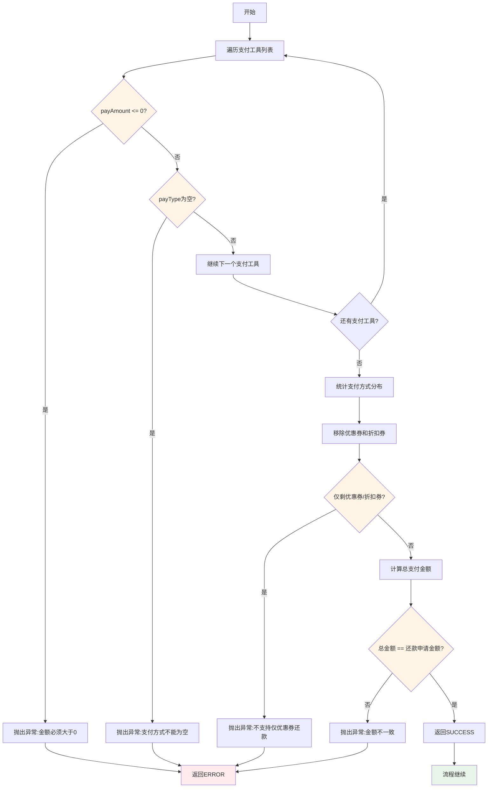
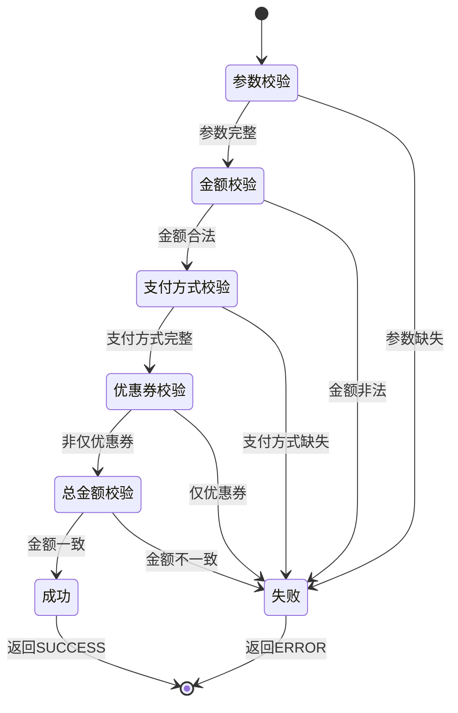

# PE110001 - 准入校验

## 节点信息

| 属性 | 值 |
|------|-----|
| **处理器代码** | PE110001 |
| **节点名称** | 准入校验 |
| **节点类型** | PROCESS |
| **所属流程** | [[账期制V400还款同步流程]] |
| **执行阶段** | 同步受理阶段 |
| **实现类** | RepayApplyBizFlowPE110001ServiceImpl |
| **优先级** | P0(核心节点) |

## 功能说明

准入校验节点负责验证还款申请参数的合法性和金额一致性,确保还款请求符合业务规则,避免非法或错误的还款申请进入后续流程。

### 核心职责
1. **支付工具金额校验**: 验证每个支付工具的金额必须大于0
2. **支付方式完整性校验**: 验证支付方式字段不能为空
3. **优惠券单独还款拦截**: 不支持仅使用优惠券或折扣券还款
4. **总金额一致性校验**: 验证支付工具总金额等于还款申请金额

### 适用场景

- **正常还款**: 校验还款金额和支付方式
- **提前结清**: 校验结清金额和支付方式
- **部分还款**: 校验部分还款金额和支付方式

## 输入参数

| 参数名 | 参数代码 | 类型 | 来源 | 说明 |
|--------|----------|------|------|------|
| 还款申请请求 | repayContext.getReq() | RepayApplyReq | 流程上下文 | 包含还款金额和支付工具列表 |
| 还款金额 | repayAmount | Integer | RepayApplyReq | 还款申请金额(单位:分) |
| 支付工具列表 | payToolList | List<PayTool> | RepayApplyReq | 支付方式列表 |

### PayTool 结构

| 字段名 | 字段代码 | 类型 | 说明 |
|--------|----------|------|------|
| 支付方式 | payType | PayType | 支付方式枚举 |
| 支付金额 | payAmount | Integer | 支付金额(单位:分) |
| 支付工具号 | payInstrumentNo | String | 支付工具编号(如优惠券ID/账户号) |

## 输出参数

| 参数名 | 参数代码 | 类型 | 说明 |
|--------|----------|------|------|
| 无 | - | - | 校验通过返回SUCCESS,校验失败返回ERROR |

## 处理流程



## 核心业务逻辑

### 1. 支付工具金额校验

**校验规则**:
```
FOR EACH payTool IN payToolList:
    IF payTool.payAmount <= 0 THEN
        THROW ErrorCode.REPAY_AMOUNT_CAN_NOT_BE_LESS_THAN_ZERO
    END IF
END FOR
```

**错误码**: `REPAY_AMOUNT_CAN_NOT_BE_LESS_THAN_ZERO`
**错误信息**: "还款金额不能小于等于0"

**业务含义**:
- 支付金额必须为正整数
- 不支持0元或负数支付

### 2. 支付方式完整性校验

**校验规则**:
```
FOR EACH payTool IN payToolList:
    IF payTool.payType == NULL THEN
        THROW ErrorCode.REPAY_PAY_TOOL_ERROR
    END IF
END FOR
```

**错误码**: `REPAY_PAY_TOOL_ERROR`
**错误信息**: "还款支付工具错误"

**业务含义**:
- 支付方式字段不能为空
- 必须明确指定支付方式

### 3. 优惠券单独还款拦截

**校验规则**:
```
payTypeCounterMap = payToolList.groupBy(payType)

// 移除优惠券和折扣券
withOutCouponPayTypeSet = payTypeCounterMap.keySet()
withOutCouponPayTypeSet.remove(COUPON_PAY)
withOutCouponPayTypeSet.remove(DEDUCT_PAY)

IF withOutCouponPayTypeSet.isEmpty() THEN
    THROW ErrorCode.REPAY_PAY_TYPE_COUPON_ONLY_NOT_SUPPORT
END IF
```

**错误码**: `REPAY_PAY_TYPE_COUPON_ONLY_NOT_SUPPORT`
**错误信息**: "暂时不支持仅使用优惠券还款"

**业务含义**:
- 优惠券只能作为辅助支付方式
- 必须搭配其他支付方式(如三方支付、溢缴款等)

**支持的主要支付方式**:
- ALIPAY_SDK: 支付宝SDK支付
- WECHAT_PAY: 微信支付
- OVERPAY: 溢缴款支付
- BANK_CARD: 银行卡代扣

**不单独支持的支付方式**:
- COUPON_PAY: 优惠券支付
- DEDUCT_PAY: 折扣券支付

### 4. 总金额一致性校验

**校验规则**:
```
totalPayToolAmount = payToolList.stream()
    .mapToInt(payTool -> payTool.payAmount)
    .sum()

IF totalPayToolAmount != repayAmount THEN
    THROW ErrorCode.REPAY_APPLY_SUBMIT_AMOUNT_ERROR
END IF
```

**错误码**: `REPAY_APPLY_SUBMIT_AMOUNT_ERROR`
**错误信息**: "还款申请金额与支付工具总金额不一致"

**业务含义**:
- 支付工具总金额必须等于还款申请金额
- 不支持部分支付或多支付

**示例**:
```
还款申请金额: 10000分 (100元)

支付工具列表:
  - 支付宝: 8000分 (80元)
  - 优惠券: 2000分 (20元)
  - 总计: 10000分

校验结果: 通过 (10000 == 10000)
```

## 支付方式枚举

### PayType 枚举值

| 枚举值 | 说明 | 可单独使用 |
|--------|------|-----------|
| ALIPAY_SDK | 支付宝SDK支付 | 是 |
| WECHAT_PAY | 微信支付 | 是 |
| OVERPAY | 溢缴款支付 | 是 |
| BANK_CARD | 银行卡代扣 | 是 |
| COUPON_PAY | 优惠券支付 | 否 |
| DEDUCT_PAY | 折扣券支付 | 否 |

### 支付方式判断方法

```java
// 判断是否为优惠券支付
PayType.isCouponPay(payType)

// 判断是否为折扣券支付
PayType.isDeductPay(payType)
```

## 状态流转



## 上游节点

- **系统触发 (SYSTEM_TRIGGER)**: 流程入口节点

## 下游节点

- **PE110010** - 请求幂等

## 异常处理

| 异常场景 | 错误类型 | 错误码 | 处理方式 | 影响 |
|----------|----------|--------|----------|------|
| 支付金额 <= 0 | ClientException | REPAY_AMOUNT_CAN_NOT_BE_LESS_THAN_ZERO | 记录日志,返回ERROR | 流程终止 |
| 支付方式为空 | ClientException | REPAY_PAY_TOOL_ERROR | 记录日志,返回ERROR | 流程终止 |
| 仅优惠券还款 | ClientException | REPAY_PAY_TYPE_COUPON_ONLY_NOT_SUPPORT | 记录日志,返回ERROR | 流程终止 |
| 金额不一致 | ClientException | REPAY_APPLY_SUBMIT_AMOUNT_ERROR | 记录日志,返回ERROR | 流程终止 |

## 日志记录

### 错误日志

**日志级别**: WARN
**日志内容**: "验证还款申请数据「PE010002」异常"
**日志上下文**:
- 异常堆栈
- 还款申请号
- 用户ID
- 还款金额
- 支付工具列表

### 日志示例

```
WARN [PE110001] 验证还款申请数据「PE010002」异常
  - repayApplyNo: APPLY20240319001
  - uid: 100123456789
  - repayAmount: 10000
  - payToolList: [{"payType":"ALIPAY_SDK","payAmount":5000},{"payType":"COUPON_PAY","payAmount":6000}]
  - error: 还款申请金额与支付工具总金额不一致
```

## 监控指标

### 业务指标
- **准入校验通过率**: 通过数 / 总校验数
- **金额不一致率**: 金额不一致次数 / 总校验数
- **仅优惠券拒绝率**: 仅优惠券拒绝次数 / 总校验数
- **支付方式错误率**: 支付方式错误次数 / 总校验数

### 技术指标
- **平均校验耗时**: P50/P95/P99
- **异常率**: 异常数 / 总执行数

## 性能优化

### 1. 流式处理
- **策略**: 使用 Stream API 遍历支付工具列表
- **效果**: 代码简洁,性能良好

### 2. 提前返回
- **策略**: 遇到错误立即返回,不继续校验
- **效果**: 减少不必要的计算

### 3. 分组统计
- **策略**: 使用 Collectors.groupingBy 统计支付方式分布
- **效果**: 快速判断是否存在非优惠券支付方式

## 实现位置

```bash
repayengine-service/src/main/java/cn/caijiajia/repayengine/service/
└── repay/process/dcp/
    └── RepayApplyBizFlowPE110001ServiceImpl.java  # 节点处理器 (93行)
```

## 代码示例

### 核心代码片段

```java
@Override
public ProcessResult process(RepayApplyContext repayContext) {
    try {
        // 计算所有支付工具的总金额
        Integer totalPayToolAmount = calculatorPayToolItemAmount(repayContext);

        // 校验总金额是否等于还款申请金额
        if (IntegerUtil.add(totalPayToolAmount, -1 * IntegerUtil.valueof(repayContext.getReq().getRepayAmount())) != 0) {
            throw REExceptionUtils.newClientException(
                ErrorCode.REPAY_APPLY_SUBMIT_AMOUNT_ERROR,
                repayContext.getReq().getRepayAmount(),
                totalPayToolAmount
            );
        }
    } catch (Exception cce) {
        repayContext.setMessage(cce.getMessage());
        RE_LOG.warn(cce, "验证还款申请数据「PE010002」异常");
        return createErrorProcessResult(repayContext.getMessage());
    }
    return createSuccessProcessResult();
}

private Integer calculatorPayToolItemAmount(RepayApplyContext repayContext) {
    // 校验每个支付工具的金额和支付方式
    for (RepayApplyReq.PayTool payItem : repayContext.getReq().getPayToolList()) {
        if (payItem.getPayAmount() <= 0) {
            throw REExceptionUtils.newClientException(ErrorCode.REPAY_AMOUNT_CAN_NOT_BE_LESS_THAN_ZERO);
        }
        if (payItem.getPayType() == null) {
            throw REExceptionUtils.newClientException(ErrorCode.REPAY_PAY_TOOL_ERROR, JSON.toJSONString(payItem));
        }
    }

    // 检查是否仅使用优惠券或折扣券
    Map<PayType, Long> payTypeCounterMap = repayContext.getReq().getPayToolList().stream()
            .collect(Collectors.groupingBy(RepayApplyReq.PayTool::getPayType, Collectors.counting()));
    Set<PayType> withOutCouponPayTypeSet = payTypeCounterMap.keySet();
    withOutCouponPayTypeSet.remove(PayType.COUPON_PAY);
    withOutCouponPayTypeSet.remove(PayType.DEDUCT_PAY);

    if (CollectionUtils.isEmpty(withOutCouponPayTypeSet)) {
        throw REExceptionUtils.newClientException(ErrorCode.REPAY_PAY_TYPE_COUPON_ONLY_NOT_SUPPORT);
    }

    // 计算总金额
    return repayContext.getReq().getPayToolList().stream()
        .mapToInt(RepayApplyReq.PayTool::getPayAmount)
        .sum();
}
```

## 设计考虑

### 1. 为什么不支持仅优惠券还款?

**原因**:
- 优惠券通常有使用条件(如满减门槛)
- 仅使用优惠券无法完成实际资金扣款
- 需要搭配其他支付方式完成还款

### 2. 为什么要校验金额一致性?

**原因**:
- 确保还款金额准确无误
- 避免部分支付或多支付
- 保证账务一致性

### 3. 为什么支付金额必须大于0?

**原因**:
- 0元或负数支付无实际意义
- 避免账务异常
- 符合业务逻辑

## 相关文档

- [[账期制V400还款同步流程]] - 主流程设计
- [[PE110010]] - 请求幂等
- [[支付方式枚举]] - PayType枚举说明
- [[还款业务规则]] - 还款业务规则文档

## 标签

#节点 #准入校验 #参数校验 #金额校验 #PE110001