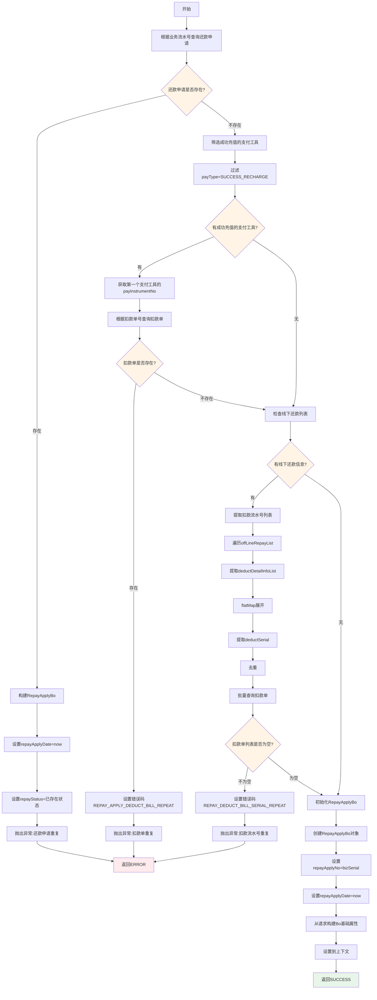
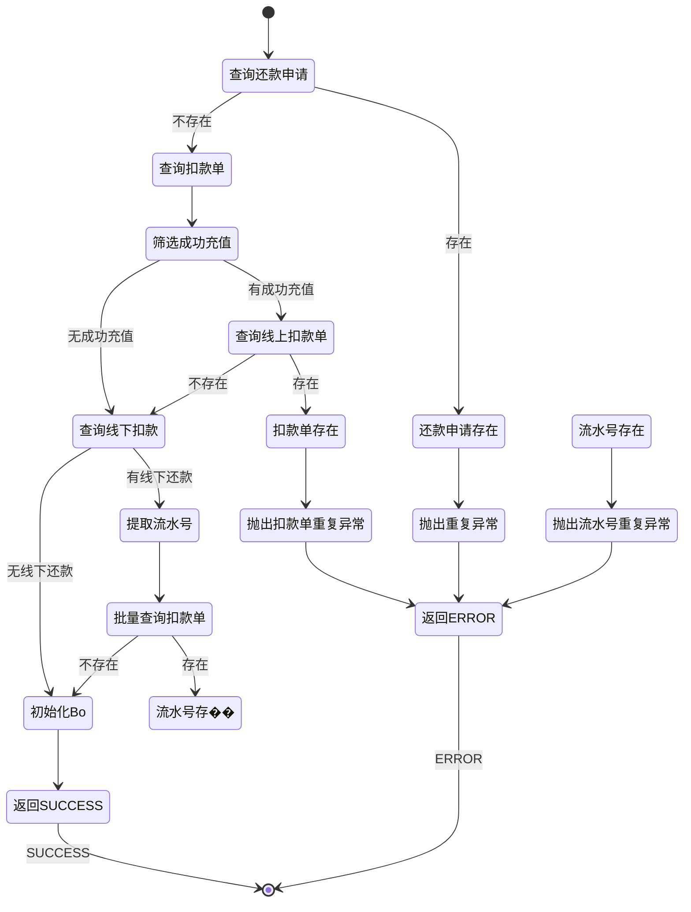

# PE110010 - 请求幂等

## 节点信息

| 属性 | 值 |
|------|-----|
| **处理器代码** | PE110010 |
| **节点名称** | 请求幂等 |
| **节点类型** | PROCESS |
| **所属流程** | [[账期制V400还款同步流程]] |
| **执行阶段** | 同步受理阶段 |
| **实现类** | RepayApplyBizFlowPE110010ServiceImpl |
| **优先级** | P0(核心节点) |

## 功能说明

请求幂等节点负责确保还款申请的幂等性,防止重复还款导致的重复扣款和入账,同时校验扣款单流水号的唯一性,确保还款操作的安全性。

### 核心职责
1. **业务流水号幂等校验**: 检查是否存在相同业务流水号的还款申请
2. **扣款单流水号幂等校验**: 检查线上扣款的扣款单号是否重复
3. **线下扣款流水号幂等校验**: 检查线下还款的扣款流水号是否重复
4. **初始化还款处理对象**: 创建RepayApplyBo对象,设置基础信息

### 适用场景

- **正常还款**: 防止重复还款申请
- **网络重试**: 防止网络异常导致的重复请求
- **线下还款**: 防止线下扣款流水号重复

## 输入参数

| 参数名 | 参数代码 | 类型 | 来源 | 说明 |
|--------|----------|------|------|------|
| 业务流水号 | bizSerial | String | RepayApplyReq | 还款申请业务流水号 |
| 支付工具列表 | payToolList | List<PayTool> | RepayApplyReq | 支付方式列表 |
| 线下还款列表 | offLineRepayList | List<OffLineRepayInfo> | RepayApplyReq | 线下还款信息列表 |

### PayTool 结构

| 字段名 | 字段代码 | 类型 | 说明 |
|--------|----------|------|------|
| 支付方式 | payType | PayType | 支付方式枚举 |
| 支付金额 | payAmount | Integer | 支付金额(单位:分) |
| 支付工具号 | payInstrumentNo | String | 支付工具编号(如扣款单号) |

### OffLineRepayInfo 结构

| 字段名 | 字段代码 | 类型 | 说明 |
|--------|----------|------|------|
| 扣款明细列表 | deductDetailInfoList | List<DeductDetailInfo> | 扣款明细信息列表 |

### DeductDetailInfo 结构

| 字段名 | 字段代码 | 类型 | 说明 |
|--------|----------|------|------|
| 扣款流水号 | deductSerial | String | 扣款流水号(唯一) |
| 扣款金额 | deductAmount | Integer | 扣款金额(单位:分) |

## 输出参数

| 参数名 | 参数代码 | 类型 | 说明 |
|--------|----------|------|------|
| 还款处理对象 | repayApplyBo | RepayApplyBo | 初始化的还款处理对象 |

## 处理流程



## 核心业务逻辑

### 1. 业务流水号幂等校验

**查询逻辑**:
```
RepayApply repayApply = repayApplyService.getByBizSerial(bizSerial, false)
```

**参数说明**:
- **bizSerial**: 业务流水号(来自请求)
- **false**: 不包括已删除的记录

**判断逻辑**:
```
IF repayApply != NULL THEN
    // 构建RepayApplyBo
    repayApplyBo = RepayApplyBo.builder()
        .repayApplyDate(LocalDateTime.now())
        .repayStatus(repayApply.repayStatus)
        .build()

    // 设置到上下文
    repayContext.setBo(repayApplyBo)

    // 抛出异常
    THROW ClientException(REPAY_APPLY_REDUNDANCY)
END IF
```

**业务含义**:
- 业务流水号是还款申请的唯一标识
- 如果存在相同业务流水号的还款申请,说明是重复请求
- 返回原还款申请的状态,不再继续处理

**错误码**: `REPAY_APPLY_REDUNDANCY`
**错误信息**: "还款申请重复"

### 2. 扣款单流水号���等校验

**适用场景**: 线上扣款(微信/支付宝/银行卡等)

**筛选逻辑**:
```java
List<RepayApplyReq.PayTool> payToolList = repayApplyReq.getPayToolList().stream()
    .filter(item -> PayType.isSuccessRecharge(item.getPayType()))
    .collect(Collectors.toList());
```

**isSuccessRecharge 判断**:
- 判断支付方式是否为"成功充值"类型
- 成功充值类型表示已经完成扣款,有扣款单号

**查询逻辑**:
```
IF payToolList不为空 THEN
    // 获取第一个支付工具的payInstrumentNo(扣款单号)
    deductBillNo = payToolList.get(0).payInstrumentNo

    // 查询扣款单
    DeductBill deductBill = deductBillService.getByDeductBillNo(deductBillNo)

    IF deductBill != NULL THEN
        // 设置错误码
        repayContext.setCode(REPAY_APPLY_DEDUCT_BILL_REPEAT)

        // 抛出异常
        THROW ClientException(REPAY_APPLY_DEDUCT_BILL_REPEAT)
    END IF
END IF
```

**业务含义**:
- 成功充值类型的支付工具包含扣款单号
- 如果扣款单号已存在,说明该笔扣款已处理
- 防止重复使用同一笔扣款

**错误码**: `REPAY_APPLY_DEDUCT_BILL_REPEAT`
**错误信息**: "扣款单重复"

### 3. 线下扣款流水号幂等校验

**适用场景**: 线下还款(银行转账、现金等)

**提取逻辑**:
```java
List<String> deductSerialList = repayApplyReq.getOffLineRepayList().stream()
    .filter(item -> CollectionUtils.isNotEmpty(item.getDeductDetailInfoList()))
    .map(OffLineRepayInfo::getDeductDetailInfoList)
    .flatMap(Collection::stream)
    .map(DeductDetailInfo::getDeductSerial)
    .distinct()
    .collect(Collectors.toList());
```

**提取步骤**:
1. 遍历线下还款列表
2. 过滤掉扣款明细为空的记录
3. 提取扣款明细列表
4. flatMap展开为扣款明细流
5. 提取扣款流水号
6. 去重
7. 收集为列表

**查询逻辑**:
```
IF offLineRepayList不为空 THEN
    // 提取扣款流水号列表
    deductSerialList = 提取逻辑(见上)

    // 批量查询扣款单
    List<DeductBill> deductBillList = deductBillService.getByDeductBillNoList(deductSerialList)

    IF deductBillList不为空 THEN
        // 设置错误码
        repayContext.setCode(REPAY_DEDUCT_BILL_SERIAL_REPEAT)

        // 抛出异常
        THROW ClientException(REPAY_DEDUCT_BILL_SERIAL_REPEAT)
    END IF
END IF
```

**业务含义**:
- 线下还款的扣款流水号是唯一标识
- 如果扣款流水号已存在,说明该笔扣款已处理
- 防止重复录入同一笔线下扣款

**错误码**: `REPAY_DEDUCT_BILL_SERIAL_REPEAT`
**错误信息**: "扣款流水号重复"

### 4. 初始化还款处理对象

**初始化逻辑**:
```java
private void initRepayApplyBo(RepayApplyContext repayContext) {
    RepayApplyBo repayApplyBo = new RepayApplyBo();

    // 设置还款申请号(使用业务流水号)
    repayApplyBo.setRepayApplyNo(repayContext.getBizSerial());

    // 设置还款申请日期(当前时间)
    repayApplyBo.setRepayApplyDate(LocalDateTime.now());

    // 从请求构建Bo的基础属性
    repayApplyBo.buildBoFromReqBase(repayContext.getReq());

    // 设置到上下文
    repayContext.setBo(repayApplyBo);
}
```

**buildBoFromReqBase 方法**:
- 从RepayApplyReq中复制基础属性到RepayApplyBo
- 包括: uid, repayAmount, repayWay, repayCategory等

**初始化字段**:
- **repayApplyNo**: 还款申请号(使用bizSerial)
- **repayApplyDate**: 还款申请日期(当前时间)
- **uid**: 用户ID
- **repayAmount**: 还款金额
- **repayWay**: 还款方式
- **repayCategory**: 还款类别
- **其他字段**: 根据请求设置

## 状态流转



## 上游节点

- **PE110001** - 准入校验

## 下游节点

- **PE110060** - 锁单

## 异常处理

| 异常场景 | 错误类型 | 错误码 | 处理方式 | 影响 |
|----------|----------|--------|----------|------|
| 还款申请重复 | ClientException | REPAY_APPLY_REDUNDANCY | 记录日志,返回ERROR | 流程终止 |
| 扣款单重复 | ClientException | REPAY_APPLY_DEDUCT_BILL_REPEAT | 设置错误码,返回ERROR | 流程终止 |
| 扣款流水号重复 | ClientException | REPAY_DEDUCT_BILL_SERIAL_REPEAT | 设置错误码,返回ERROR | 流程终止 |
| 其他异常 | ServerException | - | 记录日志,返回ERROR | 流程终止 |

## 日志记录

### 警告日志

**日志级别**: WARN
**日志场景**: 幂等校验失败
**日志内容**: LogPayLoad.of(ErrorCode.REPAY_APPLY_REDUNDANCY.getMsg(), bizSerial)
**日志上下文**:
- 异常堆栈
- 业务流水号
- 错误信息

### 日志示例

```
WARN [PE110010] 还款申请重复
  - bizSerial: BIZ20240319001
  - error: 还款申请重复,请勿重复提交
```

## 监控指标

### 业务指标
- **幂等命中率**: 幂等拦截数 / 总请求数
- **业务流水号重复率**: 业务流水号重复数 / 总请求数
- **扣款单重复率**: 扣款单重复数 / 总请求数
- **扣款流水号重复率**: 扣款流水号重复数 / 总请求数

### 技术指标
- **平均查询耗时**: P50/P95/P99
- **数据库查询成功率**: 成功数 / 总查询数

## 性能优化

### 1. 索引优化
- **策略**: 在bizSerial字段上建立唯一索引
- **效果**: 加快查询速度,保证唯一性

### 2. 批量查询
- **策略**: 批量查询线下扣款流水号
- **效果**: 减少数据库查询次数

### 3. 缓存优化
- **策略**: 缓存最近的还款申请记录
- **效果**: 减少数据库查询,提高响应速度

## 实现位置

```bash
repayengine-service/src/main/java/cn/caijiajia/repayengine/service/
├── repay/process/dcp/
│   └── RepayApplyBizFlowPE110010ServiceImpl.java  # 节点处理器 (123行)
├── repayapply/
│   └── IRepayApplyService.java                     # 还款申请服务
└── bill/
    └── IDeductBillService.java                     # 扣款单服务
```

## 代码示例

### 核心代码片段

```java
@Override
public ProcessResult process(RepayApplyContext repayContext) {
    RepayApplyReq repayApplyReq = repayContext.getReq();
    try {
        // 1. 业务流水号幂等校验
        RepayApply repayApply = repayApplyService.getByBizSerial(repayApplyReq.getBizSerial(), false);
        if (repayApply != null) {
            repayContext.setBo(RepayApplyBo.builder()
                .repayApplyDate(LocalDateTime.now())
                .repayStatus(repayApply.getRepayStatus())
                .build());
            throw REExceptionUtils.newClientException(ErrorCode.REPAY_APPLY_REDUNDANCY);
        }

        // 2. 扣款单流水号幂等校验(线上扣款)
        List<RepayApplyReq.PayTool> payToolList = repayApplyReq.getPayToolList().stream()
            .filter(item -> PayType.isSuccessRecharge(item.getPayType()))
            .collect(Collectors.toList());
        if (CollectionUtils.isNotEmpty(payToolList)) {
            DeductBill deductBill = deductBillService.getByDeductBillNo(payToolList.get(0).getPayInstrumentNo());
            if (deductBill != null) {
                repayContext.setCode(String.valueOf(ErrorCode.REPAY_APPLY_DEDUCT_BILL_REPEAT.getCode()));
                throw REExceptionUtils.newClientException(ErrorCode.REPAY_APPLY_DEDUCT_BILL_REPEAT);
            }
        }

        // 3. 线下扣款流水号幂等校验
        if (CollectionUtils.isNotEmpty(repayApplyReq.getOffLineRepayList())) {
            List<String> deductSerialList = repayApplyReq.getOffLineRepayList().stream()
                .filter(item -> CollectionUtils.isNotEmpty(item.getDeductDetailInfoList()))
                .map(OffLineRepayInfo::getDeductDetailInfoList)
                .flatMap(Collection::stream)
                .map(DeductDetailInfo::getDeductSerial)
                .distinct()
                .collect(Collectors.toList());

            List<DeductBill> deductBillList = deductBillService.getByDeductBillNoList(deductSerialList);
            if (CollectionUtils.isNotEmpty(deductBillList)) {
                repayContext.setCode(String.valueOf(ErrorCode.REPAY_DEDUCT_BILL_SERIAL_REPEAT.getCode()));
                throw REExceptionUtils.newClientException(ErrorCode.REPAY_DEDUCT_BILL_SERIAL_REPEAT);
            }
        }

        // 4. 初始化还款处理对象
        initRepayApplyBo(repayContext);

    } catch (CjjClientException | CjjServerException cce) {
        RE_LOG.warn(cce, LogPayLoad.of(ErrorCode.REPAY_APPLY_REDUNDANCY.getMsg(), repayApplyReq.getBizSerial()));
        repayContext.setMessage(cce.getMessage());
        return createErrorProcessResult(repayContext.getMessage());
    }
    return createSuccessProcessResult();
}

private void initRepayApplyBo(RepayApplyContext repayContext) {
    RepayApplyBo repayApplyBo = new RepayApplyBo();
    repayApplyBo.setRepayApplyNo(repayContext.getBizSerial());
    repayApplyBo.setRepayApplyDate(LocalDateTime.now());
    repayApplyBo.buildBoFromReqBase(repayContext.getReq());
    repayContext.setBo(repayApplyBo);
}
```

## 设计考虑

### 1. 为什么需要幂等控制?

**原因**:
- 网络异常可能导致重复请求
- 用户可能误操作多次点击
- 定时任务可能重复执行
- 防止重复扣款造成资金损失

### 2. 为什么要分别校验业务流水号和扣款单号?

**原因**:
- 业务流水号是请求级别的幂等
- 扣款单号是扣款级别的幂等
- 两者都需要校验,确保完整的幂等性

### 3. 为什么线下扣款要单独校验?

**原因**:
- 线下扣款的扣款流水号由运营录入
- 扣款流水号可能来自银行回单
- 需要确保同一笔银行流水不被重复录入

### 4. 为什么幂等失败返回ERROR而不是SUCCESS?

**原因**:
- 重复请求属于客户端异常
- 返回ERROR可以让调用方感知到异常
- 避免调用方误以为请求成功

## 相关文档

- [[账期制V400还款同步流程]] - 主流程设计
- [[PE110060]] - 锁单
- [[幂等控制设计]] - 幂等控制方案
- [[扣款单管理]] - 扣款单管理文档

## 标签

#节点 #幂等控制 #重复校验 #核心节点 #PE110010