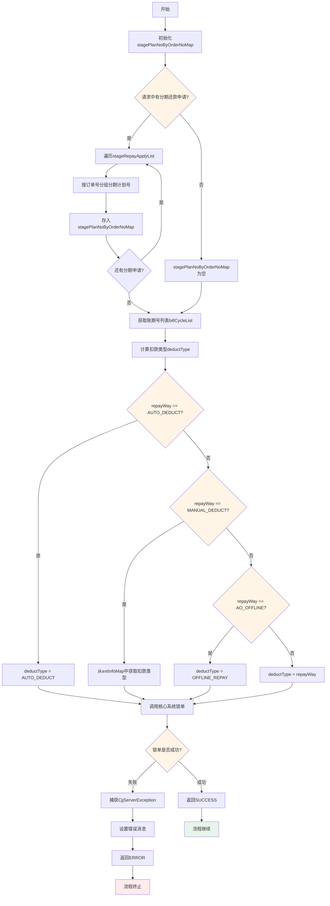
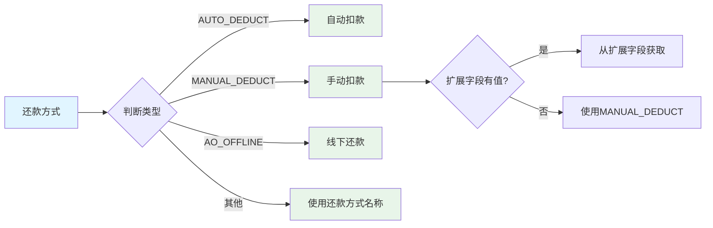
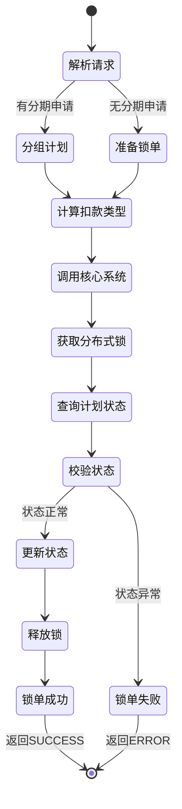

# PE110060 - 锁单

## 节点信息

| 属性 | 值 |
|------|-----|
| **处理器代码** | PE110060 |
| **节点名称** | 锁单 |
| **节点类型** | PROCESS |
| **所属流程** | [[账期制V400还款同步流程]] |
| **执行阶段** | 同步受理阶段 |
| **实现类** | RepayApplyBizFlowPE110060ServiceImpl |
| **优先级** | P0(核心节点) |

## 功能说明

锁单节点负责锁定用户待还款的分期计划,防止并发还款导致的重复扣款和入账,确保还款操作的原子性和一致性。

### 核心职责
1. **解析分期还款申请**: 从请求中提取分期订单和分期计划信息
2. **按订单分组**: 将分期计划按订单号分组
3. **计算扣款类型**: 根据还款方式和扩展字段确定扣款类型
4. **调用核心系统锁单**: 锁定分期计划状态,防止并发修改

### 适用场景

- **正常还款**: 锁定指定账期的分期计划
- **提前结清**: 锁定所有未结清的分期计划
- **部分还款**: 锁定指定的分期计划

## 输入参数

| 参数名 | 参数代码 | 类型 | 来源 | 说明 |
|--------|----------|------|------|------|
| 分期还款申请列表 | stageRepayApplyList | List<StageRepayApply> | RepayApplyReq | 指定分期计划的还款申请 |
| 账期号列表 | billNoList | List<String> | RepayApplyReq | 待还款的账期号列表 |
| 用户ID | uid | String | RepayApplyContext | 用户唯一标识 |
| 还款申请号 | repayApplyNo | String | RepayApplyBo | 还款申请唯一标识 |
| 还款金额 | repayAmount | Integer | RepayApplyBo | 还款金额(单位:分) |
| 还款方式 | repayWay | RepayWay | RepayApplyBo | 还款方式枚举 |
| 扩展字段 | extInfoMap | Map<String,String> | RepayApplyBo | 扩展字段 |

### StageRepayApply 结构

| 字段名 | 字段代码 | 类型 | 说明 |
|--------|----------|------|------|
| 分期订单号 | stageOrderNo | String | 分期订单唯一标识 |
| 分期计划号 | stagePlanNo | String | 分期计划唯一标识 |
| 还款金额 | repayAmount | Integer | 该期还款金额(单位:分) |

## 输出参数

| 参数名 | 参数代码 | 类型 | 说明 |
|--------|----------|------|------|
| 无 | - | - | 锁单成功返回SUCCESS,锁单失败返回ERROR |

## 处理流程



## 核心业务逻辑

### 1. 解析分期还款申请

**业务逻辑**:
```
IF stageRepayApplyList不为空 THEN
    FOR EACH stageRepayApply IN stageRepayApplyList DO
        stageOrderNo = stageRepayApply.stageOrderNo
        stagePlanNo = stageRepayApply.stagePlanNo

        // 按订单号分组
        IF stagePlanNoByOrderNoMap不包含stageOrderNo THEN
            stagePlanNoByOrderNoMap[stageOrderNo] = []
        END IF

        stagePlanNoByOrderNoMap[stageOrderNo].add(stagePlanNo)
    END FOR
END IF
```

**数据结构**:
```
stagePlanNoByOrderNoMap = {
    "ORDER_001": ["PLAN_001", "PLAN_002"],
    "ORDER_002": ["PLAN_003"]
}
```

**业务含义**:
- Key: 分期订单号
- Value: 该订单下待还款的分期计划号列表

### 2. 计算扣款类型

**扣款类型枚举**: `DeductType` / `DeductTypeEnum`

**计算规则**:

| 还款方式 | 扩展字段 | 扣款类型 | 说明 |
|---------|---------|---------|------|
| AUTO_DEDUCT | - | AUTO_DEDUCT | 自动扣款 |
| MANUAL_DEDUCT | 包含MANUAL_DEDUCT字段 | extInfoMap.get(MANUAL_DEDUCT) | 手动扣款(具体类型从扩展字段获取) |
| AO_OFFLINE | - | OFFLINE_REPAY | 线下还款 |
| 其他 | - | repayWay.name() | 使用还款方式名称 |

**计算逻辑**:
```java
private String calcRepayWay(RepayWay repayWay, Map<String, String> extField) {
    // 自动扣款
    if (repayWay == RepayWay.AUTO_DEDUCT) {
        return DeductTypeEnum.AUTO_DEDUCT.name();
    }

    // 手动扣款(从扩展字段获取具体扣款类型)
    if (repayWay == RepayWay.MANUAL_DEDUCT && extField != null) {
        if (extField.containsKey(RepayWay.MANUAL_DEDUCT.name())) {
            return extField.get(RepayWay.MANUAL_DEDUCT.name());
        }
    }

    // 线下还款
    if (repayWay == RepayWay.AO_OFFLINE) {
        return DeductTypeEnum.OFFLINE_REPAY.name();
    }

    // 默认使用还款方式名称
    return repayWay.name();
}
```

### 3. 调用核心系统锁单

**锁单服务**: `LoanCoreRepayService.tryRepayPlansV3()`

**锁单参数**:
- **uid**: 用户ID
- **billCycleList**: 账期号列表(未指定分期计划时使用)
- **stagePlanNoByOrderNoMap**: 订单号→分期计划号映射(指定分期计划时使用)
- **repayApplyNo**: 还款申请号(用于关联锁单记录)
- **repayAmount**: 还款金额(用于校验)
- **deductType**: 扣款类型(自动扣款/手动扣款/线下还款)
- **其他参数**: null

**锁单逻辑**:
```
tryRepayPlansV3(
    uid,                    // 用户ID
    billCycleList,          // 账期号列表
    stagePlanNoByOrderNoMap,// 订单号→分期计划号映射
    repayApplyNo,           // 还款申请号
    repayAmount,            // 还款金额
    deductType,             // 扣款类型
    null                    // 其他参数
)
```

**锁单结果**:
- **成功**: 分期计划状态更新为"还款中",可以继续后续流程
- **失败**: 抛出异常,流程终止

## 扣款类型说明

### DeductType / DeductTypeEnum

| 枚举值 | 说明 | 触发方式 |
|--------|------|---------|
| AUTO_DEDUCT | 自动扣款 | 系统自动触发 |
| MANUAL_DEDUCT | 手动扣款 | 用户主动触发 |
| OFFLINE_REPAY | 线下还款 | 线下打款,运营录入 |
| BANK_CARD | 银行卡代扣 | 银行卡自动扣款 |
| THIRD_PARTY | 三方支付 | 支付宝/微信等 |

### 还款方式与扣款类型映射



## 锁单机制

### 1. 乐观锁

**实现方式**:
- 核心系统使用数据库乐观锁
- 分期计划表增加版本号字段
- 更新时校验版本号

**锁单SQL示例**:
```sql
UPDATE stage_plan
SET status = 'REPAYING',
    version = version + 1,
    repay_apply_no = #{repayApplyNo}
WHERE stage_plan_no = #{stagePlanNo}
  AND status = 'NORMAL'
  AND version = #{version}
```

### 2. 分布式锁

**实现方式**:
- 使用Redis分布式锁
- 锁Key: `repay:lock:uid:{uid}:order:{stageOrderNo}`
- 锁过期时间: 30秒

**锁流程**:
```
1. 尝试获取分布式锁
2. 查询分期计划状态
3. 校验状态是否允许还款
4. 更新分期计划状态为"还款中"
5. 释放分布式锁
```

### 3. 数据库锁

**实现方式**:
- 使用数据库行锁
- SELECT ... FOR UPDATE

**锁单SQL示例**:
```sql
SELECT * FROM stage_plan
WHERE stage_plan_no IN (#{stagePlanNoList})
FOR UPDATE
```

## 状态流转



## 上游节点

- **PE110010** - 请求幂等

## 下游节点

- **PE120001** - 还款试算

## 异常处理

| 异常场景 | 错误类型 | 处理方式 | 影响 |
|----------|----------|----------|------|
| 分期计划状态异常 | CjjServerException | 设置错误消息,返回ERROR | 流程终止 |
| 分期计划已结清 | CjjServerException | 设置错误消息,返回ERROR | 流程终止 |
| 分期计划已逾期 | CjjServerException | 设置错误消息,返回ERROR | 流程终止 |
| 分布式锁获取失败 | CjjServerException | 设置错误消息,返回ERROR | 流程终止 |
| 数据库更新失败 | Exception | 记录日志,返回ERROR | 流程终止 |
| 其他异常 | Exception | 记录日志,返回ERROR | 流程终止 |

### 错误码

| 错误码 | 错误信息 | 说明 |
|--------|----------|------|
| REPAY_STAGE_PLAN_STATUS_ERROR | 分期计划状态异常 | 分期计划状态不允许还款 |
| STAGE_PLAN_ALREADY_PAYOFF | 分期计划已结清 | 分期计划已结清,无需还款 |
| STAGE_PLAN_OVERDUE | 分期计划已逾期 | 分期计划已逾期,需要特殊处理 |
| DISTRIBUTED_LOCK_FAILED | 获取分布式锁失败 | 并发还款,锁获取失败 |

## 日志记录

### 错误日志

**日志级别**: WARN
**日志内容**: "客户账锁单「PE110060」异常,解锁并置失败"
**日志上下文**:
- 异常堆栈
- 用户ID
- 还款申请号
- 账期号列表
- 分期计划映射

### 日志示例

```
WARN [PE110060] 客户账锁单「PE110060」异常,解锁并置失败
  - uid: 100123456789
  - repayApplyNo: APPLY20240319001
  - billCycleList: ["202403"]
  - stagePlanNoByOrderNoMap: {"ORDER_001":["PLAN_001","PLAN_002"]}
  - error: 分期计划状态异常
```

## 监控指标

### 业务指标
- **锁单成功率**: 成功数 / 总锁单数
- **锁单并发冲突率**: 冲突数 / 总锁单数
- **平均锁单耗时**: P50/P95/P99
- **分期计划状态异常率**: 异常数 / 总锁单数

### 技术指标
- **分布式锁获取成功率**: 成功数 / 总请求数
- **数据库锁等待时间**: P50/P95/P99
- **锁超时率**: 超时数 / 总锁单数

## 性能优化

### 1. 批量锁单
- **策略**: 一次性锁定多个分期计划
- **效果**: 减少数据库交互次数

### 2. 分布式锁优化
- **策略**: 使用Redis Lua脚本保证原子性
- **效果**: 避免死锁,提高并发性能

### 3. 乐观锁优先
- **策略**: 优先使用乐观锁,减少悲观锁
- **效果**: 提高并发性能

### 4. 锁粒度优化
- **策略**: 按订单号分组锁单,减少锁冲突
- **效果**: 提高并发度

## 实现位置

```bash
repayengine-service/src/main/java/cn/caijiajia/repayengine/service/
├── repay/process/dcp/
│   └── RepayApplyBizFlowPE110060ServiceImpl.java  # 节点处理器 (104行)
└── loan/
    └── LoanCoreRepayService.java                   # 核心系统锁单服务
```

## 代码示例

### 核心代码片段

```java
@Override
public ProcessResult process(RepayApplyContext repayContext) {
    try {
        lockStagePlans(repayContext);
        return createSuccessProcessResult();
    } catch (CjjServerException ce) {
        repayContext.setMessage(ce.getDeveloperMessage());
        return createErrorProcessResult(ce.getDeveloperMessage());
    } catch (Exception e) {
        RE_LOG.warn(e, "客户账锁单「PE110060」异常,解锁并置失败");
        repayContext.setMessage(e.getMessage());
        repayContext.setCode(String.valueOf(ErrorCode.REPAY_STAGE_PLAN_STATUS_ERROR.getCode()));
        return createErrorProcessResult(e.getMessage());
    }
}

private void lockStagePlans(RepayApplyContext repayContext) {
    // 按订单号分组分期计划号
    Map<String, List<String>> stagePlanNoByOrderNoMap = Maps.newHashMap();
    if (CollectionUtils.isNotEmpty(repayContext.getReq().getStageRepayApplyList())) {
        for (RepayApplyReq.StageRepayApply stageRepayApply : repayContext.getReq().getStageRepayApplyList()) {
            stagePlanNoByOrderNoMap.putIfAbsent(stageRepayApply.getStageOrderNo(), Lists.newArrayList());
            stagePlanNoByOrderNoMap.get(stageRepayApply.getStageOrderNo()).add(stageRepayApply.getStagePlanNo());
        }
    }

    // 获取账期号列表
    List<String> billCycleList = repayContext.getReq().getBillNoList();

    // 计算扣款类型
    DeductType deductType = Enums.getIfPresent(DeductType.class,
            calcRepayWay(repayContext.getBo().getRepayWay(), repayContext.getBo().getExtInfoMap()))
            .toJavaUtil()
            .orElseThrow(() -> REExceptionUtils.newClientException(ErrorCode.ENUM_CAST_EXCEPTION));

    // 调用核心系统锁单
    loanCoreRepayService.tryRepayPlansV3(
        repayContext.getUid(),
        billCycleList,
        stagePlanNoByOrderNoMap,
        repayContext.getBo().getRepayApplyNo(),
        repayContext.getBo().getRepayAmount(),
        deductType,
        null
    );
}

private String calcRepayWay(RepayWay repayWay, Map<String, String> extField) {
    if (repayWay == RepayWay.AUTO_DEDUCT) {
        return DeductTypeEnum.AUTO_DEDUCT.name();
    }
    if (repayWay == RepayWay.MANUAL_DEDUCT && extField != null) {
        if (extField.containsKey(RepayWay.MANUAL_DEDUCT.name())) {
            return extField.get(RepayWay.MANUAL_DEDUCT.name());
        }
    }
    if (repayWay == RepayWay.AO_OFFLINE) {
        return DeductTypeEnum.OFFLINE_REPAY.name();
    }
    return repayWay.name();
}
```

## 设计考虑

### 1. 为什么要锁单?

**原因**:
- 防止并发还款导致的重复扣款
- 确保还款操作的原子性
- 保证账务一致性

### 2. 为什么要按订单号分组?

**原因**:
- 一个用户可能有多个分期订单
- 不同订单的还款可以并行
- 减少锁冲突

### 3. 为什么要计算扣款类型?

**原因**:
- 不同扣款类型的业务逻辑不同
- 自动扣款和手动扣款的费率不同
- 线下还款需要特殊处理

### 4. 为什么锁单失败要返回ERROR而不是PAUSED?

**原因**:
- 锁单失败通常是业务异常(如状态不对)
- PAUSED会触发重试,但业务异常重试不会成功
- ERROR直接返回错误,避免无效重试

## 相关文档

- [[账期制V400还款同步流程]] - 主流程设计
- [[PE120001]] - 还款试算
- [[分期计划状态流转]] - 分期计划状态说明
- [[分布式锁设计]] - 分布式锁实现方案

## 标签

#节点 #锁单 #并发控制 #分布式锁 #PE110060