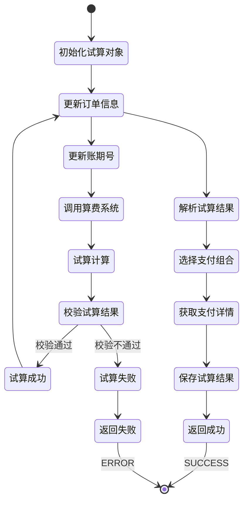

# PE120001 - 还款试算

## 节点信息

| 属性 | 值 |
|------|-----|
| **处理器代码** | PE120001 |
| **节点名称** | 还款试算 |
| **节点类型** | PROCESS |
| **所属流程** | [[账期制V400还款同步流程]] |
| **执行阶段** | 同步受理阶段 |
| **实现类** | RepayApplyBizFlowPE120001ServiceImpl |
| **优先级** | P0(核心节点) |

## 功能说明

还款试算节点是还款流程的核心节点,负责调用底层算费系统计算还款金额、费用、优惠等关键信息,生成还款试算结果,为后续还款单拆分和扣款提供数据基础。

### 核心职责
1. **初始化还款试算对象**: 构建RepayTrialBoV3对象,包含订单、金额、支付工具等信息
2. **更新账期号**: 将账期号列表保存到还款申请单扩展域
3. **调用算费系统**: 调用底层算费系统进行还款试算
4. **校验试算结果**: 校验试算结果的完整性和合法性
5. **更新订单信息**: 根据试算结果更新订单信息
6. **解析试算结果**: 解析还款试算结果,提取关键信息
7. **选择支付方式组合**: 选择用户指定的支付方式组合
8. **获取支付详情**: 获取各订单的非优惠券支付方式详情
9. **保存试算结果**: 保存还款试算结果到数据库

### 适用场景

- **正常还款**: 试算当期应还金额
- **提前结清**: 试算所有未结清金额
- **部分还款**: 试算部分还款金额
- **逾期还款**: 试算逾期费用和本金

## 输入参数

| 参数名 | 参数代码 | 类型 | 来源 | 说明 |
|--------|----------|------|------|------|
| 用户ID | uid | String | RepayApplyBo | 用户唯一标识 |
| 业务流水号 | bizSerial | String | RepayApplyBo | 业务流水号 |
| 还款申请号 | repayApplyNo | String | RepayApplyBo | 还款申请唯一标识 |
| 还款日期 | repayApplyDate | Date | RepayApplyBo | 还款申请日期 |
| 账期号列表 | billNoList | List<String> | RepayApplyReq | 待还款的账期号列表 |
| 分期还款申请列表 | stageRepayApplyList | List | RepayApplyReq | 指定分期计划的还款申请 |
| 支付工具列表 | payToolList | List<PayTool> | RepayApplyReq | 支付方式列表 |
| 还款方式 | repayWay | RepayWay | RepayApplyBo | 还款方式枚举 |
| 还款类别 | repayCategory | RepayCategory | RepayApplyBo | 还款类别枚举 |
| 还款金额 | repayAmount | Integer | RepayApplyBo | 还款金额(单位:分) |

## 输出参数

| 参数名 | 参数代码 | 类型 | 说明 |
|--------|----------|------|------|
| 还款试算结果 | repayTrialRespV3 | RepayTrialRespV3 | 还款试算结果对象 |
| 订单试算结果列表 | stageOrderTrialResultList | List | 各订单的试算结果 |

## 处理流程

```mermaid
flowchart TD
    A[开始] --> B[初始化还款试算对象]
    B --> B1[设置uid/bizSerial/repayApplyNo]
    B1 --> B2[设置repayDate/billNoList]
    B2 --> B3[设置businessTypeList: ENJOY_PAY/FUN_PAY]
    B3 --> B4[设置stageOrderStatusList: LENDING/EXCEED]
    B4 --> B5[设置repayWay/repayCategory/repayReqAmount]
    B5 --> B6[设置repayCouponKey: NONE]

    B6 --> C{请求中有分期还款申请?}
    C -->|是| D[提取stageOrderNoList和stagePlanNoList]
    C -->|否| E[stageOrderNoList为空]

    D --> F[调用refreshRepayTrialBoOrderInfo]
    E --> F

    F --> F1[查询订单信息]
    F1 --> F2[查询分期计划信息]
    F2 --> F3[构建StageOrderWrapperList]
    F3 --> F4[过滤空的分期计划]

    F4 --> G[更新账期号到扩展域]
    G --> G1[构建extInfoMap]
    G1 --> G2[设置BILL_NO_LIST字段]

    G2 --> H[调用算费系统还款试算]
    H --> H1[调用repayTrialPerformer.repayTrial4Bill]
    H1 --> H2[返回repaymentTrialRespV3Map]

    H2 --> I[校验试算结果]
    I --> I1[遍历所有订单试算结果]
    I1 --> I2[检查还款场景字段是否为空]
    I2 --> I3{有还款场景为空?}
    I3 -->|是| J[抛出异常:还款试算失败]
    I3 -->|否| K[根据试算结果更新订单信息]

    K --> K1[调用refreshRepayTrialBoOrderInfo]
    K1 --> K2[更新订单状态和金额]

    K2 --> L[解析还款试算结果]
    L --> L1[调用convert2RepayTrialRespV3]
    L1 --> L2[构建RepayTrialRespV3对象]

    L2 --> M[选择用户指定的支付方式组合]
    M --> M1[获取repayCouponKey]
    M1 --> M2[从repaymentTrialRespV3Map中取出对应的试算结果]

    M2 --> N[获取各订单的非优惠券支付方式]
    N --> N1[调用refreshOrderPayTrialResultList]
    N1 --> N2[设置stageOrderTrialResultList]

    N2 --> O[保存还款试算结果]
    O --> O1[调用saveTrialResultV3]
    O1 --> O2[保存到数据库]

    O2 --> P[设置repayTrialRespV3到上下文]
    P --> Q[返回SUCCESS]

    J --> Z[返回ERROR]

    style C fill:#fff4e6
    style I3 fill:#fff4e6
    style Z fill:#ffebee
    style Q fill:#e8f5e9
```



## 核心业务逻辑

### 1. 初始化还款试算对象

**构建对象**: `RepayTrialBoV3`

**核心字段**:

| 字段名 | 字段代码 | 类型 | 说明 |
|--------|----------|------|------|
| 用户ID | uid | String | 用户唯一标识 |
| 业务流水号 | bizSerial | String | 业务流水号 |
| 还款申请号 | repayApplyNo | String | 还款申请唯一标识 |
| 还款日期 | repayDate | Date | 还款申请日期 |
| 账期号列表 | billNoList | List<String> | 待还款的账期号列表 |
| 业务类型列表 | businessTypeList | List<BusinessTypeEnum> | 业务类型列表(ENJOY_PAY/FUN_PAY) |
| 订单状态列表 | stageOrderStatusList | List<StageOrderStatus> | 订单状态列表(LENDING/EXCEED) |
| 还款方式 | repayWay | RepayWay | 还款方式枚举 |
| 还款类别 | repayCategory | RepayCategory | 还款类别枚举 |
| 还款金额 | repayReqAmount | Integer | 还款金额(单位:分) |
| 优惠券Key | repayCouponKey | String | 优惠券Key(格式:类型_优惠券ID) |

**初始化示例**:
```java
RepayTrialBoV3 repayTrialBo = RepayTrialBoV3.builder()
    .uid(repayApplyBo.getUid())
    .bizSerial(repayApplyBo.getBizSerial())
    .repayApplyNo(repayApplyBo.getRepayApplyNo())
    .repayDate(repayApplyBo.getRepayApplyDate())
    .billNoList(getBillNoList(repayContext.getReq()))
    .businessTypeList(Lists.newArrayList(BusinessTypeEnum.ENJOY_PAY, BusinessTypeEnum.FUN_PAY))
    .stageOrderStatusList(Lists.newArrayList(StageOrderStatus.LENDING, StageOrderStatus.EXCEED))
    .repayWay(repayApplyBo.getRepayWay())
    .repayCategory(repayApplyBo.getRepayCategory())
    .repayReqAmount(repayApplyBo.getRepayAmount())
    .repayCouponKey(new StringBuffer(CouponTypeEnum.NONE.name())
        .append(CommonConst.CHAR_SEPARATOR_DELIMITER).toString())
    .build();
```

### 2. 更新订单信息

**服务**: `RepayTrialV3Tool.refreshRepayTrialBoOrderInfo()`

**更新内容**:
- 查询分期订单信息(StageOrderWrapper)
- 查询分期计划信息(StagePlan)
- 查询分期计划详情(PlanInfo)
- 过滤空的分期计划

**更新逻辑**:
```
1. 调用订单服务查询订单信息
2. 调用计划服务查询分期计划信息
3. 构建StageOrderWrapperList
4. 过滤掉没有分期计划的订单
5. 更新分期计划详情列表
```

### 3. 更新账期号到扩展域

**目的**: 将账期号列表保存到还款申请单扩展域,供后续流程使用

**更新逻辑**:
```java
private void refreshBillCycle(RepayApplyContext repayContext, List<String> billNoList) {
    if (MapUtils.isEmpty(repayContext.getBo().getExtInfoMap())) {
        Map<String,String> map = Maps.newHashMap();
        map.put(Constant.BILL_N0_LIST, JSON.toJSONString(billNoList));
        repayContext.getBo().setExtInfoMap(map);
        return;
    }
    repayContext.getBo().getExtInfoMap().put(Constant.BILL_N0_LIST, JSON.toJSONString(billNoList));
}
```

**扩展域结构**:
```json
{
  "BILL_NO_LIST": "[\"202403\",\"202404\",\"202405\"]"
}
```

### 4. 调用算费系统还款试算

**服务**: `IRepayTrialPerformer.repayTrial4Bill()`

**入参**: `RepayTrialBoV3`

**出参**: `Map<String, RepaymentTrialRespV3>`

**Map结构**:
- Key: repayCouponKey (优惠券Key)
- Value: RepaymentTrialRespV3 (试算结果)

**试算逻辑**:
```
1. 获取用户订单信息
2. 获取分期计划信息
3. 获取支付工具信息(优惠券/溢缴款)
4. 调用费用计算器算费
5. 计算本金/利息/罚息/费用
6. 应用优惠券优惠
7. 应用溢缴款抵扣
8. 生成试算结果
9. 按优惠券Key分组返回
```

### 5. 校验试算结果

**校验规则**: 检查还款场景字段是否为空

**校验逻辑**:
```java
private void checkTrialResult(List<OrderRepayTrial> orderRepayTrialList) {
    List<OrderRepayTrial.StageRepayTrial> repayStageTrialList = orderRepayTrialList.stream()
        .map(OrderRepayTrial::getPlanRepayTrialList)
        .flatMap(Collection::stream)
        .filter(item -> StringUtils.isBlank(item.getRepayScene()))
        .collect(Collectors.toList());

    // 如果存在还款场景字段为空的则抛异常
    if (CollectionUtils.isNotEmpty(repayStageTrialList)) {
        throw REExceptionUtils.newClientException(
            ErrorCode.REPAY_TRIAL_ERROR,
            repayStageTrialList.get(0).getStagePlanNo()
        );
    }
}
```

**业务含义**:
- 还款场景(RepayScene)是试算结果的关键字段
- 还款场景为空说明试算失败或数据异常
- 必须抛出异常终止流程

### 6. 更新支付工具信息

**服务**: `refreshRepayTrialBoV3ByReqPayTool()`

**更新内容**:
- 获取优惠券信息
- 获取溢缴款账户信息
- 更新repayCouponKey

#### 6.1 优惠券处理

**处理逻辑**:
```
FOR EACH payTool IN payToolList:
    IF payType == COUPON_PAY OR payType == DEDUCT_PAY THEN
        // 获取优惠券信息
        couponWrapper = couponClient.getCouponByCouponId(payInstrumentNo)

        // 校验优惠券状态
        IF couponWrapper为空 OR status != ACTIVATED THEN
            抛出异常:优惠券不可用
        END IF

        // 设置优惠券Key
        repayCouponKey = couponType + "_" + couponId
        couponWrapperList.add(couponWrapper)
    END IF
END FOR
```

**优惠券Key格式**: `{CouponTypeEnum}_{CouponId}`
- 示例: `COUPON_123456`

#### 6.2 溢缴款处理

**处理逻辑**:
```
FOR EACH payTool IN payToolList:
    IF payType == OVERPAY THEN
        // 获取溢缴款账户
        accountWrapper = accountClient.getActiveDebitOverPayAccountByUid(uid)

        // 校验账户号
        IF accountWrapper为空 OR payInstrumentNo != accountNo THEN
            抛出异常:溢缴款账户不可用
        END IF

        // 校验金额(以账户余额为准)
        IF payAmount != availableBalance THEN
            记录警告日志
        END IF

        accountWrapperReference.set(accountWrapper)
    END IF
END FOR
```

**关键点**:
- 溢缴款支付以账户余额为准,不以请求金额为准
- 账户号必须匹配

### 7. 解析试算结果

**服务**: `RepayTrialV3Tool.convert2RepayTrialRespV3()`

**解析内容**:
- 订单试算结果列表
- 还款金额汇总
- 费用明细
- 优惠明细

### 8. 选择支付方式组合

**逻辑**: 从试算结果Map中选择用户指定的支付方式组合

**选择Key**: `repayCouponKey`

**示例**:
```java
// 获取用户指定的优惠券组合
RepaymentTrialRespV3 repaymentTrialRespV3 = repaymentTrialRespV3Map.get(repayTrialBo.getRepayCouponKey());
```

### 9. 获取支付详情

**服务**: `RepayTrialV3Tool.refreshOrderPayTrialResultList()`

**获取内容**:
- 各订单的非优惠券支付方式
- 支付金额明细
- 支付渠道信息

### 10. 保存试算结果

**服务**: `IRepayCommonTrialService.saveTrialResultV3()`

**保存内容**:
- 还款试算主表
- 还款试算明细表
- 还款试算支付方式表

## 还款试算结果结构

### RepayTrialRespV3

| 字段名 | 字段代码 | 类型 | 说明 |
|--------|----------|------|------|
| 还款申请号 | repayApplyNo | String | 还款申请唯一标识 |
| 用户ID | uid | String | 用户唯一标识 |
| 还款金额 | repayAmount | Integer | 还款总金额(单位:分) |
| 本金 | principal | Integer | 还款本金(单位:分) |
| 利息 | interest | Integer | 还款利息(单位:分) |
| 罚息 | penalty | Integer | 还款罚息(单位:分) |
| 费用 | fee | Integer | 还款费用(单位:分) |
| 优惠金额 | discount | Integer | 优惠金额(单位:分) |
| 订单试算列表 | orderRepayTrialList | List | 各订单试算结果 |

### OrderRepayTrial

| 字段名 | 字段代码 | 类型 | 说明 |
|--------|----------|------|------|
| 订单号 | orderNo | String | 订单唯一标识 |
| 订单类型 | orderType | String | 订单类型 |
| 还款金额 | repayAmount | Integer | 该订单还款金额(单位:分) |
| 分期计划试算列表 | planRepayTrialList | List | 各分期计划试算结果 |

### StageRepayTrial

| 字段名 | 字段代码 | 类型 | 说明 |
|--------|----------|------|------|
| 分期计划号 | stagePlanNo | String | 分期计划唯一标识 |
| 还款场景 | repayScene | String | 还款场景(正常还款/提前结清/逾期还款) |
| 还款金额 | repayAmount | Integer | 该期还款金额(单位:分) |
| 本金 | principal | Integer | 该期还款本金(单位:分) |
| 利息 | interest | Integer | 该期还款利息(单位:分) |
| 罚息 | penalty | Integer | 该期还款罚息(单位:分) |
| 费用 | fee | Integer | 该期还款费用(单位:分) |

## 状态流转



## 上游节点

- **PE110060** - 锁单

## 下游节点

- **PE120020** - 获取资方数据

## 异常处理

| 异常场景 | 错误类型 | 错误码 | 处理方式 | 影响 |
|----------|----------|--------|----------|------|
| 还款场景为空 | ClientException | REPAY_TRIAL_ERROR | 记录日志,返回ERROR | 流程终止 |
| 优惠券不可用 | ClientException | COUPON_CAN_NOT_BE_USED | 记录日志,返回ERROR | 流程终止 |
| 溢缴款账户不可用 | ClientException | OVER_ACCOUNT_CAN_NOT_BE_USED_WITH_ARGUMENTS | 记录日志,返回ERROR | 流程终止 |
| 算费系统异常 | Exception | - | 记录日志,返回ERROR | 流程终止 |
| 其他异常 | Exception | - | 记录日志,返回ERROR | 流程终止 |

## 日志记录

### 错误日志

**日志级别**: WARN
**日志内容**: "还款试算并保存还款试算单「PE120001」异常"
**日志上下文**:
- 异常堆栈
- 还款申请号
- 用户ID
- 还款金额
- 账期号列表

### 日志示例

```
WARN [PE120001] 还款试算并保存还款试算单「PE120001」异常
  - repayApplyNo: APPLY20240319001
  - uid: 100123456789
  - repayAmount: 10000
  - billNoList: ["202403","202404"]
  - error: 还款场景字段为空,试算失败
```

## 监控指标

### 业务指标
- **试算成功率**: 成功数 / 总试算数
- **试算准确率**: 试算金额与实际入账金额一致的比率
- **优惠券使用率**: 使用优惠券的试算数 / 总试算数
- **溢缴款使用率**: 使用溢缴款的试算数 / 总试算数
- **平均试算耗时**: P50/P95/P99

### 技术指标
- **算费系统调用成功率**: 成功数 / 总调用数
- **算费系统平均耗时**: P50/P95/P99
- **试算结果保存成功率**: 成功数 / 总保存数
- **订单信息查询成功率**: 成功数 / 总查询数

## 性能优化

### 1. 批量查询
- **策略**: 批量查询订单和分期计划信息
- **效果**: 减少数据库查询次数

### 2. 缓存优化
- **策略**: 缓存订单信息和分期计划信息
- **效果**: 减少数据库查询,提高响应速度

### 3. 并行处理
- **策略**: 并行查询订单信息和分期计划信息
- **效果**: 减少总查询时间

### 4. 试算结果缓存
- **策略**: 缓存试算结果,避免重复计算
- **效果**: 减少算费系统调用次数

## 实现位置

```bash
repayengine-service/src/main/java/cn/caijiajia/repayengine/service/
├── repay/process/dcp/
│   └── RepayApplyBizFlowPE120001ServiceImpl.java  # 节点处理器 (255行)
├── repaytrial/
│   ├── IRepayTrialPerformer.java                   # 还款试算执行器接口
│   └── IRepayCommonTrialService.java               # 还款试算服务
└── repay/
    └── repaytrialformer/
        └── RepayTrialV3Tool.java                   # 还款试算工具类
```

## 代码示例

### 核心代码片段

```java
@Override
public ProcessResult process(RepayApplyContext repayContext) {
    try {
        dealProcess(repayContext);
    } catch (Exception e) {
        repayContext.setMessage(e.getMessage());
        RE_LOG.warn(e, "还款试算并保存还款试算单「PE120001」异常");
        return createErrorProcessResult(repayContext.getMessage());
    }
    return createSuccessProcessResult();
}

private void dealProcess(RepayApplyContext repayContext) {
    // 1. 构建账期制还款试算对象
    RepayTrialBoV3 repayTrialBo = initRepayTrialBoV3(repayContext);

    // 2. 更新账期号,保存在repay_apply扩展域
    refreshBillCycle(repayContext, repayTrialBo.getBillNoList());

    // 3. 调用底层算费系统进行还款试算
    Map<String, RepaymentTrialRespV3> repaymentTrialRespV3Map =
        repayTrialPerformer.repayTrial4Bill(repayTrialBo);

    // 4. 校验试算结果参数
    checkTrialResult(repayTrialBo.getOrderRepayTrialList());

    // 5. 根据试算结果再次更新订单信息
    repayTrialV3Tool.refreshRepayTrialBoOrderInfo(repayTrialBo);

    // 6. 解析还款试算的结果
    RepayTrialRespV3 repayTrialRespV3 =
        repayTrialV3Tool.convert2RepayTrialRespV3(repayTrialBo, repaymentTrialRespV3Map, null);
    repayContext.setRepayTrialRespV3(repayTrialRespV3);

    // 7. 选择用户指定的支付方式组合进行解析
    RepaymentTrialRespV3 repaymentTrialRespV3 =
        repaymentTrialRespV3Map.get(repayTrialBo.getRepayCouponKey());

    // 8. 获取各订单的非优惠券、非折扣券支付方式和支付详情
    repayTrialV3Tool.refreshOrderPayTrialResultList(repayTrialBo, repaymentTrialRespV3);

    // 9. BY订单合并用户选择的组合支付方式
    repayContext.setStageOrderTrialResultList(repayTrialBo.getStageOrderTrialResultList());

    // 10. 保存还款试算结果
    repayCommonTrialService.saveTrialResultV3(repayTrialBo);
}

private void checkTrialResult(List<OrderRepayTrial> orderRepayTrialList) {
    List<OrderRepayTrial.StageRepayTrial> repayStageTrialList =
        orderRepayTrialList.stream()
            .map(OrderRepayTrial::getPlanRepayTrialList)
            .flatMap(Collection::stream)
            .filter(item -> StringUtils.isBlank(item.getRepayScene()))
            .collect(Collectors.toList());

    if (CollectionUtils.isNotEmpty(repayStageTrialList)) {
        throw REExceptionUtils.newClientException(
            ErrorCode.REPAY_TRIAL_ERROR,
            repayStageTrialList.get(0).getStagePlanNo()
        );
    }
}
```

## 设计考虑

### 1. 为什么要按优惠券Key分组?

**原因**:
- 同一笔还款可能使用不同的优惠券组合
- 每种优惠券组合对应不同的试算结果
- 用户需要选择其中一种组合进行还款

### 2. 为什么要校验还款场景?

**原因**:
- 还款场景是试算结果的关键字段
- 还款场景决定了后续的业务逻辑
- 还款场景为空说明试算失败

### 3. 为什么要保存试算结果?

**原因**:
- 试算结果供后续流程使用
- 试算结果用于对账和审计
- 试算结果用于问题排查

### 4. 为什么溢缴款以账户余额为准?

**原因**:
- 溢缴款账户余额实时变化
- 请求金额可能与实际余额不一致
- 以账户余额为准可以避免扣款失败

## 相关文档

- [[账期制V400还款同步流程]] - 主流程设计
- [[PE120020]] - 获取资方数据
- [[还款试算规则]] - 还款试算规则说明
- [[费用计算器]] - 费用计算器文档

## 标签

#节点 #还款试算 #费用计算 #核心节点 #PE120001