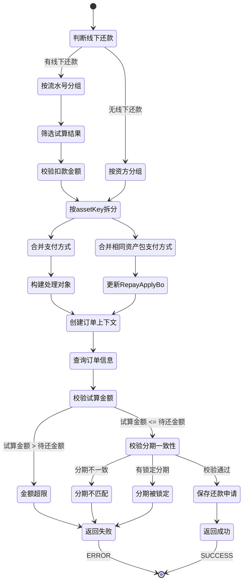

# PE120006 - 整合试算结果,初始化还款单元数据

## 节点信息

| 属性 | 值 |
|------|-----|
| **处理器代码** | PE120006 |
| **节点名称** | 整合试算结果,初始化还款单元数据 |
| **节点类型** | PROCESS |
| **所属流程** | [[账期制V400还款同步流程]] |
| **执行阶段** | 同步受理阶段 |
| **实现类** | RepayApplyBizFlowPE120006ServiceImpl |
| **优先级** | P0(核心节点) |

## 功能说明

整合试算结果节点负责将还款试算结果按照资方(assetBank)和资产ID(assetId)进行拆分,生成还款单元数据结构,并初始化订单上下文(StageOrderContext),为后续还款单拆分和扣款流程提供数据基础。

### 核心职责
1. **按资方资产包拆分试算结果**: 按照assetKey(assetBank+@+assetId+@+fundTag)进行分组
2. **构建还款单元数据**: 创建RepayTrialPlanListComponent列表
3. **处理线下还款**: 特殊处理线下还款场景,按扣款流水号分组
4. **合并支付方式**: 合并相同资产包的支付方式
5. **创建订单上下文**: 构建StageOrderContext映射,包含分期计划上下文
6. **校验试算结果**: 校验试算金额与分期待还金额的一致性
7. **保存还款申请**: 保存还款申请单到数据库

### 适用场景

- **正常还款**: 拆分为一个或多个还款单元(按资方/资产包)
- **提前结清**: 拆分为多个还款单元(多个资方/资产包)
- **线下还款**: 按扣款流水号分组拆分还款单元
- **联合贷还款**: 不同资方的还款需要独立处理

## 输入参数

| 参数名 | 参数代码 | 类型 | 来源 | 说明 |
|--------|----------|------|------|------|
| 还款试算结果 | repayTrialRespV3 | RepayTrialRespV3 | RepayApplyContext | 还款试算结果对象 |
| 订单试算结果列表 | stageOrderTrialResultList | List | RepayApplyContext | 各订单的试算结果 |
| 还款申请 | req | RepayApplyReq | RepayApplyContext | 还款申请请求对象 |
| 还款处理对象 | bo | RepayApplyBo | RepayApplyContext | 还款处理业务对象 |
| 线下还款列表 | offLineRepayList | List | RepayApplyBo | 线下还款信息列表 |

### RepayTrialRespV3 结构

| 字段名 | 字段代码 | 类型 | 说明 |
|--------|----------|------|------|
| 订单试算列表 | orderRepayTrialList | List<OrderRepayTrial> | 各订单试算结果 |
| 还款金额 | repayAmount | Integer | 还款总金额(单位:分) |

### OrderRepayTrial 结构

| 字段名 | 字段代码 | 类型 | 说明 |
|--------|----------|------|------|
| 分期订单号 | stageOrderNo | String | 分期订单唯一标识 |
| 订单还款金额 | orderRepayAmount | Integer | 该订单还款金额(单位:分) |
| 资方银行 | assetBank | String | 资方银行编码 |
| 资产ID | assetId | String | 资产ID |
| 资金标签 | fundTag | String | 资金标签 |
| 放款主体 | loanSubject | String | 放款主体 |
| 分期计划试算列表 | planRepayTrialList | List | 各分期计划试算结果 |

## 输出参数

| 参数名 | 参数代码 | 类型 | 说明 |
|--------|----------|------|------|
| 订单上下文映射 | stageOrderContextMap | Map<String,StageOrderContext> | 订单号→订单上下文映射 |
| 订单包装列表 | stageOrderWrapperList | List<StageOrderWrapper> | 更新后的订单信息列表 |
| 还款单处理列表 | repaymentBillHandleForDcpList | List | 还款单处理对象列表 |

## 处理流程

```mermaid
flowchart TD
    A[开始] --> B{有线下还款?}

    B -->|是| C[按扣款流水号分组]
    B -->|否| D[正常分组处理]

    C --> C1[遍历offLineRepayList]
    C1 --> C2[提取订单号列表orderNoList]
    C2 --> C3[筛选对应的试算结果]
    C3 --> C4[校验扣款金额与试算金额]
    C4 --> C5[按assetKey拆分试算结果]
    C5 --> C6[合并支付方式]
    C6 --> C7[构建RepaymentBillHandleForDcp]
    C7 --> C8{还有流水?}
    C8 -->|是| C1
    C8 -->|否| E[设置到RepayApplyBo]

    D --> D1[按assetKey拆分试算结果]
    D1 --> D2[调用fetchRepayTrialPlanListComponents]
    D2 --> D3[按assetBank+@+assetId+@+fundTag分组]
    D3 --> D4[合并相同资产包的支付方式]
    D4 --> D5[构建RepayTrialPlanListComponent列表]
    D5 --> D6[合并支付方式]
    D6 --> D7[更新RepayApplyBo]

    D7 --> E
    E --> F[创建订单上下文映射]

    F --> F1[遍历RepayTrialPlanListComponent]
    F1 --> F2[构建StageOrderContext]
    F2 --> F3[设置earlySettleType]
    F3 --> F4[构建StagePlanContext]
    F4 --> F5[设置claimed/fundPayOff字段]

    F5 --> G[查询更新后订单信息]
    G --> G1[调用queryStageOrderWrapperList]
    G1 --> G2[返回StageOrderWrapper列表]

    G2 --> H[校验试算金额]
    H --> H1[计算分期待还总金额leftAmountSum]
    H1 --> H2[计算试算金额repayTrialAmount]
    H2 --> H3{leftAmountSum < repayTrialAmount?}
    H3 -->|是| I[抛出异常:金额超限]
    H3 -->|否| J[校验分期一致性]

    J --> J1[构建试算分期集合Set]
    J1 --> J2[遍历StageOrderWrapper]
    J2 --> J3[比对分期计划]
    J3 --> J4{分期不一致?}
    J4 -->|是| K[抛出异常:分期不匹配]
    J4 -->|否| J5{有锁定中的分期?}
    J5 -->|是| L[抛出异常:分期被锁定]
    J5 -->|否| M[保存还款申请]

    M --> M1[调用saveRepayApply]
    M1 --> N[返回SUCCESS]

    I --> Z[返回ERROR]
    K --> Z
    L --> Z

    style B fill:#fff4e6
    style C8 fill:#fff4e6
    style H3 fill:#fff4e6
    style J4 fill:#fff4e6
    style J5 fill:#fff4e6
    style Z fill:#ffebee
    style N fill:#e8f5e9
```

## 核心业务逻辑

### 1. 按资方资产包拆分试算结果

**分组Key**: `assetBank + "@" + assetId + "@" + fundTag`

**分组逻辑**:
```
FOR EACH orderRepayTrial IN orderRepayTrialList:
    fundTag = (fundTag为空) ? "DEFAULT" : fundTag
    assetKey = assetBank + "@" + assetId + "@" + fundTag

    // 按assetKey分组
    orderRepayTrialMapByAssetKey[assetKey].add(orderRepayTrial)

    // 更新StageOrderTrialResult中的资方信息
    FOR EACH stageOrderTrialResult:
        IF stageOrderNo相同 THEN
            stageOrderTrialResult.setAssetBank(assetBank)
            stageOrderTrialResult.setAssetId(assetId)
            stageOrderTrialResult.setAssetKey(assetKey)
        END IF
    END FOR
END FOR
```

**Map结构**:
```
orderRepayTrialMapByAssetKey = {
    "BOC@ASSET001@DEFAULT": [OrderRepayTrial1, OrderRepayTrial2],
    "ICBC@ASSET002@TAG1": [OrderRepayTrial3]
}
```

**业务含义**:
- 不同资方的还款需要独立处理
- 同一资方的不同资产包也需要独立处理
- fundTag用于进一步细分资金标签

### 2. 构建还款单元数据

**构建逻辑**:
```
FOR EACH (assetKey, orderRepayTrialList) IN orderRepayTrialMapByAssetKey:
    // 解析assetKey
    assetBank = assetKey.split("@")[0]
    assetId = assetKey.split("@")[1]
    fundTag = assetKey.split("@")[2]

    // 构建RepayTrialPlanListComponent
    component = RepayTrialPlanListComponent.builder()
        .assetBank(assetBank)
        .assetId(assetId)
        .fundTag(fundTag)
        .loanSubject(orderRepayTrialList.get(0).getLoanSubject())
        .repayAmount(SUM(orderRepayTrialList.orderRepayAmount))
        .stagePlanRepayComponentList(convert2StagePlanRepayComponentList(orderRepayTrialList))
        .paymentTypeList(payToolItemListMap.get(assetKey))
        .build()

    repayTrialPlanListComponentList.add(component)
END FOR
```

**RepayTrialPlanListComponent 结构**:

| 字段名 | 字段代码 | 类型 | 说明 |
|--------|----------|------|------|
| 资方银行 | assetBank | BankEnum | 资方银行枚举 |
| 资产ID | assetId | String | 资产ID |
| 资金标签 | fundTag | String | 资金标签 |
| 放款主体 | loanSubject | String | 放款主体 |
| 还款金额 | repayAmount | Integer | 该还款单元总金额(单位:分) |
| 分期计划还款组件列表 | stagePlanRepayComponentList | List | 分期计划还款组件 |
| 支付方式列表 | paymentTypeList | List<PayToolItem> | 支付方式列表 |

### 3. 处理线下还款

**线下还款场景**: 运营录入的线下扣款流水,需要按扣款流水号分组

**处理逻辑**:
```
IF offLineRepayList不为空 THEN
    FOR EACH offLineRepayInfo IN offLineRepayList:
        // 提取订单号列表
        orderNoList = offLineRepayInfo.repayOrderInfoList中的stageOrderNo

        // 筛选对应的试算结果
        currOrderRepayTrialList = 筛选orderNoList对应的试算结果
        currOrderTrialResultList = 筛选orderNoList对应的试算结果

        // 校验扣款金额与试算金额
        checkDeductAmount(currOrderRepayTrialList, deductDetailInfoList)

        // 按assetKey拆分试算结果
        repayTrialPlanListComponentList = currRepayTrialPlanListComponents(...)

        // 合并支付方式
        mergeRepayTrialPlanListComponent = mergeAndRefreshRepayTrialPlanListComponent(...)

        // 构建RepaymentBillHandleForDcp
        repaymentBillHandleForDcp = RepaymentBillHandleForDcp.builder()
            .repayTrialPlanListComponent(mergeRepayTrialPlanListComponent)
            .repayTrialPlanListComponentList(repayTrialPlanListComponentList)
            .deductDetailInfoList(deductDetailInfoList)
            .repaymentBillBaseNo(UUID.randomUUID())
            .repaymentBillSeqNo(0)
            .build()

        repaymentBillHandleForDcps.add(repaymentBillHandleForDcp)
    END FOR

    repayApplyBo.setRepaymentBillHandleForDcpList(repaymentBillHandleForDcps)
END IF
```

**业务含义**:
- 每个扣款流水号对应一个RepaymentBillHandleForDcp
- 扣款流水号关联具体的扣款明细
- 用于后续生成扣款单

### 4. 合并支付方式

**合并场景**: 三方支付(微信/支付宝/线下支付)需要合并所有资产包的支付方式

**合并规则**:

| 条件 | 是否合并 |
|------|---------|
| 存在WECHAT_PAY | 合并 |
| 存在ALIPAY_SDK | 合并 |
| 存在AO_OFFLINE_PAY | 合并 |
| 其他支付方式 | 不合并 |

**合并逻辑**:
```
IF 支付方式包含三方支付 THEN
    // 合并所有RepayTrialPlanListComponent
    mergeComponent = RepayTrialPlanListComponent.builder()
        .repayAmount(SUM(所有component的repayAmount))
        .assetBank((不同资方数量 > 1) ? SELF : component[0].assetBank)
        .assetId((不同资产ID数量 > 1) ? "SELF" : component[0].assetId)
        .fundTag(component[0].fundTag)
        .loanSubject((不同放款主体数量 > 1) ? null : component[0].loanSubject)
        .paymentTypeList(mergePaymentTypeList(componentList))
        .stagePlanRepayComponentList(合并所有stagePlanRepayComponentList)
        .build()

    RETURN mergeComponent
END IF
```

**支付方式合并**:
```
FOR EACH component IN repayTrialPlanListComponentList:
    FOR EACH payToolItem IN component.paymentTypeList:
        // 按PayType分组
        existingPayItem = map.get(payToolItem.payType)

        IF existingPayItem为空 THEN
            map.put(payType, 初始化PayToolItem)
        END IF

        // 累加金额
        existingPayItem.payableAmount += payToolItem.payableAmount
        existingPayItem.limitedAmount += payToolItem.limitedAmount
    END FOR
END FOR

RETURN map.values()
```

### 5. 创建订单上下文

**订单上下文**: 用于保存订单和分期计划的业务状态

**创建逻辑**:
```
orderContextMap = {}

FOR EACH repayTrialPlanListComponent IN repayTrialPlanListComponentList:
    FOR EACH stagePlanRepayComponent IN repayTrialPlanListComponent.stagePlanRepayComponentList:
        stageOrderNo = stagePlanRepayComponent.stageOrderNo
        stagePlanNo = stagePlanRepayComponent.stagePlanNo

        // 获取或创建StageOrderContext
        stageOrderContext = orderContextMap.getOrCreate(stageOrderNo)

        // 从试算结果获取订单信息
        orderRepayTrial = orderRepayTrialMap.get(stageOrderNo)
        stageRepayTrial = stageRepayTrialMap.get(stagePlanNo)

        // 设置提前结清类型
        stageOrderContext.setEarlySettleType(orderRepayTrial.earlySettleTypeEnum)

        // 构建StagePlanContext
        stagePlanContext = StagePlanContext.builder()
            .stagePlanNo(stagePlanNo)
            .stageNo(stageRepayTrial.stageNo)
            .planAllPayOff(stageRepayTrial.planAllPayOff)
            .build()

        // 添加到订单上下文
        stageOrderContext.stagePlanContextList.add(stagePlanContext)
    END FOR
END FOR

RETURN orderContextMap
```

**StageOrderContext 结构**:

| 字段名 | 字段代码 | 类型 | 说明 |
|--------|----------|------|------|
| 分期订单号 | stageOrderNo | String | 分期订单唯一标识 |
| 提前结清类型 | earlySettleType | Enum | 提前结清类型 |
| 分期计划上下文列表 | stagePlanContextList | List | 分期计划上下文列表 |

**StagePlanContext 结构**:

| 字段名 | 字段代码 | 类型 | 说明 |
|--------|----------|------|------|
| 分期计划号 | stagePlanNo | String | 分期计划唯一标识 |
| 期数 | stageNo | Integer | 分期期数 |
| 计划是否全部结清 | planAllPayOff | Boolean | 该期是否全部结清 |
| 资方是否已认领 | claimed | Boolean | 资方是否已认领该期 |
| 资方是否已结清 | fundPayOff | Boolean | 资方是否已结清该期 |

### 6. 校验试算结果

#### 6.1 校验扣款金额

**校验规则**: 扣款明细总金额 == 试算还款金额

**校验逻辑**:
```
trialAmt = SUM(currOrderRepayTrialList.orderRepayAmount)
deductAmt = SUM(deductDetailInfoList.deductAmount)

IF trialAmt != deductAmt THEN
    LOG.warn("扣款明细总金额:" + deductAmt + ",试算还款金额:" + trialAmt)
    THROW ClientException(REPAY_AMOUNT_ERROR)
END IF
```

**业务含义**:
- 线下还款的扣款金额必须与试算金额一致
- 防止扣款金额与实际入账金额不一致

#### 6.2 校验试算金额

**校验规则**: 试算金额 <= 分期待还总金额

**校验逻辑**:
```
leftAmountSum = SUM(stageOrderWrapperList.stagePlanList.leftAmount)
repayTrialAmount = SUM(repayTrialPlanListComponentList
    .paymentTypeList
    .filter(payType != DEDUCT_PAY && payType != COUPON_PAY)
    .limitedAmount)

IF leftAmountSum < repayTrialAmount THEN
    LOG.warn("分期总待还金额:" + leftAmountSum + ", 试算还款金额:" + repayTrialAmount)
    THROW ClientException(REPAY_AMOUNT_ERROR)
END IF
```

**业务含义**:
- 还款金额不能超过待还金额
- 防止超额还款

#### 6.3 校验分期一致性

**校验规则**: 试算分期 == 订单分期

**校验逻辑**:
```
// 构建试算分期集合
trialPlanSet = {}
FOR EACH component IN repayTrialPlanListComponentList:
    FOR EACH plan IN component.stagePlanRepayComponentList:
        trialPlanSet.add(stageOrderNo + "-" + stagePlanNo)
    END FOR
END FOR

// 遍历订单分期,逐个从试算分期集合中移除
FOR EACH orderWrapper IN stageOrderWrapperList:
    FOR EACH plan IN orderWrapper.stagePlanList:
        key = orderWrapper.stageOrderNo + "-" + plan.stagePlanNo

        IF !trialPlanSet.remove(key) THEN
            THROW ServerException(REPAY_STAGE_PLAN_NOT_FOUND, key)
        END IF
    END FOR
END FOR

// 如果试算分期集合不为空,说明有分期不匹配
IF !trialPlanSet.isEmpty() THEN
    THROW ServerException(REPAY_STAGE_PLAN_NOT_FOUND, trialPlanSet)
END IF

// 检查是否有锁定中的分期
IF 存在lendStatus == THIRD_PAYING的分期 THEN
    THROW ClientException(REPAY_STAGE_PLAN_STATUS_ERROR)
END IF
```

**业务含义**:
- 确保试算结果与实际分期一致
- 防止分期被其他流程锁定

### 7. 保存还款申请

**保存内容**:
- 还款申请主表(repay_apply)
- 还款申请扩展信息(extInfoMap)

**保存逻辑**:
```
dcpRepayApplyRepository.saveRepayApply(req, bo)
```

## 状态流转



## 上游节点

- **PE120020** - 获取资方数据

## 下游节点

- **PE130080** - 支付工具初始化

## 异常处理

| 异常场景 | 错误类型 | 错误码 | 处理方式 | 影响 |
|----------|----------|--------|----------|------|
| 扣款金额不一致 | ClientException | REPAY_AMOUNT_ERROR | 记录日志,返回ERROR | 流程终止 |
| 试算金额超限 | ClientException | REPAY_AMOUNT_ERROR | 记录日志,返回ERROR | 流程终止 |
| 分期不匹配 | ServerException | REPAY_STAGE_PLAN_NOT_FOUND | 记录日志,返回ERROR | 流程终止 |
| 分期被锁定 | ClientException | REPAY_STAGE_PLAN_STATUS_ERROR | 记录日志,返回ERROR | 流程终止 |
| 还款单元为空 | ClientException | REPAYMENT_BILL_NOT_NULL_ERROR | 记录日志,返回ERROR | 流程终止 |
| 支付工具异常 | ClientException | REPAY_PAY_TOOL_ERROR | 记录日志,返回ERROR | 流程终止 |
| 其他异常 | Exception | - | 记录日志,返回ERROR | 流程终止 |

## 监控指标

### 业务指标
- **平均还款单元数**: 总还款单元数 / 总还款次数
- **资方分组数**: 按assetKey分组后的平均分组数
- **线下还款比例**: 线下还款次数 / 总还款次数
- **三方支付合并率**: 合并次数 / 三方支付次数

### 技术指标
- **平均处理耗时**: P50/P95/P99
- **数据库保存成功率**: 成功数 / 总次数
- **校验失败率**: 失败数 / 总次数

## 性能优化

### 1. 批量查询
- **策略**: 批量查询订单和分期计划信息
- **效果**: 减少数据库查询次数

### 2. Map优化
- **策略**: 使用Map进行分组和查找
- **效果**: O(1)时间复杂度,提高处理速度

### 3. Stream并行处理
- **策略**: 使用Stream的并行处理能力
- **效果**: 提高数据处理速度

## 实现位置

```bash
repayengine-service/src/main/java/cn/caijiajia/repayengine/service/
├── repay/process/dcp/
│   └── RepayApplyBizFlowPE120006ServiceImpl.java  # 节点处理器 (520行)
├── dcp/service/
│   └── DcpLoanCoreService.java                     # 核心系统服务
└── dcp/repository/
    ��── DcpRepayApplyRepository.java                # 还款申请仓储
```

## 设计考虑

### 1. 为什么要按资方资产包拆分?

**原因**:
- 不同资方的还款流程独立
- 不同资产包的费率和规则不同
- 拆分后便于并行处理

### 2. 为什么三方支付要合并?

**原因**:
- 三方支付(微信/支付宝)是统一的支付渠道
- 用户只需要支付一次
- 后端需要将支付金额分配到各个资方

### 3. 为什么线下还款要按流水号分组?

**原因**:
- 每个扣款流水号对应一笔银行流水
- 一笔银行流水可能涉及多个订单/资方
- 按流水号分组便于对账

### 4. 为什么要校验分期一致性?

**原因**:
- 确保试算结果与实际分期一致
- 防止并发修改导致数据不一致
- 避免分期被其他流程锁定

## 相关文档

- [[账期制V400还款同步流程]] - 主流程设计
- [[PE120020]] - 获取资方数据
- [[PE130080]] - 支付工具初始化
- [[还款单元拆分规则]] - 还款单元拆分规则说明
- [[订单上下文设计]] - 订单上下文设计文档

## 标签

#节点 #还款单元 #试算结果 #资方拆分 #PE120006